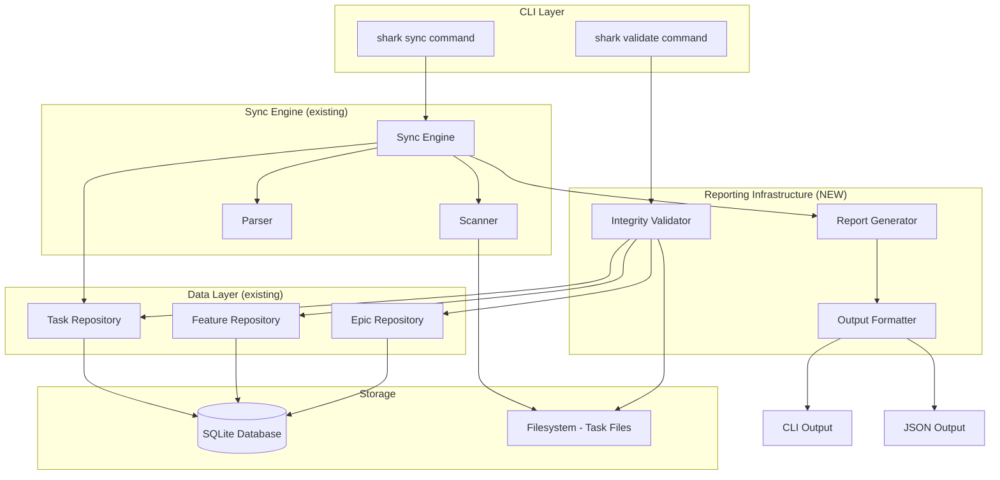
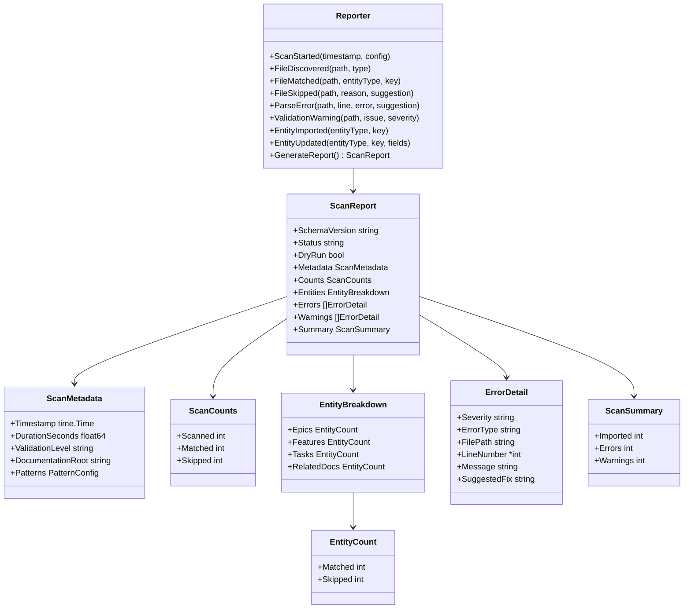
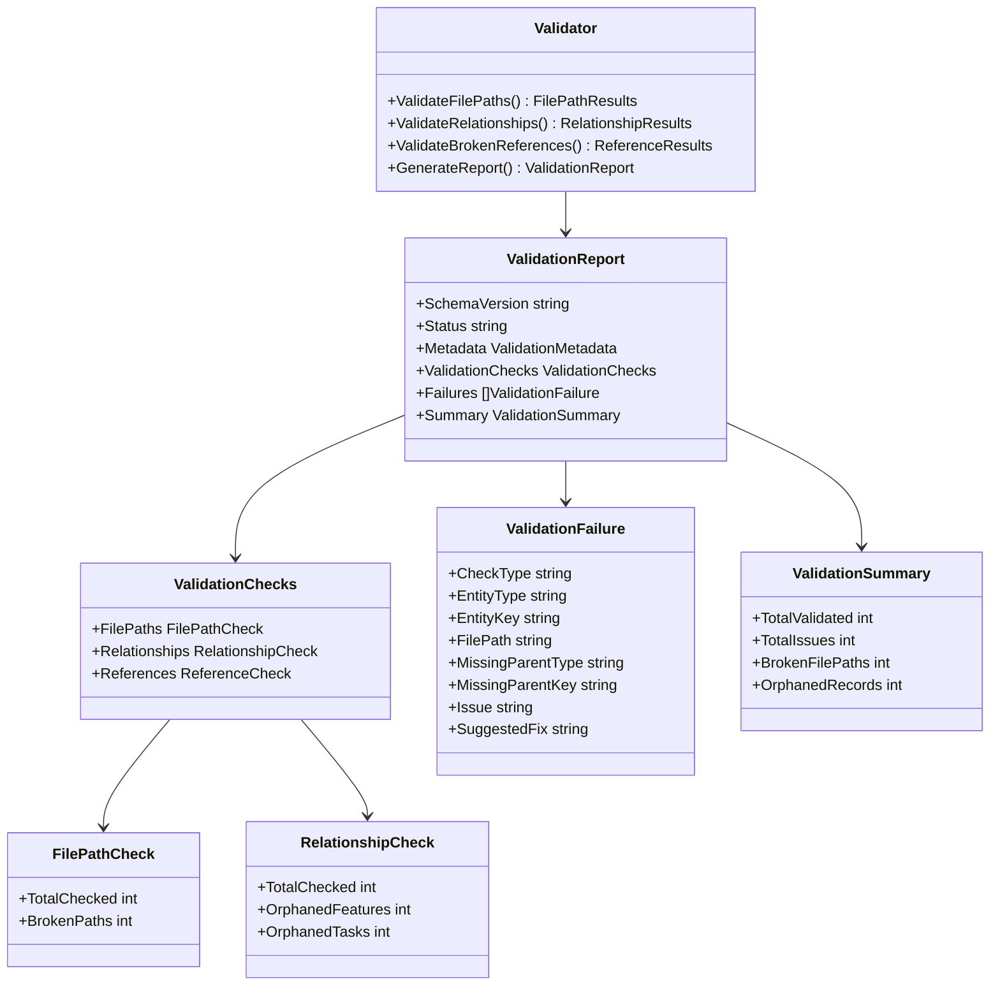
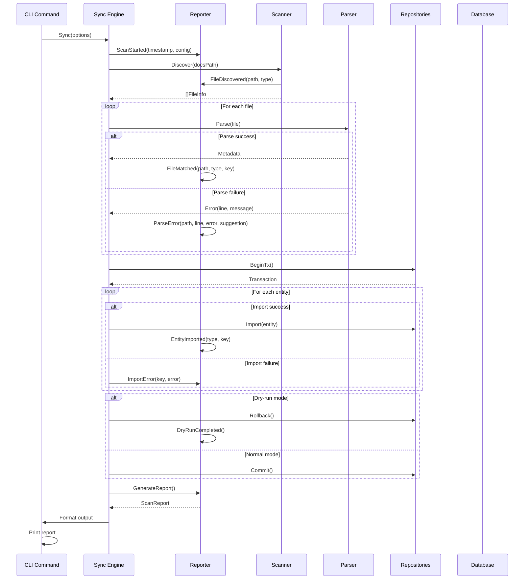
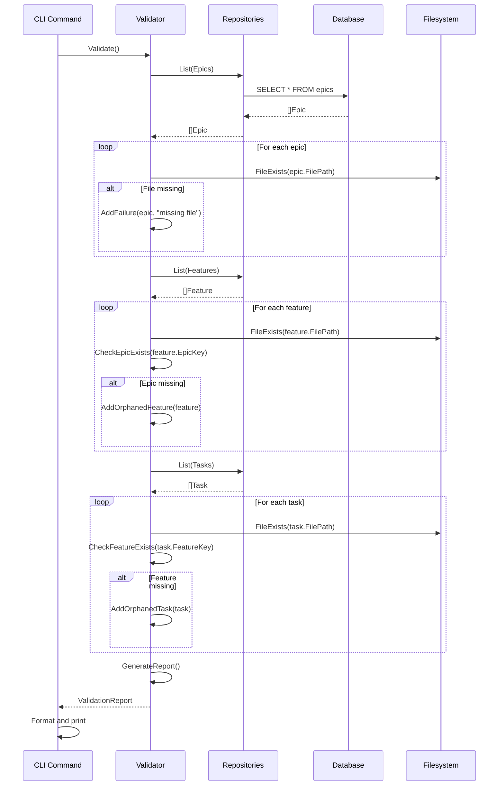

# Architecture: Import Reporting & Validation

**Feature**: E06-F05-import-reporting-validation
**Epic**: E06-intelligent-scanning
**Status**: Draft
**Last Updated**: 2025-12-17

---

## Table of Contents

1. [Executive Summary](#executive-summary)
2. [System Context](#system-context)
3. [Component Architecture](#component-architecture)
4. [Integration Points](#integration-points)
5. [Data Flow](#data-flow)
6. [Error Handling Strategy](#error-handling-strategy)
7. [Design Decisions](#design-decisions)

---

## Executive Summary

### Purpose

This feature adds comprehensive reporting and validation infrastructure to the intelligent scanning system. It provides visibility into every stage of the scan/sync workflow (discovery, parsing, validation, import) and enables database integrity verification after import.

### Key Architectural Decisions

| Decision | Rationale | Trade-offs |
|----------|-----------|------------|
| **Extend existing SyncReport** | Reuse proven structure from sync engine | Must maintain backward compatibility |
| **Separate Validator component** | Single responsibility, independently testable | Additional component to maintain |
| **JSON schema versioning** | Support API evolution without breaking clients | Schema complexity increases over time |
| **Transaction-based dry-run** | Simple rollback, no code duplication | Executes full workflow (slower than simulation) |
| **Structured error types** | Enable programmatic error handling | More upfront design than free-form strings |

### Architecture Pattern

**Pattern**: Repository + Service Layer + Formatter
**Components**:
- `internal/sync/reporter.go` - Report generation service
- `internal/sync/validator.go` - Database integrity validation
- `internal/sync/formatter.go` - Multi-format output (CLI, JSON)
- Enhanced `internal/sync/types.go` - Extended report structures

---

## System Context

### High-Level Architecture



### Component Responsibilities

| Component | Responsibility | Status |
|-----------|---------------|--------|
| **Reporter** | Collect scan events, generate reports | NEW |
| **Validator** | Verify database integrity, check file paths | NEW |
| **Formatter** | Multi-format output (CLI, JSON) | EXTEND |
| **SyncEngine** | Orchestrate scan, emit events to reporter | EXTEND |
| **Scanner** | Emit detailed discovery events | EXTEND |
| **Parser** | Emit detailed parse errors with line numbers | EXTEND |

---

## Component Architecture

### 1. Report Generator

**Purpose**: Collect events during scan workflow and produce comprehensive reports.

**Design**:



**Event Collection Pattern**:

```go
// Reporter collects events during scan workflow
type Reporter struct {
    startTime       time.Time
    metadata        ScanMetadata
    filesScanned    int
    filesMatched    map[EntityType]int
    filesSkipped    map[EntityType]int
    errors          []ErrorDetail
    warnings        []ErrorDetail
    imported        map[EntityType]int
}

// Example event methods
func (r *Reporter) FileDiscovered(path string, entityType EntityType) {
    r.filesScanned++
}

func (r *Reporter) FileSkipped(path string, reason SkipReason, suggestion string) {
    r.filesSkipped[entityType]++
    r.errors = append(r.errors, ErrorDetail{
        Severity:      "ERROR",
        ErrorType:     string(reason),
        FilePath:      path,
        Message:       reason.Message(),
        SuggestedFix:  suggestion,
    })
}

func (r *Reporter) GenerateReport() *ScanReport {
    duration := time.Since(r.startTime).Seconds()
    // ... build comprehensive report
}
```

### 2. Integrity Validator

**Purpose**: Verify database integrity after import (or anytime) by checking file paths and relationships.

**Design**:



**Validation Algorithms**:

```go
// File Path Validation
func (v *Validator) ValidateFilePaths(ctx context.Context) (*FilePathResults, error) {
    results := &FilePathResults{}

    // Check epics
    epics, _ := v.epicRepo.List(ctx)
    for _, epic := range epics {
        if epic.FilePath != nil && !fileExists(*epic.FilePath) {
            results.AddFailure("epic", epic.Key, *epic.FilePath, "File not found")
        }
    }

    // Check features
    features, _ := v.featureRepo.List(ctx)
    for _, feature := range features {
        if feature.FilePath != nil && !fileExists(*feature.FilePath) {
            results.AddFailure("feature", feature.Key, *feature.FilePath, "File not found")
        }
    }

    // Check tasks
    tasks, _ := v.taskRepo.List(ctx)
    for _, task := range tasks {
        if task.FilePath != nil && !fileExists(*task.FilePath) {
            results.AddFailure("task", task.Key, *task.FilePath, "File not found")
        }
    }

    return results, nil
}

// Relationship Validation
func (v *Validator) ValidateRelationships(ctx context.Context) (*RelationshipResults, error) {
    results := &RelationshipResults{}

    // Build epic key set
    epics, _ := v.epicRepo.List(ctx)
    epicKeys := make(map[string]bool)
    for _, epic := range epics {
        epicKeys[epic.Key] = true
    }

    // Check features reference existing epics
    features, _ := v.featureRepo.List(ctx)
    featureKeys := make(map[string]bool)
    for _, feature := range features {
        featureKeys[feature.Key] = true
        if !epicKeys[feature.EpicKey] {
            results.AddOrphanedFeature(feature.Key, feature.EpicKey)
        }
    }

    // Check tasks reference existing features
    tasks, _ := v.taskRepo.List(ctx)
    for _, task := range tasks {
        if !featureKeys[task.FeatureKey] {
            results.AddOrphanedTask(task.Key, task.FeatureKey)
        }
    }

    return results, nil
}
```

### 3. Output Formatter

**Purpose**: Format reports for different audiences (human CLI, machine JSON).

**Design**:

```go
// Formatter provides multi-format output
type Formatter struct{}

// FormatCLI produces human-readable terminal output
func (f *Formatter) FormatCLI(report *ScanReport, useColor bool) string {
    var sb strings.Builder

    // Header
    sb.WriteString("Shark Scan Report\n")
    sb.WriteString("=================\n")

    // Metadata
    sb.WriteString(fmt.Sprintf("Scan completed at %s\n", report.Metadata.Timestamp))
    sb.WriteString(fmt.Sprintf("Duration: %.1f seconds\n", report.Metadata.DurationSeconds))

    // Summary
    sb.WriteString("\nSummary\n-------\n")
    sb.WriteString(fmt.Sprintf("Total files scanned: %d\n", report.Counts.Scanned))
    sb.WriteString(fmt.Sprintf("  ✓ Matched: %d\n", report.Counts.Matched))
    sb.WriteString(fmt.Sprintf("  ✗ Skipped: %d\n", report.Counts.Skipped))

    // Breakdown by type
    sb.WriteString("\nBreakdown by Type\n-----------------\n")
    f.formatEntityBreakdown(&sb, "Epics", report.Entities.Epics)
    f.formatEntityBreakdown(&sb, "Features", report.Entities.Features)
    f.formatEntityBreakdown(&sb, "Tasks", report.Entities.Tasks)

    // Errors (grouped by type)
    if len(report.Errors) > 0 {
        sb.WriteString("\nErrors and Warnings\n-------------------\n")
        f.formatErrorsByType(&sb, report.Errors, useColor)
    }

    return sb.String()
}

// FormatJSON produces machine-readable JSON output
func (f *Formatter) FormatJSON(report *ScanReport) (string, error) {
    data, err := json.MarshalIndent(report, "", "  ")
    if err != nil {
        return "", fmt.Errorf("failed to marshal JSON: %w", err)
    }
    return string(data), nil
}
```

### 4. Error Type Taxonomy

**Purpose**: Categorize errors for programmatic handling and grouping.

```go
// ErrorType categorizes different failure modes
type ErrorType string

const (
    ErrorTypePatternMismatch     ErrorType = "pattern_mismatch"
    ErrorTypeValidationFailure   ErrorType = "validation_failure"
    ErrorTypeParseError          ErrorType = "parse_error"
    ErrorTypeFrontmatterError    ErrorType = "frontmatter_error"
    ErrorTypeFileAccessError     ErrorType = "file_access_error"
    ErrorTypeMissingMetadata     ErrorType = "missing_metadata"
    ErrorTypeInvalidKey          ErrorType = "invalid_key"
)

// Severity levels
type Severity string

const (
    SeverityError   Severity = "ERROR"   // Blocks import
    SeverityWarning Severity = "WARNING" // Imports with issues
    SeverityInfo    Severity = "INFO"    // Informational
)
```

---

## Integration Points

### 1. Sync Engine Integration

**Modification**: Extend SyncEngine to emit events to Reporter.

```go
type SyncEngine struct {
    scanner  *Scanner
    parser   *Parser
    repos    *Repositories
    reporter *Reporter  // NEW
    options  SyncOptions
}

func (e *SyncEngine) Sync(ctx context.Context) (*ScanReport, error) {
    // Initialize reporter
    e.reporter = NewReporter(e.options)
    e.reporter.ScanStarted(time.Now(), e.options)

    // Discovery phase
    files, err := e.scanner.Discover(e.options.FolderPath)
    for _, file := range files {
        e.reporter.FileDiscovered(file.Path, file.Type)
    }

    // Parsing phase
    for _, file := range files {
        metadata, err := e.parser.Parse(file)
        if err != nil {
            e.reporter.ParseError(file.Path, err.Line, err.Message, err.Suggestion)
            continue
        }
        e.reporter.FileMatched(file.Path, file.Type, metadata.Key)
    }

    // Import phase (with transaction)
    tx, _ := e.repos.BeginTx(ctx)
    defer tx.Rollback()

    for _, metadata := range parsedMetadata {
        if err := e.importEntity(ctx, tx, metadata); err != nil {
            e.reporter.ImportError(metadata.Key, err)
            continue
        }
        e.reporter.EntityImported(metadata.Type, metadata.Key)
    }

    // Commit or rollback
    if e.options.DryRun {
        tx.Rollback()
        e.reporter.DryRunCompleted()
    } else {
        tx.Commit()
    }

    // Generate report
    return e.reporter.GenerateReport(), nil
}
```

### 2. CLI Command Integration

**Modification**: Add --output=json and --dry-run flags to sync commands.

```go
// sync.go
var syncCmd = &cobra.Command{
    Use:   "sync",
    Short: "Sync task files to database",
    RunE:  runSync,
}

var (
    syncDryRun    bool
    syncOutputJSON bool
)

func init() {
    syncCmd.Flags().BoolVar(&syncDryRun, "dry-run", false, "Preview changes without committing")
    syncCmd.Flags().StringVar(&syncOutput, "output", "cli", "Output format: cli or json")
}

func runSync(cmd *cobra.Command, args []string) error {
    options := sync.SyncOptions{
        DryRun: syncDryRun,
        // ... other options
    }

    engine := sync.NewEngine(repos, options)
    report, err := engine.Sync(ctx)
    if err != nil {
        return err
    }

    // Format output
    formatter := sync.NewFormatter()
    if syncOutput == "json" {
        output, _ := formatter.FormatJSON(report)
        fmt.Println(output)
    } else {
        output := formatter.FormatCLI(report, true)
        fmt.Println(output)
    }

    return nil
}
```

### 3. Validation Command

**New Command**: `shark validate` for database integrity checks.

```go
// validate.go
var validateCmd = &cobra.Command{
    Use:   "validate",
    Short: "Validate database integrity",
    Long: `Validate that all file paths exist and relationships are intact.

Checks:
  - File path existence (epics, features, tasks)
  - Relationship integrity (features → epics, tasks → features)
  - Broken references (invalid keys)

Examples:
  shark validate              # Human-readable output
  shark validate --output=json  # JSON output for scripts`,
    RunE: runValidate,
}

var validateOutputJSON bool

func init() {
    validateCmd.Flags().BoolVar(&validateOutputJSON, "output", "cli", "Output format: cli or json")
}

func runValidate(cmd *cobra.Command, args []string) error {
    validator := sync.NewValidator(repos)

    report, err := validator.Validate(ctx)
    if err != nil {
        return err
    }

    formatter := sync.NewFormatter()
    if validateOutputJSON {
        output, _ := formatter.FormatValidationJSON(report)
        fmt.Println(output)
    } else {
        output := formatter.FormatValidationCLI(report, true)
        fmt.Println(output)
    }

    // Exit code: 0 for success, 1 for failures
    if report.Summary.TotalIssues > 0 {
        return fmt.Errorf("validation found %d issue(s)", report.Summary.TotalIssues)
    }

    return nil
}
```

---

## Data Flow

### Scan Workflow with Reporting



### Validation Workflow



---

## Error Handling Strategy

### 1. Graceful Degradation

**Principle**: Individual file failures don't halt entire scan.

```go
func (e *SyncEngine) processFile(file FileInfo) {
    defer func() {
        if r := recover(); r != nil {
            e.reporter.FileError(file.Path, fmt.Errorf("panic: %v", r))
        }
    }()

    metadata, err := e.parser.Parse(file)
    if err != nil {
        e.reporter.ParseError(file.Path, err.Line, err.Message, err.Suggestion)
        return // Skip this file, continue with next
    }

    // Continue processing...
}
```

### 2. Transaction Safety

**Principle**: Dry-run uses transactions for safety without code duplication.

```go
func (e *SyncEngine) Sync(ctx context.Context) (*ScanReport, error) {
    tx, err := e.repos.BeginTx(ctx)
    if err != nil {
        return nil, fmt.Errorf("failed to begin transaction: %w", err)
    }

    // Always rollback on defer (no-op if already committed)
    defer tx.Rollback()

    // Execute full workflow
    if err := e.importEntities(ctx, tx); err != nil {
        return nil, err
    }

    // Commit only if not dry-run
    if !e.options.DryRun {
        if err := tx.Commit(); err != nil {
            return nil, fmt.Errorf("failed to commit transaction: %w", err)
        }
    }

    // Report generated regardless of commit
    return e.reporter.GenerateReport(), nil
}
```

### 3. Structured Error Reporting

**Principle**: All errors include context for actionability.

```go
type ParseError struct {
    FilePath     string
    Line         int
    Column       int
    ErrorType    ErrorType
    Message      string
    SuggestedFix string
}

func (e *ParseError) Error() string {
    return fmt.Sprintf(
        "Cannot parse %s in %s:%d: %s. Suggestion: %s",
        e.ErrorType,
        e.FilePath,
        e.Line,
        e.Message,
        e.SuggestedFix,
    )
}
```

### 4. Error Recovery

**Principle**: Validation is read-only; never modifies data during validation.

```go
func (v *Validator) Validate(ctx context.Context) (*ValidationReport, error) {
    // Use read-only transaction
    tx, err := v.repos.BeginTx(ctx)
    if err != nil {
        return nil, err
    }
    defer tx.Rollback() // Always rollback (read-only)

    // Validation checks...

    return v.GenerateReport(), nil
}
```

---

## Design Decisions

### 1. Why Extend SyncReport vs. New Structure?

**Decision**: Extend existing `SyncReport` structure.

**Rationale**:
- Backward compatibility: existing code continues to work
- Proven structure: already handles counts, errors, warnings
- Incremental enhancement: add fields without breaking changes
- Single report model: easier to understand and maintain

**Trade-offs**:
- Report structure becomes larger (mitigated by optional fields)
- Must maintain compatibility (benefit: forces thoughtful changes)

### 2. Why Transaction-Based Dry-Run?

**Decision**: Use database transactions for dry-run, rollback at end.

**Rationale**:
- No code duplication: same code path for dry-run and real run
- Accurate preview: exactly simulates what will happen
- Database validates: SQLite enforces constraints during dry-run
- Simple implementation: just skip commit, rollback instead

**Trade-offs**:
- Slower than simulation (mitigated: still <1 second for 100 files)
- Database lock held longer (acceptable: single-user tool)
- Benefits outweigh costs for POC-level tool

### 3. Why Separate Validator Component?

**Decision**: Create standalone `Validator` component separate from `SyncEngine`.

**Rationale**:
- Single Responsibility Principle: validation is distinct concern
- Independent invocation: can run validation without scanning
- Testability: easy to test validation logic in isolation
- Reusability: other features can use validator

**Trade-offs**:
- Additional component to maintain (mitigated: small, focused component)
- Slight code duplication (entity iteration)

### 4. Why JSON Schema Versioning?

**Decision**: Include `schema_version` field in all JSON output.

**Rationale**:
- API evolution: can change schema without breaking clients
- Backward compatibility: clients can handle multiple versions
- Forward compatibility: old clients ignore unknown fields
- Industry standard: common pattern in REST APIs

**Implementation**:
```go
type ScanReport struct {
    SchemaVersion string `json:"schema_version"` // "1.0"
    // ... rest of fields
}
```

### 5. Why Structured Error Types?

**Decision**: Use enum-like error types instead of free-form strings.

**Rationale**:
- Programmatic handling: AI agents can switch on error type
- Grouping: can group errors by type in reports
- Consistency: prevents typos and variations
- Localization: can translate error types to different languages

**Trade-offs**:
- More upfront design (benefit: forces clarity)
- Must extend enum for new error types (benefit: intentional)

---

## Performance Considerations

### Report Generation Overhead

**Target**: <5% overhead on scan time.

**Strategy**:
- In-memory accumulation: reporter stores events in memory
- Lazy formatting: only format report when requested
- Efficient grouping: use maps for O(1) lookup during accumulation

```go
type Reporter struct {
    errors map[ErrorType][]ErrorDetail  // O(1) grouping
    counts map[EntityType]int           // O(1) counting
}

func (r *Reporter) AddError(err ErrorDetail) {
    r.errors[err.ErrorType] = append(r.errors[err.ErrorType], err)
}
```

### Validation Performance

**Target**: <1 second for 1,000 entities.

**Strategy**:
- Single-pass validation: iterate each entity type once
- Index lookups: build key maps for O(1) relationship checks
- Concurrent file checks: check file existence in parallel

```go
func (v *Validator) ValidateRelationships(ctx context.Context) error {
    // Build epic key map (single pass)
    epicKeys := make(map[string]bool, len(epics))
    for _, epic := range epics {
        epicKeys[epic.Key] = true
    }

    // Validate features (single pass, O(1) lookups)
    for _, feature := range features {
        if !epicKeys[feature.EpicKey] {
            v.AddOrphanedFeature(feature)
        }
    }

    return nil
}
```

---

## Security Considerations

### 1. File Path Safety

**Risk**: Path traversal attacks via file paths.

**Mitigation**:
- Validate all file paths are within documentation root
- Use `filepath.Clean()` to normalize paths
- Reject paths with `..` components

```go
func validateFilePath(path, docsRoot string) error {
    cleanPath := filepath.Clean(path)
    if !strings.HasPrefix(cleanPath, docsRoot) {
        return fmt.Errorf("path outside documentation root: %s", path)
    }
    return nil
}
```

### 2. JSON Injection

**Risk**: User-controlled content in JSON output.

**Mitigation**:
- Use standard `encoding/json` library (escapes by default)
- Never construct JSON with string concatenation
- Validate all string fields before inclusion

### 3. Error Message Leakage

**Risk**: Error messages reveal sensitive file paths.

**Mitigation**:
- Use absolute paths (intentional: useful for debugging)
- No passwords or secrets in file paths (document convention)
- Sanitize error messages in multi-user scenarios (future)

---

## Testing Strategy

### Unit Tests

**Components to test**:
- Reporter event collection
- Error grouping and categorization
- Report generation accuracy
- Formatter output correctness
- Validator logic (file checks, relationship checks)

**Example**:
```go
func TestReporter_FileSkipped(t *testing.T) {
    reporter := NewReporter(options)

    reporter.FileSkipped("/path/to/file.md", ErrorTypePatternMismatch, "Rename to match pattern")

    report := reporter.GenerateReport()
    assert.Equal(t, 1, report.Counts.Skipped)
    assert.Len(t, report.Errors, 1)
    assert.Equal(t, ErrorTypePatternMismatch, report.Errors[0].ErrorType)
}
```

### Integration Tests

**Scenarios**:
- End-to-end scan with reporting
- Dry-run mode (verify rollback)
- JSON output validation (schema compliance)
- Validation command with broken data

**Example**:
```go
func TestSyncEngine_DryRun(t *testing.T) {
    // Setup: create test files
    setupTestFiles(t)

    // Execute: sync in dry-run mode
    engine := NewEngine(repos, SyncOptions{DryRun: true})
    report, err := engine.Sync(ctx)

    // Verify: report generated, no DB changes
    assert.NoError(t, err)
    assert.True(t, report.DryRun)
    assert.Equal(t, 3, report.Counts.Matched)

    // Verify: database unchanged
    tasks, _ := taskRepo.List(ctx)
    assert.Empty(t, tasks)
}
```

---

## Future Enhancements

### Phase 1: Enhanced Reporting (E06-F06)

- Progress indicators for long scans
- Warning severity levels
- Auto-fix suggestions

### Phase 2: Historical Reports (Future)

- Report archiving
- Trend analysis
- Diff between scan runs

### Phase 3: Custom Validation Rules (Future)

- User-defined validation rules
- Plugin system for validators
- Rule DSL

---

## Appendix

### JSON Schema Example

```json
{
  "schema_version": "1.0",
  "status": "success",
  "dry_run": false,
  "metadata": {
    "timestamp": "2025-12-17T14:32:05Z",
    "duration_seconds": 2.3,
    "validation_level": "balanced",
    "documentation_root": "/home/user/project/docs/plan"
  },
  "counts": {
    "scanned": 265,
    "matched": 245,
    "skipped": 20
  },
  "entities": {
    "epics": {"matched": 12, "skipped": 1},
    "features": {"matched": 87, "skipped": 5},
    "tasks": {"matched": 146, "skipped": 14},
    "related_docs": {"matched": 0, "skipped": 0}
  },
  "errors": [
    {
      "severity": "ERROR",
      "error_type": "parse_error",
      "file_path": "/home/user/project/docs/plan/E04-task-mgmt/E04-F07-sync/tasks/T-E04-F07-003.md",
      "line_number": 5,
      "message": "Cannot parse frontmatter: Missing closing '---' for frontmatter block",
      "suggested_fix": "Add '---' on line 8 to close frontmatter"
    }
  ],
  "warnings": [],
  "summary": {
    "imported": 245,
    "errors": 3,
    "warnings": 17
  }
}
```

---

*This architecture document describes the POC-level design for E06-F05. It focuses on practical implementation using existing patterns from the shark-task-manager codebase.*
