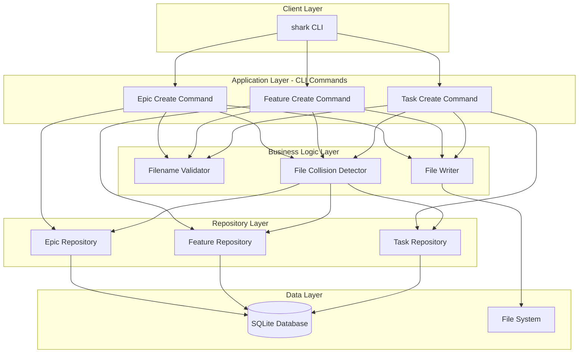
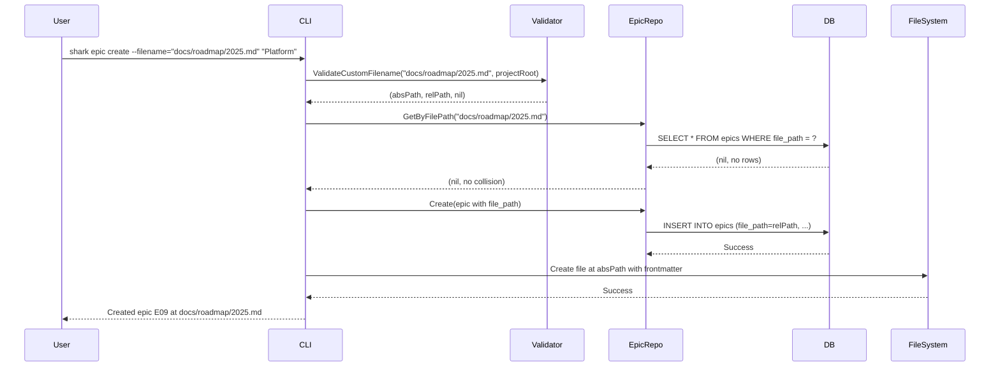
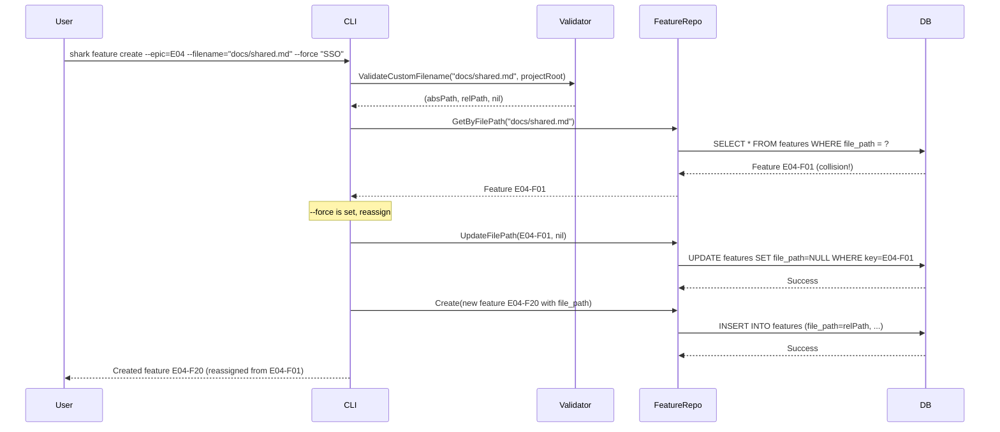
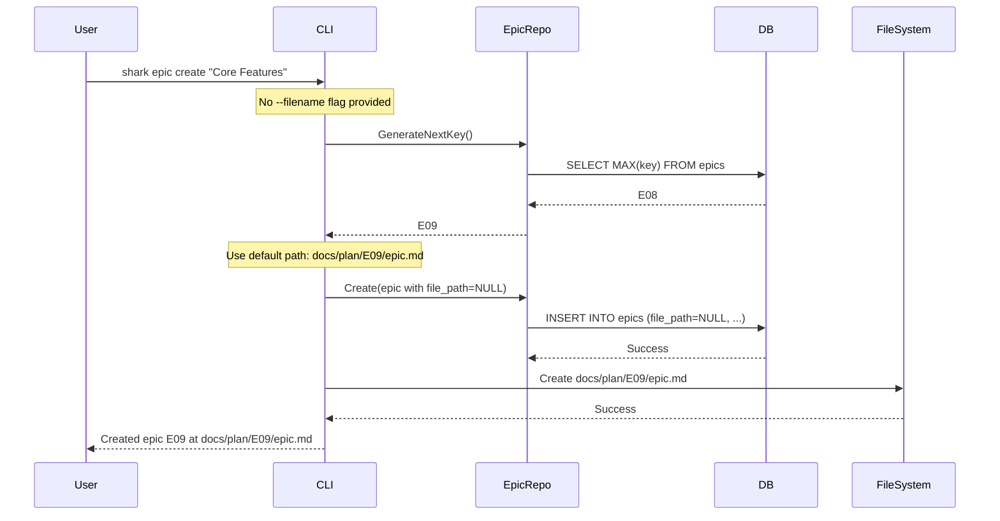

# System Architecture: Custom Filenames for Epics & Features

**Epic**: E07
**Feature**: E07-F08
**Date**: 2025-12-19
**Author**: backend-architect

## Architecture Overview

This feature extends the custom filename capability from tasks to epics and features, providing feature parity across all entity types in the Shark Task Manager CLI. The architecture follows the established pattern from E07-F05 (task custom filenames), reusing validation logic and collision detection mechanisms while adapting the CLI command handlers and repository layers to support epic and feature entities.

### Key Design Decisions

1. **Reuse existing validation**: The `ValidateCustomFilename` function from `internal/taskcreation/creator.go` is reused without modification, ensuring consistent behavior across all entity types and reducing code duplication.

2. **Database-first file ownership**: File path assignments are stored in the database (new `file_path` columns) and collision detection queries the database rather than the filesystem, maintaining a single source of truth for file ownership.

3. **Backward compatibility**: When `--filename` is not provided, the system continues using default hierarchical paths (`docs/plan/{epic-key}/epic.md` and `docs/plan/{epic-key}/{feature-key}/feature.md`), ensuring existing workflows remain unchanged.

4. **Lightweight schema extension**: Only adds nullable `file_path` TEXT columns to existing `epics` and `features` tables with indexes for collision detection performance, avoiding complex migrations or data model restructuring.

## System Architecture Diagram

## Component Details

### Epic Create Command Handler

**Purpose**: Extends the `shark epic create` command to accept `--filename` and `--force` flags for custom file path assignment.

**Responsibilities**:
- Parse CLI flags (`--filename`, `--force`)
- Invoke filename validation for custom paths
- Check for file collisions via repository query
- Handle force reassignment when `--force` is set
- Create database record with file path
- Write epic markdown file at specified location

**Dependencies**:
- `internal/taskcreation.ValidateCustomFilename`: Filename validation utility
- `internal/repository.EpicRepository`: Database operations
- File system operations: Directory creation, file writing

**Interfaces**:
- Exposes: CLI flags `--filename` (string) and `--force` (bool)
- Consumes: `ValidateCustomFilename(filename, projectRoot)` function

---

### Feature Create Command Handler

**Purpose**: Extends the `shark feature create` command to accept `--filename` and `--force` flags for custom file path assignment.

**Responsibilities**:
- Parse CLI flags (`--filename`, `--force`)
- Invoke filename validation for custom paths
- Check for file collisions via repository query
- Handle force reassignment when `--force` is set
- Create database record with file path
- Write feature markdown file at specified location

**Dependencies**:
- `internal/taskcreation.ValidateCustomFilename`: Filename validation utility
- `internal/repository.FeatureRepository`: Database operations
- File system operations: Directory creation, file writing

**Interfaces**:
- Exposes: CLI flags `--filename` (string) and `--force` (bool)
- Consumes: `ValidateCustomFilename(filename, projectRoot)` function

---

### ValidateCustomFilename (Shared Utility)

**Purpose**: Validates custom file paths against security and project boundary constraints.

**Responsibilities**:
- Reject absolute paths (must be relative to project root)
- Enforce `.md` extension requirement
- Prevent path traversal attacks (no `..` in path)
- Verify path resolves within project boundaries
- Return both absolute path (for file operations) and relative path (for database storage)

**Dependencies**:
- `filepath.Abs`, `filepath.Clean`, `filepath.Rel`: Path manipulation
- Project root directory knowledge

**Interfaces**:
- Exposes: `ValidateCustomFilename(filename string, projectRoot string) (absPath string, relPath string, error)`
- Already implemented in: `internal/taskcreation/creator.go`

---

### Epic Repository Extensions

**Purpose**: Provide database operations for file path management on epic entities.

**Responsibilities**:
- Query epics by file path for collision detection
- Update epic file path during reassignment
- Clear file path (set to NULL) when reassigning to another entity

**Dependencies**:
- SQLite database connection
- `epics` table with `file_path` column

**Interfaces**:
- Exposes: `GetByFilePath(ctx, filePath) (*Epic, error)`
- Exposes: `UpdateFilePath(ctx, epicKey, newFilePath) error`

---

### Feature Repository Extensions

**Purpose**: Provide database operations for file path management on feature entities.

**Responsibilities**:
- Query features by file path for collision detection
- Update feature file path during reassignment
- Clear file path (set to NULL) when reassigning to another entity

**Dependencies**:
- SQLite database connection
- `features` table with `file_path` column

**Interfaces**:
- Exposes: `GetByFilePath(ctx, filePath) (*Feature, error)`
- Exposes: `UpdateFilePath(ctx, featureKey, newFilePath) error`

## Data Flow

### Epic Creation with Custom Filename

### Feature Creation with Collision and Force Reassignment

### Default Path Behavior (Backward Compatibility)

## Integration Points

### Internal Services

| Component | Integration Type | Purpose |
|-----------|-----------------|---------|
| ValidateCustomFilename | Function call | Validate custom file paths before database insert |
| EpicRepository | Direct function call | Database CRUD for epics with file path support |
| FeatureRepository | Direct function call | Database CRUD for features with file path support |
| FileWriter | Direct function call | Create markdown files with YAML frontmatter |

### External Services

No external services are consumed by this feature. All operations are local to the CLI and database.

## Technology Stack

| Layer | Technology | Justification |
|-------|------------|---------------|
| CLI Framework | Cobra | Already used project-wide for all CLI commands |
| Database | SQLite | Project standard; lightweight, embedded, supports ALTER TABLE |
| Validation | Go filepath package | Secure path manipulation with project boundary checks |
| File Operations | Go os package | Standard library for file creation and directory management |
| Transaction Management | database/sql | ACID compliance for multi-step operations |

## Deployment Considerations

### Scaling Strategy

- **Horizontal**: Not applicable (single-user CLI tool)
- **Vertical**: File path operations are O(1) database lookups with indexed queries; no scaling concerns for typical project sizes (< 1000 epics/features)

### High Availability

Not applicable for a CLI tool. This is a single-process, local-database application without high availability requirements.

## Technical Risks & Mitigations

| Risk | Likelihood | Impact | Mitigation |
|------|------------|--------|------------|
| Path traversal security vulnerability | Low | High | Reuse battle-tested `ValidateCustomFilename` with explicit `..` rejection and project boundary validation |
| File collision race condition (concurrent CLI calls) | Low | Medium | Database unique index on `file_path` prevents duplicate inserts; transaction rollback ensures atomicity |
| Migration failure for existing databases | Low | High | Use `ALTER TABLE` with NULL default; existing epics/features remain valid with `file_path=NULL` |
| Inconsistent behavior across epic/feature/task | Medium | Medium | Share validation function across all three entity types; comprehensive integration tests for parity |
| Performance degradation from file path lookups | Low | Low | Add indexes on `epics.file_path` and `features.file_path`; queries remain fast even with thousands of records |
