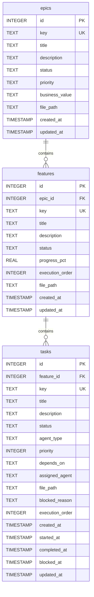

# Data Design: Custom Filenames for Epics & Features

**Epic**: E07
**Feature**: E07-F08
**Date**: 2025-12-19
**Author**: db-admin (data architect)

## Persistence Overview

This feature extends file path tracking from tasks to epics and features by adding a `file_path` column to both the `epics` and `features` tables. The column stores the relative path (from project root) to the markdown file representing the entity, enabling custom file locations while maintaining backward compatibility through nullable semantics.

### Persistence Mechanism

**Primary Storage**: SQLite database (existing `shark-tasks.db`)

**Rationale**: The project already uses SQLite for all task management data. Adding two columns to existing tables is a minimal, low-risk change that leverages existing transaction infrastructure and requires no new persistence mechanisms. SQLite's ALTER TABLE support makes schema evolution straightforward.

## Data Model

### Entity Diagram



### Schema Definition

#### epics (Modified)

**Purpose**: Top-level organizational unit representing a project epic. Extended to support custom file locations.

**Changes**: Add `file_path` column

| Field | Type | Constraints | Description |
|-------|------|-------------|-------------|
| id | INTEGER | PK, AUTOINCREMENT | Unique identifier |
| key | TEXT | NOT NULL, UNIQUE | Epic key (E01, E02, ...) |
| title | TEXT | NOT NULL | Epic title |
| description | TEXT | NULL | Optional description |
| status | TEXT | NOT NULL, CHECK | One of: draft, active, completed, archived |
| priority | TEXT | NOT NULL, CHECK | One of: high, medium, low |
| business_value | TEXT | NULL, CHECK | One of: high, medium, low |
| **file_path** | **TEXT** | **NULL** | **Relative path to epic markdown file (new)** |
| created_at | TIMESTAMP | NOT NULL, DEFAULT | Creation timestamp |
| updated_at | TIMESTAMP | NOT NULL, DEFAULT | Last update timestamp |

**New Field Details**:
- `file_path`: Stores relative path from project root (e.g., `docs/roadmap/2025.md`)
- NULL value indicates default location: `docs/plan/{epic-key}/epic.md`
- Indexed for fast collision detection queries

---

#### features (Modified)

**Purpose**: Mid-level organizational unit representing a feature within an epic. Extended to support custom file locations.

**Changes**: Add `file_path` column

| Field | Type | Constraints | Description |
|-------|------|-------------|-------------|
| id | INTEGER | PK, AUTOINCREMENT | Unique identifier |
| epic_id | INTEGER | NOT NULL, FK → epics(id) | Parent epic reference |
| key | TEXT | NOT NULL, UNIQUE | Feature key (E04-F01, ...) |
| title | TEXT | NOT NULL | Feature title |
| description | TEXT | NULL | Optional description |
| status | TEXT | NOT NULL, CHECK | One of: draft, active, completed, archived |
| progress_pct | REAL | NOT NULL, DEFAULT 0.0, CHECK | Progress percentage (0.0-100.0) |
| execution_order | INTEGER | NULL | Optional execution sequencing |
| **file_path** | **TEXT** | **NULL** | **Relative path to feature markdown file (new)** |
| created_at | TIMESTAMP | NOT NULL, DEFAULT | Creation timestamp |
| updated_at | TIMESTAMP | NOT NULL, DEFAULT | Last update timestamp |

**New Field Details**:
- `file_path`: Stores relative path from project root (e.g., `docs/specs/auth.md`)
- NULL value indicates default location: `docs/plan/{epic-key}/{feature-key}/feature.md`
- Indexed for fast collision detection queries

---

#### tasks (Unchanged - Included for Reference)

**Purpose**: Atomic work item within a feature. Already supports custom filenames via `file_path` column (implemented in E07-F05).

| Field | Type | Constraints | Description |
|-------|------|-------------|-------------|
| file_path | TEXT | NULL | Relative path to task markdown file |

*Note*: Tasks already have the `file_path` column from E07-F05. This feature brings epics and features to parity.

### Relationships

| From | To | Type | Description |
|------|-----|------|-------------|
| epics | features | 1:N | One epic contains multiple features |
| features | tasks | 1:N | One feature contains multiple tasks |

**File Path Uniqueness Consideration**:
- File paths are not enforced as globally unique across entity types
- An epic and a feature *could* theoretically claim the same file path
- Collision detection queries check within the entity type being created
- Force reassignment can reassign from any entity type (epic, feature, task) to another

## Query Patterns

| Operation | Frequency | Pattern |
|-----------|-----------|---------|
| Create epic with custom filename | Low | Insert epic with `file_path` set; collision check via `SELECT WHERE file_path = ?` |
| Create feature with custom filename | Low | Insert feature with `file_path` set; collision check via `SELECT WHERE file_path = ?` |
| Create epic with default path | Medium | Insert epic with `file_path = NULL` (no collision check needed) |
| Create feature with default path | Medium | Insert feature with `file_path = NULL` (no collision check needed) |
| Collision detection | Low | Single lookup: `SELECT * FROM epics WHERE file_path = ?` (indexed) |
| Force reassignment | Low | Update old entity: `UPDATE epics SET file_path = NULL WHERE key = ?` |
| List all epics/features | Medium | Full table scan with filters (file_path not typically queried in list operations) |

**Frequency levels**:
- **High**: > 100 requests/second (N/A for CLI tool)
- **Medium**: 10-100 requests/second (typical CLI usage patterns)
- **Low**: < 10 requests/second (occasional custom filename usage)

## Indexing Strategy

| Index Name | Fields | Type | Purpose |
|------------|--------|------|---------|
| idx_epics_file_path | file_path | btree | Fast collision detection for epic file paths |
| idx_features_file_path | file_path | btree | Fast collision detection for feature file paths |
| idx_epics_key | key | btree, unique | Existing; ensures key uniqueness |
| idx_features_key | key | btree, unique | Existing; ensures key uniqueness |

**Index Justification**:
- `file_path` indexes enable O(log n) collision detection queries
- Even with 1000+ epics/features, indexed lookups remain under 1ms
- Nullable columns can be indexed in SQLite; NULL values are included in the index

**Existing Indexes** (unchanged):
- `idx_epics_key`, `idx_epics_status`, `idx_features_epic_id`, `idx_features_status`

## Data Integrity

### Constraints

- **Primary Key**: Each epic and feature has a unique `id` (auto-increment)
- **Unique Key**: `key` field is unique across epics and features (separate namespaces)
- **Foreign Key**: `features.epic_id` references `epics.id` with `ON DELETE CASCADE`
- **Check Constraints**:
  - `epics.status` and `features.status`: Valid status values
  - `epics.priority`, `epics.business_value`: Valid priority values
  - `features.progress_pct`: Between 0.0 and 100.0
- **Not Null**: `key`, `title`, `status`, `created_at`, `updated_at` are required
- **Nullable**: `file_path` is NULL when using default locations

### Validation Rules

**Database-Level**:
- `file_path` column has no CHECK constraint; validation is application-level only
- No UNIQUE constraint on `file_path` across entity types (allows different entities to claim the same file with force override)

**Application-Level** (enforced in Go code):
- `file_path` must be a relative path (no leading `/`)
- `file_path` must have `.md` extension
- `file_path` must not contain `..` (path traversal prevention)
- `file_path` must resolve within project boundaries

**Collision Validation**:
- Before inserting epic with `file_path`, query `SELECT * FROM epics WHERE file_path = ?`
- Before inserting feature with `file_path`, query `SELECT * FROM features WHERE file_path = ?`
- If collision found and `--force` not set, reject with error
- If collision found and `--force` set, clear old entity's `file_path` to NULL

## Migration Strategy

### Initial Setup

**Schema Change Statement**:
```
Add two columns to existing tables:
1. ALTER TABLE epics ADD COLUMN file_path TEXT;
2. ALTER TABLE features ADD COLUMN file_path TEXT;

Create two indexes:
3. CREATE INDEX IF NOT EXISTS idx_epics_file_path ON epics(file_path);
4. CREATE INDEX IF NOT EXISTS idx_features_file_path ON features(file_path);
```

**Migration Approach**:
- SQLite supports `ALTER TABLE ADD COLUMN` natively
- New column defaults to NULL for all existing rows
- No data migration needed; NULL represents "use default location"
- Indexes can be created on existing tables without locking (SQLite is single-writer)

**Migration Execution**:
- Update `internal/db/db.go` schema string with new columns and indexes
- On next application start, `CreateSchema()` applies missing schema elements via `CREATE IF NOT EXISTS`
- Existing epics/features remain valid with `file_path = NULL`

### Version Management

**Current Approach**:
- Shark uses embedded schema definitions in `internal/db/db.go`
- Schema is applied via `CREATE IF NOT EXISTS` statements
- No formal migration versioning system (suitable for a CLI tool with local databases)

**For This Feature**:
- Add `file_path` column and indexes to the schema string
- Database automatically upgrades on next CLI invocation
- No rollback needed; NULL columns are backward compatible

### Rollback Plan

**If Rollback Needed**:
- SQLite does not support `ALTER TABLE DROP COLUMN` prior to version 3.35.0
- Alternative: Create new tables without `file_path`, copy data, drop old tables, rename new tables
- Recommendation: Do not rollback; leave columns in place (they are harmless if unused)

**Data Preservation**:
- Existing epics/features are unaffected by adding NULL columns
- No data loss occurs during schema addition
- Backup recommendation: Copy `shark-tasks.db` before upgrading (general best practice)

## Performance Considerations

### Expected Data Volume

- **Initial**: 10-50 epics, 50-200 features (typical project size)
- **Growth**: Linear with project scope; unlikely to exceed 1000 epics or 5000 features
- **Peak**: Single-user CLI tool; no concurrent writes; peak is a few operations per minute

### Optimization Strategies

**Indexing**:
- Add btree indexes on `file_path` columns for both tables
- Indexes enable fast collision detection without full table scans
- Nullable index performance: SQLite handles NULL values efficiently in btree indexes

**Query Optimization**:
- Collision detection: Single indexed lookup (`SELECT * FROM epics WHERE file_path = ?`)
- No joins required for file path operations
- Force reassignment: Single UPDATE by primary key

**Transaction Efficiency**:
- Use transactions for multi-step operations (collision check + insert + file write)
- Rollback on error ensures atomicity
- SQLite's single-writer model prevents lock contention in CLI usage

**No Denormalization Needed**:
- File path storage is normalized (single source of truth in database)
- No caching or materialized views required for CLI performance

## Backup & Recovery

**Backup Strategy**:
- Inherits project's existing backup approach (SQLite database file backup)
- No additional backup requirements for this feature

**Recovery Approach**:
- Restore `shark-tasks.db` from backup
- Markdown files are separate; file paths in database may point to missing files
- Application handles missing files gracefully (reports error, does not crash)

**Point-in-Time Recovery**:
- Not required for a CLI tool
- Users can manually version control `shark-tasks.db` if needed

## Integration with Interface Contracts

### DTO Mapping

This feature does not introduce new DTOs. The existing `Epic` and `Feature` structs are extended with an optional `FilePath` field.

#### Epic Model Extension

| Go Struct Field | Database Column | Transformation |
|-----------------|-----------------|----------------|
| FilePath | file_path | Direct mapping; `*string` for NULL support |

#### Feature Model Extension

| Go Struct Field | Database Column | Transformation |
|-----------------|-----------------|----------------|
| FilePath | file_path | Direct mapping; `*string` for NULL support |

**Go Model Changes** (in `internal/models/`):

**Epic**:
- Add field: `FilePath *string` with struct tag `db:"file_path"`
- Pointer type allows NULL representation (nil = default location)

**Feature**:
- Add field: `FilePath *string` with struct tag `db:"file_path"`
- Pointer type allows NULL representation (nil = default location)

### Validation Alignment

**Database Validation**:
- None beyond nullable constraint

**Application Validation** (in Go):
- Performed before database insert via `ValidateCustomFilename` function
- Ensures path security and project boundary compliance
- Validation errors prevent database writes
