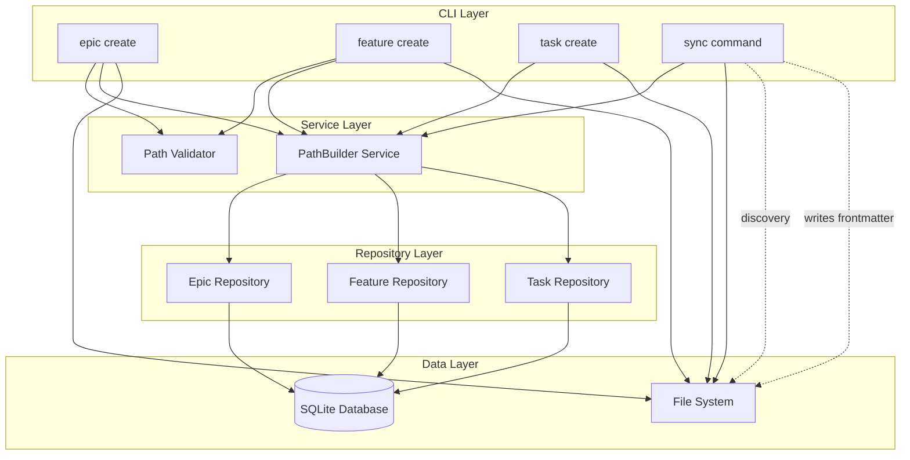
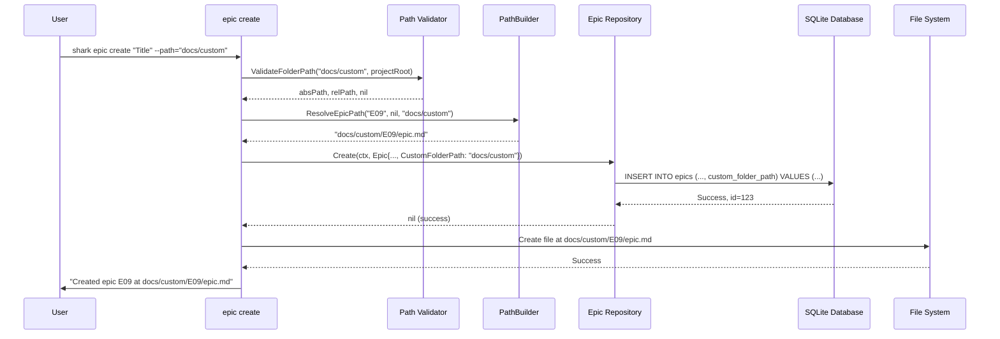
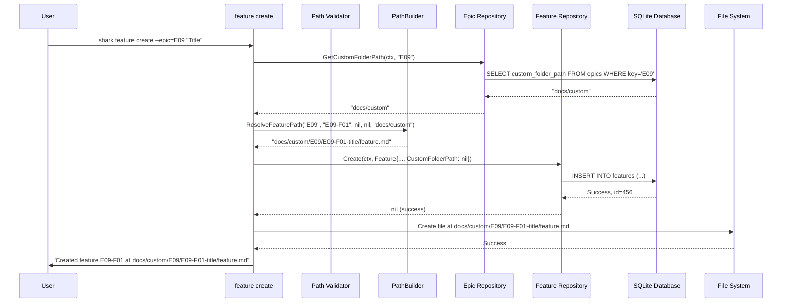
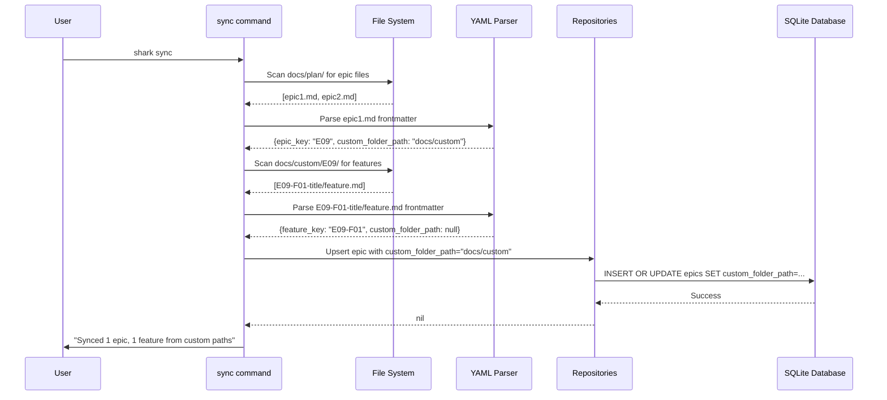

# System Architecture: Custom Folder Base Paths

**Epic**: E07-Enhancements
**Feature**: E07-F09-Custom Folder Base Paths
**Date**: 2025-12-19
**Author**: principal-architect

---

## Architecture Overview

This feature extends the Shark Task Manager's CLI and data layer to support custom base folder paths for epics and features, enabling flexible project organization beyond the default `docs/plan/` hierarchy. The architecture introduces a centralized PathBuilder service, database schema extensions, and CLI flag additions while maintaining backward compatibility.

### Key Design Decisions

1. **Centralized Path Resolution**: PathBuilder service encapsulates all path resolution logic in a single, testable component rather than scattering logic across commands
2. **Nullable Column Design**: Use NULL values for `custom_folder_path` to represent default behavior, ensuring zero-impact for existing projects
3. **Inheritance via Database Lookups**: Features and tasks query parent custom paths dynamically rather than duplicating values, maintaining data integrity
4. **Security-First Validation**: All paths validated before storage to prevent path traversal and directory escape attacks
5. **Sync Integration Required**: Discovery must scan custom locations, making Phase 4 (Sync) critical for production readiness

---

## System Architecture Diagram

---

## Component Details

### CLI Commands (epic create, feature create)

**Purpose**: Provide user interface for creating epics and features with optional custom folder paths

**Responsibilities**:
- Parse `--path` command-line flag
- Validate user input (non-empty title, valid path format)
- Fetch parent custom paths from database (features only)
- Call PathBuilder to resolve final file location
- Invoke repository methods to persist entities
- Create markdown files with frontmatter at resolved paths
- Display success messages or error feedback

**Dependencies**:
- **PathBuilder Service**: For path resolution
- **Path Validator**: For security validation
- **Epic/Feature Repositories**: For database operations
- **File System**: For creating markdown files

**Interfaces**:
- **Exposes**: Cobra CLI commands (`shark epic create`, `shark feature create`)
- **Consumes**: Repository methods, PathBuilder methods, File I/O functions

---

### PathBuilder Service

**Purpose**: Centralized service for resolving file paths based on custom folder path inheritance and precedence rules

**Responsibilities**:
- Implement path resolution precedence logic (filename > custom_folder_path > parent custom path > default)
- Handle epic, feature, and task path resolution with different inheritance rules
- Normalize paths (remove trailing slashes, resolve `./`)
- Join relative paths with project root to produce absolute paths
- Provide consistent path resolution across all CLI commands and sync operations

**Dependencies**:
- **Path Validator**: For security checks before returning paths
- **Project Root**: Configuration value for absolute path resolution

**Interfaces**:
- **Exposes**: `ResolveEpicPath()`, `ResolveFeaturePath()`, `ResolveTaskPath()` methods
- **Consumes**: Path Validator functions

**Design Patterns**:
- **Strategy Pattern**: Different resolution strategies for epic/feature/task
- **Null Object Pattern**: NULL parameters represent "use default" behavior
- **Pure Functions**: No side effects, fully testable

---

### Path Validator

**Purpose**: Validate folder paths for security and correctness before storage or use

**Responsibilities**:
- Reject absolute paths (must be relative to project root)
- Detect path traversal attempts (`..` sequences)
- Ensure paths resolve within project boundaries
- Normalize paths (remove trailing slashes, clean `./` sequences)
- Provide descriptive error messages for validation failures

**Dependencies**:
- **Go filepath package**: For path normalization and resolution
- **Project Root**: Configuration value for boundary checks

**Interfaces**:
- **Exposes**: `ValidateFolderPath(path, projectRoot) (absPath, relPath, error)`
- **Consumes**: Go standard library (filepath, path)

**Security Model**:
- Defense in depth: Validation at CLI layer + PathBuilder layer
- Whitelist approach: Only relative paths within project root allowed
- No symbolic link following (paths resolved before validation)

---

### Epic Repository

**Purpose**: CRUD operations for epic entities, including custom folder path management

**Responsibilities**:
- Create epics with `custom_folder_path` field
- Retrieve epic custom folder path by key
- Update epic metadata (title, status, etc.)
- Delete epics (cascade to features/tasks)

**Dependencies**:
- **SQLite Database**: For persistence
- **Go context package**: For cancellation and timeouts

**Interfaces**:
- **Exposes**: `Create(ctx, epic)`, `GetByKey(ctx, key)`, `GetCustomFolderPath(ctx, epicKey)`
- **Consumes**: SQLite database connection

**New Methods**:
- `GetCustomFolderPath(ctx, epicKey) (*string, error)` - Returns NULL if not set

---

### Feature Repository

**Purpose**: CRUD operations for feature entities, including custom folder path management and parent path lookups

**Responsibilities**:
- Create features with `custom_folder_path` field
- Retrieve feature custom folder path by key
- Update feature metadata (title, status, progress)
- Delete features (cascade to tasks)

**Dependencies**:
- **SQLite Database**: For persistence
- **Epic Repository**: For parent epic lookups (implicit via foreign key)

**Interfaces**:
- **Exposes**: `Create(ctx, feature)`, `GetByKey(ctx, key)`, `GetCustomFolderPath(ctx, featureKey)`
- **Consumes**: SQLite database connection

**New Methods**:
- `GetCustomFolderPath(ctx, featureKey) (*string, error)` - Returns NULL if not set

---

### Sync Command (Discovery Integration)

**Purpose**: Discover epics, features, and tasks in custom folder locations and synchronize with database

**Responsibilities**:
- Scan file system for markdown files in both default and custom locations
- Parse YAML frontmatter to extract `custom_folder_path` values
- Resolve expected file locations using PathBuilder
- Update database with discovered custom paths
- Handle conflicts between file frontmatter and database values
- Write `custom_folder_path` to frontmatter when creating/updating files

**Dependencies**:
- **File System**: For directory scanning
- **YAML Parser**: For frontmatter extraction
- **PathBuilder Service**: For path resolution
- **Repositories**: For database updates

**Interfaces**:
- **Exposes**: `shark sync` CLI command
- **Consumes**: PathBuilder, Epic/Feature/Task Repositories, File I/O

**Discovery Algorithm**:
1. Scan `docs/plan/` for epic files (default location)
2. For each epic, parse `custom_folder_path` from frontmatter
3. If custom path exists, additionally scan `<custom_folder_path>/<epic-key>/` for features
4. For each feature, parse `custom_folder_path` from frontmatter
5. Scan for tasks in feature's custom path, epic's custom path, or default location
6. Update database with discovered custom paths
7. Handle conflicts using `--strategy` flag (file-wins vs. db-wins)

---

## Data Flow

### Epic Creation Flow

---

### Feature Creation with Path Inheritance

---

### Sync Discovery Flow

---

## Integration Points

### Internal Services

| Component | Integration Type | Purpose | Data Exchanged |
|-----------|-----------------|---------|----------------|
| CLI Commands → PathBuilder | Function Call | Resolve file paths | Epic/feature/task keys, custom paths → absolute file path |
| CLI Commands → Repositories | Function Call | Persist entities | Epic/Feature/Task structs → database IDs |
| PathBuilder → Validator | Function Call | Validate paths | Relative path → validated absolute path |
| Sync → PathBuilder | Function Call | Resolve expected paths | Parent custom paths → expected file location |
| Repositories → Database | SQL Query | CRUD operations | Entity data → rows in SQLite |

### External Services

None. This feature is entirely self-contained within the Shark Task Manager CLI.

---

## Technology Stack

| Layer | Technology | Justification |
|-------|------------|---------------|
| **CLI Framework** | Cobra | Already in use; supports nested commands and flags |
| **Language** | Go 1.23.4+ | Project language; compiled binary, static typing |
| **Database** | SQLite | Already in use; embedded, zero-config, ACID compliant |
| **Path Validation** | Go filepath package | Standard library; platform-agnostic path handling |
| **Frontmatter Parsing** | YAML parser | Already in use for task/epic/feature frontmatter |
| **Testing** | Go testing + testify | Standard testing framework with assertions |

---

## Deployment Considerations

### Scaling Strategy

**Not Applicable**: This is a CLI tool, not a service. Each invocation is a single-process execution.

**Performance Characteristics**:
- Path resolution: O(1) - constant time lookups and string operations
- Database queries: O(log n) - btree index lookups
- File system operations: O(n) - where n = number of files in directory (sync only)

### High Availability

**Not Applicable**: CLI tool runs on user's local machine. No redundancy or failover needed.

**Reliability Considerations**:
- SQLite database: Single file, atomic transactions, crash-safe with WAL mode
- File system: User's local filesystem, backed up via user's backup strategy

---

## Technical Risks & Mitigations

| Risk | Likelihood | Impact | Mitigation |
|------|------------|--------|------------|
| **Path Traversal Vulnerability** | Low | High | Multi-layer validation (CLI + PathBuilder), reject `..` sequences, verify resolved paths within project root |
| **Sync Performance Degradation** | Medium | Low | Build path map during discovery to cache parent custom paths; avoid redundant filesystem scans |
| **User Confusion: --path vs. --filename** | Medium | Low | Clear documentation, help text, and examples distinguishing "base folder" vs. "exact file" |
| **Database Migration Issues** | Medium | Medium | Provide clear migration guide; use ALTER TABLE in docs; columns are nullable for safety |
| **Complex Inheritance Bugs** | Medium | Medium | Centralize logic in PathBuilder; comprehensive unit tests covering all precedence scenarios |
| **Backward Compatibility Breakage** | Low | High | NULL values = default behavior; all new flags optional; existing workflows unchanged |

---

## Quality Attributes (WAF Pillars)

### Security

- **Path Traversal Prevention**: All paths validated before use; reject `..`, absolute paths, and out-of-bounds paths
- **Input Validation**: CLI flags validated at entry point; malicious paths rejected with clear errors
- **Database Injection**: Parameterized queries prevent SQL injection (existing pattern maintained)

### Reliability

- **Data Integrity**: Foreign key constraints ensure parent-child relationships maintained
- **Atomic Operations**: Database transactions ensure all-or-nothing updates
- **Error Handling**: Descriptive errors with context; graceful degradation to defaults

### Performance

- **Minimal Overhead**: Path resolution is pure computation (no I/O)
- **Efficient Queries**: Indexed lookups for custom_folder_path (O(log n))
- **Sparse Index Optimization**: NULL values not indexed, keeping indexes small

### Cost Efficiency

- **No Infrastructure Cost**: CLI tool, no servers or cloud resources
- **Storage Cost**: Two additional TEXT columns per epic/feature (minimal storage)

### Operational Excellence

- **Backward Compatibility**: Existing projects work unchanged; new columns are NULL by default
- **Testability**: PathBuilder is pure function; easily unit tested
- **Maintainability**: Centralized logic in single service; clear separation of concerns

---

## Success Criteria

### Functional

- [ ] `shark epic create --path=<folder>` creates epic with custom base path
- [ ] Features inherit parent epic's custom path by default
- [ ] Features can override epic's custom path with `--path` flag
- [ ] Tasks inherit custom paths from features and epics
- [ ] `shark sync` discovers epics/features/tasks in custom locations
- [ ] Path validation prevents security vulnerabilities
- [ ] Default behavior unchanged (backward compatible)

### Non-Functional

- [ ] Path resolution completes in < 1ms (negligible overhead)
- [ ] Database queries complete in < 2ms (indexed lookups)
- [ ] All paths validated for security before use
- [ ] Zero impact on existing projects (NULL = default)
- [ ] Comprehensive test coverage (>90% for PathBuilder, validators)
- [ ] Clear error messages for validation failures

---

## Future Enhancements

**Potential Extensions** (post-MVP):
1. **Epic Index Integration**: Update `/generate-epic-index` to follow custom paths
2. **Move Command**: `shark epic move --path=<new-path>` to relocate entire hierarchies
3. **Path Templates**: `--path-template="docs/{{year}}/{{quarter}}"` with variable substitution
4. **Validation Command**: `shark validate paths` to verify file locations match expected paths
5. **Bulk Update**: `shark epic update-path E09 --new-path="..."` to move existing epics

---

## References

- **Research Report**: `00-research-report.md` - Codebase analysis and patterns
- **Data Design**: `03-data-design.md` - Database schema and models
- **Backend Design**: `04-backend-design.md` - CLI commands and service interfaces
- **PRD**: `prd.md` - Feature requirements and user stories
- **E07-F08 PRD**: Custom filenames for epics/features (prerequisite feature)

---

## Summary

This architecture extends Shark Task Manager with custom folder base paths through minimal, surgical changes: two database columns, one service class, and two CLI flags. The design prioritizes security (multi-layer path validation), simplicity (centralized PathBuilder), and backward compatibility (NULL = default behavior).

The critical path to production includes Phase 4 (Sync Integration), which enables discovery of items in custom locations. Without sync, the feature only works for CLI-created items and cannot discover manually reorganized files.

---

**End of System Architecture Document**
