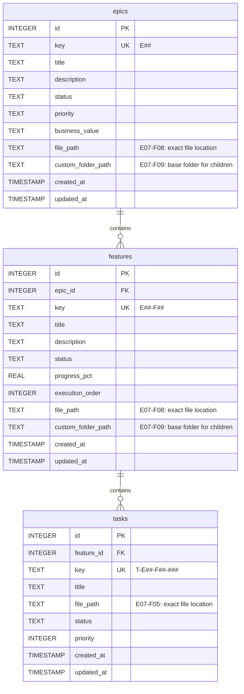

# Data Design: Custom Folder Base Paths

**Epic**: E07-Enhancements
**Feature**: E07-F09-Custom Folder Base Paths
**Date**: 2025-12-19
**Author**: db-admin (data architect)

---

## Persistence Overview

This feature extends the data model for epics and features to support custom folder base paths that cascade to child items. The `custom_folder_path` field stores the base directory path where an epic or feature and its children should reside, enabling flexible project organization beyond the default `docs/plan/` hierarchy.

### Persistence Mechanism

**Primary Storage**: SQLite relational database
**Rationale**:
- Project already uses SQLite for all entity persistence
- Custom folder paths are organizational metadata best stored with entity records
- Relational model supports inheritance queries (epic → feature → task path resolution)
- NULL values naturally represent default behavior (backward compatible)
- Indexes enable efficient path lookups for validation and discovery

---

## Data Model

### Entity Diagram



---

## Schema Definition

### Epics Table Extension

**Purpose**: Store custom base folder path for each epic and its child features/tasks

**New Column**:

| Field | Type | Constraints | Description |
|-------|------|-------------|-------------|
| custom_folder_path | TEXT | NULL | Custom base directory for this epic and all children. NULL indicates default behavior (`docs/plan/<epic-key>/`). Relative path from project root. |

**Existing Columns** (for context):

| Field | Type | Constraints | Description |
|-------|------|-------------|-------------|
| id | INTEGER | PK, AUTOINCREMENT | Unique numeric identifier |
| key | TEXT | NOT NULL, UNIQUE | Epic key (E##) |
| title | TEXT | NOT NULL | Epic title |
| description | TEXT | NULL | Epic description |
| status | TEXT | NOT NULL, CHECK | One of: draft, active, completed, archived |
| priority | TEXT | NOT NULL, CHECK | One of: high, medium, low |
| business_value | TEXT | NULL, CHECK | One of: high, medium, low |
| file_path | TEXT | NULL | Exact file location for epic.md (E07-F08) |
| created_at | TIMESTAMP | NOT NULL, DEFAULT CURRENT_TIMESTAMP | Creation timestamp |
| updated_at | TIMESTAMP | NOT NULL, DEFAULT CURRENT_TIMESTAMP | Last modification timestamp |

**Semantics**:
- `file_path`: Exact file path for THIS epic's markdown file (e.g., `docs/custom/my-epic.md`)
- `custom_folder_path`: Base directory for THIS epic AND all child features/tasks (e.g., `docs/custom`)
- If both are NULL, use default: `docs/plan/<epic-key>/epic.md`
- `custom_folder_path` sets the base; children inherit and append their structure

---

### Features Table Extension

**Purpose**: Store custom base folder path for each feature and its child tasks

**New Column**:

| Field | Type | Constraints | Description |
|-------|------|-------------|-------------|
| custom_folder_path | TEXT | NULL | Custom base directory for this feature and all child tasks. NULL indicates inherit from parent epic or use default. Relative path from project root. |

**Existing Columns** (for context):

| Field | Type | Constraints | Description |
|-------|------|-------------|-------------|
| id | INTEGER | PK, AUTOINCREMENT | Unique numeric identifier |
| epic_id | INTEGER | NOT NULL, FK → epics(id) | Parent epic reference |
| key | TEXT | NOT NULL, UNIQUE | Feature key (E##-F##) |
| title | TEXT | NOT NULL | Feature title |
| description | TEXT | NULL | Feature description |
| status | TEXT | NOT NULL, CHECK | One of: draft, active, completed, archived |
| progress_pct | REAL | NOT NULL, DEFAULT 0.0, CHECK (0-100) | Completion percentage |
| execution_order | INTEGER | NULL | Sequential execution order |
| file_path | TEXT | NULL | Exact file location for feature.md (E07-F08) |
| created_at | TIMESTAMP | NOT NULL, DEFAULT CURRENT_TIMESTAMP | Creation timestamp |
| updated_at | TIMESTAMP | NOT NULL, DEFAULT CURRENT_TIMESTAMP | Last modification timestamp |

**Semantics**:
- `file_path`: Exact file path for THIS feature's markdown file
- `custom_folder_path`: Base directory for THIS feature AND all child tasks
- If both are NULL, inherit from parent epic's `custom_folder_path` or use default
- Feature's `custom_folder_path` overrides parent epic's if both are set

---

### Tasks Table (No Changes)

**Note**: Tasks do NOT receive a `custom_folder_path` column. Task locations are determined by:
1. Explicit `file_path` (E07-F05) - highest precedence
2. Parent feature's `custom_folder_path` (this feature)
3. Parent epic's `custom_folder_path` (this feature)
4. Default structure

Tasks use inheritance from their parent feature/epic for path resolution.

---

## Relationships

| From | To | Type | Description |
|------|-----|------|-------------|
| epics | features | 1:N | Epic contains zero or more features. CASCADE DELETE. |
| features | tasks | 1:N | Feature contains zero or more tasks. CASCADE DELETE. |

**Path Inheritance Flow**:
```
Epic.custom_folder_path
  ↓ (inherited if Feature.custom_folder_path is NULL)
Feature.custom_folder_path
  ↓ (inherited if Task.file_path is NULL)
Task location (calculated)
```

---

## Query Patterns

### Common Operations

| Operation | Frequency | Pattern | Implementation Notes |
|-----------|-----------|---------|---------------------|
| Get epic custom path | Medium | Lookup by epic key | `SELECT custom_folder_path FROM epics WHERE key = ?` |
| Get feature custom path | Medium | Lookup by feature key | `SELECT custom_folder_path FROM features WHERE key = ?` |
| Resolve feature path | High | Feature + parent epic lookup | Join features → epics to get parent custom_folder_path |
| Resolve task path | High | Task + feature + epic lookup | Join tasks → features → epics for path resolution |
| Check path collision | Low | Lookup by custom_folder_path | `SELECT key FROM epics WHERE custom_folder_path = ?` (validation) |
| List epics by custom path | Low | Filter by custom_folder_path | `SELECT * FROM epics WHERE custom_folder_path IS NOT NULL` |
| Sync discovery | Low | Scan all custom paths | `SELECT key, custom_folder_path FROM epics UNION features` |

**Frequency Levels**:
- **High**: > 100 requests/second (path resolution during creation)
- **Medium**: 10-100 requests/second (queries for inherited paths)
- **Low**: < 10 requests/second (admin operations, sync)

---

## Indexing Strategy

### Epic Indexes

| Index Name | Fields | Type | Purpose |
|-----------|--------|------|---------|
| idx_epics_custom_folder_path | custom_folder_path | btree | Fast lookups for epics by custom path. Supports validation queries (collision detection). NULL-safe (NULLs are skipped). |

**Existing Indexes** (preserved):
- `idx_epics_key` (UNIQUE) - Primary access pattern
- `idx_epics_status` - Status filtering

### Feature Indexes

| Index Name | Fields | Type | Purpose |
|-----------|--------|------|---------|
| idx_features_custom_folder_path | custom_folder_path | btree | Fast lookups for features by custom path. Supports validation queries. NULL-safe. |

**Existing Indexes** (preserved):
- `idx_features_key` (UNIQUE) - Primary access pattern
- `idx_features_epic_id` - Parent epic joins
- `idx_features_status` - Status filtering

### Index Rationale

**Why index `custom_folder_path`?**
- Supports sync discovery (find all items with custom paths)
- Enables collision detection during creation
- Minimal overhead (sparse index since most records will be NULL)
- Efficient NULL handling (SQLite btree indexes skip NULL values)

**Why btree?**
- Standard index type for equality and range queries
- Efficient for sparse data (many NULLs)
- Supports `IS NULL` and `IS NOT NULL` predicates

---

## Data Integrity

### Constraints

**Epic Table**:
- **Primary Key**: `id` (INTEGER AUTOINCREMENT)
- **Unique Key**: `key` (TEXT) - Enforced via unique index
- **Foreign Key**: None (top-level entity)
- **Check Constraints**:
  - `status IN ('draft', 'active', 'completed', 'archived')`
  - `priority IN ('high', 'medium', 'low')`
  - `business_value IN ('high', 'medium', 'low') OR business_value IS NULL`
- **NOT NULL**: `key`, `title`, `status`, `priority`, `created_at`, `updated_at`
- **NULL Allowed**: `description`, `business_value`, `file_path`, `custom_folder_path`

**Feature Table**:
- **Primary Key**: `id` (INTEGER AUTOINCREMENT)
- **Unique Key**: `key` (TEXT) - Enforced via unique index
- **Foreign Key**: `epic_id` REFERENCES `epics(id)` ON DELETE CASCADE
- **Check Constraints**:
  - `status IN ('draft', 'active', 'completed', 'archived')`
  - `progress_pct >= 0.0 AND progress_pct <= 100.0`
- **NOT NULL**: `epic_id`, `key`, `title`, `status`, `progress_pct`, `created_at`, `updated_at`
- **NULL Allowed**: `description`, `execution_order`, `file_path`, `custom_folder_path`

### Validation Rules

**Application-Level Validation** (enforced before INSERT/UPDATE):

1. **Path Format Validation**:
   - Must be relative path (no leading `/`)
   - No path traversal (`..` sequences not allowed)
   - Must resolve within project root
   - Trailing slashes are normalized (removed)
   - Empty string treated as NULL

2. **Path Security Validation**:
   - No absolute paths (e.g., `/absolute/path`)
   - No parent directory references (e.g., `../../outside`)
   - No symbolic link escapes (path must resolve to project subdirectory)
   - Validated using `filepath.Clean()` and `filepath.Abs()` checks

3. **Path Collision Validation** (advisory):
   - Warning if multiple epics/features share same `custom_folder_path`
   - Not enforced as constraint (valid use case: multiple entities in same folder)
   - Checked during creation for user feedback

4. **Inheritance Validation**:
   - NULL is valid (inherit from parent or use default)
   - Non-NULL must be valid path (validated before storage)
   - Tasks do not have `custom_folder_path` (validated at model layer)

**Database-Level Validation**:
- CHECK constraints on status fields
- NOT NULL constraints on required fields
- FOREIGN KEY constraints ensure referential integrity

---

## Migration Strategy

### Initial Setup

**For New Installations** (`shark init`):
- Schema includes `custom_folder_path` columns from the start
- Created via `internal/db/db.go` `createSchema()` function
- Indexes created automatically

**For Existing Installations**:
- Requires manual migration via ALTER TABLE statements
- Provided in migration documentation

### Version Management

**Migration Approach**: In-place schema evolution

**Migration Script** (for existing databases):

```sql
-- Add custom_folder_path column to epics
ALTER TABLE epics ADD COLUMN custom_folder_path TEXT;

-- Add custom_folder_path column to features
ALTER TABLE features ADD COLUMN custom_folder_path TEXT;

-- Create indexes
CREATE INDEX IF NOT EXISTS idx_epics_custom_folder_path ON epics(custom_folder_path);
CREATE INDEX IF NOT EXISTS idx_features_custom_folder_path ON features(custom_folder_path);
```

**Execution**:
- Run via `sqlite3 shark-tasks.db < migration.sql`
- Or integrated into `shark init` with schema version check
- Idempotent (uses `IF NOT EXISTS`)

**Schema Version Tracking**:
- Currently no formal version table (future enhancement)
- Schema version implicit in code (db.go createSchema)
- Migration history tracked via git commits

### Rollback Plan

**To Rollback** (remove custom_folder_path columns):

```sql
-- SQLite doesn't support DROP COLUMN directly
-- Must recreate tables without the column

-- 1. Backup data
.backup backup.db

-- 2. Create new tables without custom_folder_path
-- 3. Copy data from old tables
-- 4. Drop old tables
-- 5. Rename new tables

-- Alternative: Keep column, ignore in code (safer)
```

**Recommendation**: Don't rollback database schema. Instead:
- Remove `custom_folder_path` field from Go models
- Ignore column in queries (don't SELECT it)
- Column remains in DB but unused (NULL)
- Easier to re-enable later

---

## Performance Considerations

### Expected Data Volume

- **Initial**: 1-50 epics per project
- **Growth**: 1-10 new epics per quarter
- **Peak**: ~200 epics in large multi-year projects
- **Features**: 5-20 features per epic (100-4,000 total)
- **Custom Paths**: 10-30% of epics/features use custom paths (sparse data)

**Impact Assessment**:
- Small data volume (thousands of records, not millions)
- Indexes add negligible overhead
- NULL handling is efficient in SQLite (NULLs don't occupy index space)

### Optimization Strategies

1. **Sparse Index Optimization**:
   - Indexes only store non-NULL values
   - Most records use default paths (NULL) → not indexed
   - Index remains small and fast

2. **Query Optimization**:
   - Avoid full table scans (use indexed key lookups)
   - JOIN with epics when resolving feature paths (acceptable cost)
   - Cache parent custom_folder_path in memory during bulk operations

3. **Connection Pooling**:
   - Already configured (not changed by this feature)
   - WAL mode supports concurrent reads

4. **Caching Strategy**:
   - PathBuilder service can cache resolved paths in-memory (optional enhancement)
   - Short-lived cache during sync operations (avoid repeated DB lookups)
   - No persistent cache needed (data volume is small)

### Query Performance Analysis

**Lookup by epic key** (indexed):
- Query: `SELECT custom_folder_path FROM epics WHERE key = ?`
- Cost: O(log n) with btree index on key (already exists)
- Estimated time: < 1ms

**Lookup by custom path** (indexed):
- Query: `SELECT key FROM epics WHERE custom_folder_path = ?`
- Cost: O(log n) with btree index on custom_folder_path (new)
- Estimated time: < 1ms
- Use case: Collision detection, sync discovery

**Resolve feature path** (join):
- Query: `SELECT f.custom_folder_path, e.custom_folder_path FROM features f JOIN epics e ON f.epic_id = e.id WHERE f.key = ?`
- Cost: O(log n) for feature lookup + O(1) for epic join
- Estimated time: < 2ms
- Use case: Feature path resolution during creation

---

## Backup & Recovery

**Backup Strategy** (project-wide, not feature-specific):
- SQLite database backed up via filesystem snapshots
- WAL files included in backup
- Recommended frequency: Daily automated backups

**Recovery Approach**:
- Restore from most recent backup
- Replay WAL if available (point-in-time recovery)
- No special recovery needed for `custom_folder_path` (standard column)

**Data Loss Impact**:
- Loss of `custom_folder_path` values → files organized by default paths
- Sync can restore values from frontmatter (if files preserved)
- Low criticality (organizational metadata, not content)

---

## Integration with Interface Contracts

### DTO Mapping

**Epic DTO** (JSON representation):

| DTO Field | Database Field | Transformation |
|-----------|----------------|----------------|
| id | id | Direct mapping (int64) |
| key | key | Direct mapping (string) |
| title | title | Direct mapping (string) |
| description | description | Direct mapping (nullable string) |
| status | status | Direct mapping (enum string) |
| priority | priority | Direct mapping (enum string) |
| business_value | business_value | Direct mapping (nullable enum string) |
| file_path | file_path | Direct mapping (nullable string) |
| custom_folder_path | custom_folder_path | **New field** - Direct mapping (nullable string) |
| created_at | created_at | ISO-8601 timestamp format |
| updated_at | updated_at | ISO-8601 timestamp format |

**Feature DTO** (JSON representation):

| DTO Field | Database Field | Transformation |
|-----------|----------------|----------------|
| id | id | Direct mapping (int64) |
| epic_id | epic_id | Direct mapping (int64) |
| key | key | Direct mapping (string) |
| title | title | Direct mapping (string) |
| description | description | Direct mapping (nullable string) |
| status | status | Direct mapping (enum string) |
| progress_pct | progress_pct | Direct mapping (float64) |
| execution_order | execution_order | Direct mapping (nullable int) |
| file_path | file_path | Direct mapping (nullable string) |
| custom_folder_path | custom_folder_path | **New field** - Direct mapping (nullable string) |
| created_at | created_at | ISO-8601 timestamp format |
| updated_at | updated_at | ISO-8601 timestamp format |

### CLI Output Format

**JSON Output** (with `--json` flag):

```json
{
  "key": "E09",
  "title": "Q1 2025 Roadmap",
  "status": "active",
  "priority": "high",
  "custom_folder_path": "docs/roadmap/2025-q1",
  "file_path": "docs/roadmap/2025-q1/E09/epic.md",
  "created_at": "2025-12-19T10:30:00Z",
  "updated_at": "2025-12-19T10:30:00Z"
}
```

**Null Handling**:
- When `custom_folder_path` is NULL, omit from JSON (using `omitempty` tag)
- Indicates default path behavior

### Frontmatter Mapping

**Epic Frontmatter** (YAML):

```yaml
---
epic_key: E09
title: Q1 2025 Roadmap
description: Strategic goals for Q1 2025
status: active
priority: high
custom_folder_path: docs/roadmap/2025-q1
---
```

**Feature Frontmatter** (YAML):

```yaml
---
feature_key: E09-F01
epic_key: E09
title: User Growth
description: Increase user acquisition
status: active
custom_folder_path: docs/roadmap/2025-q1/user-growth
---
```

**Frontmatter Rules**:
- `custom_folder_path` is optional in frontmatter
- If absent, use NULL in database (default behavior)
- Sync reads from frontmatter → database
- Sync writes from database → frontmatter (when non-NULL)

---

## Data Model Versioning

**Current Schema Version**: 1.0 (initial implementation)

**Future Enhancements** (potential):
- Add `path_template` field for dynamic path generation (e.g., `docs/{{year}}/{{quarter}}/`)
- Add `path_policy` enum (strict | inherit | override) for advanced inheritance rules
- Add `path_history` table to track path changes over time

**Deprecation Policy**:
- `custom_folder_path` will NOT be deprecated
- If enhanced, new fields will be added alongside (backward compatible)
- Existing records continue to work unchanged

---

## Summary

This data design extends the SQLite schema with `custom_folder_path` columns for epics and features, enabling hierarchical path inheritance. The design prioritizes:

1. **Backward Compatibility**: NULL values = default behavior
2. **Simplicity**: Single column, no complex relationships
3. **Performance**: Sparse indexes, efficient NULL handling
4. **Security**: Application-level path validation
5. **Maintainability**: Consistent with existing patterns

The implementation requires minimal schema changes (two columns, two indexes) while enabling powerful organizational flexibility for users.

---

**End of Data Design Document**
