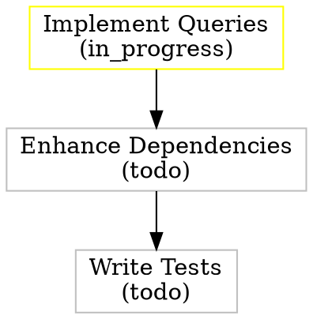

---
key: T-E15-F04-002
title: Enhance Dependency Management and Validation
epic: E15
feature: E15-F04
agent: developer
status: todo
priority: 8
created_at: 2026-02-17T23:17:31Z
---

# Task: Enhance Dependency Management and Validation

## Goal

Enhance TaskService dependency management to detect circular dependencies, analyze impact of changes, and provide dependency chain visualization. Current implementation has `ValidateDependencies` and `GetDependencyTree` - this task adds cycle detection, impact analysis, and dependency suggestion/auto-resolution features.

## Requirements

### Functional Requirements

- [ ] Implement circular dependency detection in ValidateDependencies
- [ ] Add GetDependencyChain method for path visualization (A → B → C)
- [ ] Implement GetImpactAnalysis to show downstream tasks affected by changes
- [ ] Add SuggestDependencies based on task relationships (same feature, semantic analysis)
- [ ] Implement AddDependency method with circular dependency prevention
- [ ] Add RemoveDependency method with impact warnings
- [ ] Implement GetDependencyGraph for visualization (DOT format output)
- [ ] Add GetCriticalPath method to identify longest dependency chain

### Non-Functional Requirements

- [ ] Cycle detection performance: O(V+E) using DFS, completes in <50ms for 1000 tasks
- [ ] Impact analysis: Traverse dependency graph efficiently with memoization
- [ ] Memory efficiency: Lazy loading for large dependency trees (only load on-demand)
- [ ] Error messages: Clear descriptions of circular dependencies with full cycle path

## Implementation Plan

### Steps

1. [ ] Enhance ValidateDependencies with circular dependency detection
   - Use depth-first search (DFS) to detect cycles
   - Return error with full cycle path (e.g., "A → B → C → A")
   - Cache visited nodes to avoid redundant checks
   - Handle self-dependencies as special case

2. [ ] Implement GetDependencyChain method
   - Find shortest path between two tasks
   - Return ordered list of task keys representing path
   - Use breadth-first search (BFS) for shortest path
   - Return empty if no path exists

3. [ ] Implement GetImpactAnalysis method
   - Given task key, find all downstream dependent tasks
   - Calculate impact metrics: affected task count, max depth, critical tasks
   - Group impacted tasks by status (blocking in_progress > blocking todo)
   - Return structured ImpactAnalysis type

4. [ ] Implement AddDependency method
   - Validate both tasks exist
   - Check for circular dependency before adding
   - Call repository to persist dependency
   - Trigger impact analysis if adding to in_progress task

5. [ ] Implement RemoveDependency method
   - Validate dependency exists
   - Calculate impact of removal (tasks becoming unblocked)
   - Return warning message if removal affects critical path
   - Call repository to remove dependency

6. [ ] Implement GetDependencyGraph method
   - Generate DOT format graph for Graphviz visualization
   - Include node attributes (status, priority, agent)
   - Color nodes by status (green=completed, yellow=in_progress, etc.)
   - Support filtering to specific epic/feature scope

7. [ ] Implement GetCriticalPath method
   - Find longest dependency chain in feature/epic
   - Identify tasks that delay overall completion
   - Return ordered task list with cumulative duration estimates
   - Highlight if critical path is blocked

### Technical Approach

**Graph Traversal**: Use adjacency list representation
- Build graph from TaskRepository.GetTaskDependents() results
- Cache graph structure per feature for performance
- Invalidate cache on dependency changes

**Cycle Detection Algorithm**:
```go
func detectCycle(graph map[string][]string, start string) ([]string, bool) {
    visited := make(map[string]bool)
    recStack := make(map[string]bool)
    var path []string

    var dfs func(string) bool
    dfs = func(node string) bool {
        visited[node] = true
        recStack[node] = true
        path = append(path, node)

        for _, neighbor := range graph[node] {
            if !visited[neighbor] {
                if dfs(neighbor) {
                    return true
                }
            } else if recStack[neighbor] {
                // Cycle found - return path
                return true
            }
        }

        recStack[node] = false
        path = path[:len(path)-1]
        return false
    }

    hasCycle := dfs(start)
    return path, hasCycle
}
```

**Impact Analysis**:
- Traverse dependency graph from task (BFS)
- Categorize impacted tasks by distance (immediate, 2-hops, 3+ hops)
- Prioritize by status (in_progress > ready_for_review > todo)

**Trade-offs**:
- In-memory graph: Fast, works for <10K tasks, requires loading all dependencies
- Database joins: Better for large datasets, slower per-query, requires complex SQL
- Decision: Start in-memory, add caching if performance issues arise

## Deliverables

- [ ] Updated `ValidateDependencies` with cycle detection
- [ ] New methods in `internal/services/task_service.go`:
  - `GetDependencyChain(ctx, from, to) ([]string, error)`
  - `GetImpactAnalysis(ctx, taskKey) (*ImpactAnalysis, error)`
  - `AddDependency(ctx, taskKey, dependsOn) error`
  - `RemoveDependency(ctx, taskKey, dependsOn) error`
  - `GetDependencyGraph(ctx, filters) (string, error)` (DOT format)
  - `GetCriticalPath(ctx, featureKey) ([]string, error)`
- [ ] New types in `internal/services/task_dto.go`:
  - `ImpactAnalysis` struct (affected tasks, metrics)
  - `DependencyGraphFilters` struct (scope, depth limit)
- [ ] Helper functions for graph operations (in new file `task_dependencies.go`)
- [ ] Godoc comments for all new methods and types

## Acceptance Criteria

**Circular Dependency Detection**:
- [ ] ValidateDependencies detects cycles before adding dependency
- [ ] Error message includes full cycle path (A → B → C → A)
- [ ] Self-dependencies detected and rejected
- [ ] Performance: <50ms for 1000-task graph

**Dependency Chain**:
- [ ] GetDependencyChain finds shortest path between tasks
- [ ] Returns empty slice if no path exists
- [ ] Path includes both start and end tasks
- [ ] Handles disconnected tasks gracefully

**Impact Analysis**:
- [ ] GetImpactAnalysis identifies all downstream tasks
- [ ] Categorizes impacted tasks by distance and status
- [ ] Calculates metrics: count, max depth, critical tasks
- [ ] Empty results for tasks with no dependents

**Dependency Modification**:
- [ ] AddDependency prevents circular dependencies
- [ ] RemoveDependency calculates impact before removal
- [ ] Both methods validate tasks exist
- [ ] Repository methods called with correct parameters

**Dependency Graph**:
- [ ] GetDependencyGraph generates valid DOT format
- [ ] Node colors match task status
- [ ] Graph scoped to requested epic/feature
- [ ] Can be rendered with Graphviz without errors

**Critical Path**:
- [ ] GetCriticalPath identifies longest dependency chain
- [ ] Returns tasks in order from first to last
- [ ] Highlights if any task in path is blocked
- [ ] Handles features with no dependencies (returns single task)

**Code Quality**:
- [ ] Graph algorithms use standard patterns (DFS, BFS)
- [ ] Error messages are clear and actionable
- [ ] No infinite loops in cycle detection
- [ ] Memory efficient (no full graph copies)

## Testing Strategy

**Unit Tests** (in `task_service_test.go`):
- [ ] Test cycle detection with various graph shapes:
  - Simple cycle: A → B → A
  - Complex cycle: A → B → C → D → B
  - Self-dependency: A → A
  - No cycle: Linear chain A → B → C
- [ ] Test dependency chain finding:
  - Direct dependency (1-hop)
  - Multi-hop chain (3+ hops)
  - No path between tasks
  - Shortest of multiple paths
- [ ] Test impact analysis:
  - Single dependent task
  - Multiple levels (tree structure)
  - Diamond dependencies (A → B,C; B,C → D)
  - No dependents
- [ ] Test add/remove dependency:
  - Valid additions
  - Circular dependency prevention
  - Removing last dependency
  - Invalid task keys
- [ ] Mock repository to return controlled dependency graphs

**Test Cases**:
1. Cycle detection: 10 different graph topologies (linear, tree, DAG with cycle, etc.)
2. Impact analysis: Empty graph, single task, 100-task deep tree
3. Critical path: Multiple chains of different lengths, all equal length, single task
4. Add dependency: Before start, after completion, to blocked task
5. DOT format: Valid syntax, node attributes, edge labels

**Integration Tests** (optional):
- [ ] Test with real repository and database
- [ ] Create tasks with actual dependencies
- [ ] Verify cycle detection prevents invalid states in DB

## Dependencies

- Existing methods:
  - `TaskService.ValidateDependencies` (to be enhanced)
  - `TaskService.GetDependencyTree` (to be extended)
  - `TaskRepository.GetTaskDependents`
- May need new repository methods:
  - `AddTaskDependency(ctx, taskID, dependsOnID) error`
  - `RemoveTaskDependency(ctx, taskID, dependsOnID) error`

## Notes

**Existing Patterns**:
- GetDependencyTree already exists - returns full tree structure
- ValidateDependencies checks if dependencies are completed before transition
- Reference graph algorithms from standard libraries (consider `golang.org/x/exp/graph` if needed)

**Graph Visualization Example** (DOT format):


**Future Enhancements** (out of scope):
- Dependency strength (hard vs soft dependencies)
- Parallel task identification (tasks with no dependencies)
- Dependency suggestions using ML (semantic analysis of task titles)
- Time-based impact analysis (estimated completion dates)

**Risks**:
- Graph traversal performance degrades with deep trees (>100 levels)
- Mitigation: Add depth limit parameter to prevent infinite recursion
- Circular dependency in production data causes validation failures
- Mitigation: Add migration script to detect and fix existing cycles
