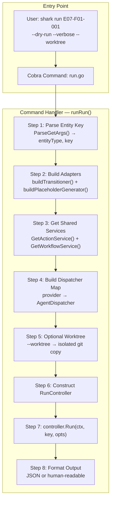
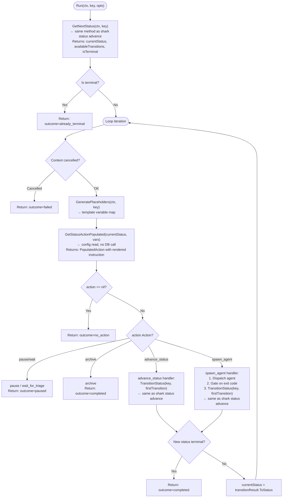
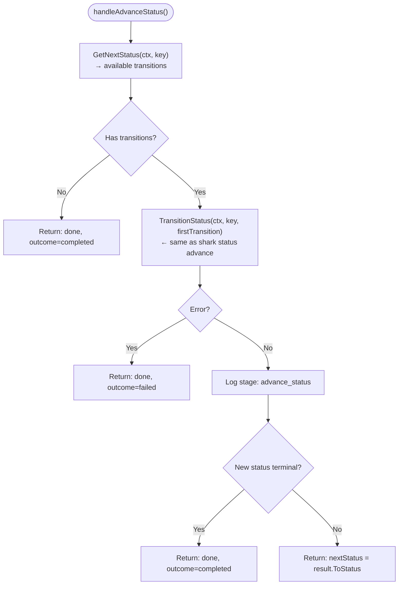
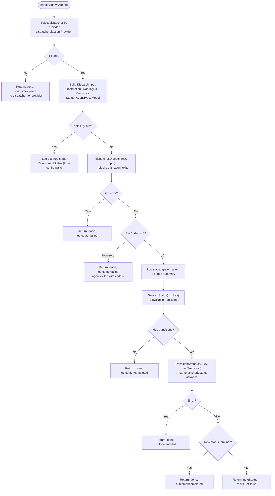
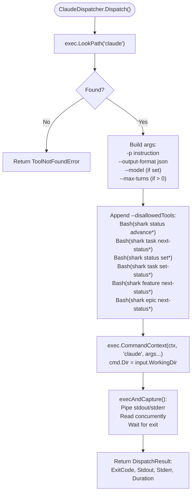
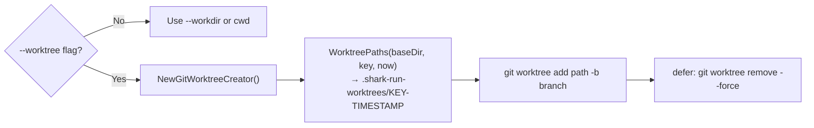
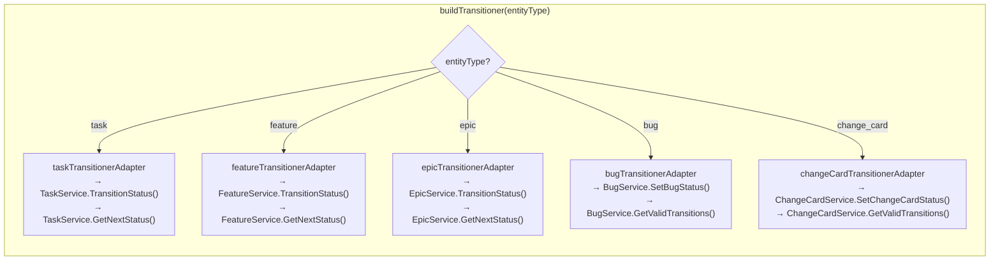
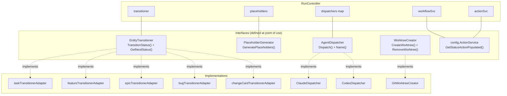
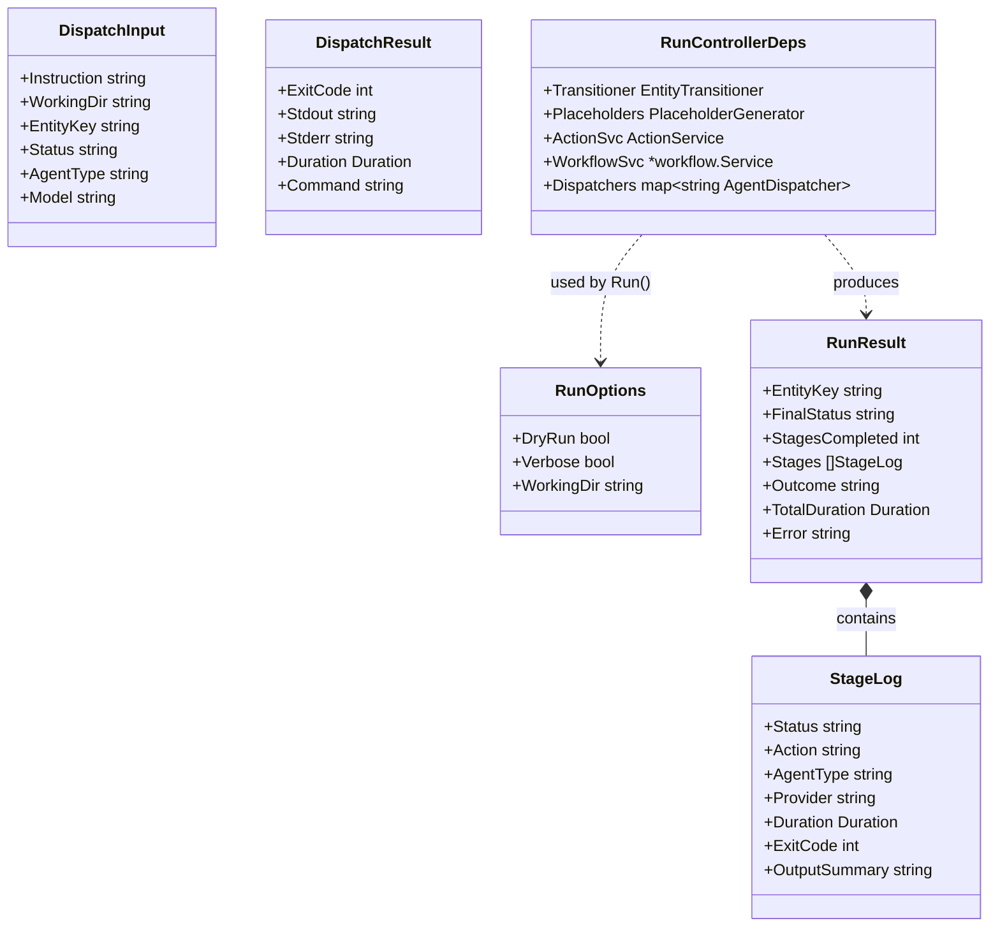

# E22: `shark run` — Architecture Flow Diagram

**Updated**: 2026-03-22 (simplified loop design)

## Overview

The `shark run <entity-key>` command drives an entity through its workflow with a simple loop:

1. **Get** entity state from DB (one call per iteration)
2. **Read** orchestrator action from workflow config (no DB)
3. **Execute** action (advance, spawn agent, pause, archive)
4. **Repeat** until terminal status or pause

The run controller reuses the **exact same** `GetNextStatus()` and `TransitionStatus()` methods that `shark status advance` calls. No separate transition logic exists in the controller.

---

## High-Level Architecture



---

## Core Orchestration Loop (Simplified)

This is the heart of the run command. Each iteration:
1. Reads entity state (DB call)
2. Reads action from config (no DB)
3. Executes the action
4. Loops with new status



---

## advance_status Handler

This is the simplest action: call `TransitionStatus()` (same as `shark status advance`) and loop. This is how `ready_for_` → `in_` transitions chain naturally.



**Example chain** (advance_status auto-chains through the loop):
```
Iteration 1: status=draft           action=advance_status → TransitionStatus → ready_for_development
Iteration 2: status=ready_for_dev   action=advance_status → TransitionStatus → in_development
Iteration 3: status=in_development  action=spawn_agent    → dispatch developer agent...
```

---

## spawn_agent Handler

Dispatches an agent, waits for exit, gates advancement on exit code 0.



---

## Claude Dispatcher Internals



---

## Git Worktree Isolation



---

## Entity Type Adapter Resolution



---

## Dependency Injection & Interface Map



---

## Data Types



---

## Example: Full Task Run

```
$ shark run E07-F01-001

Iteration 1:
  GetNextStatus("E07-F01-001") → status=draft, transitions=[ready_for_development]
  GetStatusActionPopulated("draft", vars) → action=advance_status
  TransitionStatus("E07-F01-001", "ready_for_development") → ok
  → new status: ready_for_development

Iteration 2:
  GetNextStatus("E07-F01-001") → status=ready_for_development, transitions=[in_development]
  GetStatusActionPopulated("ready_for_development", vars) → action=advance_status
  TransitionStatus("E07-F01-001", "in_development") → ok
  → new status: in_development

Iteration 3:
  GetNextStatus("E07-F01-001") → status=in_development, transitions=[ready_for_code_review]
  GetStatusActionPopulated("in_development", vars) → action=spawn_agent, agent=developer
  Dispatch(claude -p "Implement task E07-F01-001...") → exit code 0
  TransitionStatus("E07-F01-001", "ready_for_code_review") → ok
  → new status: ready_for_code_review

Iteration 4:
  GetNextStatus("E07-F01-001") → status=ready_for_code_review, transitions=[in_code_review]
  GetStatusActionPopulated("ready_for_code_review", vars) → action=advance_status
  TransitionStatus("E07-F01-001", "in_code_review") → ok
  → new status: in_code_review

...continues until terminal status (completed/cancelled)...
```

---

## Safety: DefaultDisallowedTools

Agents are **always** blocked from self-advancing status:

```
Bash(shark status advance*)
Bash(shark task next-status*)
Bash(shark status set*)
Bash(shark task set-status*)
Bash(shark feature next-status*)
Bash(shark epic next-status*)
```

Only the RunController advances status — after gating on agent exit code 0.

---

## File Index

| File | Purpose |
|------|---------|
| `internal/cli/commands/run.go` | CLI command, flag registration, entity-type adapters |
| `internal/runner/controller.go` | RunController: simplified orchestration loop |
| `internal/runner/dispatcher.go` | AgentDispatcher interface, DispatchInput/Result, error types, execAndCapture() |
| `internal/runner/claude_dispatcher.go` | ClaudeDispatcher: validates binary, builds args, executes `claude` CLI |
| `internal/runner/codex_dispatcher.go` | CodexDispatcher: same pattern for OpenAI Codex CLI |
| `internal/runner/worktree.go` | WorktreeCreator interface, GitWorktreeCreator, path sanitization |
| `internal/runner/output_format.go` | TruncateOutput() helper for display |
| `internal/runner/integration_test/env.go` | Isolated test environment with mock dispatchers (CC-020) |
| `internal/runner/integration_test/run_loop_test.go` | End-to-end run loop integration tests |
| `internal/cli/services_global.go` | GetActionService(), GetWorkflowService() global accessors |
