# E27-F16 — Combined Requirements + Architecture Specification

**Feature**: Group Left Nav by Artifact Type (Plan/Architecture/Product) + Configurable Browsable Folders

---

## 1. Context and inherited decisions

Business context is **not restated here**. See:

| Source | What it supplies |
| --- | --- |
| `docs/plan/E27-shark-status-viewer-local-web-dashboard/epic.md` §Goal, §Impact | Why a unified browsable dashboard exists at all |
| `epic.md` §Architecture Decision (Option B) | Extend the existing server/viewer stack; no second app, no new binaries |
| `epic.md` §Key Constraints | No build step, no new Go dependencies, file-path security must validate within project root |
| `docs/plan/E27-shark-status-viewer-local-web-dashboard/architecture.md` | Component map: SPA + viewer API + viewer service, all layers additive |
| `.../E27-F16-.../research-report.md` §Capability map, §Decisions | Reuse/extend/new classification this spec implements verbatim |
| `.../E27-F10-tree-view-enhancements/spec.md` REQ-F-001…005 | Sidebar behaviors this feature must not regress |
| `CLAUDE.md`, `.claude/rules/architecture.md` | Command → Service → Repository layering; services own logic |
| `.claude/rules/go/input-sanitization.md` | Path-safety posture: reuse the existing containment check, add no second one |

### 1.1 Capability map application

The research report's Capability map governs what this feature builds versus reuses. Restated only as the binding scope boundary:

| Capability | Decision | What this feature will **not** re-implement |
| --- | --- | --- |
| `renderSidebarSection` + per-section `localStorage` expand state (`internal/viewer/assets/viewer.html:8257-8272`, `3434-3474`) | **REUSE** | No new section renderer, no new state store, no new toggle-event wiring. Groups are rendered *by the same primitive* (ADR-F16-1). |
| `ViewerService.FolderFiles` (`internal/services/viewer_service.go:2576-2638`) | **REUSE unchanged** | No new directory-listing endpoint. It is already keyed by an arbitrary project-root-relative path. |
| `isContained` + `EvalSymlinks` containment check (`internal/services/helpers.go:23`, used at `viewer_service.go:2085,2159,2601`, `edit_service.go:64,88`) | **REUSE** | No second traversal check anywhere — not in `internal/config`, not in the handler, not in the frontend. |
| `WebConfig` (`internal/config/config.go:296-300`) | **EXTEND** | No new top-level config section; browsable folders live under the existing `web.*` key. |
| Top-level nav grouping | **NEW** | No parallel tree component (F13 precedent). |
| Server→client surface for configured folders | **NEW** | Follows the `workflow-meta` static-metadata endpoint idiom, not a new transport style. |

---

## 2. Requirements

Incremental over the epic. The epic PRD carries no numbered `REQ-` identifiers, so traceability below cites epic **section names** rather than fabricated parent IDs.

### 2.1 Functional requirements

#### REQ-F-001 — Left nav is organized into three top-level collapsible groups

- **Description**: `renderSidebar()` emits three top-level groups in fixed order — **Plan**, **Architecture**, **Product** — each with its own header and independent expand/collapse control. Group order is fixed and not user-reorderable.
- **Priority**: Must-Have
- **Traces to**: epic.md §Solution ("browse the project hierarchy, read spec documents"), §Impact ("Humans can visually navigate ... without memorizing CLI commands"); feature.md §Solution
- **Acceptance criteria**:
  - [ ] **AC-001.1a** With the dashboard loaded, the **first three** elements in `#sidebar-content` matching `[data-sidebar-section^="group:"]` are, in DOM order, `group:plan`, `group:architecture`, `group:product`.
  - [ ] **AC-001.1b** Any further `[data-sidebar-section^="group:"]` elements are user-registered folder groups (REQ-F-005) and appear **after** those three. With no folders configured, exactly three such elements exist.
  - [ ] **AC-001.2** Clicking a group's collapse button hides that group's body and leaves the other two groups' expanded state unchanged.
  - [ ] **AC-001.3** Each group header renders with the group-level header class (`sidebar-group-header`) so it is visually distinguishable from a nested section header.

#### REQ-F-002 — The Plan group contains every existing tracked-entity section, unmodified

- **Description**: The `epics`, `bugs`, `change_cards`, `tech_debt`, `ideas`, and `questions` sidebar sections, plus the Sprint tree rendered in sprint mode (`viewer.html:6806`, `renderSprintTree`), move inside the Plan group body. Their internal markup, section ids, per-section collapse state, and empty-section suppression are unchanged.
- **Priority**: Must-Have
- **Traces to**: feature.md §Solution ("Plan — every tracked entity family"); research-report §Findings 1
- **Acceptance criteria**:
  - [ ] **AC-002.1** Every one of the six section ids still appears as `[data-sidebar-section="<id>"]` and is a descendant of `[data-sidebar-section="group:plan"]`.
  - [ ] **AC-002.2** A section with no items (e.g. no bugs) is still omitted entirely — `renderSidebarSection`'s empty-body suppression is not bypassed by grouping.
  - [ ] **AC-002.3** In sprint mode (`appState === 'sprint'`), the sprint tree renders inside the Plan group body, above the Tags-independent entity sections.
  - [ ] **AC-002.4** Collapsing the Plan group hides all nested sections; re-expanding restores each nested section to its own previously stored expanded/collapsed state (nested state is preserved, not reset).

#### REQ-F-003 — Architecture and Product groups browse `docs/architecture` and `docs/product`

- **Description**: The Architecture group body contains a single folder-browser entry targeting `docs/architecture`; the Product group body contains one targeting `docs/product`. Both use the existing `tree-node-folder` markup and `FOLDER_KEY_PREFIX` key convention, so clicking one routes through the existing folder-view path (`viewer.html:7860-7861`, `8462-8463`, `8673`) and the existing `GET /api/v1/viewer/folder-files/{path...}` endpoint.
- **Priority**: Must-Have
- **Traces to**: feature.md §Solution (Architecture / Product bullets); research-report §Findings 2
- **Acceptance criteria**:
  - [ ] **AC-003.1** The Architecture group body contains a node with `data-folder-path="docs/architecture"` and `data-select-key="folder:docs/architecture"`.
  - [ ] **AC-003.2** The Product group body contains a node with `data-folder-path="docs/product"` and `data-select-key="folder:docs/product"`.
  - [ ] **AC-003.3** Clicking either node opens the existing folder view listing that directory's immediate children; no new listing endpoint is called.
  - [ ] **AC-003.4** When the target directory does not exist, the folder view shows the existing empty-listing result (`FolderFiles` already returns an empty `entries` array for a missing path) — no error toast, no console error.

#### REQ-F-004 — Group collapse state persists and participates in expand-all/collapse-all

- **Description**: Group expand/collapse state is stored in the existing `shark.viewer.sidebarSections` `localStorage` record under the same `sidebarSectionState` map, using `group:`-prefixed ids. The `sidebar-toggle-all-btn` control reports and sets the state of groups **and** sections together.
- **Priority**: Must-Have
- **Traces to**: feature.md §Solution ("remembers its expand/collapse state the same way the existing tree does, and participates in the existing expand-all/collapse-all control")
- **Acceptance criteria**:
  - [ ] **AC-004.1** Collapsing a group, reloading the page, and re-rendering leaves that group collapsed and the others expanded.
  - [ ] **AC-004.2** With any group or section collapsed, `sidebar-toggle-all-btn` reads `+` / "Expand all sections"; clicking it expands every group **and** every section.
  - [ ] **AC-004.3** With everything expanded, the same button reads `−` / "Collapse all sections"; clicking it collapses every group and every section.
  - [ ] **AC-004.4** Dynamic user-registered folder groups (REQ-F-005) are included in both the read and the write path of the toggle-all control, not only the statically-declared ids.
  - [ ] **AC-004.5** All new `localStorage` reads and writes are inside `try/catch`; with storage throwing, groups still render and toggle in-memory (mirrors F10 REQ-F-004 AC-004.6).

#### REQ-F-005 — Users can register additional browsable folders in `.sharkconfig.json`

- **Description**: A new `web.browsable_folders` array lets a user register project-root-relative folders. Each registered folder renders as its own top-level group after Product, containing one folder-browser entry, using the same rendering path as Architecture and Product.
- **Priority**: Must-Have
- **Traces to**: feature.md §Solution ("add a config section to `.sharkconfig.json` that lets a user register additional browsable folders in the left bar")
- **Acceptance criteria**:
  - [ ] **AC-005.1** With `web.browsable_folders: [{"label":"Runbooks","path":"docs/runbooks"}]`, a top-level group titled "Runbooks" renders after Product, containing a node with `data-folder-path="docs/runbooks"`.
  - [ ] **AC-005.2** With `label` omitted, the group title is the title-cased basename of `path` (`docs/runbooks` → "Runbooks").
  - [ ] **AC-005.3** With `web.browsable_folders` absent, empty, or `web` absent entirely, the nav renders exactly the three built-in groups and no extra group — and no error.
  - [ ] **AC-005.4** A registered folder that does not exist on disk still renders its group; its entry carries the `is-unavailable` marker and its title attribute states the folder was not found. Clicking it shows the existing empty folder listing.
  - [ ] **AC-005.5** Two registered folders with the same basename but different paths (`a/notes`, `b/notes`) both render, each with a distinct group id derived from the full relative path.
  - [ ] **AC-005.6** Unknown keys elsewhere in `.sharkconfig.json` survive a config round-trip unchanged (existing `Config.RawData` preservation is not broken by the new field).

#### REQ-F-006 — Registered folder paths are rejected when they escape the project root

- **Description**: A configured path that is absolute, or that resolves (after symlink evaluation) outside the project root, is **omitted** from the nav and logged server-side. The rejection uses the existing containment check — no new traversal logic is written.
- **Priority**: Must-Have
- **Traces to**: epic.md §Key Constraints ("File path security — ... validates within project root"); feature.md §Solution ("must reject `../` traversal, and must reuse shark's existing path-safety check"); `.claude/rules/go/input-sanitization.md`
- **Acceptance criteria**:
  - [ ] **AC-006.1** `web.browsable_folders` containing `{"path":"../secrets"}` produces no group for it; the remaining valid folders still render.
  - [ ] **AC-006.2** An absolute path (`/etc`) is rejected the same way.
  - [ ] **AC-006.3** A relative path whose symlink target resolves outside the project root is rejected.
  - [ ] **AC-006.4** Each rejection emits one `slog.Warn` naming the offending path and the reason; the request still returns `200` with the valid folders.
  - [ ] **AC-006.5** No new path-containment or traversal-detection function is introduced anywhere in the diff — a reviewer grep for a second containment helper finds none.

#### REQ-F-007 — Architecture and Product survive a failure of the new folder-discovery call

- **Description**: The frontend obtains the nav folder list from a new endpoint at load time. If that call fails, the frontend falls back to the two built-in roots so Architecture and Product never disappear; only user-registered extras are lost. This mirrors the existing non-fatal `workflow-meta` + `STATUS_COLORS` fallback idiom (`viewer.html:3251-3265`).
- **Priority**: Must-Have
- **Traces to**: epic.md §Success Criteria (dashboard remains usable); research-report §Findings 4
- **Acceptance criteria**:
  - [ ] **AC-007.1** With the nav-folders request returning `500`, the sidebar still renders Plan, Architecture (`docs/architecture`), and Product (`docs/product`).
  - [ ] **AC-007.2** That failure produces no error toast and does not prevent the dashboard state transition — it is non-fatal, exactly like `workflow-meta`.
  - [ ] **AC-007.3** With the request succeeding, the built-in roots come from the response and are not rendered twice.

#### REQ-F-008 — The existing generic `Docs` browse entry is retained unchanged

- **Description**: The pre-existing `docs` sidebar section (`Browse docs/`, `viewer.html:8252-8255`) remains as a top-level entry outside the three groups, unmodified. This preserves browse access to `docs/guides`, `docs/cli-reference`, and other `docs/` subtrees that neither Architecture nor Product exposes.
- **Priority**: Must-Have
- **Status**: **Provisional — default pending Q006.** See §7. If Q006 resolves to "remove" or "fold into Product", this requirement and its ACs change and nothing else in the feature moves.
- **Traces to**: F10 non-regression posture; research-report §Capability map row 1 ("keep every existing section exactly as-is")
- **Acceptance criteria**:
  - [ ] **AC-008.1** `[data-sidebar-section="docs"]` still exists, still contains the `folder:docs` node, and is **not** a descendant of any `group:*` element.
  - [ ] **AC-008.2** Its stored collapse state key (`docs`) is unchanged, so an existing user's stored preference still applies after upgrade.

### 2.2 Non-functional requirements

#### REQ-NF-001 — No regression of existing sidebar behaviors

- **Description**: `showCompleted` ("show all items"), `showAllFiles` ("show all files"), `collapse-all-btn` (epics/features collapse), the completed/cancelled dimming classes, and the tag filter chips continue to behave exactly as specified in `E27-F10-tree-view-enhancements/spec.md` REQ-F-001…005 and E28-F06.
- **Measurement**: The existing F10 and E28-F06 acceptance checks pass unchanged against the regrouped sidebar. Specifically: `collapse-all-btn` still clears `expandedEpics`/`expandedFeatures` only and does **not** collapse groups or sections (it is a tree control, not a section control).

#### REQ-NF-002 — Path safety is single-sourced

- **Description**: All containment enforcement for browsable folders flows through `internal/services/helpers.go:isContained` applied to `EvalSymlinks`-canonicalized paths, at both nav-list build time and `FolderFiles` request time (defense in depth). `internal/config` performs **no** path-security validation.
- **Measurement**: Diff review confirms zero new traversal-checking code; a test asserts `NavFolders` rejects `../`, absolute, and symlink-escape paths.

#### REQ-NF-003 — No added blocking latency on dashboard load

- **Description**: The new nav-folders fetch must not extend the blocking critical path. It runs alongside the existing non-blocking metadata fetches, never before the blocking hierarchy fetch.
- **Measurement**: `loadProjectData()` still awaits hierarchy as its only blocking network dependency; nav-folders resolves in the same non-blocking phase as `workflow-meta`/vocabulary. Epic success criterion "hierarchy loads in < 500 ms for 500 tasks" is unaffected.

#### REQ-NF-004 — Epic constraints preserved

- **Description**: No build step, no new Go module dependencies, no new frontend dependencies. All new frontend code is vanilla JS inside the single `viewer.html` asset. All new `localStorage` access is `try/catch`-wrapped.
- **Measurement**: `go.mod` unchanged; `viewer.html` remains the single-file SPA; no `<script src>` additions.

### 2.3 Out of scope

1. **Editing, creating, renaming, or deleting files in browsable folders** — Why: this feature is nav structure only; file mutation is E27-F07's surface. Future: not planned here.
2. **Recursive/tree expansion of browsable folders inside the sidebar** — Why: the existing folder affordance opens a folder *view* in the main panel; replicating a recursive file tree in the sidebar is a different capability. Future: separate feature if requested.
3. **User-reorderable or user-renameable built-in groups** — Why: three fixed groups is what feature.md specifies; ordering config is speculative (Rule 2). Future: only if requested.
4. **A `shark config validate` check for browsable folder paths** — Why: `internal/config` cannot reach the package-private `isContained` helper without exporting it, and exporting a security primitive to gain a convenience warning is a poor trade (ADR-F16-4). Rejections are already surfaced by server-side `slog.Warn` and by the folder's absence from the nav. Future: revisit if users report confusion.
5. **Per-folder icons, badges, or counts** — Why: not requested; adds surface with no stated need.
6. **Any change to `FolderFiles`, `File`, `FileByPath`, or the folder-view rendering path** — Why: they already do exactly what is needed (research-report §Findings 2).

---

## 3. Acceptance scenarios

**Scenario 1 — Grouped nav on a stock project**
- **Given** a shark project with epics, bugs, and `docs/architecture` and `docs/product` present, and no `web.browsable_folders` configured
- **When** the user runs the web dashboard and the sidebar renders
- **Then** three top-level groups appear in order: Plan, Architecture, Product
- **And** Plan contains the Epics/Bugs/Change Cards/Tech Debt/Ideas/Questions sections with their existing content
- **And** Architecture and Product each contain one folder-browser entry
- **And** the standalone `Docs` entry still appears outside the groups (REQ-F-008)

**Scenario 2 — Group collapse persists**
- **Given** the sidebar is rendered with all groups expanded
- **When** the user collapses the Plan group and reloads the page
- **Then** Plan renders collapsed, Architecture and Product render expanded
- **And** expanding Plan again restores each nested section to its own prior state

**Scenario 3 — Expand-all covers groups and sections**
- **Given** the Plan group is collapsed and the Bugs section is collapsed
- **When** the user clicks the sidebar toggle-all button
- **Then** Plan, Architecture, Product, every user-registered folder group, and every section become expanded
- **And** clicking it again collapses all of them

**Scenario 4 — Registered folder**
- **Given** `.sharkconfig.json` contains `"web": {"browsable_folders": [{"label":"Runbooks","path":"docs/runbooks"}]}` and `docs/runbooks` exists
- **When** the sidebar renders
- **Then** a "Runbooks" group appears after Product with one folder-browser entry for `docs/runbooks`
- **And** clicking it lists that directory's immediate children in the main panel

**Scenario 5 — Traversal attempt is rejected**
- **Given** `"browsable_folders": [{"path":"../../etc"}, {"label":"Runbooks","path":"docs/runbooks"}]`
- **When** the sidebar renders
- **Then** no group is created for `../../etc`
- **And** the "Runbooks" group renders normally
- **And** the server logged one warning naming `../../etc` and the containment reason

**Scenario 6 — Folder-discovery endpoint is down**
- **Given** the nav-folders endpoint returns `500`
- **When** the dashboard loads
- **Then** the dashboard still reaches the dashboard state with Plan, Architecture, and Product rendered from built-in defaults
- **And** no error toast is shown

**Scenario 7 — Existing behaviors unaffected**
- **Given** the regrouped sidebar with completed epics present
- **When** the user toggles "show all items", toggles "show all files", clicks the epics collapse-all arrow, and selects a tag chip
- **Then** each behaves exactly as before the regrouping (F10 REQ-F-001…005, E28-F06)

---

## 4. Architecture

### 4.1 Design shape

```mermaid
flowchart LR
  cfg[".sharkconfig.json<br/>web.browsable_folders"] --> wire["internal/viewer/server/wire.go<br/>loadBrowsableFoldersConfig()"]
  wire --> vs["ViewerService.WithBrowsableFolders()"]
  vs --> nf["ViewerService.NavFolders()<br/>canonicalize + isContained"]
  nf --> h["GET /api/v1/viewer/nav-folders"]
  h --> spa["viewer.html<br/>apiGetNavFolders() → navFolders[]"]
  spa --> rs["renderSidebar()<br/>group wrappers"]
  rs -. click .-> ff["GET /api/v1/viewer/folder-files/{path...}<br/>(unchanged)"]
```



The whole feature is one new read-only endpoint, one config field, and a rendering restructure. It adds no repository method, no database table, and no migration.

### 4.2 Component changes — files to modify or create

| # | File | Change |
| --- | --- | --- |
| 1 | `internal/config/config.go` | **Modify.** Add `BrowsableFolder` struct and `WebConfig.BrowsableFolders []BrowsableFolder` (§4.4). Add `(*Config).GetBrowsableFolders() []BrowsableFolder` accessor alongside the existing `GetWebPort()` (line 335) with the same nil-safe shape. No validation logic here (ADR-F16-4). |
| 2 | `internal/services/viewer_service.go` | **Modify.** Add `NavFolder` / `NavFoldersResponse` types near the other response types (§4.5); add `browsableFolders []config.BrowsableFolder` field to `ViewerService` (no intermediate service-side type — see ADR-F16-8); add `WithBrowsableFolders(...)` setter following the existing `WithSprintService`-style optional-dependency idiom (lines 603-670); add `NavFolders(ctx)` method that canonicalizes and containment-checks each path via `isContained`. |
| 3 | `internal/api/viewer/handler.go` | **Modify.** Register `mux.Handle("GET "+prefix+"/nav-folders", wrap(http.HandlerFunc(h.NavFolders)))` next to the `workflow-meta` route (line 65); add the `NavFolders` handler method mirroring `WorkflowMeta` (line 396) — call service, `respondError(500)` on failure, otherwise encode. Update the route comment block (lines 39-46). |
| 4 | `internal/viewer/server/wire.go` | **Modify.** Add `loadBrowsableFoldersConfig(projectRoot string) []config.BrowsableFolder` following the existing `loadAdvanceGuardConfig` / `loadTagEnforcementConfig` helper pattern (lines 52-75, 572-580); call `viewerService.WithBrowsableFolders(...)` in the Step 5b `With*` chain (after line 530). |
| 5 | `internal/viewer/assets/viewer.html` | **Modify.** Six edits: (a) CSS for `.sidebar-group-header` and nested-section indentation near line 647-690; (b) `SIDEBAR_SECTION_DEFAULTS` + new `dynamicSidebarGroupIds` + `allSidebarSectionIds()` near lines 3413-3421; (c) `areAllSidebarSectionsExpanded` / `setAllSidebarSectionsExpanded` iterate `allSidebarSectionIds()` (lines 3465-3474); (d) `apiGetNavFolders()` next to `apiGetWorkflowMeta` (line 2630); (e) generalize `buildDocsBrowserBodyHtml()` into `buildFolderBrowserBodyHtml(relPath, opts)` (line 8252); (f) restructure `renderSidebar()` (lines 8285-8341) to emit group wrappers; (g) fetch nav folders in `loadProjectData()` alongside the other non-blocking metadata (line ~3251). |
| 6 | `internal/services/viewer_service_test.go` | **Modify.** Add `NavFolders` cases: valid relative, `../` escape, absolute, symlink escape, missing-directory (`exists:false`), label defaulting, duplicate basenames, nil/empty config. |
| 7 | `internal/api/viewer/handler_test.go` | **Modify.** Add route-level test for `GET /api/v1/viewer/nav-folders` — 200 shape, and 500 path. |
| 8 | `internal/config/config_test.go` | **Modify.** Add unmarshal/marshal round-trip for `web.browsable_folders` including `RawData` unknown-key preservation (AC-005.6). |
| 9 | `docs/cli-reference/configuration.md` | **Modify.** Extend the `web` key table (line 334-358) with `web.browsable_folders`, its object shape, and the containment rule. |

| 10 | `docs/plan/E27-shark-status-viewer-local-web-dashboard/uat-plan.md` | **Modify.** Append UAT cases for the browser-observable acceptance criteria enumerated in §4.7. |

No new files are created.

### 4.3 Data model changes

**None.** No SQLite table, column, index, or trigger changes. `internal/db/db.go` is untouched and `CurrentSchemaVersion` is **not** bumped — see `.claude/rules/database-critical.md` for why that constant matters; nothing here triggers it.

### 4.4 Configuration contract

`.sharkconfig.json`, extending the existing `web` object:

```json
{
  "web": {
    "port": 7777,
    "browsable_folders": [
      { "label": "Runbooks", "path": "docs/runbooks" },
      { "path": "docs/guides" }
    ]
  }
}
```

| Field | Type | Required | Rule |
| --- | --- | --- | --- |
| `web.browsable_folders` | array of objects | no | Absent, `null`, or `[]` all mean "no extra folders" |
| `.path` | string | yes | Project-root-relative, forward-slash separated. Absolute paths and paths escaping the root are rejected (REQ-F-006). An entry with an empty/whitespace-only `path` is dropped. |
| `.label` | string | no | Nav group title. When omitted, derived as the title-cased basename of `path` |

Go shape (`internal/config/config.go`):
- `type BrowsableFolder struct { Label string \`json:"label,omitempty"\`; Path string \`json:"path"\` }`
- `WebConfig` gains `BrowsableFolders []BrowsableFolder \`json:"browsable_folders,omitempty"\``

`omitempty` on both the slice and `label` keeps existing configs byte-identical on rewrite. The existing `Config.RawData` unknown-field preservation (`config.go:84`) is unaffected because this is a *known* field being added, not an unknown one.

### 4.5 API contract

**New endpoint — `GET /api/v1/viewer/nav-folders`**

Read-only. No parameters. Registered in `internal/api/viewer/handler.go` beside `workflow-meta`; inherits the existing CORS and wrapper middleware.

Response `200`:

```json
{
  "folders": [
    { "id": "architecture", "label": "Architecture", "path": "docs/architecture", "source": "builtin", "exists": true },
    { "id": "product",      "label": "Product",      "path": "docs/product",      "source": "builtin", "exists": true },
    { "id": "docs/runbooks","label": "Runbooks",     "path": "docs/runbooks",     "source": "config",  "exists": false }
  ]
}
```

| Field | Type | Meaning |
| --- | --- | --- |
| `folders` | array, always non-nil (`[]` never `null`) | Ordered: built-ins first in fixed order, then config entries in declaration order |
| `.id` | string | Stable group identity. `"architecture"` / `"product"` for built-ins; the cleaned relative path for config entries (satisfies AC-005.5 — distinct for same-basename folders). Frontend derives the `localStorage` key as `group:` + `id`. |
| `.label` | string | Group header text; always populated (defaulted from basename when config omits it) |
| `.path` | string | Project-root-relative, forward-slash normalized; safe to pass straight to `folder-files/{path...}` |
| `.source` | string | `"builtin"` or `"config"` — lets the frontend keep built-ins when the call fails and reconcile without duplicating |
| `.exists` | bool | Directory present on disk at response time; `false` drives the dimmed/unavailable affordance (AC-005.4) |

Response `500`: `{"error":"failed to load nav folders"}` via the existing `respondError` helper. Non-fatal to the client (REQ-F-007).

Rejected entries are **absent** from `folders` — there is no `invalid` array. Rationale: the response is a render list, not a diagnostic channel; rejections are logged server-side (AC-006.4) where the operator who wrote the config can see them.

**Unchanged**: `GET /api/v1/viewer/folder-files/{path...}` and `ViewerService.FolderFiles` are used exactly as they are today. Every nav folder click funnels through them, so the containment check applies at request time regardless of what the config or the nav list contains.

### 4.6 Key technical decisions

#### ADR-F16-1 — Groups reuse `renderSidebarSection` rather than a new group renderer

**Decision**: Render each group by calling the existing `renderSidebarSection(groupId, title, innerHtml, {keepEmpty: true, headerClass: 'sidebar-group-header'})` with `groupId` in a `group:` namespace, nesting section HTML in the group's body. `renderSidebarSection` gains one optional `options.headerClass`.

**Rationale**: The primitive already provides collapse state (`isSidebarSectionExpanded`), persistence, the `data-sidebar-section-toggle` attribute, and — critically — the existing delegated click handler at `viewer.html:8400-8407` picks up nested toggles for free via `querySelectorAll`. A separate `renderSidebarGroup` would duplicate the state model, the persistence call, and the event wiring for zero behavioral gain. This is the research report's "compose, don't replace" decision made concrete, and it is why REQ-F-004 is nearly free.

**Nesting safety — verified**: `.sidebar-section-header` (`viewer.html:650-663`) uses only `background`, `padding`, typography, and `display:flex`. It declares `z-index: 1` with **no** `position` property, so the z-index is inert and the header is in normal flow — it is not sticky or absolutely positioned, and nesting it inside `.sidebar-section-body` (`:686-688`) has no layout consequence. The collapse rule `.sidebar-section.is-collapsed .sidebar-section-body { display: none }` (`:689-691`) is a descendant selector, which is precisely why collapsing a group hides nested sections for free (AC-002.4).

**Cosmetic work required, not risk**: `.sidebar-section { border-bottom: 1px solid var(--border) }` (`:647-649`) applies to nested sections too, so a group renders one border per nested section plus its own. The CSS work item must add a nesting rule (group-header emphasis via `headerClass`, and suppression or indentation of nested section borders). This is styling only — no markup or state change.

#### ADR-F16-2 — Group state shares the existing `sidebarSectionState` store with a `group:` key prefix

**Decision**: No new `localStorage` key. Group ids are `group:plan`, `group:architecture`, `group:product`, `group:<relPath>`, stored in the existing `shark.viewer.sidebarSections` map.

**Rationale**: A second store would need its own load/persist/try-catch trio and its own participation in toggle-all. The prefix keeps one store, one serializer, one resilience story (REQ-NF-004). Existing stored records lacking group keys fall back through the existing `Object.assign({}, SIDEBAR_SECTION_DEFAULTS, parsed)` merge, so upgrade is seamless.

#### ADR-F16-3 — Toggle-all iterates a computed id set, not the static defaults map

**Decision**: Introduce `allSidebarSectionIds()` returning the union of `Object.keys(SIDEBAR_SECTION_DEFAULTS)` and a module-level `dynamicSidebarGroupIds` Set populated from the nav-folders response. `areAllSidebarSectionsExpanded` and `setAllSidebarSectionsExpanded` (`viewer.html:3465-3474`) iterate it instead of the defaults map.

**Rationale**: User-registered folder groups are only known at runtime, so a static map cannot cover them (AC-004.4).

**Flagged pre-existing defect, fixed in scope**: `SIDEBAR_SECTION_DEFAULTS` (`viewer.html:3413-3421`) omits `questions`, so the Questions section is currently invisible to toggle-all. Since AC-004.2/AC-004.3 assert "every section", `questions` is added to the defaults map as part of this change. This is a deliberate, minimal in-scope correction of the same function being modified — called out explicitly rather than slipped in (CLAUDE.md Rule 3, Rule 12).

#### ADR-F16-4 — Path validation lives in `ViewerService`, not in `internal/config`

**Decision**: `internal/config` stores raw strings and performs no path-security check. `ViewerService.NavFolders` canonicalizes with `filepath.Abs` + `filepath.EvalSymlinks` and applies `isContained` (`internal/services/helpers.go:23`) — the identical sequence used by `FolderFiles` (`viewer_service.go:2586-2603`), `File` (`:2085`), `FileByPath` (`:2159`), and `EditService` (`edit_service.go:64,88`).

**Rationale**: `isContained` is package-private to `internal/services`. Validating in `internal/config` would require either exporting the security primitive or writing a second traversal check — both directly contrary to feature.md's instruction and to `.claude/rules/go/input-sanitization.md`. Keeping validation in the service that already owns every other path check gives one implementation, one test surface, and one place a future hardening lands. The cost is that `shark config validate` cannot warn about a bad path (documented in §2.3 item 4).

**Defense in depth**: even if a bad path somehow reached the frontend, the click routes through `FolderFiles`, which independently returns `*SecurityError`.

#### ADR-F16-5 — A dedicated `nav-folders` endpoint, not a field on hierarchy or summary

**Decision**: New `GET /api/v1/viewer/nav-folders`.

**Rationale**: `HierarchyResponse` is refetched on every tag-filter change and every "show all items" toggle (`viewer.html:3176`, `8348-8360`); attaching static configuration to it would re-ship an unchanging payload on every filter interaction. `SummaryResponse` is a counts payload — folders do not belong there semantically. `workflow-meta` is the established precedent for exactly this shape: static, fetched once, non-blocking, non-fatal. Following it means the new endpoint inherits an understood failure story (REQ-F-007) rather than inventing one.

#### ADR-F16-6 — Built-in roots are duplicated as frontend constants for fallback

**Decision**: The endpoint returns built-ins **and** the frontend holds `docs/architecture` / `docs/product` as constants used only when the fetch fails.

**Rationale**: Without the fallback, one failed metadata call silently deletes two nav groups the user was told are always there. With it, the failure degrades to "user-registered extras missing" — a proportionate loss. The duplication is two string literals, mirroring how `STATUS_COLORS` backstops a failed `workflow-meta` (`viewer.html:3251-3265`). Reconciliation on success is by `id`, so nothing renders twice (AC-007.3).

#### ADR-F16-7 — Config entries are objects, not bare strings

**Decision**: `browsable_folders` is an array of `{label?, path}` objects rather than an array of path strings.

**Rationale**: A nav group needs a display title. Deriving it from the basename alone yields lowercase, mechanical names and offers no escape hatch when two folders share a basename. One optional field buys that; the object form also leaves room for a future field without a breaking config migration. Bare strings would be marginally simpler to type but would force the title decision to be unfixable.

#### ADR-F16-8 — No service-side mirror of the config type

**Decision**: `ViewerService.WithBrowsableFolders` accepts `[]config.BrowsableFolder` directly. No `BrowsableFolderSpec` or equivalent translation type is introduced in `internal/services`.

**Rationale**: `internal/services` already imports `internal/config` in the ordinary course of business (`epic_service.go`, `bug_service.go`, `change_card_service.go`, `display_service.go`, `aggregate_policy.go`, `cascade_reopen.go`, and others), so the dependency edge exists and adds nothing new. A parallel two-field struct plus its conversion loop would be pure ceremony (CLAUDE.md Rule 2). The service's *output* type (`NavFolder`, §4.5) is separate and stays separate, because it carries derived fields (`id`, `source`, `exists`) that have no place in a config record.

### 4.7 Verification path for acceptance criteria

The exit gate requires every requirement to be testable; this section names the mechanism for each, so test planning does not have to rediscover it.

**No JavaScript test harness exists in this repository** — verified: there is no `package.json`, and `Makefile` contains no `playwright`/`jest`/`vitest`/`puppeteer`/`cypress` target. This is a direct consequence of the epic's "no build step" constraint (`epic.md` §Key Constraints), and it is why every prior E27 frontend feature verified through manual UAT.

| AC group | Mechanism | Location |
| --- | --- | --- |
| AC-005.6 (config round-trip, `RawData` preservation) | Go unit test | `internal/config/config_test.go` |
| AC-006.1…4 (containment rejection: `../`, absolute, symlink escape, warn log) | Go unit test against `ViewerService.NavFolders` with a temp project root | `internal/services/viewer_service_test.go` |
| AC-005.2, AC-005.5 (label defaulting, distinct ids for duplicate basenames) | Go unit test | `internal/services/viewer_service_test.go` |
| AC-005.4 partial, AC-007.3 (`exists:false`, built-ins present exactly once in the payload) | Go unit test | `internal/services/viewer_service_test.go` |
| Endpoint 200 shape and 500 path | Go handler test | `internal/api/viewer/handler_test.go` |
| AC-006.5 (no second containment helper) | Code-review assertion in the review gate, not an automated test | diff review |
| **AC-001.1a/1b, 001.2, 001.3; AC-002.1…4; AC-003.1…4; AC-004.1…5; AC-005.1, 005.3; AC-007.1, 007.2; AC-008.1, 008.2; Scenarios 1…7** | **Manual UAT** — DOM structure, collapse persistence, and degradation behavior are browser-observable only | New UAT cases appended to `docs/plan/E27-shark-status-viewer-local-web-dashboard/uat-plan.md`, following the established E27 precedent |

AC-007.1/007.2 (endpoint-down degradation) is exercised in UAT by temporarily stopping the server response for that route or by editing the response in browser devtools; the fallback constants make the expected result unambiguous.

Introducing a browser test harness for this feature is **out of scope** (§2.3 rationale extends: it would breach the epic's no-build-step constraint and is a project-wide decision, not a feature-level one).

### 4.8 Integration with existing code

**Backend**

| Integration point | Existing signature / location | How this feature attaches |
| --- | --- | --- |
| Optional-dependency setters | `func (s *ViewerService) WithSprintService(...)` — `internal/services/viewer_service.go:659` | New `func (s *ViewerService) WithBrowsableFolders(folders []config.BrowsableFolder)`; nil/empty is a safe no-op, matching the "safe to skip" contract documented on every sibling setter |
| Containment check | `func isContained(rootCanon, targetCanon string) bool` — `internal/services/helpers.go:23` | Called by `NavFolders` after `filepath.Abs` + `filepath.EvalSymlinks`, identical to `viewer_service.go:2586-2603` |
| Security error type | `type SecurityError struct{ Path string }` — `internal/services/viewer_service.go:37` | Not returned to the client by `NavFolders` (rejections are silently omitted + logged); still returned by `FolderFiles` on click |
| Handler idiom | `func (h *ViewerHandler) WorkflowMeta(w, r)` — `internal/api/viewer/handler.go:396` | `NavFolders` handler is a structural copy: call service, `slog.Error` + `respondError(500)` on failure, else encode |
| Config loader helpers | `func loadAdvanceGuardConfig(projectRoot string) config.AdvanceGuardConfig` — `internal/viewer/server/wire.go:572` | `loadBrowsableFoldersConfig(projectRoot string) []config.BrowsableFolder` follows it exactly: `config.NewManager(path)`, `Load()`, return zero value on error or nil config |
| Config accessor | `func (c *Config) GetWebPort() int` — `internal/config/config.go:335` | `GetBrowsableFolders()` uses the same `if c == nil || c.Web == nil { return nil }` guard |

`NavFolders` must not fail the whole response because one entry is bad — a canonicalization error on a single path drops that entry and logs it, matching `FolderFiles`'s tolerance of a missing directory.

**Frontend** (`internal/viewer/assets/viewer.html`)

| Integration point | Existing location | How this feature attaches |
| --- | --- | --- |
| `FOLDER_KEY_PREFIX` | line 2454 | Reused verbatim for every folder-browser entry, so the existing selection dispatch at 7860-7861 / 8462-8463 / 8673 needs no change |
| `buildDocsBrowserBodyHtml()` | line 8252 | Generalized to `buildFolderBrowserBodyHtml(relPath, { label, exists })`; the existing `docs` call site passes `'docs'` and keeps its current italic/dim styling |
| `renderSidebarSection(sectionId, title, bodyHtml, options)` | line 8257 | Gains `options.headerClass`; all existing call sites keep their current behavior since the option is absent |
| `renderSidebar()` | lines 8285-8341 | Restructured: filter bar → Tags section → `group:plan` (sprint tree + six entity sections) → `group:architecture` → `group:product` → `group:<relPath>`… → `docs` section |
| `SIDEBAR_SECTION_DEFAULTS` | lines 3413-3421 | Gains `questions` (ADR-F16-3) and the three built-in `group:*` keys, all defaulting to `true` |
| `apiGetWorkflowMeta()` | line 2630 | `apiGetNavFolders()` is a structural sibling: fetch, tolerate failure, return null |
| `loadProjectData()` | lines ~3249-3268 | Nav-folders fetch is added to the existing non-blocking metadata phase (alongside `workflow-meta` and `loadVocabulary`), never before the blocking hierarchy fetch (REQ-NF-003) |
| Tags section | line 8311 | Stays **above** the groups, ungrouped — it is a filter control over the Plan tree, not an artifact location, and feature.md's grouping is explicitly "mirroring known artifact locations" |

**Layering compliance**: no CLI command changes; `internal/api/viewer` handlers stay thin and call only `ViewerService`; `ViewerService` owns all logic and path validation; no repository or DB access is added. This matches `.claude/rules/architecture.md` §Data Flow.

**Quality gate**: implementation tasks must run `make fmt && make lint && make test` before completion (CLAUDE.md mandatory gate).

---

## 5. Cross-feature interactions

**None declared — no interaction map exists for this epic.**

Verified by globbing `docs/plan/E27-shark-status-viewer-local-web-dashboard/*map*.md`, which returns no matches; there is no `E27-interaction-map.md`. No I-## identifiers are assigned to E27 or to E27-F16, and none are invented here.

The feature's only inter-feature couplings are **non-regression constraints**, not contracts, and they are tracked as REQ-NF-001 against `E27-F10-tree-view-enhancements/spec.md` REQ-F-001…005 and against E28-F06's tag-chip behavior. It reuses E27-F07's folder-view affordance without altering it.

---

## 6. Cross-epic integrations

**None declared — no X-## row names this feature.**

Verified against `docs/product/cross-epic-integration-map.md` (41 lines). Its only E27 row is **X-09**, owned by **E27-F15** (Codex/Claude cross-session usage tracking, consumer E40 Phase 2 G1) — unrelated to nav structure and not touched by E27-F16. There is no `E27-cross-epic-map.md` in the epic directory.

E27-F16 produces, consumes, and validates no cross-epic contract: every interface it adds (`web.browsable_folders`, `GET /api/v1/viewer/nav-folders`) is consumed solely by this epic's own SPA. No X-## IDs are invented here, and no test-coverage deferral needs logging in `docs/product/progress.md`.

---

## 7. Durable unresolved decisions

| ID | Decision | Status | Effect if answered differently |
| --- | --- | --- | --- |
| **Q006** | Should the existing generic `Browse docs/` sidebar entry survive the Plan/Architecture/Product regrouping? | `open` — responder and resolution owner: product-manager | Changes **REQ-F-008 and its two ACs only**. Options: (A) retain top-level, unchanged — the spec default; (B) remove as superseded by Architecture/Product; (C) fold into the Product group. No other requirement, ADR, file, or contract moves under any option. |

Rationale for a Question rather than an in-document note: the answer changes user-visible nav structure and an acceptance criterion, which meets the materiality test in `skills/question-management/SKILL.md`. Deduplication was performed across `open`, `answering`, `ready_for_resolution`, and the full question list before creation; no existing Question covers it.

**Deliberately not raised as Questions** (settled here under CLAUDE.md Rule 2, with rationale recorded above rather than deferred):
- Config entry shape (objects vs bare strings) — ADR-F16-7.
- Where user-registered folders live in the nav (own top-level groups) — REQ-F-005 / ADR-F16-1; the literal reading of feature.md's "register additional browsable folders in the left bar", and it makes Architecture/Product the built-in instances of a single code path.
- Tags section placement (ungrouped, above the groups) — §4.8; it is a filter control, not an artifact location.
- Degradation on endpoint failure — ADR-F16-6.

**No `question_blocks` link was created against E27-F16.** REQ-F-008 carries a safe, zero-regression default, so the feature can proceed to test planning and implementation without the answer. If the owner prefers to gate on it, the parent loop can add the link.

---

## 8. Traceability

| Requirement | Traces to (epic / feature source) | Primary ACs | Files |
| --- | --- | --- | --- |
| REQ-F-001 | epic.md §Solution, §Impact; feature.md §Solution | AC-001.1a, 001.1b, 001.2, 001.3 | viewer.html |
| REQ-F-002 | feature.md §Solution (Plan bullet) | AC-002.1…4 | viewer.html |
| REQ-F-003 | feature.md §Solution (Architecture/Product bullets) | AC-003.1…4 | viewer.html |
| REQ-F-004 | feature.md §Solution (expand/collapse sentence) | AC-004.1…5 | viewer.html |
| REQ-F-005 | feature.md §Solution (config paragraph) | AC-005.1…6 | config.go, viewer_service.go, handler.go, wire.go, viewer.html, configuration.md |
| REQ-F-006 | epic.md §Key Constraints (file path security); feature.md §Solution; input-sanitization.md | AC-006.1…5 | viewer_service.go, helpers.go (read-only) |
| REQ-F-007 | epic.md §Success Criteria; research-report §Findings 4 | AC-007.1…3 | viewer.html, handler.go |
| REQ-F-008 | F10 non-regression posture (provisional, Q006) | AC-008.1…2 | viewer.html |
| REQ-NF-001 | E27-F10 spec REQ-F-001…005; E28-F06 | Scenario 7 | viewer.html |
| REQ-NF-002 | epic.md §Key Constraints; input-sanitization.md | AC-006.5 | viewer_service.go |
| REQ-NF-003 | epic.md §Success Criteria | — | viewer.html |
| REQ-NF-004 | epic.md §Key Constraints | AC-004.5 | viewer.html, go.mod (unchanged) |

The verification mechanism for every AC above — Go unit test, handler test, code review, or manual UAT — is named in **§4.7**.

---

*Last Updated*: 2026-08-10
*Author*: Architect (E27-F16 specification step)
