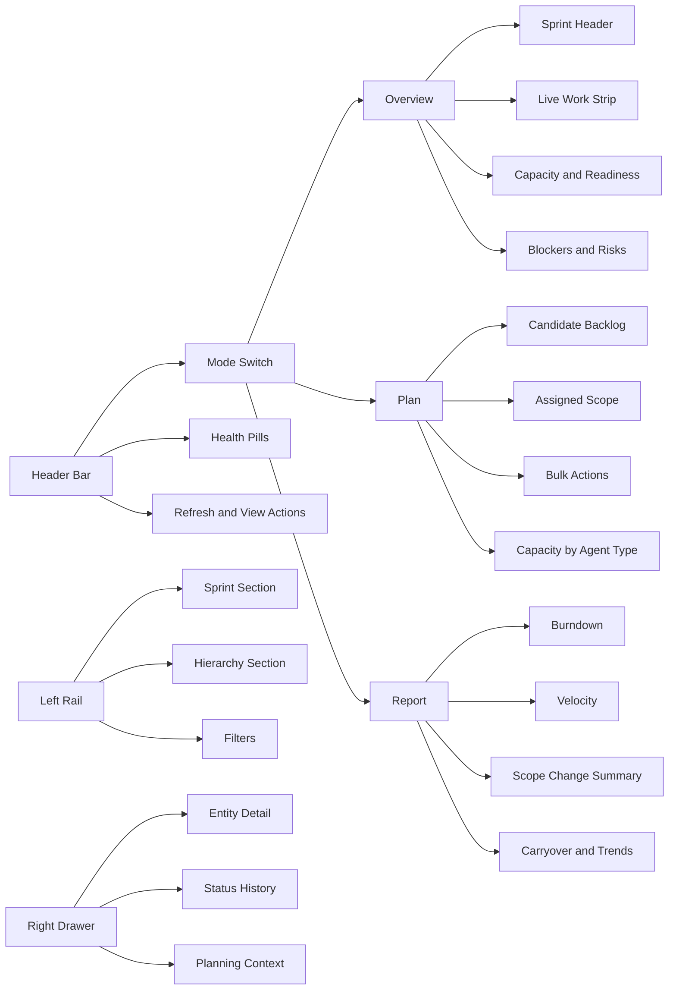
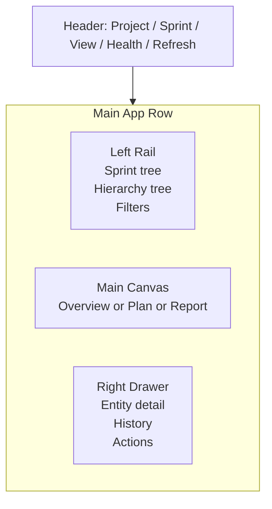

# Sprint Planning Web UI Wireframes

This document reviews the existing sprint planning UI prompt and recommendation, then turns them into low-fidelity wireframes for the Shark local web viewer.

Assumptions:
- The implementation remains a single embedded `viewer.html` with vanilla JS.
- The existing dark 3-panel viewer structure stays intact.
- Personas are derived from E19 sprint planning artifacts:
  - `P1`: PM / Scrum Master
  - `P2`: AI Orchestrator
- V1 is read-first and interactive for navigation, filtering, inspection, and scoped planning actions.

---

## Review Notes

### What the prompt gets right

- It correctly anchors the work to the current viewer character: dark, practical, local-first, and frameworkless by default.
- It asks the right product question: tab, tree, or both.
- It resists generic dashboard drift and keeps the feature tied to real Shark usage patterns.

### What the prompt should specify more explicitly

1. **V1 interaction boundary**
   - It asks whether the surface should be interactive, but it should name the intended V1 write scope.
   - Recommendation: explicitly define V1 as `filter + inspect + select + bulk stage actions`, with deeper mutation deferred.

2. **Default landing state**
   - It does not say whether users land on current sprint health, planning candidates, or historical reporting.
   - Recommendation: default to current active sprint overview, not backlog or reporting.

3. **Data freshness model**
   - The viewer already has a refresh-oriented character.
   - Recommendation: define whether sprint metrics are snapshot-based, manually refreshed, or auto-refreshed on a timer.

4. **Scope split between monitoring and planning**
   - The prompt groups many capabilities together, but the UX needs a stronger split between:
     - current sprint observability
     - planning candidate backlog
     - historical reporting

5. **Small viewport behavior**
   - The constraint mentions smaller viewports, but not what collapses first.
   - Recommendation: define a priority order for collapse: right drawer, then left rail density, then reporting.

### What the recommendation gets right

- `Dashboard + sprint tree` is the correct structure.
- `Interactive, but read-first` is the correct interaction posture.
- Prioritizing live work and blockers above burndown is correct for Shark.
- Treating sprint mode as a sibling surface, not a replacement for entity view, is the right integration model.

### What the recommendation still leaves underspecified

1. **Where the sprint tree sits**
   - "Above or adjacent" is still too loose.
   - Recommendation: keep one left rail with a `Sprint` section first, then `Hierarchy`.

2. **What the primary screen tabs are**
   - The doc lists panels, but not a stable screen model.
   - Recommendation: use three explicit subviews:
     - `Overview`
     - `Plan`
     - `Report`

3. **How planning actions stay quiet**
   - The document says not to center mutation, but it does not define how.
   - Recommendation: confine bulk add/remove and capacity edits to the `Plan` subview and a right-side drawer.

4. **State coverage**
   - Loading, empty, stale-data, and error states are not described.
   - Recommendation: define those states before implementation.

---

## UX Direction

Design the sprint surface as a `command board` inside the existing viewer shell.

Primary jobs:
- `P1` scans sprint health, blockers, and capacity pressure in under 30 seconds.
- `P1` moves into planning only when readiness or scope needs adjustment.
- `P2` reads the same surface as a structured operational dashboard and uses machine-oriented outputs elsewhere.

Proposed mode model:
- `Overview`: default, status-first
- `Plan`: backlog intake and scope shaping
- `Report`: burndown, velocity, carryover, trend

---

## Information Architecture



---

## Layout Model



---

## Wireframe 01: Desktop Overview

```text
+----------------------------------------------------------------------------------------------------------------------+
| SHARK | Dashboard | Sprint | S024 Current Sprint | Overview | Plan | Report | Ready 78 | Cap 23/26 | Blocked 4    |
|                                                                                           Last refresh 14:32 [R]   |
+-----------------------------------+------------------------------------------------------------------------+---------+
| SPRINT                            | S024  Current Sprint                                  May 1 - May 14 | DRAWER  |
| --------------------------------  | Goal: Stabilize web viewer planning surface                         | closed  |
| > Active Sprint                   +------------------------------------------------------------------------+---------+
|   v S024 Current                  | [Readiness 78] [In Progress 12] [Blocked 4] [Done 17] [Drift +2]            |
|     - Ready (12)                  +----------------------------------------------------------------------------------+
|     - In Progress (12)            | LIVE WORK STRIP                                                                   |
|     - Blocked (4)                 | [Newly blocked] T-E27-F10-004  [Completed] T-E27-F08-003  [Changed] F11        |
|     - Done (17)                   +----------------------------------------------------------------------------------+
|   > S025 Upcoming                 | CAPACITY / READINESS                         | BLOCKERS / RISKS                    |
|   > Archive                       | backend     9 / 10  OK                       | 1. T-E27-F10-004 blocked 3d         |
|                                   | frontend   11 / 10 OVER                      | 2. F12 depends on unresolved API    |
| HIERARCHY                         | qa          3 / 6  LOW                       | 3. 2 unsized tasks in sprint        |
| --------------------------------  | orchestration 0 / 2 LOW                      |                                     |
|   v E27 viewer epic               | Readiness drivers:                           | RECENT CHANGES                      |
|     > F08 epic dashboard          | - 2 tasks unsized                            | 14:21 T-E27-F08-003 done            |
|     > F10 tree enhancements       | - frontend over capacity                     | 13:54 T-E27-F10-004 blocked         |
|     > F12 mermaid viewer          | - one dependency outside sprint              | 11:08 E27-F11 moved in_progress     |
|                                   +-----------------------------------------------+-------------------------------------+
| FILTERS                           | ASSIGNED SCOPE SNAPSHOT                                                            |
| [status] [agent] [risk]           | todo 4 | in_progress 12 | review 3 | qa 2 | blocked 4 | done 17                           |
+-----------------------------------+------------------------------------------------------------------------+---------+
```

### Notes

- `Overview` answers "what is happening now?" before exposing planning controls.
- The left rail merges sprint navigation and existing hierarchy instead of creating a second sidebar.
- The right drawer stays closed by default to preserve dashboard scan speed.

---

## Wireframe 02: Desktop Plan View With Drawer Open

```text
+----------------------------------------------------------------------------------------------------------------------+
| SHARK | Dashboard | Sprint | S024 Current Sprint | Overview | Plan | Report | Ready 78 | Cap 23/26 | Blocked 4    |
+-----------------------------------+---------------------------------------------------------------+----------------------+
| SPRINT                            | PLAN S024                                                     | ITEM DETAIL          |
| --------------------------------  | ------------------------------------------------------------- | -------------------- |
| > Active Sprint                   | Filters: [priority] [agent] [status] [size] [dependency]     | T-E27-F10-004        |
|   v S024 Current                  | Search: [ tree keyboard nav bug......................... ]    | frontend | size 3    |
|     - Candidate Backlog           +-----------------------------------+-------------------------+ blocked 3 days       |
|     - Assigned Scope              | CANDIDATE BACKLOG                 | ASSIGNED THIS SPRINT    | Depends on F08 API   |
|     - Capacity                    | [ ] T-E27-F10-006 size 2 frontend | [x] T-E27-F10-004 size3|                     |
|   > S025 Upcoming                 | [ ] T-E27-F12-001 size 3 frontend | [x] T-E27-F08-003 size2| HISTORY              |
|                                   | [ ] T-E27-F08-004 size 1 backend  | [x] T-E27-F11-002 size5| - todo -> in_prog    |
| HIERARCHY                         | [ ] T-E27-F09-010 size ? qa       | [x] T-E27-F06-003 size2| - in_prog -> blocked |
| --------------------------------  | [ ] B042 urgent bug size 2 backnd |                         |                      |
|   v E27 viewer epic               +-----------------------------------+-------------------------+ PLANNING ACTIONS     |
|     > F08 epic dashboard          | BULK ACTIONS                       | CAPACITY BY AGENT TYPE | [Remove from sprint] |
|     > F10 tree enhancements       | [Add selected] [Remove selected]  | frontend 11 / 10 OVER | [Open entity view]   |
|     > F12 mermaid viewer          | [Pin working set] [Export JSON]   | backend   9 / 10 OK   | [Jump to hierarchy]  |
|                                   |                                   | qa        3 / 6 LOW    |                      |
+-----------------------------------+---------------------------------------------------------------+----------------------+
```

### Notes

- All scope-changing actions are isolated to `Plan`.
- The drawer holds the detailed context that explains why an item should be kept, removed, or deferred.
- Capacity stays visible while planning so users do not operate blind.

---

## Wireframe 03: Desktop Report View

```text
+----------------------------------------------------------------------------------------------------------------------+
| SHARK | Dashboard | Sprint | S024 Current Sprint | Overview | Plan | Report | Ready 78 | Cap 23/26 | Blocked 4    |
+-----------------------------------+------------------------------------------------------------------------+---------+
| SPRINT                            | REPORT: S024                                                            | DRAWER  |
| --------------------------------  | ---------------------------------------------------------------------- | closed  |
| > Active Sprint                   | BURNDOWN                              | VELOCITY TREND                        |
|   v S024 Current                  | ideal line vs actual remaining scope  | S020 18 | S021 21 | S022 16 | S023 20 |
|   > S023 Previous                 | day 01 ... day 14                     | avg 18.75                              |
|   > Archive                       +----------------------------------------+----------------------------------------+
|                                   | SCOPE CHANGE SUMMARY                   | CARRYOVER / COMPLETION                 |
| HIERARCHY                         | added mid-sprint: 3 tasks / 7 points   | completed: 17                          |
| --------------------------------  | removed mid-sprint: 1 task / 2 points  | incomplete: 4                          |
|   v E27 viewer epic               | unplanned urgent work: 1 bug           | carryover candidate size: 6            |
|     > F08 epic dashboard          +----------------------------------------+----------------------------------------+
|     > F10 tree enhancements       | CYCLE TIME BY PHASE                    | AGENT UTILIZATION                      |
|     > F12 mermaid viewer          | dev 2.3d | review 0.8d | qa 1.1d       | frontend 110% | backend 90% | qa 50%  |
+-----------------------------------+------------------------------------------------------------------------+---------+
```

---

## Wireframe 04: Mobile / Narrow View

```text
+--------------------------------------------------------------+
| SHARK | Sprint S024 | Overview                [menu] [R]     |
+--------------------------------------------------------------+
| Ready 78 | Cap 23/26 | Blocked 4 | Drift +2                  |
+--------------------------------------------------------------+
| Tabs: [Overview] [Plan] [Report]                             |
+--------------------------------------------------------------+
| Live work                                                    |
| - blocked: T-E27-F10-004                                     |
| - done:    T-E27-F08-003                                     |
+--------------------------------------------------------------+
| Capacity                                                     |
| frontend 11 / 10 OVER                                        |
| backend   9 / 10 OK                                          |
| qa        3 / 6 LOW                                          |
+--------------------------------------------------------------+
| Risks                                                        |
| 1. Unsized tasks in sprint                                   |
| 2. Dependency outside sprint                                 |
+--------------------------------------------------------------+
| Assigned scope snapshot                                      |
| todo 4 | in_progress 12 | blocked 4 | done 17               |
+--------------------------------------------------------------+
```

### Mobile behavior

- Collapse the left rail into a slide-over panel.
- Remove the right drawer; open item detail as a full-screen stacked panel.
- Keep `Overview` first and reporting last.

---

## State Wireframes

### Loading

```text
+--------------------------------------------------------------------------------------+
| Sprint S024 | Overview                                              Refreshing...    |
+--------------------------------------------------------------------------------------+
| Loading sprint health...                                                               |
| [##########......]                                                                    |
| Pulling backlog, capacity, readiness, and recent changes                              |
+--------------------------------------------------------------------------------------+
```

### Empty Planning State

```text
+--------------------------------------------------------------------------------------+
| Plan S025                                                                            |
+--------------------------------------------------------------------------------------+
| No tasks assigned yet.                                                               |
| Start with candidate backlog filters, then bulk add from a feature or agent slice.   |
| [Open candidate backlog]                                                             |
+--------------------------------------------------------------------------------------+
```

### Error / Stale Data State

```text
+--------------------------------------------------------------------------------------+
| Sprint S024 | Overview                                             Data may be stale |
+--------------------------------------------------------------------------------------+
| Failed to refresh sprint metrics. Showing last successful snapshot from 14:32.       |
| [Retry refresh] [View raw error]                                                     |
+--------------------------------------------------------------------------------------+
```

---

## Interaction Summary

### V1 interactions

- switch sprint
- switch subview: `Overview`, `Plan`, `Report`
- expand and collapse sprint buckets
- expand and collapse entity hierarchy
- filter backlog and assigned scope
- open item detail drawer
- bulk add / remove selected items
- jump from sprint item to entity context
- manual refresh

### Deferred interactions

- drag-and-drop prioritization
- inline capacity editing in overview
- multi-sprint comparison overlays
- optimistic live auto-update without refresh control

---

## Recommended Next Refinements

1. Turn this into a feature-scoped `feature.md` or `wireframes.md` under the implementation feature that will own sprint mode.
2. Decide whether `Plan` ships with true write capability in v1 or only selection plus command/export support.
3. Define the exact API shape for:
   - readiness drivers
   - live work strip events
   - capacity by agent type
   - scope change reporting
