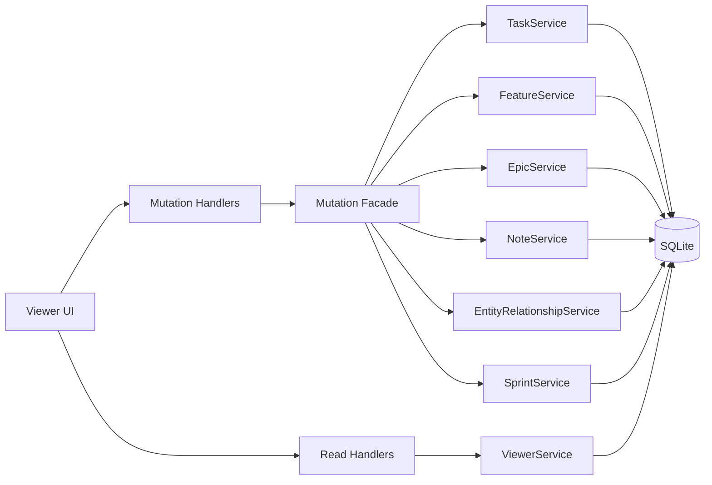

# E30 Architecture: Entity Mutation and Sprint Operations

**Epic**: [Entity Mutation and Sprint Operations](./epic.md)  
**Date**: 2026-05-07

## 1. Component Overview

### What Stays

- The read-only viewer API stays read-only for dashboard composition.
- `ViewerService` continues to aggregate summary, hierarchy, history, sprint overview, sprint plan, and sprint report data.
- `EditService` remains the separate file-write path for arbitrary project files.
- Existing service-layer business logic stays in place for entity updates, note creation, entity relationships, sprint planning, and status transitions.

### What Changes

- Add a viewer mutation surface for explicit entity operations:
  - field edits on epics, features, and tasks
  - note actions
  - dependency/link actions
  - Sprint actions
- Add a thin mutation orchestration layer in the viewer stack so handlers remain small and business rules remain in services.
- Add UI controls in the viewer so users can invoke mutations without leaving the current entity or Sprint context.

### Proposed Runtime Shape

## 2. Key Technical Decisions

### 2.1 Keep Business Logic In Services

Handlers should only parse input, validate shape, and call services. The existing codebase already follows this split in the viewer and edit handlers, and E30 should keep that convention to avoid duplicating validation or workflow rules in HTTP code.

### 2.2 Keep File Editing Separate From Entity Mutation

`EditService` and `PUT /api/v1/edit/file` are for file content writes only. Entity mutation must not piggyback on the file-write path, because file writes have path-security concerns and a different audit model.

### 2.3 Use Existing Workflow Services For Status Changes

All entity status changes should continue to flow through `EntityService` and the entity-specific services that delegate to it. That preserves:

- workflow validation
- backward-transition rules
- rejection-note behavior
- history recording
- orchestrator-action resolution

### 2.4 Canonicalize Dependency Writes Through The Relationship Model

E30 should treat `entity_relationships` as the canonical write path for cross-entity links and dependency-style edges. The legacy `tasks.depends_on` JSON should remain a compatibility/read path until the system is fully migrated or explicitly retired.

Rationale:

- the normalized relationship model already supports multiple entity types
- cycle detection already exists
- viewer read models already expose relationships
- keeping two writable dependency stores would create split-brain data

### 2.5 Reuse SprintService For Sprint Operations

Sprint actions should call `SprintService` instead of writing directly to sprint tables. The existing service already handles:

- sprint creation and updates
- close transitions
- entity assignment and removal
- planning view composition

### 2.6 Keep The Viewer Local-Only

Mutation endpoints should inherit the same local-only posture as the existing viewer routes. No new auth model or remote edit surface is introduced in this epic.

## 3. Data Model Changes

### No New Tables Required

The first implementation should reuse the existing tables:

- `tasks`
- `entity_notes`
- `entity_history`
- `entity_relationships`
- `sprints`
- `sprint_assignments`
- `sprint_capacity`

### Transitional Data Rule For Dependencies

If dependency writes are moved to `entity_relationships`, the system should preserve compatibility with existing `tasks.depends_on` data during the migration window.

Recommended transitional rule:

- new writes go to `entity_relationships`
- reads continue to accept legacy task-local dependency data until backfill is complete
- one reconciliation step backfills or mirrors legacy task dependencies into the normalized relationship table

### Potential Future Schema Work

If note edit/delete is added later, `entity_notes` may need explicit update/delete tracking columns. That is not required for the first E30 cut if the epic stays focused on note creation and retrieval.

## 4. Integration Approach

### Viewer API

- Add new viewer mutation handlers alongside the existing read handlers.
- Keep the read endpoints unchanged so the dashboard continues to load the same aggregates.
- Return updated entities or lightweight operation results after each mutation, then let the UI refresh the read model as needed.

### Service Wiring

- Wire the new mutation layer in `internal/viewer/server/wire.go`.
- Reuse the existing service constructors instead of creating parallel business logic.
- Keep `ViewerService` separate from the mutation façade so read-only composition remains easy to reason about.

### Entity Editing

- Use `TaskService.UpdateTask`, `FeatureService.UpdateFeature`, and `EpicService.UpdateEpic` for field edits.
- Use `EntityService.TransitionStatus` for status changes.
- Use `EntityHistoryService` only for reads; it should not become a write path.

### Notes And Relationships

- Use `NoteService` for note creation and note retrieval.
- Use `EntityRelationshipService` for relationship create/delete/query and cycle checks.
- Preserve the existing CLI semantics so the viewer and CLI continue to share the same backend rules.

### Sprint Actions

- Use `SprintService` for create/update/close/assign/remove/plan actions.
- Keep Sprint overview and report read models as they are; the new UI actions should feed into those existing aggregates.

### Frontend Interaction

- The viewer should submit explicit mutation requests, then refetch the relevant read endpoint.
- Inline validation messages should be shown in the same place the user initiated the action.
- The UI should keep the user in context after each mutation, especially for Sprint plan actions and relationship edits.

## 5. Migration Strategy

### Phase 1: Add Mutation Endpoints Without Changing Existing Reads

- Introduce the viewer mutation layer.
- Reuse existing service methods.
- Keep the existing read endpoints and file-edit endpoint untouched.

### Phase 2: Canonicalize Dependency Writes

- Write new dependency/link mutations through `EntityRelationshipService`.
- Backfill or reconcile legacy task dependency data if the epic needs to preserve old task-local relationships.
- Keep read compatibility until the migration is complete.

### Phase 3: Extend UI Workflows

- Add edit controls in entity views.
- Add note and relationship controls in the same entity context.
- Add Sprint plan actions in Sprint mode.

### Phase 4: Tighten Legacy Paths

- Once the viewer mutations are stable, reduce reliance on any compatibility-only dependency path.
- Leave the file edit surface unchanged unless a separate epic needs it.

### Rollout Considerations

- No downtime is required for the first release.
- Regression risk is concentrated in workflow transitions, dependency cycle detection, and Sprint assignment conflicts.
- The safest rollout order is status edits first, then notes/relationships, then Sprint actions.

