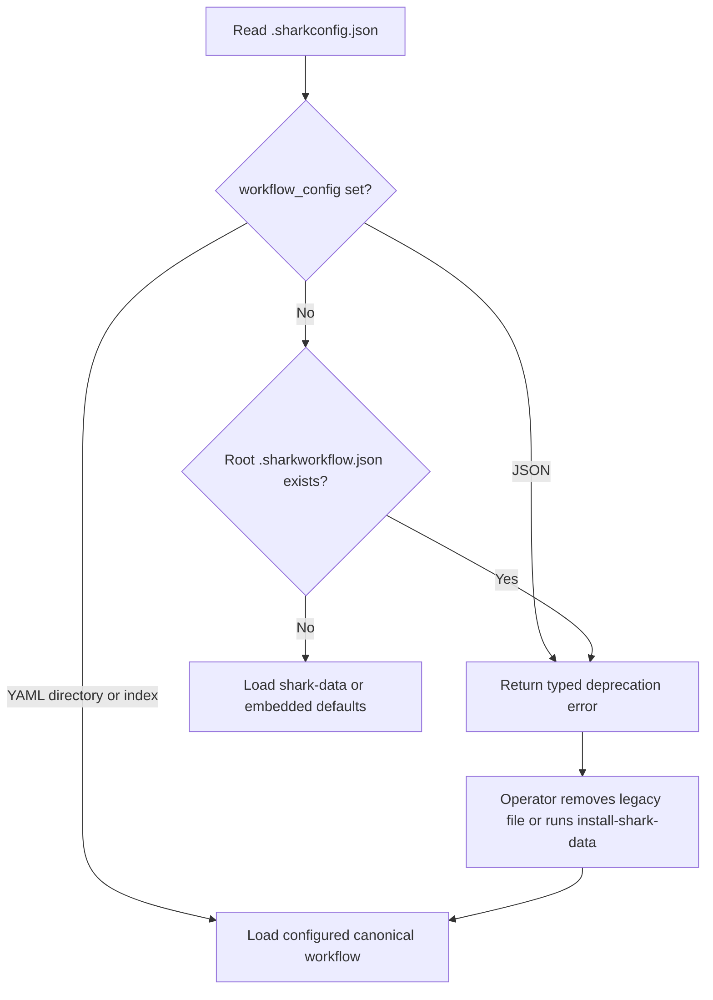

# E32-F06 specification: retire legacy resolution paths

## Scope and traceability

This specification is incremental to the E32 epic. For business context, scope
boundaries, and stakeholder impact, see [Epic PRD §2, §3, and §5](../epic.md).
It implements the final cleanup described by the parent architecture's ADR-6
and §6.1, and it must satisfy the E32 UAT plan's A9 only after A2–A4 and the
F05 release-window gate have passed.

The validated capability map in [research-report.md](research-report.md)
requires reuse of canonical `shark-data/` resolution, embedded defaults, and
replace-only overrides. This feature removes obsolete entry points; it does not
reimplement those capabilities.

The repository has no `E32-interaction-map.md`; therefore this feature declares
no I-## interaction contract. Neither E32 cross-epic row applies to F06:
X-05 owns E32-F04 distribution for E38, and X-12 owns E32-F04 installed-content
identity for E40. No X-## contract is produced, consumed, or validated here.

## Requirements

### Functional requirements

| ID | Requirement | Trace |
|---|---|---|
| REQ-F-001 | Treat every root `.sharkworkflow.json` as an unsupported legacy workflow source, even when `workflow_config` is absent or empty. Return the existing typed deprecation error and migration guidance; never parse or use its contents. | Epic PRD §2 SC7; §3 Cleanup; architecture ADR-6; UAT A9 |
| REQ-F-002 | Continue rejecting an explicit JSON `workflow_config` target with the same typed error. `shark admin install-shark-data` remains the only supported automatic migration path and rewrites the target to the installed YAML workflow directory. | Epic PRD §2 SC7; research report Capability map |
| REQ-F-003 | When no legacy JSON file is selected or present, resolve workflows only from an explicit YAML directory/index, the configured `shark_data_path` bundle, or embedded canonical defaults. Preserve inline workflow blocks and the existing override precedence. | Epic PRD §2 SC1, SC6; architecture ADR-3 and §4.1 |
| REQ-F-004 | Keep prompt resolution canonical-only. Do not add or restore a `shark-templates/` probe. If a legacy tree is present, it must not affect `findTemplateDir()` or rendered output. | Epic PRD §2 SC7; architecture §2.2; research report Finding 1 |
| REQ-F-005 | Delete the eight F05-deprecated harness commands — `run`, `feature`, `epic`, `task`, `prd`, `dispatch`, `develop`, and `release` — only after the qualifying shipped release and one day of normal-use evidence are recorded. | Feature PRD Dependencies and Risks; architecture ADR-6 |
| REQ-F-006 | Remove or correct active operator documentation that presents `shark-templates/` or root JSON workflow loading as current behavior. Preserve historical plans, changelogs, archived assessments, and dated analyses as historical records. | Epic PRD §3; research report Finding 4 |
| REQ-F-007 | Correct the stale local planning identity in `feature.md` to `feature_key: E32-F06` and `epic_key: E32` before task generation. This is a traceability repair discovered by the validated research report, not a runtime change. | research report Scope and Capability map |

### Non-functional requirements

| Area | Requirement |
|---|---|
| Reliability | A legacy file must fail deterministically before workflow parsing. Its content, validity, or location must not alter the error path. A missing legacy file must not prevent embedded-default resolution. |
| Security | Keep existing relative-path containment and absolute-path behavior for YAML workflow sources. Do not broaden supported file extensions or reintroduce a file-based fallback that can select unreviewed project content. |
| Compatibility | Preserve YAML directory/index, embedded-default, `shark_data_path`, inline workflow, and replace-only override contracts. The only intentional incompatibilities are JSON workflow sources and the eight retired harness commands after their release gate. |
| Performance | Remove redundant root-file stat/read attempts from the no-`workflow_config` path; do not add filesystem scans beyond the current canonical bundle resolution. |
| Operations | Error text must name the unsupported JSON source and give one of the supported remediation paths: remove the target/file for embedded defaults, or run `shark admin install-shark-data` for editable YAML. |

### Acceptance criteria

| ID | Criterion |
|---|---|
| AC-001 | A project containing a root `.sharkworkflow.json` and no `workflow_config` causes `LoadMultiLevelWorkflow` and configuration validation to return/report `ErrDeprecatedWorkflowConfigJSON`; no workflow from that JSON is loaded. |
| AC-002 | A project with `workflow_config: ""` and a root `.sharkworkflow.json` has the same refusal as AC-001. |
| AC-003 | An explicit JSON `workflow_config` still returns the same typed deprecation error; `shark admin install-shark-data` migrates that explicit target to `<shark_data_path>/workflow/` and preserves `overrides/`. |
| AC-004 | With no root legacy JSON and no explicit workflow source, the normal embedded-default path remains usable. YAML directory and YAML index configurations continue to load, including configured `shark_data_path` locations. |
| AC-005 | `findTemplateDir()` selects only `<shark_data_path>/prompts` or its canonical embedded fallback. A fixture containing only a `shark-templates/` prompt tree cannot render from that tree. |
| AC-006 | `rg -n 'shark-templates' cmd internal` returns no production-code matches. The repository does not contain a shipped `shark-templates/` directory. Test fixtures may mention the retired name only to prove it is ignored. |
| AC-007 | `shark config validate --help` and its long description describe current YAML/embedded validation and do not claim to validate `.sharkworkflow.json`. |
| AC-008 | The eight named files are absent from `~/.claude/commands/` only after release-window evidence is attached to the implementation handoff. Before that evidence exists, implementation stops before external deletion and reports the gate as unmet. |
| AC-009 | Current guidance in `CLAUDE.md`, `docs/cli-reference/initialization.md`, `docs/cli-reference/configuration.md`, `docs/guides/route-based-workflow.md`, `docs/guides/workflow-profiles.md`, and `docs/architectural-overview.md` describes canonical `shark-data/` behavior and the explicit JSON refusal. Historical E20/E32 planning records remain unchanged. |
| AC-010 | `feature.md` identifies E32-F06 under E32 before implementation tasks are authored. |

### Out of scope

- New workflow features, workflow-schema changes, template rendering features, or a `shark dev` disk-loading mode.
- Changes to embedded corpus contents, prompt/skill migration, or override merge semantics.
- Rewriting historical plans, release notes, QA reports, or the dated LLM architecture analysis solely to remove legacy terminology.
- Deleting user-owned root JSON files, local overrides, or third-party integrations. The product refuses legacy input; operators choose whether to remove or migrate their files.
- Any cross-epic contract change or new I-##/X-## identifier.

## Architecture

### Component changes

| Path | Change |
|---|---|
| `internal/config/workflow/parser.go` | Remove the implicit fallback that selects `<project>/.sharkworkflow.json` when `workflow_config` is absent or empty. Before canonical/default loading, detect a root legacy JSON file and return `ErrDeprecatedWorkflowConfigJSON` via `DeprecatedWorkflowConfigJSONError()`. Retain explicit-JSON refusal, YAML directory/index loading, and the migration-error constructor. Make the no-source branch represent canonical defaults rather than a missing JSON file. |
| `internal/config/workflow/validator.go` | Update `ValidateWorkflowFiles` and its comments so duplicate-source inspection does not synthesize the retired root JSON path. It must surface the parser's deprecation finding for detected legacy JSON and otherwise inspect only configured supported sources. |
| `internal/config/aliases.go` | Delete the unused `resolveWorkflowDir` legacy-file signal and its fallback-oriented comments. Retain `ResolveSharkDataRoot` and the action-service loader's explicit JSON guard. |
| `internal/config/workflow_config_resolve_test.go` | Remove tests that specify the legacy-file signal; retain canonical YAML-directory and `shark_data_path` resolution tests. |
| `internal/config/shark_data_path_test.go` | Update assertions only if the removed legacy signal is part of the helper contract; retain custom and absolute bundle coverage. |
| `internal/config/workflow/workflow_file_loading_test.go` | Replace the two tests that load a root `.sharkworkflow.json` with refusal tests for absent and empty `workflow_config`. Keep explicit JSON rejection, YAML directory/index, and normal default-source coverage. |
| `internal/config/workflow/workflow_validation_dx_test.go` | Add or update validation coverage proving a root legacy JSON produces one actionable error finding rather than duplicate detection or a loaded workflow. |
| `internal/templates/shark_data_renderer_test.go` | Retain the canonical-only regression fixture. Update its E32/F06 trace comment if needed; do not alter renderer behavior because the fallback is already absent. |
| `internal/cli/commands/config.go` | Revise `config validate` help so it describes `.sharkconfig.json` and supported YAML/embedded workflow sources only. |
| `internal/cli/commands/config_test.go` | Add a command-help regression asserting the removed JSON-validation claim is absent and supported source terminology remains present. |
| `internal/cli/commands/sharkdata_cmd.go` and `internal/cli/commands/sharkdata_cmd_test.go` | Preserve the explicit install-and-migrate behavior. Only update wording/tests if the shared error text changes; do not remove this migration capability. |
| `docs/plan/E32-shark-20-single-artifact-consolidation/E32-F06-cleanup-remove-fallback-paths-retire-shark-templat/feature.md` | Correct the stale E02 feature and epic keys to E32-F06/E32. |
| `CLAUDE.md`, `docs/cli-reference/initialization.md`, `docs/cli-reference/configuration.md`, `docs/guides/route-based-workflow.md`, `docs/guides/workflow-profiles.md` | Align migration wording with the final refusal semantics: a discovered root JSON file is rejected; use embedded defaults after removal or use the explicit install command to migrate. |
| `docs/architectural-overview.md` | Replace current-state diagrams and instructions that identify `.sharkworkflow.json` and `shark-templates/` as the active engine with the E32 canonical bundle. |
| `~/.claude/commands/{run,feature,epic,task,prd,dispatch,develop,release}.md` | Delete the eight deprecated command files only when the release-window gate is evidenced. These are external harness artifacts, not repository files. |

No change is planned for `internal/templates/orchestrator_renderer.go`: live code already implements the target canonical-only resolution. No `shark-templates/` tree is present in this checkout, so there is no repository directory to delete; retain the negative test as the durable guard.

### Data model changes

No database schema, persisted model, migration, or API-response schema changes are required. The configuration contract narrows accepted workflow sources:

| Field / input | Supported behavior after F06 |
|---|---|
| `workflow_config` omitted or empty | Use the configured canonical bundle or embedded defaults, unless a root `.sharkworkflow.json` is present, in which case return the migration error. |
| `workflow_config` YAML directory or YAML index | Continue current loading and override behavior. |
| `workflow_config` JSON file | Reject with `ErrDeprecatedWorkflowConfigJSON`. |
| Root `.sharkworkflow.json` | Reject with `ErrDeprecatedWorkflowConfigJSON`; do not parse it as an implicit default. |
| `shark_data_path` / `overrides/` | Unchanged: existing path checks and replace-only override semantics apply. |

### API and interface contracts

`workflow.LoadMultiLevelWorkflow(configPath string)` and
`workflow.LoadMultiLevelWorkflowFromBytes(...)` retain their signatures. Their
behavior changes only for the retired implicit root JSON input. Callers detect
the condition with `errors.Is(err, workflow.ErrDeprecatedWorkflowConfigJSON)`;
they must not match error text.

`workflow.DeprecatedWorkflowConfigJSONError()` remains the single migration
message source. It must direct an operator to remove/empty the JSON selection
and root file for embedded defaults, or run `shark admin install-shark-data` to
create editable YAML. `ensureWorkflowConfigField` continues to use
`workflow.IsDeprecatedWorkflowConfigTarget` for the explicit migration command.

### Key decisions

| Decision | Rationale |
|---|---|
| Refuse implicit root JSON rather than silently ignore it. | A silent ignore can change an established project's workflow without an actionable diagnosis. Explicit refusal fulfills SC7 and preserves operational safety. |
| Preserve `install-shark-data` JSON migration. | It is an explicit, reviewable operator action that converts a deprecated selection into the canonical YAML directory; it is not a runtime fallback. |
| Do not modify the renderer. | Code and its negative regression test already satisfy canonical-only prompt resolution. Reintroducing work there would create risk without changing behavior. |
| Preserve historical documentation. | Historical evidence must remain auditable. Only current operator guidance and current architecture claims need correction. |
| Gate harness deletion on release evidence. | F05 promised a one-release compatibility window. A spec cannot waive that commitment; missing evidence stops destructive external cleanup. |

There are no material unresolved technical decisions. The release-window check is
an implementation gate with a defined evidence requirement, not an unanswered
design choice; therefore no Q### record is required.

### Integration with existing code

Follow the configuration/workflow package pattern in
`internal/config/workflow/parser.go`: parse configuration once, return typed
errors, and preserve the public loader surface. Follow thin Cobra command
guidance in `internal/cli/commands/config.go`; this feature changes help text,
not command business logic. Preserve the renderer's existing
`findTemplateDir() string` and `sharkDataPromptsSubdir() string` behavior in
`internal/templates/orchestrator_renderer.go`.

Verification must run the focused Go tests for the listed packages, then the
repository quality gate: `make fmt`, `make lint`, and `make test`. Before the
external command deletion, record fresh evidence for E32 UAT A2, A3, A4, and A9
preconditions, the release containing F05, one day of normal use, and the
read-only audit of `~/.claude/hooks/`, `scripts/`, and the eight command paths.

## Cross-feature interactions

Not applicable. No parent `E32-interaction-map.md` exists, so no map-owned
I-## contract can be produced or consumed by E32-F06.

## Cross-epic integrations

Not applicable. The product map assigns E32's current rows X-05 and X-12 to
E32-F04. E32-F06 neither produces, consumes, nor validates a map-owned X-##
contract.
