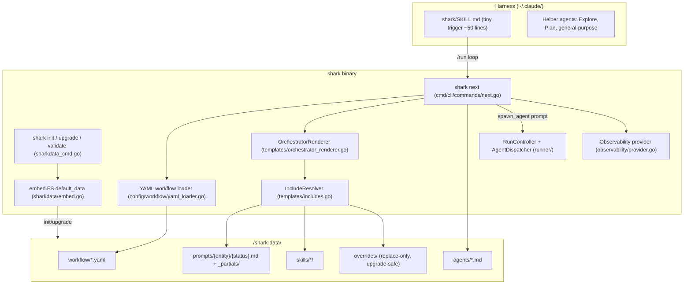

# System Architecture: Shark 2.0 — Single-Artifact Consolidation

**Epic**: E32
**Date**: 2026-06-22
**Author**: architect

> This document is the **system-level technical design** for E32. It records the
> target architecture, the key decisions (ADRs), data/model changes, integration
> approach, and migration strategy. Business context is owned by `epic.md`;
> existing-implementation facts are owned by `research.md`. This document does not
> restate either — it points at them and designs on top of them.

---

## 1. Architecture Overview

E32 consolidates a three-location workflow stack (Go engine + `~/.claude/skills/`
+ `~/.claude/agents/`) into a **single embedded, drop-in artifact** that
`shark init` lays down as `shark-data/` in any project. The core architectural
move is a **three-layer separation** — *workflow YAML* (step order, routing),
*prompt `.md` files* (workflow scaffolding: read inputs, gate, advance), and
*skills* (portable craft) — assembled by the engine into a single
fully-rendered, self-contained prompt emitted by `shark next`.

Critically, per `research.md`, **the engine machinery already exists** (E1–E9
are implemented and compile). E32 is therefore predominantly a **content
migration, distribution, and cutover** epic layered on a built engine — not new
engine development. This architecture documents the as-built engine as the
governing contract, then specifies the remaining migration/cutover/instrumentation
work so it conforms to that contract.

### Key Design Decisions (summary; full ADRs in §3)

1. **Structural decoupling, not lexical** — craft/scaffolding split by the
   "would the activity still be that activity?" test; a skill may be 100%
   shark-vocab-free and still be wrongly coupled if it embeds the host contract.
2. **Engine-driven dispatch via `shark next`** — the engine assembles the prompt
   and emits dispatch metadata; the harness loop becomes trivial. `orchestration`
   skill is retired.
3. **Embedded `//go:embed` distribution** — canonical defaults ship in the
   binary; `shark init`/`upgrade` lay them down; `overrides/` is replace-only and
   upgrade-safe.
4. **Inline agent bodies at render time** — `shark next` inlines `agents/<type>.md`
   into the prompt (resolves C6: Claude's `Agent` tool reading `~/.claude/agents/`
   is bypassed because the persona travels inside the rendered prompt).
5. **Sequenced backward compatibility** — F01–F04 stay compatible with the legacy
   three-location stack; F05 is the deliberate hard cutover; F06 removes fallbacks.

---

## 2. Component Overview — What Changes, What Stays

### 2.1 System Diagram (target, as-built engine)



### 2.2 What Changes vs What Stays

| Element | Disposition | Detail |
|---|---|---|
| `internal/templates/includes.go` (E1) | **Stays (built)** | `IncludeResolver`, depth cap 5, 50KB warn, override-first resolution. No change. |
| `internal/config/workflow/yaml_loader.go` (E2) | **Stays (built)** | YAML→JSON→`WorkflowConfig` single-schema loader. No change. |
| `internal/cli/commands/next.go` (E3) | **Stays (built); extend in F07** | `NextResponse`, cascade resolution, `attachAgentBody` inlining. F07 adds per-call span attributes. |
| `internal/templates/orchestrator_renderer.go` (E4/E5) | **Stays; F06 deletes Pass-2 fallback** | `.md` support + `findTemplateDir()` shark-data→shark-templates fallback. F06 removes Pass 2. |
| `internal/sharkdata/embed.go` + `default_data/` (E6–E9) | **Stays (built); F04 fills content** | `Init`/`Upgrade`/`Validate`, `//go:embed all:default_data`. F04 completes the embedded corpus. |
| `internal/observability/provider.go` | **Extend (F07)** | Add `file_jsonl` exporter case + custom `SpanExporter`. |
| `shark-templates/.sharkworkflow.json` + `*.tmpl` | **Retire (F06)** | Legacy source; superseded by `shark-data/`. ~160 files removed after F05. |
| `~/.claude/skills/{9 in-scope}` | **Delete (F05)** | Migrated to `shark-data/skills/`; harness copies removed. |
| `~/.claude/skills/orchestration` | **Delete (F05)** | Replaced by `shark next`. |
| `~/.claude/agents/{9 in-scope}` | **Delete (F05)** | Inlined via `shark next`; harness copies removed. |
| `~/.claude/skills/shark/SKILL.md` | **Reduce (F05)** | Shrink to tiny dispatch-loop trigger. |
| Helper agents (Explore/Plan/general-purpose) | **Stays** | Harness-level, out of scope. |
| Untouched `~/.claude/skills/*` (§3 epic out-of-scope list) | **Stays** | Not shark-coupled. |

---

## 3. Key Technical Decisions (ADRs)

### ADR-1 — Three-layer architecture: workflow / prompt / skill

**Status**: Accepted (jaunty-panda model, adopted per epic A1).
**Context**: Skills had accumulated workflow-contract logic (status names,
`shark --field` calls, gate enforcement). Lexical de-sharking is insufficient.
**Decision**: Govern every line of content by the structural test — *"if you
removed this line, would the activity still be that activity?"* Craft-checks stay
in **skills**; gate-checks, state mutation, and input-fetching move to **prompts**;
step order/routing/agent assignment live in **workflow YAML**.
**Consequences**: Skills become standalone-readable and host-agnostic; the
prompt↔skill contract is the skill's `inputs:`/`outputs:` frontmatter. The cost is
a one-time content split per in-scope skill (`_extracted/` sidecars during F01,
consumed before close per SC8). Validation enforces purity (no shark/status names
in skills) rather than relying on author discipline.

### ADR-2 — Engine-driven dispatch; retire `orchestration` skill

**Status**: Accepted (epic resolved decision #3).
**Context**: The harness previously needed dispatch logic that re-derived shark's
runtime assumptions; rendered prompts named skills (`LOAD: quality skill`) and
relied on runtime discovery, which breaks under Codex/Copilot/Gemini.
**Decision**: `shark next <entity> --json` returns
`{ prompt, agent_type, provider, model, action }` where `prompt` is fully
assembled with all skill content inlined. The harness reduces to: call
`shark next` → spawn agent with `prompt` → call advance. `action` ∈
`spawn_agent | check_or_resume | advance_status | pause | archive` (see
`normalizeWireAction` in `next.go`).
**Consequences**: Workflow knowledge lives entirely in the engine + YAML, not the
harness. Multi-harness portability becomes viable. The trade-off (epic §5) is a
slower inner loop for skill iteration (edit→rebuild→upgrade vs live edit);
accepted, with `shark dev` disk-load mode deferred to backlog.

### ADR-3 — Embedded-FS distribution with replace-only overrides

**Status**: Accepted (epic resolved decisions #1, #5; constraints C3, C5).
**Context**: A new project required four manual installs. There is no per-project
version pin in this epic.
**Decision**: Canonical defaults are embedded via `//go:embed all:default_data`
(the `all:` prefix is mandatory to capture `.gitkeep`/hidden files — see
`research.md` §2). `shark init` lays down `shark-data/` (idempotent;
`ErrAlreadyInitialized` ⇒ caller runs `upgrade`). `shark upgrade` refreshes every
file **except** `overrides/`. `overrides/<path>` **fully replaces** the
corresponding default at render time — never merges.
**Consequences**: A shark release globally invalidates defaults on `upgrade`;
overrides are the only safe customization surface and they survive upgrades
unchanged (SC6/UAT-4). Replace-only semantics avoid silent merge drift, at the
cost of overrides going stale silently (acknowledged follow-up: no diff/reconcile
tooling in this epic).

### ADR-4 — Inline agent persona at `shark next` time

**Status**: Accepted (epic resolved decision #5; resolves constraint C6).
**Context**: Claude Code's `Agent` tool reads `~/.claude/agents/`. Moving agents
to `shark-data/agents/` would break dispatch unless routing is decided.
**Decision**: The **inline** model is canonical (already implemented:
`attachAgentBody()` / `LoadAgentBodyForInline()` in `next.go`). `shark next`
resolves `agents/<type>.md` (override-aware via `IncludeResolver`) and appends the
persona to the rendered prompt. The harness spawns a generic agent carrying the
full prompt; it does not need the persona to exist as a harness `Agent` type.
**Consequences**: Agents become host-agnostic and travel with the prompt
(supports multi-harness). The F04 routing decision is resolved *toward the
existing implementation* to avoid contradicting shipped code (per `research.md`
Risk 3). No copy-on-init of agents into `~/.claude/agents/` is required.

### ADR-5 — `.md` prompt format with optional stripped frontmatter

**Status**: Accepted (epic resolved decision #4).
**Context**: Prompt files need optional metadata (`inputs:`/`outputs:`) but must
render as Go templates.
**Decision**: Prompt files are `.md`. `stripFrontmatter()` removes a leading
`---`-delimited YAML block before the body is parsed as a Go template
(`orchestrator_renderer.go`). The same template engine and `orchestratorFuncs()`
(`dict`, `list`, `default`, `eq`, `ne`, `isEmpty`, `isSimple/Standard/Complex`)
serve `.tmpl` and `.md` identically.
**Consequences**: One renderer, two extensions. New prompts must use only the
existing template functions or extend `orchestratorFuncs()` centrally.

### ADR-6 — Sequenced compatibility; F05 is the deliberate break

**Status**: Accepted (epic constraints C1, C2; scope boundary rules).
**Context**: Daily work depends on shark; two repos with no shared CI; F04 spans
both.
**Decision**: F01–F04 remain backward-compatible with the three-location stack
(the `findTemplateDir()` Pass-2 `shark-templates/` fallback is the safety net).
**F05 is the first phase permitted to break legacy paths** (global hard cutover of
the shared harness). F06 then removes the fallback and retires `shark-templates/`.
**Consequences**: Neither repo is left broken mid-flight. F06 must not remove the
fallback until F04 prompt coverage is verified (per `research.md` Risk 2). Cutover
must be communicated/timed because the harness is shared (epic §5).

### ADR-7 — Include safety: cycle detection, depth cap, size warning

**Status**: Accepted (epic constraint C4) — already built.
**Context**: `{{include:}}`/`{{augment:}}` recursion can cycle, runaway-nest, or
produce oversized prompts.
**Decision**: `IncludeResolver` carries a `visited` set for cycle detection, caps
depth at `IncludeDepthCap = 5` (error on exceed), and warns above
`IncludeSizeWarnBytes = 50KB` via an injectable `warnFn`.
**Consequences**: Render safety is enforced in one place. F07 should surface
render-size and unresolved-placeholder signals through the JSONL exporter rather
than re-implementing detection.

### ADR-8 — `shark validate` as the structural guardrail

**Status**: Accepted (epic SC5) — built; F04 must keep it green.
**Decision**: `Validate()` walks workflow YAML (expected entity files present,
structure parses), prompt includes (every `{{include:}}` path resolves), and skill
frontmatter (parses). Per-file errors accumulate (not fail-fast), matching the
YAML loader. `ValidationReport` carries `IssueLevelError/Warning/Info`.
**Consequences**: Structural rot (link rot, dangling agent/prompt refs, impure
skills) is caught in CI/locally. Semantic rot is **not** caught — golden-output
diff suite is explicit follow-up. F04 success is gated on a clean `shark validate`
against a fresh `shark init`.

---

## 4. Data / Model Changes

E32 introduces **no database schema changes** — no migration, no
`CurrentSchemaVersion` bump. All structural change is in the **filesystem
contract** and **in-memory config model**.

### 4.1 Filesystem contract (`shark-data/` tree)

```
<project>/shark-data/
  workflow/      epic.yaml feature.yaml task.yaml bug.yaml change.yaml [tech-debt.yaml sprint.yaml]
  prompts/       {entity}/{status}.md  +  _partials/_*.md
  skills/        {skill}/SKILL.md (+ workflows/, optional assets consumed into prompts)
  agents/        {architect,business-analyst,developer,qa,tech-lead,product-manager,
                  tech-director,researcher,uat-agent}.md
  overrides/     mirror of the above; entries WIN over defaults, never merged
```

### 4.2 Workflow YAML model (per entity)

Loaded by `yaml_loader.go` into the existing `WorkflowConfig` (same JSON struct
tags — single schema source). Key fields per status:
`status_flow[status] -> [next…]`, and `status_metadata[status]` carrying
`phase`, `progress_weight`, `responsibility`, and
`orchestrator_action: { action, instruction_template }` (the `.md` prompt
pointer). Status name = step name = entity status (epic layer rule).

### 4.3 `shark next` response contract (`NextResponse`)

| Field | Meaning |
|---|---|
| `entity_key`, `entity_type`, `status` | resolved entity + current status |
| `action` | wire verb: `spawn_agent` / `check_or_resume` / `advance_status` / `pause` / `archive` / `error` |
| `agent_type`, `provider`, `model` | dispatch metadata for the harness |
| `prompt` | fully-assembled, self-contained prompt (skills + agent persona inlined) |
| `resolved_via` | provenance (which entity in the cascade produced this) |
| `error` | populated on `action: error` |

### 4.4 Skill frontmatter contract (prompt↔skill)

```yaml
---
inputs:
  - <name>: <description / how the prompt must supply it>
outputs:
  - <name>: <what the skill returns>
---
```
This is the **only** coupling surface between scaffolding and craft (epic A3). The
prompt promises to supply `inputs`; the skill promises to operate with no further
host assumptions.

### 4.5 F07 telemetry record (JSONL)

A per-`shark next` event line written to `<project>/shark-data/.stats/events.jsonl`,
derived from the existing OTel spans, with attributes: prompt byte size,
unresolved-placeholder count, `agent_type`, `action`, entity key/type/status,
timestamp. Off by default (`ObservabilityConfig.Enabled: false`).

---

## 5. Integration Approach — How New Work Connects to the Built Engine

Per `research.md`, the engine is in place. Integration is therefore mostly
"fill, extend at named seams, then subtract", not "build new subsystems".

| Remaining work | Connects via | Type |
|---|---|---|
| **F04** complete embedded corpus | Copy fully-populated `shark-data/{prompts,skills,workflow}` into `internal/sharkdata/default_data/`; rebuild. No code change — `embed.FS` is a compile-time snapshot. | Content only |
| **F04** workflow parity | Verify per-entity YAML in `default_data/workflow/` matches the legacy `.sharkworkflow.json` semantics via `shark validate` + a render diff. | Content + verification |
| **F04** agent routing | Confirm against `attachAgentBody()` (ADR-4) — no code change if inline model stands. | Verification |
| **F05** harness repoint | Delete in-scope `~/.claude/skills/`+`agents/`; rewrite `shark/SKILL.md` to the dispatch loop; add deprecation headers to slash commands. | Harness content only |
| **F06** fallback removal | Delete Pass-2 branch in `findTemplateDir()`; remove `shark-templates/`; refuse legacy `.sharkworkflow.json` load with a deprecation error. | Targeted deletion |
| **F07** JSONL exporter | Add `"file_jsonl"` case to the exporter switch in `buildTracerProvider()`/`buildMeterProvider()`; implement `fileJSONLSpanExporter` satisfying `sdktrace.SpanExporter`; add per-call attributes in `next.go`; validate `Exporter` config value. | New code (~200 LoC) at a named seam |
| **F08** supplemental skills | Content fixes in `shark-data/skills/` (purity gate); ensure no `_extracted/` sidecars ship as craft. | Content only |

**Pattern conformance (from `research.md` §2, non-negotiable):**
- CLI commands stay thin wrappers (parse → service → format); no business logic.
- Constructor injection; no new global singletons for template logic.
- `all:` prefix on any new `//go:embed`.
- Per-file error accumulation (not fail-fast) in validators/loaders.
- Override precedence + upgrade-skip is a hard contract F04 must not violate.

---

## 6. Migration Strategy

### 6.1 Critical path and sequencing

```
F01 (craft extraction, content done; in_code_review)
F02 (engine E1–E5, built)         ─┐
F03 (engine E6–E9, built)          ├─► F04 (complete embedded corpus; rebuild; shark validate green)
                                   ─┘        │
                                            ▼
                                      F05 (harness hard cutover)  ── F06 (remove fallback, retire shark-templates)
F07 (file_jsonl exporter)  — parallel, additive, no dependency on the critical path
F08 (supplemental skills)  — parallel, low-risk content fixes
```

- **F02/F03 status reconciliation**: code shipped ahead of formal feature
  planning (`research.md` §4). Advance their statuses to reflect built reality so
  E32 does not carry false "work remaining" signals; no implementation work.
- **F04 is the gate**: the embedded snapshot must be complete and `shark init →
  shark validate → shark create epic → shark next` must run clean (SC1/UAT-1)
  *before* F05/F06.
- **F06 ordering hazard**: never remove the `shark-templates/` fallback until F04
  prompt coverage for every shipped entity/status is verified (Risk 2). The
  fallback is the safety net through F04.

### 6.2 Backward-compatibility windows

- F01–F04: both stacks resolve (Pass-2 fallback live). No daily-work disruption.
- F05: deliberate break — shared harness cutover; one-release deprecation window
  for slash commands (epic A4); must be communicated/timed.
- F06: legacy paths retired; legacy `.sharkworkflow.json` load refused.

### 6.3 Override-preservation invariant

Every migration step preserves the ADR-3 contract: `upgrade` never touches
`overrides/`; an override always wins at render time. This is verified by UAT-4
and is a release blocker if violated.

### 6.4 External-leakage audit (pre-F04)

Before F04, audit external consumers that hardcode `shark-templates/` or status
vocabulary (likely `~/.claude/hooks/`, `scripts/`, dashboards, CLAUDE.md) per
epic A5/C-watchouts. Residual leakage is a documented follow-up risk, not a
blocker, but the path-name rename must not silently break hooks.

### 6.5 Rollback posture

Through F04, rollback is trivial (both stacks coexist). After F05, rollback means
restoring the deleted harness skills/agents from git and reverting the
`SKILL.md` trigger — feasible within the deprecation window. After F06, rollback
requires restoring `shark-templates/` and the fallback branch from git history.
This asymmetry is the reason F05/F06 are last and gated on a clean F04.

---

## 7. Cross-Cutting Concerns (WAF pillars)

- **Reliability**: Include cycle/depth/size guards (ADR-7); `shark validate`
  structural gate (ADR-8); per-file error accumulation avoids partial-set
  regressions. Gap: semantic rot uncaught (golden-diff follow-up).
- **Performance**: `shark next` is on the dispatch hot path. F07 exporter must use
  buffered/append writes and flush on `Shutdown()`; start with the synchronous
  span processor for correctness, evaluate async only if latency shows
  (`research.md` Risk 4). Render-size warning bounds prompt blowup.
- **Security**: No new external surface, no auth/PII. Embedded content is
  trusted-source. `DefaultDisallowedTools` already blocks agent self-advancement
  (`shark status advance*`); the inline-agent prompt must not weaken that.
- **Cost / Operations**: Single binary = single deployable (G1). `shark upgrade`
  is the operational update path; overrides are the supported customization
  surface; telemetry is opt-in and local-file (no external collector required).
- **Operability gap (accepted)**: no per-project version pin; global
  invalidation on upgrade; documented in epic follow-up backlog.

---

## 8. Open Items Carried to Implementation (not new requirements)

These are decisions already resolved by the epic/research that implementation must
honor — listed so no requirement is orphaned:

1. F04 workflow YAML must reach **semantic parity** with legacy
   `.sharkworkflow.json`, verified by render diff (SC2/UAT-3), not just file
   presence.
2. F04 must consume or explicitly de-ship all `_extracted/` sidecars before close
   (SC8/UAT-8).
3. F08 specification-writing purity fix (2 stray `shark status advance` lines →
   `_extracted/`) per `research.md` Risk 5.
4. F07 must add `file_jsonl` to `ObservabilityConfig.Exporter` validation, not
   just the provider switch.
```
