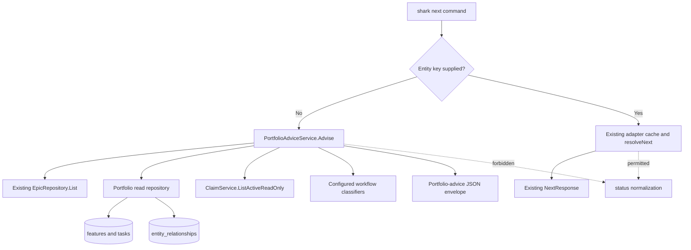

# Specification — E36-F04: Portfolio-Aware Next-Action Advisor

## Scope and sources

This specification is incremental to the [E36 epic](../epic.md). See the epic
PRD's **Goal** and **Guiding principles P2-P4** for the project-coordination
boundary, single-project store, advisory-document rule, and entity-first state
model. The feature adds a fourth slice after the epic's original F01-F03 design;
it does not change those slices.

The detailed source of validated feature scope is
[feature.md](feature.md). The [research report](research-report.md) supplies the
required Capability map and the brownfield evidence for the design below. E36
has no parent architecture document, `E36-interaction-map.md`, or
`E36-cross-epic-map.md`. The global
[`docs/product/cross-epic-integration-map.md`](../../../product/cross-epic-integration-map.md)
contains no E36 row as of 2026-07-20.

### Capability map application

| Capability | Decision from research | Specification consequence |
| --- | --- | --- |
| E36-F01 read-only advisor boundary | REUSE | Bare `shark next` cannot mutate state and reports unavailable evidence clearly. It does not invoke a consult persona. |
| E36-F02 project coordination and advisory progress | EXTEND | The prompt may inspect `docs/product/`, but neither Go code nor Rider treats product documents as workflow state or persisted order. |
| E36-F03 entities as durable state | REUSE | Epic relationships remain in `entity_relationships`; this feature adds no roadmap ledger. |
| E19-F07 stable lexicographic ordering and explanation | REUSE | Graph layers and warnings use explicit precedence tiers and stable key ordering, not a weighted score. |
| Polymorphic `depends_on`, `blocks`, and `follows` | EXTEND | The advisor reads existing epic relationships and detects graph defects without changing relationship creation rules. |
| Rider state-aware help | EXTEND | Only bare state-aware help consumes portfolio advice; static help modes remain zero-state. |
| Keyed `shark next <key>` dispatch | REUSE | Existing dispatch response, cascade traversal, prompt assembly, and status normalization remain unchanged. |
| Portfolio-advice envelope | NEW | Add a separate no-argument query path and a stable JSON read model. |
| `shark next --preview` | CONTRADICTS | Remove the inert flag. Do not add keyed-dispatch simulation. |
| Cross-entity implementation planning | NEW, separate work | Do not create a general implementation-plan model or choose work below the epic root. |

The implementation must not recreate the progress record, sprint queue,
relationship store, claim lease, epic progress formula, or keyed dispatch
engine.

## Requirements

### Functional requirements

| ID | Incremental requirement | Epic trace |
| --- | --- | --- |
| REQ-F-001 | `shark next` with no entity argument must return exactly one JSON portfolio-advice envelope. `shark next <key>` must continue to return the existing `NextResponse` dispatch envelope. | Epic REQ-F15 and REQ-F18; feature **Command contract** |
| REQ-F-002 | The bare mode must return every non-terminal epic in the current Shark database with key, title, status, priority, business value, progress, eligibility evidence, blockers, and active work. Terminal classification must come from the configured epic workflow, not hard-coded status names. | Epic REQ-F16; feature **Command contract** |
| REQ-F-003 | The bare mode must return every stored epic-to-epic `depends_on`, `blocks`, or `follows` relationship for which at least one endpoint is a returned non-terminal epic. It must resolve endpoint keys and statuses and mark hard precedence as satisfied or unresolved. | Epic REQ-F16; feature **Command contract** |
| REQ-F-004 | Go code must produce deterministic hard-dependency and combined-roadmap layers. It must report hard cycles, roadmap cycles, contradictory precedence, unlayered epics, and missing order between otherwise eligible first-layer candidates. It must not invent a total order. | Epic REQ-F16 and REQ-NF7; feature **Success conditions** |
| REQ-F-005 | The envelope prompt must direct the receiving agent to inspect relevant files under `docs/product/`, treat Shark as authoritative for workflow and relationship state, recommend one eligible epic root, explain why it should come next, and compare it with the strongest alternative. | Epic REQ-F17; feature **Advisory prompt contract** |
| REQ-F-006 | When relationship, descendant-state, or active-claim evidence is unavailable, the command must return the available epic evidence, set `evidence_complete` to `false`, add a typed warning, and direct the receiving agent to report the gap instead of guessing. Failure to list epics is fatal because no portfolio envelope can be formed. | Epic REQ-F16 and REQ-NF5; feature **Advisory prompt contract** |
| REQ-F-007 | State-aware `/shark-rider help` must use bare `shark next` as its portfolio evidence source. `/shark-rider help --fast`, `help commands`, and `help <verb>` must remain static and make no Shark state calls. | Epic REQ-F19; research Capability map |
| REQ-F-008 | All collection fields in the envelope must encode as JSON arrays, including when empty. Output ordering must follow the rules in **Deterministic ordering** below. | Epic REQ-F16 and REQ-NF7; feature **Success conditions** |
| REQ-F-009 | `shark next --preview` must be rejected as an unknown flag. The removal must not change the separate `--preview` contracts on entity lifecycle commands such as `shark task next-status`. | Epic REQ-F18 and REQ-NF3; research Decision 7 |

### Non-functional requirements

| ID | Requirement | Verification target |
| --- | --- | --- |
| REQ-NF-001 | Bare `shark next` must perform no writes, including status normalization, lease cleanup, relationship repair, history insertion, or document updates. | Its production dependency surface contains only read methods; tests verify expired claim rows are filtered without calling `ReclaimExpired`. |
| REQ-NF-002 | Given the same database snapshot, workflow configuration, and claim-evaluation time, graph layers, warnings, and array order must be stable. | Fixed-input service tests compare complete read models across repeated calls. |
| REQ-NF-003 | Portfolio assembly must use at most four set-oriented database reads: epic list, descendant state, epic relationships, and claims. It must not issue per-epic queries. | Repository/service mock call counts and repository integration tests. |
| REQ-NF-004 | Bare mode must complete within 1 second on local SQLite with 200 epics, 5,000 feature/task descendants, and 10,000 relevant relationships. | A repository benchmark or bounded integration test records the threshold. |
| REQ-NF-005 | The response must omit claim session IDs and free-form claim notes. It may expose entity type/key, holder, last heartbeat, and numeric progress because those fields are required to identify current work. | JSON contract tests reject `session_id` and `note`. |
| REQ-NF-006 | The feature must add no tables, columns, migrations, schema-version bump, network call, or HTTP endpoint. | Schema diff and component review. |
| REQ-NF-007 | Keyed dispatch must preserve its existing response fields, exit behavior, cascade resolution, agent prompt assembly, and permitted status normalization. | Existing keyed tests plus explicit zero/one-argument branch tests. |
| REQ-NF-008 | All new Go code must follow CLI → service → repository layering, use `context.Context`, wrap errors with operation context, and pass `make fmt`, `make lint`, and `make test`. | Project quality gate and architecture review. |

### Acceptance criteria

| ID | Scenario | Expected result |
| --- | --- | --- |
| AC-001 | Run `shark next` with no arguments. | Exit 0 and emit one envelope whose `mode` is `portfolio_advice`; no keyed adapter, transitioner, action service, or prompt-assembly path is initialized. |
| AC-002 | Run `shark next E36`. | Return the current keyed `NextResponse` shape and preserve all current normalization behavior. |
| AC-003 | Run `shark next E36 extra`. | Cobra rejects the command for having more than one positional argument. |
| AC-004 | Run bare mode while an expired claim row exists. | The row remains in `entity_claims`, does not appear in `active_work`, and no claim/session/history row is created, updated, or deleted. |
| AC-005 | Configure a custom terminal epic status and store one epic in that status. | The terminal epic is absent from `epics`; no literal `completed`/`archived` check is required. |
| AC-006 | Epic E03 depends on non-terminal E02, while E01 is terminal and E02 depends on E01. | E03 is `ineligible`, E02 is not blocked by E01, and hard layers place E02 before E03. |
| AC-007 | Non-terminal E01 has an outgoing `blocks` edge to E02. | E02 is `ineligible` until E01 becomes terminal; the relationship reports hard precedence E01 before E02. |
| AC-008 | E03 follows E02 and E02 follows E01. | Roadmap layers are `[[E01], [E02], [E03]]`; repeated calls produce the same order. |
| AC-009 | Legacy data contains a hard cycle. | The command returns an `HARD_ORDER_CYCLE` warning, lists the affected keys in `ordering.unlayered_epics`, and does not hang or silently break the cycle. |
| AC-010 | `follows` edges form a cycle that is not a hard cycle. | The command returns `ROADMAP_ORDER_CYCLE`; hard layers remain usable if their graph is acyclic. |
| AC-011 | One pair of epics has precedence in both directions after normalizing relationship semantics. | The command returns `CONTRADICTORY_ORDER` with both keys and the contributing relationship types. |
| AC-012 | Two eligible first-layer epics have no precedence path between them. | The command returns `MISSING_ORDERING` and leaves both in the same lexicographically sorted layer. |
| AC-013 | One feature under an epic is blocked and another direct feature is non-terminal and non-blocked. | The blocked feature appears in `blocked_items`, but the blocked child alone does not make the epic ineligible. |
| AC-014 | Descendant-state or relationship reads fail after epics load. | The response is partial, `evidence_complete=false`, the failure appears as a typed warning, affected eligibility is `unknown`, and the prompt forbids guessing. |
| AC-015 | No non-terminal epics exist. | The command returns empty arrays and a prompt that says no root can be recommended from current Shark state. |
| AC-016 | Inspect the generated prompt. | It names `docs/product/`, states the Shark-vs-document authority boundary, requests exactly one epic key, asks for a strongest-alternative comparison, and requires missing evidence to be reported. |
| AC-017 | Run state-aware and static Rider help variants. | Bare help consumes `shark next`; `--fast`, `commands`, and verb-specific help make zero state calls. |
| AC-018 | Run `shark next --preview`. | The command returns an unknown-flag error; keyed lifecycle preview tests continue to pass. |
| AC-019 | Marshal two service-produced envelopes: partition A has no relationships, blockers, claims, layers, or warnings; partition B has populated epic, feature, and task claims whose source rows include a session ID and free-form note. | In partition A, every collection is `[]`, never `null`. In partition B, `active_work` is non-empty and each claim object contains only `entity_type`, `entity_key`, `claimed_by`, `last_heartbeat`, and nullable `progress`; no object at any depth contains `session_id` or `note`. |
| AC-020 | Run the defined local SQLite performance fixture. | Portfolio assembly completes within 1 second and query counts remain within REQ-NF-003. |

### Out of scope

- Choosing or dispatching a task, feature, bug, change-card, or tech-debt item.
- Automatically claiming, advancing, or running the recommended epic.
- Cross-project aggregation or a project registry.
- A persisted roadmap score, `execution_order` field on epics, or a second
  workflow/order store under `docs/product/`.
- General cross-entity implementation planning from idea `I-2026-01-02-06`.
- Repairing cycles or contradictory relationships.
- Reintroducing `shark next --preview` or simulating keyed dispatch.
- HTTP, viewer, or graphical portfolio surfaces.
- Reading product documents inside Go. The receiving agent reads them after the
  command returns the prompt.

## Architecture

### Architecture baseline

E36 has no parent architecture document. This design therefore applies the
repository's current layering in `CLAUDE.md` and `.claude/rules/architecture.md`:
the Cobra command parses and renders, a focused service owns eligibility and
graph logic, and repositories perform SQL only. Keyed behavior continues to
follow `internal/cli/commands/next.go`; this specification adds a sibling branch
rather than inserting advice logic into `resolveNext`.

The branch occurs before `newNextAdapterCache`. This is the structural
read-only boundary: bare mode cannot construct a transitioner or call
`resolveNext`.

### Component changes

#### Files to create

| Path | Change |
| --- | --- |
| `internal/models/portfolio_advice.go` | Define the stable domain/read-model DTOs and JSON field names in **Data model**. |
| `internal/repository/portfolio/repository.go` | Add set-oriented, read-only descendant-state and epic-relationship queries. Keep workflow classification and graph logic out of SQL. |
| `internal/repository/portfolio/repository_test.go` | Use the repository test database with cleanup to cover query shape, terminal endpoints, relationship filtering, and stable row order. |
| `internal/services/portfolio_advice_service.go` | Add `PortfolioAdviceService`, narrow read interfaces, partial-evidence handling, eligibility assembly, prompt text, and response sanitization. |
| `internal/services/portfolio_graph.go` | Add pure relationship normalization, topological layering, cycle/contradiction detection, and warning ordering helpers. |
| `internal/services/portfolio_advice_service_test.go` | Cover orchestration, configured statuses, progress reuse, claims, blockers, partial evidence, security fields, and no-write dependency calls with mocks. |
| `internal/services/portfolio_graph_test.go` | Table-drive hard/soft edge semantics, cycles, contradictions, incomparable roots, and deterministic output. |
| `internal/cli/commands/next_portfolio_test.go` | Cover zero/one/many argument routing, JSON envelope output, no keyed initialization from bare mode, and removed `--preview`. Use a mocked advisor service; do not use a real database. |
| `internal/services/epic_analytics_service_test.go` | Create a focused test file for the extracted shared epic-progress helper. The live tree has no file at this path; existing higher-level progress regressions remain in `internal/services/epic_service_test.go` and continue to run unchanged. |

#### Files to modify

| Path | Change |
| --- | --- |
| `internal/cli/commands/next.go` | Change usage to `next [entity-key]`, accept zero or one argument, route zero arguments to the advisor before keyed initialization, preserve the keyed branch, remove `--preview`, and document both response modes. |
| `internal/cli/services_global.go` | Add `GetPortfolioAdviceService()` and wire the existing epic repository, new portfolio read repository, claim service, and workflow service with constructor injection. |
| `internal/services/claim_service.go` | Add a read-only active-claim method that filters repository results with the existing TTL and `EntityClaim.IsExpired` policy without reclaiming rows. Keep mutating `List` behavior unchanged for `shark claims`. |
| `internal/services/claim_service_test.go` | Verify the read-only claim method filters expired leases and never calls `ReclaimExpired`; cover TTL disabled. |
| `internal/services/epic_analytics_service.go` | Extract the existing feature-row progress calculation into a package helper used by both `EpicAnalyticsService.CalculateProgress` and portfolio advice. Do not change the formula. |
| `skills/shark-rider/verbs/help.md` | Make state-aware help consume bare `shark next` and its prompt; retain zero-state behavior for static variants and distinguish bare advice from keyed dispatch. |
| `skills/shark-rider/SKILL.md` | Document the two command modes at the CLI/Rider boundary and keep the golden keyed-dispatch invariant explicitly scoped to `shark next <key>`. |
| `docs/architecture/shark-dispatch-prompt-assembly.md` | Clarify that the documented prompt-assembly contract is keyed dispatch and that bare mode is a separate non-mutating advice envelope. |
| `docs/guides/route-based-workflow.md` | Qualify claim/dispatch statements as `shark next <root>` so bare portfolio advice is not mistaken for a lease cleanup or dispatch operation. |

No database, migration, config, HTTP, embedded workflow, or prompt-bundle file
changes are required.

### Data model

No persistent model changes are allowed. `internal/models/portfolio_advice.go`
defines the following JSON read model.

#### `PortfolioAdviceEnvelope`

| JSON field | Go shape | Required contract |
| --- | --- | --- |
| `mode` | `string` | Always `portfolio_advice`. |
| `evidence_complete` | `bool` | `true` only when descendant, relationship, and active-claim reads all succeeded. |
| `epics` | array of `PortfolioEpicEvidence` | Non-terminal epics, sorted by normalized key ascending; never `null`. |
| `relationships` | array of `PortfolioEpicRelationship` | Relevant epic relationships, sorted by `from_key`, `relationship_type`, then `to_key`; never `null`. |
| `ordering` | `PortfolioOrdering` | Deterministic graph output. |
| `warnings` | array of `PortfolioWarning` | Evidence-availability and unknown-status warnings; never `null`. |
| `prompt` | `string` | Non-empty advisor instructions, including when no candidates exist. |

#### `PortfolioEpicEvidence`

| JSON field | Go shape | Validation and meaning |
| --- | --- | --- |
| `key` | `string` | Canonical epic key. |
| `title` | `string` | Stored epic title. |
| `status` | `string` | Stored status, interpreted through the epic workflow. |
| `priority` | `string` | Stored `low`, `medium`, or `high`. No numeric weight is derived. |
| `business_value` | nullable `string` | Stored value or JSON `null`; do not omit. |
| `progress_pct` | `number` | Existing epic progress formula, clamped to 0-100 and rounded to two decimals for output. |
| `eligibility` | `string` enum | `eligible`, `ineligible`, or `unknown`. |
| `eligibility_reasons` | array of `string` | Stable reason codes, sorted ascending; never `null`. |
| `blocked_items` | array of `PortfolioBlockedItem` | Workflow-blocked descendants and unresolved hard predecessors; sorted by type/key. A blocked child is evidence, not automatically root-disqualifying. |
| `active_work` | array of `PortfolioActiveWork` | Live epic or descendant claims mapped to this epic; sorted by type/key. |

Eligibility reason codes are `epic_workflow_blocked`,
`unresolved_dependency:<key>`, `blocked_by:<key>`,
`all_direct_features_blocked`, and `evidence_incomplete`. An epic is
`ineligible` when its own status is workflow-blocked, a hard predecessor is
unresolved, or every non-terminal direct feature is workflow-blocked. It is
`unknown` when descendant or relationship evidence needed for that decision is
unavailable. Otherwise it is `eligible`. Active work does not change
eligibility; the receiving agent uses it as continuity evidence.

#### Supporting evidence objects

| Type | Fields | Rules |
| --- | --- | --- |
| `PortfolioBlockedItem` | `kind`, `entity_type`, `entity_key`, `title`, `status` | `kind` is `workflow_blocked`, `hard_dependency`, or `incoming_block`. Empty title is allowed for relationship-only evidence. |
| `PortfolioActiveWork` | `entity_type`, `entity_key`, `claimed_by`, `last_heartbeat`, `progress` | `last_heartbeat` uses RFC 3339 UTC; `progress` is nullable and must be in 0-1 when present. Session ID and note are not fields. |
| `PortfolioEpicRelationship` | `from_key`, `from_status`, `relationship_type`, `to_key`, `to_status`, `hard`, `satisfied` | `relationship_type` is only `depends_on`, `blocks`, or `follows`. `satisfied` is nullable for `follows`; for hard edges it reflects terminal completion of the prerequisite endpoint. |
| `PortfolioWarning` | `code`, `message`, `epic_keys` | `epic_keys` is sorted and never `null`; messages are actionable and contain no SQL details. |

Claims on epics attach directly. Feature/task claims attach by the descendant
rows returned from the portfolio repository, not by parsing slugs or assuming a
key shape. Claims on standalone entities are outside this portfolio and are
ignored. Expired claims are filtered in memory at one captured evaluation time
and remain persisted for the normal claim lifecycle to reclaim later.

#### `PortfolioOrdering`

| JSON field | Shape | Meaning |
| --- | --- | --- |
| `dependency_layers` | array of string arrays | Kahn layers over unresolved hard precedence between non-terminal candidates. |
| `roadmap_layers` | array of string arrays | Kahn layers over hard precedence plus `follows`. |
| `unlayered_epics` | array of strings | Candidate keys remaining after Kahn traversal because of a cycle. |
| `warnings` | array of `PortfolioWarning` | Graph diagnostics only. |

All arrays are allocated as empty slices before marshaling.

### Repository contracts

The new `internal/repository/portfolio` package is a query-only read-model
repository. This is a deliberate, narrow deviation from one repository per
entity: the advisor needs set-oriented facts across the epic hierarchy, while
putting joins in the service would create N+1 queries. It remains a dumb
repository because it returns raw rows and performs no terminal, eligibility,
or graph classification.

| Function | Contract |
| --- | --- |
| `portfolio.NewRepository(db *dbconn.DB) *portfolio.Repository` | Construct the query repository with the shared CLI database connection. |
| `(*portfolio.Repository).ListChildStates(ctx context.Context) ([]portfolio.ChildStateRow, error)` | Return one row for every feature and task, including owning epic ID/key, entity type/key/title/status, direct-parent key, and feature progress when applicable. Order by epic key, entity type, entity key. |
| `(*portfolio.Repository).ListEpicRelationships(ctx context.Context) ([]portfolio.EpicRelationshipRow, error)` | Join `entity_relationships` to both epic endpoints, filter to the three supported types, and return endpoint IDs/keys/statuses. Include a row when at least one endpoint is non-terminal only after service classification; the repository returns all epic-to-epic rows. |

The service reuses `(*epic.EpicRepository).List(ctx, nil)` for the authoritative
epic rows and `(*claim.Repository).List(ctx)` indirectly through the claim
service. No repository method introduced here may execute `INSERT`, `UPDATE`,
or `DELETE`.

### Service contracts

`internal/services/portfolio_advice_service.go` defines consumer-side
interfaces for the exact methods above and these production entry points:

| Function | Contract |
| --- | --- |
| `services.NewPortfolioAdviceService(epics, snapshot, claims, workflows) *services.PortfolioAdviceService` | Require the epic reader, portfolio snapshot reader, active-claim reader, and workflow provider through constructor injection. |
| `(*services.PortfolioAdviceService).Advise(ctx context.Context) (*models.PortfolioAdviceEnvelope, error)` | Capture one UTC evaluation time; load epics; attempt descendant, relationship, and active-claim reads; assemble sanitized evidence, graph layers, warnings, and prompt. Return an error only when the epic list fails or the context is cancelled. |
| `(*services.ClaimService).ListActiveReadOnly(ctx context.Context, evaluatedAt time.Time) ([]*models.EntityClaim, error)` | Call repository `List`, filter with the service TTL and `EntityClaim.IsExpired`, and never call `ReclaimExpired`. Existing `ClaimService.List` retains its sweep-before-list semantics. |
| `calculateEpicProgress(featureRows)` | Extract the current pure formula from `EpicAnalyticsService.CalculateProgress`: exclude cancelled features, count configured completed/archived legacy values exactly as today, and average remaining stored progress. Both services call the same helper. |

Graph helpers remain pure and accept normalized candidate/relationship values;
they receive no repository, workflow transitioner, or clock.

### CLI contract

`nextCmd` uses `next [entity-key]` with a zero-or-one argument validator.

| Input | Handler behavior | Output |
| --- | --- | --- |
| `shark next` | Call `cli.GetPortfolioAdviceService().Advise` before constructing keyed adapters. | `PortfolioAdviceEnvelope`, JSON only. |
| `shark next <key>` | Run the existing parse → adapter cache → `resolveNext` → prompt assembly path without semantic changes. | Existing `NextResponse`, JSON only. |
| More than one positional argument | Reject in Cobra validation. | Non-zero exit with usage error. |
| Any use of `--preview` | Reject as an unknown flag. | Non-zero exit; no state read or write. |

`cli.GetPortfolioAdviceService()` follows the global accessor pattern in
`internal/cli/services_global.go`: use the shared DB and workflow service, and
construct lightweight services per command invocation. The CLI formats no
eligibility or graph business logic.

### Relationship and ordering semantics

Normalize each stored relationship into a prerequisite edge `before → after`:

| Stored relationship | Normalized precedence | Hard? | Satisfaction rule |
| --- | --- | --- | --- |
| `A depends_on B` | `B → A` | Yes | Satisfied when B is terminal in the configured epic workflow. |
| `A blocks B` | `A → B` | Yes | Satisfied when A is terminal. |
| `A follows B` | `B → A` | No | Advisory only; no eligibility gate. |

Hard layers use unresolved hard edges among returned candidates. Roadmap layers
use those hard edges plus `follows`. Terminal prerequisite endpoints satisfy
their edge and do not appear in candidate layers.

#### Deterministic ordering

1. Deduplicate identical normalized edges while retaining all contributing
   relationship types for diagnostics.
2. Sort candidate keys lexicographically before graph traversal.
3. At each Kahn iteration, emit all zero-indegree keys as one lexicographically
   sorted layer.
4. Sort warnings by code, then joined epic keys, then message.
5. Never use map iteration order, timestamps, priority weights, business-value
   weights, or progress to break a layer tie.

The graph warning codes are:

- `HARD_ORDER_CYCLE`: unresolved nodes remain in the hard graph.
- `ROADMAP_ORDER_CYCLE`: unresolved nodes remain only after adding soft order.
- `CONTRADICTORY_ORDER`: normalized precedence exists in both directions for a
  pair; include the contributing relationship types.
- `MISSING_ORDERING`: two or more eligible first-layer candidates have no
  reachability path between them.

The service returns partial acyclic layers plus `unlayered_epics`; it never
repairs or discards stored relationships.

### Prompt contract

The prompt is versioned with the service and contains these instructions in
this order:

1. Inspect the relevant artifacts that exist under `docs/product/`, especially
   `progress.md` and `cross-epic-integration-map.md`.
2. Treat envelope state, relationships, blockers, and active work as the live
   Shark authority. Treat product documents only as intent and decision context.
3. Respect hard precedence before considering priority, business value,
   progress, and continuity from active work. Do not convert those fields into
   an undocumented weighted score.
4. Recommend exactly one `eligibility=eligible` epic key, give the decisive
   “why now” evidence, and compare it with the strongest eligible alternative.
5. If `evidence_complete=false`, no eligible root exists, or evidence
   contradicts, report the condition and the next evidence/relationship fix
   instead of guessing.
6. End at advice. Do not claim, dispatch, or advance the root.

Go does not read the documents or produce the final recommendation. This
preserves the E36-F02 rule that product records are advisory and uses the model
only for the product judgment call, as required by `CLAUDE.md` Rule 5.

### Error handling and graceful degradation

| Failure | Behavior |
| --- | --- |
| Epic list fails or context is cancelled | Return a wrapped error and no misleading envelope. |
| Descendant-state query fails | Keep core epic fields, set all progress-dependent eligibility to `unknown`, add `CHILD_STATE_UNAVAILABLE`, and return empty blocker/active descendant arrays. |
| Relationship query fails | Set all relationship-dependent eligibility to `unknown`, return empty relationship/layer arrays, and add `RELATIONSHIP_STATE_UNAVAILABLE`. |
| Active-claim read fails | Keep eligibility, omit active work, set `evidence_complete=false`, and add `CLAIM_STATE_UNAVAILABLE`. |
| Unknown epic/child status is not present in configured workflow | Keep the entity visible, classify affected eligibility as `unknown`, and add `UNKNOWN_WORKFLOW_STATUS` with the entity key. |
| Relationship endpoint cannot be resolved | Omit the malformed edge from layers, retain an actionable `DANGLING_RELATIONSHIP` warning, and mark evidence incomplete. |

Warnings expose operation-level context, not SQL, file contents, session IDs,
or claim notes.

### Rider integration

State-aware `skills/shark-rider/verbs/help.md` runs bare `shark next`, follows
the returned prompt, and reports one recommendation or an evidence gap. It does
not pass the portfolio prompt to a spawned subagent and does not call keyed
dispatch. The operator must explicitly invoke `/shark-rider run <key>` to cross
the dispatch handoff.

`skills/shark-rider/SKILL.md` keeps the golden invariant narrowly worded:
`shark next <key> --json` is the only keyed dispatch API and its prompt must be
passed unchanged. Bare `shark next` is a Mode 1 read-only advice query. Static
help variants continue to make no state calls.

### Security, reliability, performance, cost, and operations

| Pillar | Design |
| --- | --- |
| Security | Local authenticated process boundaries remain unchanged. Return only the minimum claim fields and no arbitrary document contents, claim notes, prompts from tracked entities, or session IDs. Parameterize all repository filters. |
| Reliability | Separate bare and keyed call graphs; use narrow read interfaces; return typed partial-evidence warnings; derive terminal/blocked state from workflow configuration; never repair data during advice. |
| Performance | Four bounded, set-oriented reads; no per-epic queries; linear graph work `O(V+E)` plus stable sorting; no document scan in Go. |
| Cost | No network or model call occurs in the CLI. The receiving Rider/agent uses one prompt and reads only relevant local product files. |
| Operations | Existing tracing around `shark.next` remains; add a distinct `mode=portfolio_advice` span attribute and counts for candidates, relationships, graph warnings, and incomplete evidence. Do not record prompt text or claim identity in telemetry. |

### Key technical decisions

| Decision | Rationale and existing pattern |
| --- | --- |
| Branch before keyed adapter construction. | `internal/cli/commands/next.go` currently constructs transition-capable adapters before `resolveNext`; branching first makes no-mutation enforceable rather than conventional. |
| Add a focused `PortfolioAdviceService`. | Matches `internal/services/cascade_service.go` and the service-layer rule: orchestration and workflow-aware classification belong in a service, not Cobra or SQL. |
| Add a query-only portfolio repository. | The read model spans epics, features, tasks, and relationships. Set-oriented queries avoid the N+1 behavior in `buildEpicsWithProgress` while keeping graph rules out of repositories. |
| Extend `ClaimService` with a non-mutating read. | Reuses `ClaimService.TTL` and `models.EntityClaim.IsExpired`; calling existing `ClaimService.List` would delete expired rows and violate the feature contract. |
| Reuse one epic progress helper. | Preserves the formula in `internal/services/epic_analytics_service.go` and prevents portfolio progress from drifting from `shark epic list/get`. |
| Use relationships, not an epic order column. | Follows `internal/models/entity_relationship.go`, `internal/services/entity_relationship_service.go`, and E36 principles P2-P4; no new source of truth or migration. |
| Return layers and warnings, not a Go recommendation score. | Reuses E19-F07's explainable stable ordering approach and follows `CLAUDE.md` Rule 5: code derives facts; the model handles product judgment. |
| Keep the prompt as service-owned static contract text. | It is not a workflow dispatch prompt and needs no bundle override. Keeping it next to the response contract avoids confusing bare advice with keyed `{{include:}}` prompt assembly. |
| Remove `--preview` instead of simulating dispatch. | The flag has no current semantics, while keyed resolution legitimately normalizes statuses. A real simulation engine is outside scope. |

## Cross-feature interactions

No `E36-interaction-map.md` exists, so there are no authorized I-## IDs to
mirror. E36-F04's CLI, service, repository, and Rider-help handoff is internal
to this feature. This specification intentionally does not invent an I-## row.

## Cross-epic integrations

Neither an E36 cross-epic map nor an E36 row in the global product map exists.
The feature reuses E19 ordering, E35 claims, E16 workflow classification, and
E32 keyed dispatch as code-level prior art, but none is registered as an X-##
product contract. This specification therefore declares no X-## row and does
not replace the absent mapping with a local contract ID.

## Test strategy

| Layer | Required coverage |
| --- | --- |
| Pure graph tests | All relationship directions, hard/soft satisfaction, layered DAGs, both cycle classes, contradictions, incomparable roots, deduplication, and randomized input-order stability. |
| Service tests with mocks | Configured terminal/blocked statuses, progress formula reuse, direct-feature blocker rule, partial reads, warning order, active/expired claims, standalone claim exclusion, sanitized JSON model, empty portfolio, context cancellation, and dependency call counts. |
| Claim service tests with mocks | `ListActiveReadOnly` calls `List` once, calls `ReclaimExpired` zero times, filters by one supplied evaluation time, and preserves TTL=0 claims. |
| Repository tests with real test DB | Set-oriented descendants and epic relationship rows, endpoint resolution, supported relationship filtering, deterministic order, cleanup, and the performance fixture. |
| CLI tests with mocked service | Zero/one/many argument routing, bare JSON output, no adapter initialization, fatal advisor error, unchanged keyed path, and unknown `--preview`. No real DB. |
| Rider/document contract tests | Static help modes remain zero-state; state-aware help names bare `shark next`; every dispatch example remains keyed; architecture/guide text distinguishes the modes. |
| Regression gate | Existing `internal/cli/commands/next_test.go` and dispatch integration tests, then `make fmt`, `make lint`, and `make test`. |

## Risks and mitigations

| Risk | Mitigation |
| --- | --- |
| A future caller treats bare advice as dispatch. | Distinct `mode`, no `action` field, separate Rider mode documentation, and explicit zero/one argument tests. |
| Custom workflows rename terminal or blocked statuses. | Use `workflow.Service.ForLevel(...).IsTerminalStatus` and `IsBlockedStatus`; warn on unknown statuses. |
| Expired claim cleanup accidentally mutates bare mode. | Add a separate read-only claim method and prohibit `ClaimService.List` in the advisor dependency interface. |
| Graph defects yield a plausible but false total order. | Preserve layers, return unlayered keys and typed warnings, and make the prompt refuse unsupported recommendations. |
| Portfolio reads become slow on remote Turso. | Use four set-oriented reads and linear graph processing; do not call progress/blocker services per epic. |
| Epic progress semantics drift. | Extract and reuse the existing service helper rather than duplicate the calculation. |
| Claim output leaks operational secrets. | Use a sanitized DTO without session ID or note and exclude prompt text from telemetry. |

## Exit-gate verification

- Every requirement and acceptance criterion has an observable result.
- Every architecture decision either names an existing code pattern or explains
  the bounded deviation.
- Every production, test, Rider, and architecture-document path is listed.
- Data fields, relationship semantics, ordering, warnings, errors, and
  performance targets are concrete.
- No schema or migration is required.
- No critical section contains a TBD.
- No I-## or X-## ID is invented because the authoritative maps contain none
  for E36-F04.

The specification is ready for test planning and task generation.
