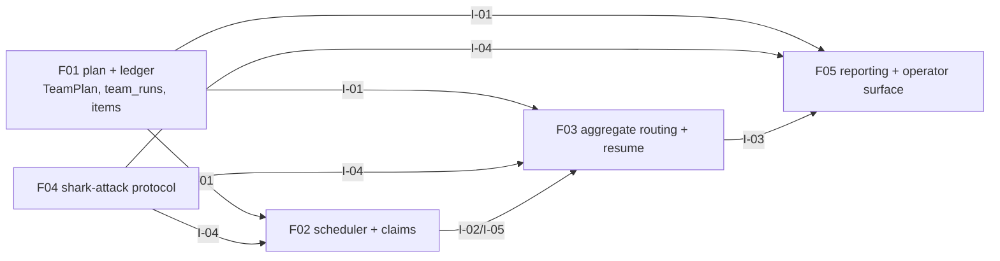

# E38-F01 Team Plan and Durable Ledger — Feature Research Report

**Scan date:** 2026-07-13
**Scope:** Existing implementation and feasibility for a read-only epic/feature
team plan plus the durable run/item ledger required by E38.
**Source context:** [E38 epic research](../research.md), [E38 PRD](../epic.md),
[feature description](./feature.md), [architecture contract](../architecture.md),
and sibling feature descriptions F02–F05.

## Executive recommendation

Build F01 as an extension-first domain capability in a new `internal/team`
package. Reuse the existing entity repositories, `CascadeService`, relationship
and task dependency reads, route-based workflow metadata, and the canonical
`next` prompt/action resolution seam. Add only the team-specific planner,
normalized ledger models/repository, schema migration, and service interfaces
needed by F02/F03/F05.

The plan operation must be read-only: it may inspect entities, dependencies,
workflow routing, claims, and host capability facts, but must not claim, mutate
status, create notes, or dispatch a worker. Start/resume persistence belongs in
the same domain contract but is consumed by F02/F03; it must write the complete
plan before the first child claim. Do not extend `RunController` into a team
engine and do not duplicate prompt assembly in team code.

## 1. Existing implementations to extend

### 1.1 Child discovery and current dispatchability

`internal/services/cascade_service.go:18-76,99-175` already defines the narrow
child shape (`CascadeChild`) and read-only `DescribeDispatchableChildren` service.
For a feature it lists tasks by feature key through `TaskRepository`; for an
epic it resolves the epic ID and lists features. It filters terminal children
through the configured workflow service and preserves repository ordering.
`internal/services/cascade_service.go:194-204` also checks task dependencies
before treating a task as ready. This is the best starting adapter for plan
membership, but it is not sufficient by itself: it returns only currently
dispatchable children, not every eligible/excluded child, dependency edges,
waves, claim conflicts, or a stable snapshot.

The CLI seam is `internal/cli/commands/cascade.go:1-27`, and
`internal/cli/commands/next.go:272-411` consumes it during single-step
resolution. `next.go:418-487` deliberately selects the first dispatchable
child and can auto-advance a parent when all children are terminal. F01 should
factor or wrap the underlying read logic at the service boundary rather than
call the Cobra command or reuse the first-child behavior as a planner.

### 1.2 Entity repositories and models

The existing aggregate hierarchy is persisted in `epics`, `features`, and
`tasks` (`internal/db/db.go:115-215`). Reusable query surfaces include:

- `internal/repository/epic/repository.go` — epic lookup by key.
- `internal/repository/feature/repository.go:362-420` — feature listing by
  epic and general feature lookup.
- `internal/repository/task/repository.go:578-622` — task listing by feature,
  feature key, and epic.
- `internal/services/task_query_service.go:13-18,39-169` — a service-level
  task query abstraction suitable for injected planner dependencies.
- `internal/models/task.go:11-40` — task status, agent type, execution order,
  file metadata, and legacy JSON `DependsOn` field.
- `internal/models/entity_relationship.go:8-75` — polymorphic relationships,
  including `depends_on` and `blocks` across entity types.

The planner should use canonical keys and typed entity pairs, snapshot child
identity/type/status and dependency keys, and preserve deterministic ordering.
It should not add team metadata to epic/feature/task rows.

### 1.3 Dependency reads and cycle detection

There are two existing dependency representations. Task-level dependency
queries are exposed by `CascadeTaskRepo` (`cascade_service.go:38-43`) and task
repositories; the legacy model stores JSON in `tasks.depends_on`. The newer
polymorphic relationship path is `internal/services/entity_relationship_service.go:170-256`
and `internal/repository/entityrel/repository.go:128-...`, with cycle-aware
`depends_on`/`blocks` traversal across entity types. The standalone
`internal/dependency/detector.go:13-191` provides in-memory DFS and chain
traversal.

F01 should define one planner-facing dependency interface and normalize these
sources behind it. It must explicitly detect missing references and cycles in
the plan snapshot. It must not silently mix the two stores or infer completion
from a hardcoded status; the existing `CascadeService` currently checks
`completed`/`archived` directly at `cascade_service.go:194-204`, which is a
known seam to revisit or isolate for the configured workflow outcome contract.

### 1.4 Workflow-resolved worker metadata

Route-based workflow steps already contain the required metadata in
`internal/config/workflow/schema.go:106-212`: responsibility, `AgentTypes`,
action, agent, provider, model, effort, skills, prompt, semantic `Outcomes`,
terminal/parking flags, and aggregation fields. The legacy action path retains
the same routing fields in `internal/config/action/orchestrator.go:13-105` and
renders templates at `orchestrator.go:207-232`.

The stable wire contract is `NextResponse` in
`internal/cli/commands/next.go:104-149`. It includes entity identity/status,
action, agent type, provider, model, effort, fully rendered prompt, resolved
cascade trail, and unresolved placeholders. `resolveNext` uses the same
transitioner, placeholder generator, action service, and prompt assembly path
as `run` (`next.go:289-411`). F01 should extract a service-level
dispatch-step builder from this seam, or expose a narrow equivalent, so the
planner records resolved worker metadata and a hash without rebuilding prompts.
The plan may store bounded metadata, but must not persist prompts or secrets.

### 1.5 Claims, leases, and session journaling

The current lease model is reusable as the child ownership primitive:

- `internal/models/entity_claim.go:8-25` defines entity type/key, claimant,
  session, heartbeat, progress, and note.
- `internal/repository/claim/claim_repository.go:31-138` provides atomic
  insert, unique `(entity_type, entity_key)` protection, session-safe release,
  renewal, and TTL reclamation; `:141-160` lists active claims.
- `internal/services/claim_service.go:18-71,220-260` owns TTL policy,
  claimability, heartbeat, and optional work-session integration.
- `internal/db/db.go:977-982,1257-1294` installs the additive
  `entity_claims` table and indexes.

`internal/models/work_session.go` and
`internal/repository/worksession/repository.go:35-92` provide entity-generic
session open/close journaling. Claim-service session writes are explicitly
best-effort telemetry (`claim_service.go:35-42,60-71`), so F01 must not treat
`work_sessions` as the authoritative plan ledger. The new ledger should link
to claim/session IDs and leave lease ownership with the coordinator.

### 1.6 Existing single-entity execution and dispatch

`internal/runner/controller.go:98-220` defines excellent injected seams:
`EntityTransitioner`, `PlaceholderGenerator`, `PromptAssembler`, workflow/action
service, and provider-keyed `AgentDispatcher`. Its `Run` loop at
`controller.go:235-245` is intentionally single-entity. The CLI wiring in
`internal/cli/commands/run.go:139-223` claims one root, builds per-entity
adapters, dispatchers, optional worktree, and controller, then releases the
root lease.

`internal/runner/dispatcher.go:29-118` supplies the reusable dispatch input and
structured process result (exit code, stdout/stderr, duration, command). F01
should depend on these interfaces through a planner/ledger contract but leave
actual scheduling and worker execution to F02. The existing safety contract
also disallows worker-owned status commands (`dispatcher.go:20-26`), matching
the E38 parent-ownership requirement.

## 2. Integration points

| Surface | Existing path | F01 integration | Ownership |
|---|---|---|---|
| Root/child discovery | `internal/services/cascade_service.go`; epic/feature/task repositories | Read all direct children, statuses, ordering, and types; add a complete-plan adapter | F01 planner |
| Dependencies | `internal/services/entity_relationship_service.go`; task repository; `internal/dependency/detector.go` | Normalize edges, validate missing nodes/cycles, calculate deterministic waves | F01 planner; F02 gates dispatch |
| Workflow metadata | `internal/config/workflow/schema.go`; action service; `next.go` | Resolve responsibility/agent/provider/model/effort/skills/action and snapshot hash inputs | F01 adapter; F02 dispatch |
| Prompt contract | `internal/cli/commands/next.go:272-411`; runner prompt interfaces | Reuse/extract step builder; no prompt duplication or CLI recursion | Shared with `next` and F02 |
| Claims | `internal/services/claim_service.go`; `repository/claim` | Read claim conflicts during preview; persist claim/session links on start/resume | F02 owns mutations |
| Sessions | `internal/repository/worksession`; `models.WorkSession` | Link telemetry IDs only; do not replace ledger | F02/observability |
| Database | `internal/db/db.go:436-465,977-1010,1257-1294` | Add idempotent migration for `team_runs` and `team_run_items`, indexes, constraints | F01 persistence |
| Service wiring | `internal/cli/services_global.go`, `internal/cli/service_accessors.go`, `cmd/server/services.go` | Expose injected team planner/ledger service to future CLI/API surfaces | F01/F05 wiring |
| CLI/API | `shark next` and `shark run` existing contracts | Add future team commands through thin wrappers; no changes to ordinary behavior | F05 consumes |

## 3. Inter-feature dependency map

F01 is execution order 1 and has no prerequisites. It produces I-01, the
shared `TeamPlan`/`TeamRun`/`TeamRunItem` contract consumed by F02, F03, and
F05. F04 is a peer protocol feature that depends on F01 and supplies I-04 to
F02/F03/F05; it is not required to calculate the core plan.

The shared contract must therefore be stable enough for scheduler and resume
work, but F01 should not implement their behavior. In particular, F01 owns
plan membership, dependency waves, resolved metadata, selected mode/limit,
plan hash, and durable item lifecycle primitives; F02 owns claims/dispatch;
F03 owns aggregate semantic routing and reconciliation; F05 owns formatting.

## 4. Extension-vs-new analysis

| Component | Extend existing? | Decision and rationale |
|---|---:|---|
| Child enumeration | Yes | Extend `CascadeService` or extract a broader read interface; its current repository/workflow wiring is the canonical hierarchy source. Keep first-child cascade behavior unchanged. |
| Dependency access | Yes, behind adapter | Reuse task and relationship repositories plus existing DFS; normalize to one planner graph and fix workflow-success interpretation at the adapter boundary. |
| Workflow/worker resolution | Yes, extract seam | Reuse `next`/`run` adapters and action service. A second renderer would drift from the canonical prompt contract. |
| Claim conflict inspection | Yes | Reuse `ClaimService.IsClaimable`/`Get`; preview must report conflicts without claiming. Mutation remains F02. |
| Work sessions | Yes, link only | Keep current session journal for telemetry and attach IDs; it lacks plan membership, attempts, skip reasons, and aggregate lifecycle. |
| Team domain models | No | Add `internal/team` models for plan, item, run, capability facts, and result. Existing entity models should not absorb orchestration state. |
| Team planner | No | New read-only service because no current component returns all children, waves, capability exclusions, and stable hashes. |
| Durable ledger tables/repository | No | Add normalized `team_runs` and `team_run_items`; claims/work sessions cannot prove exactly-once plan membership or resume state. |
| Schema migration | No | Follow `internal/db/db.go` additive/idempotent migration pattern and bump `CurrentSchemaVersion`; never alter/delete the source database. |
| Scheduler/worker dispatch | No in F01 | Leave to F02; depend on the F01 contract and existing runner interfaces. |
| Aggregate routing/resume | No in F01 | Leave to F03; F01 provides persisted states and attempt/idempotency fields. |
| Operator commands/output | No in F01 | Leave to F05; expose service DTOs, not presentation formatting. |

## 5. Proposed durable shape and invariants

Use the architecture contract’s normalized `team_runs` and `team_run_items`
shape ([`../architecture.md`](../architecture.md), §3). The minimum invariants
for F01 are:

1. `team_runs` identifies root type/key, lifecycle status, actual execution
   mode, concurrency limit, stable `plan_hash`, root session, timestamps, and
   aggregate/next-action fields.
2. `team_run_items` has a unique `(team_run_id, child_key)` membership,
   typed child identity, wave/order, dependency snapshot, resolved worker
   metadata, item status, claim/worker session links, outcome/skip reason,
   bounded evidence, attempt, and timestamps.
3. Preview writes no ledger row and performs no claim, transition, note, or
   file mutation.
4. Start writes the complete run and all items transactionally before the first
   claim. Resume never dispatches an item already terminal for that run.
5. A changed child/dependency/workflow snapshot changes the hash and produces
   an explicit refresh-required result; it is never silently merged.
6. SQLite/Turso writes are short and retry known busy/locked failures using the
   repository’s existing database conventions. The repository owns SQL; the
   service owns transaction/idempotency semantics.
7. Prompts, credentials, and full process output are excluded from the ledger;
   evidence fields contain bounded summaries and artifact paths only.

## 6. Recommended implementation approach

1. Define `internal/team` consumer-side interfaces for root/child discovery,
   dependency graph reads, dispatch-step resolution, claim diagnostics,
   capability facts, and ledger persistence. Use constructor injection and
   context-first methods, matching the service rules in
   `.claude/rules/services/service-design.md`.
2. Extract a reusable dispatch-step resolver from `next.go`/`run.go` that can
   return structured metadata without CLI output or mutation. Keep `next` as a
   compatibility caller and add focused tests for parity.
3. Expand cascade read behavior into a complete planner input: include terminal
   and excluded children, dependency edges, claim conflicts, workflow-resolved
   metadata, deterministic topological waves, execution mode/limit, and a
   canonical serialization for hashing. Sort explicitly by wave, execution
   order, and key where repository order is not a contract.
4. Add `team_runs`/`team_run_items` through an idempotent `internal/db` migration
   and a pure SQL repository. Use a transaction for plan snapshot plus item
   inserts; enforce the unique membership constraint in SQLite as well as in
   service checks.
5. Return the architecture §4.2 domain contract to F02/F03/F05. Keep plan
   generation read-only and put claims, dispatch, item result updates, and
   aggregate routing behind the later feature boundaries.
6. Test at the right layers: planner/service tests use mocks; repository tests
   use the real test database; migration tests prove fresh, upgrade, rerun,
   unique membership, and rollback behavior. Verify normal `shark next` and
   `shark run` behavior remains unchanged.

### Risks and unresolved questions for architect

- The repository currently has both `tasks.depends_on` and polymorphic
  `entity_relationships`; the specification must select the authoritative
  planner source and define migration/compatibility behavior.
- `CascadeService.dependenciesSatisfied` hardcodes `completed`/`archived`,
  while route-based workflows expose semantic outcomes. F01 should not copy
  this assumption; architect/specify must decide the configured-success
  resolver shared with F02/F03.
- Resource/file ownership facts are not visible in the current child model.
  F01 can record capability/resource exclusions supplied by the host, but F02
  needs a concrete policy for unknown overlap and sequential fallback.
- The plan hash must define canonical serialization and which workflow/prompt
  fields are included, without hashing volatile rendered prompts or secrets.
- Claim lookup is currently entity-level and TTL-based; preview conflict data
  is necessarily a point-in-time diagnostic and must not be treated as a
  reservation.

## Exit-gate checklist

- [x] Existing related code identified with file paths.
- [x] Integration points across services, repositories, CLI, workflow, claims,
      sessions, and database documented.
- [x] Dependency map within E38 documented, including I-01 consumers.
- [x] Extension-vs-new decision recorded for each component.
- [x] Actionable implementation recommendation and architect risks provided.
- [x] No Shark workflow-state transition command run against E38-F01.
