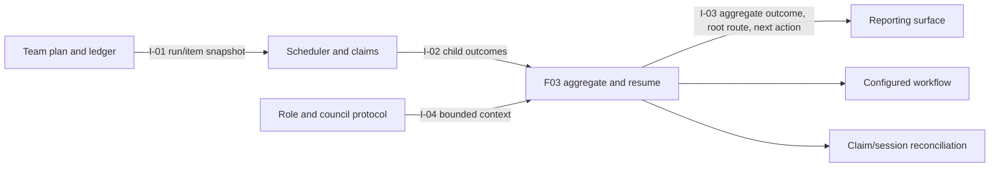

# E38-F03 Research Report: Aggregate Routing and Resume

**Scan date:** 2026-07-13
**Repository:** `/home/jwwel/projects/shark-task-manager`
**Feature:** Aggregate Routing and Resume
**Depth:** Deep tactical codebase and dependency analysis

## Executive recommendation

Implement F03 as a new aggregate/resume coordinator in `internal/team`, using
the F01 `TeamRun`/`TeamRunItem` ledger and the per-child outcomes produced by
F02. Extend existing workflow outcome resolution, typed entity transition
services, claim/session inspection, and resume-context readers. Do not turn the
existing `ResumeService` into a team ledger, and do not extend
`runner.RunController`: it is intentionally a single-entity state machine.

The coordinator should:

1. Load one active run and its immutable plan/item snapshot from F01.
2. Reconcile claimed/running items against the current claim lease and ledger
   state before deciding what is resumable.
3. Treat completed terminal ledger items as exactly-once for that run; dispatch
   only unfinished, eligible items whose dependencies have satisfied the
   configured success semantics.
4. Aggregate every planned item, including failed, blocked, paused, cancelled,
   skipped, provider, and partial outcomes, without collapsing partial work into
   success.
5. Resolve the root's configured semantic outcome and invoke the existing typed
   transition adapter. Stop at a human/quality/pause boundary and expose the
   exact next action.
6. Return a stable `TeamRunResult` for F05 and durable bounded council pointers
   from F04; never persist prompts, credentials, or unrestricted worker output.

## 1. Scope and strategic context

The E38 PRD makes Shark workflow configuration, prompt assembly, claims, and
outcome routing authoritative. Workers perform scoped craft while the parent
coordinator owns the root lease and root transitions (`docs/plan/E38-shark-attack-team-orchestration/epic.md:12-55,130-158`).
F03 owns the aggregate and re-entry boundary only; F01 owns plan membership and
ledger persistence, F02 owns child scheduling/claims/dispatch, F04 owns council
communication, and F05 owns operator presentation.

The feature consumes I-01 from F01, I-02 from F02, and I-04 from F04; it
produces I-03 for F05 (`docs/plan/E38-shark-attack-team-orchestration/E38-interaction-map.md:8-20`).
The shared shape is architecture §4.4: aggregate outcome, configured target or
paused boundary, root transition result, next action, and complete per-item
diagnostics (`docs/plan/E38-shark-attack-team-orchestration/architecture.md:309-355`).

## 2. Existing implementations to extend

### 2.1 F01 durable team-run contract

F01's report and architecture define the required normalized `team_runs` and
`team_run_items` records. The relevant fields already cover F03's inputs:
run status, plan hash, root session, aggregate outcome, next action, item status,
dependency snapshot, claim/worker session IDs, outcome, skip reason, evidence,
and attempt (`docs/plan/E38-shark-attack-team-orchestration/architecture.md:238-296`).
F03 should consume a repository interface over this contract and add only
aggregate/reconciliation operations; it must not duplicate the schema or make
claims the source of plan membership.

### 2.2 Per-child result contract from F02

F02's research establishes that the scheduler reuses `ClaimService`, the
single-worker dispatcher, and the F01 ledger, and emits semantic/process
outcomes, evidence, skip reasons, dependency state, timestamps, and session
links. F03 should aggregate these persisted results rather than infer status
from current entity counts or rerun completed workers
(`docs/plan/E38-shark-attack-team-orchestration/E38-F02-scheduler-and-claims/research-report.md`,
sections “Executive recommendation” and “Cross-feature interactions”).

### 2.3 Configured semantic workflow routing

The route-based workflow `Step` already carries `Responsibility`, `AgentTypes`,
`Action`, `Agent`, provider/model/effort, `Outcomes`, `Parking`, and `Terminal`
metadata (`internal/config/workflow/schema.go:106-212`). The workflow service
exposes `GetOutcomes`, `GetValidOutcomes`, and `Release`, which resolves a
semantic outcome to the configured target and rejects undefined outcomes
(`internal/workflow/service.go:655-711`). `internal/config/workflow/steps.go:47-66`
provides the lower-level case-insensitive `ResolveOutcome` implementation.

F03 should use these named semantic routes for root aggregation. It must not
hard-code `completed`, select the first transition positionally, or treat a
terminal child count as proof that the root passed. `ValidateCoreOutcomes` and
workflow target validation (`internal/config/workflow/steps.go:130-170`) are
useful configuration guards, but F03 still needs explicit handling for custom
outcomes, parking steps, quality gates, and unavailable routes.

### 2.4 Typed root transition services

`internal/services/entity_service.go:153-316` owns generic entity transition
validation, status normalization, history recording, and forced-transition
rules. `GetNextStatus` and `GetNextStatusForEntity` expose current status,
available transitions, terminal state, and configured outcomes
(`internal/services/entity_service.go:335-415`). `EpicService`,
`FeatureService`, and `TaskService` delegate their typed `TransitionStatus` and
`GetNextStatus` methods to this service; the per-type adapters used by
`internal/cli/commands/run.go` are the correct injection boundary.

F03 should define a consumer-side root transition interface equivalent to the
existing `runner.EntityTransitioner`, carrying the aggregate outcome as a
reason/context field while preserving normal validation and history. The
coordinator should never write entity tables directly.

### 2.5 Existing resume context aggregation

`internal/services/resume_service.go:12-144` defines injected repository
interfaces and context DTOs for entity resume. `GetEpicResume` and
`GetFeatureResume` collect current entity context, notes, child summaries, and
status rollups (`resume_service.go:204-314`); `GetTaskResume` additionally reads
work sessions, session statistics, active session, dependencies, and completion
metadata (`resume_service.go:317-393`). The CLI wrappers are thin:
`internal/cli/commands/epic_resume.go:36-56`,
`feature_resume.go:36-56`, and `task_resume.go:53-88`.

These are valuable conventions for context-first output and graceful optional
data, but they do not know team-run IDs, plan hashes, attempts, item leases,
dependency eligibility, or aggregate routing. Extend by composing or adapting
their repository reads where useful; do not overload their entity-specific DTOs
with team execution state.

### 2.6 Claims, leases, and session reconciliation

`ClaimService` owns TTL policy, reclaim-before-claim, conflict diagnostics,
heartbeat, and session-scoped release (`internal/services/claim_service.go:18-96,158-265`).
`ClaimService.Release` accepts the claim session ID and outcome, preventing a
stale worker from releasing a reissued lease. Claim-created work sessions are
best-effort telemetry and are closed on release; they are not the durable team
ledger (`internal/services/claim_service.go:184-221`). The underlying unique
lease and session-safe operations are in
`internal/repository/claim/claim_repository.go:31-160`, with schema support in
`internal/db/db.go:436-465,1257-1294`.

F03 should call `Get`, `IsClaimable`, and bounded expiry reconciliation through
an injected interface, then record an explicit item state such as
`resume_eligible`, `claim_conflict`, `stale_attempt`, or `refresh_required`.
It must never force-steal a live claim as part of ordinary resume.

### 2.7 Single-worker dispatch and ownership guardrails

`internal/runner/controller.go:48-220,238-245` defines `RunResult`, stage logs,
typed transition seams, prompt assembly, and a loop over one entity. Its
single-entity contract is reusable as an adapter, not as the multi-item
aggregate engine. `internal/runner/dispatcher.go:20-118` provides the shared
`AgentDispatcher`, structured process result, provider/tool errors, and the
default disallowed status-transition commands. The worker ownership preamble
and prompt assembly helpers remain in `internal/cli/commands/next.go:616-696`.

F03 should consume F02's persisted result and dispatch metadata. It should not
invoke the CLI recursively, re-render prompts, or give workers root-transition
authority.

### 2.8 Child hierarchy and dependency sources

`internal/services/cascade_service.go:20-204` is the current read-only child
discovery seam for feature tasks and epic features. `internal/cli/commands/next.go:272-527`
uses it to select one child and auto-advance a parent; that behavior is not a
complete aggregate result. Entity repositories provide feature children and
task lists (`internal/repository/feature/repository.go:361-420`,
`internal/repository/task/repository.go:577-653`). Task dependency reads and
cycle validation combine legacy `tasks.depends_on` JSON with
`entity_relationships` (`internal/repository/task/dependency.go:21-190,301-390`).

F03 should consume the normalized dependency snapshot from F01/F02 rather than
recompute a second graph. If it must validate an item during resume, use the
same dependency adapter and configured-success resolver used by the scheduler.

### 2.9 Database and migration conventions

`internal/db/db.go:396-492,604-650` applies additive migrations and records the
schema version; the current version is 27. F03 should use F01's ledger tables,
short repository transactions, and idempotent updates. No new tables are needed
for F03 itself unless F01's contract is missing a narrowly defined reconciliation
field; do not add team state to `entity_claims`, `work_sessions`, or entity rows.

### 2.10 F04 council/resume pointers

F04's contract makes decisions, handoffs, unresolved escalations, resolutions,
and inbox state durable under `docs/council/`, while excluding prompts,
credentials, and unrestricted output (`E38-F04/.../spec.md:REQ-F-003..REQ-F-012`).
F03 should consume bounded paths/metadata and emit a resume pointer when an
unresolved escalation or council-review boundary prevents routing. It should
not implement the file protocol or choose a human destination.

## 3. Integration and dependency map

| Concern | Existing path/contract | F03 use | Gap/new seam |
|---|---|---|---|
| Team run/item state | F01 `team_runs`, `team_run_items`; architecture §3 | Load active run, update lifecycle/attempts, persist aggregate and next action | Add F03-facing ledger methods for atomic reconciliation and idempotent aggregate finalization |
| Per-child outcomes | F02 I-02 / architecture §4.4 | Consume all item outcomes and evidence | Define explicit precedence/state table for pass, fail, blocked, paused, cancelled, skipped, partial, provider, and stale states |
| Root semantic routing | `workflow.Service.Release`, `GetOutcomes`; `Step.Outcomes` | Map aggregate semantic result to configured root target | New aggregate policy and typed transition adapter; no hardcoded terminal status |
| Root transition/history | `EntityService`, `EpicService`, `FeatureService`, `TaskService` | Execute exactly one parent-owned root transition | Carry aggregate outcome/reason without bypassing normal validation/history |
| Resume eligibility | F01 plan hash/wave/item status; F02 claim/session links | Reconcile and select unfinished eligible items | New run-resume coordinator; current `ResumeService` is entity context only |
| Claims/leases | `ClaimService`, claim repository | Detect active/expired/reissued claims and preserve session safety | Adapter for reconciliation diagnostics; no force-steal |
| Sessions/telemetry | `work_sessions`, `ResumeService` session reads | Include bounded session/attempt diagnostics | Work sessions remain non-authoritative telemetry |
| Dependencies | F01/F02 normalized graph; task/relationship repositories | Confirm prerequisite outcomes before re-dispatch | Reuse graph and semantic-success policy; reject plan drift |
| Council context | F04 I-04 | Attach unresolved escalation/handoff pointers | Consume typed metadata; no second communication store |
| Operator contract | F05 I-03 / architecture §4.6 | Return aggregate result and exact next action | F05 owns CLI formatting; JSON fields must remain stable |
| Ordinary execution | `shark next`, `shark run`, `RunController` | Preserve behavior when no team run exists | Compatibility tests; no team-only side effects in ordinary paths |

### Cross-feature flow

## 4. Extension versus new analysis

| Component | Extend/reuse? | Decision |
|---|---:|---|
| F01 ledger repository | Yes | Add narrow load/update/reconcile/finalize methods; preserve F01 schema and unique item membership. |
| F02 item result contract | Yes | Consume persisted results; do not recalculate worker process outcomes from stdout or current statuses. |
| Workflow semantic routing | Yes | Reuse `workflow.Service.Release`, `GetOutcomes`, normalization, and configured selectors. |
| Entity transition services | Yes | Reuse typed adapters around `EntityService.TransitionStatus`; keep history, validation, and post-hooks centralized. |
| `ResumeService` | Partially | Reuse entity/context/note/session repository patterns; add a separate team-run resume DTO and coordinator. |
| `ClaimService` | Yes | Reuse `Get`, `IsClaimable`, TTL/reclaim, and session-safe release semantics through interfaces. |
| `work_sessions` | Link only | Use for telemetry and diagnostics; never use it to infer plan completion or membership. |
| Cascade/dependency reads | Yes, via F01/F02 adapters | Reuse normalized child/dependency snapshots; avoid a third dependency interpretation. |
| `RunController` | No | Keep single-entity. Share dispatcher/transition interfaces only. |
| Aggregate policy/state machine | No | New `internal/team` logic is required to account for all item outcomes and precedence. |
| Resume coordinator | No | New logic is required for plan-hash checks, stale attempts, completed-item idempotency, and next-wave eligibility. |
| CLI/API output | No in F03 | Return domain DTOs for F05; do not add Cobra formatting or a second API contract here. |
| Database schema | No additional schema beyond F01 | F01's normalized ledger should support F03; add a column only if an explicit reconciliation invariant cannot be represented. |

## 5. Recommended aggregate and resume behavior

### 5.1 Aggregate rules

1. Load every planned item, including excluded/skipped items and items from
   prior attempts. Missing item rows are a ledger integrity error.
2. A configured success result requires every eligible item and required gate to
   satisfy the configured success semantic. A partial pass is not root success.
3. Preserve distinct aggregate states: `completed`, `failed`, `blocked`,
   `paused`, `cancelled`, `partial`, `provider_unavailable`, and
   `refresh_required` (exact names should be finalized in the F03 spec).
4. Apply an explicit precedence table, for example: configuration/plan drift
   and unresolved routing errors stop first; pause/human/quality boundaries
   remain paused; failed/blocked required work prevents pass; skipped work is
   success only when its reason is an allowed configured exclusion.
5. Resolve the selected semantic outcome against the root's current workflow
   step. If no configured route exists, persist the aggregate and a
   `routing_unavailable` next action without guessing a status.
6. Transition the root once, with the aggregate outcome and run ID in the
   reason/history context, and make the transition result idempotent on retry.

### 5.2 Resume rules

1. Load the active run by root and reject ambiguous concurrent active runs
   unless the ledger explicitly identifies one resumable run.
2. Recompute the current plan fingerprint without mutating. A hash mismatch
   returns `refresh_required`; it must not silently merge changed children,
   dependencies, or workflow routes into the old run.
3. Treat ledger-terminal items as complete for that run. Never dispatch them
   again or recreate their notes/evidence implicitly.
4. For claimed/running items, compare the stored session ID with the current
   claim. An expired/missing lease becomes a reconciled unfinished attempt;
   a different live session becomes a visible claim conflict.
5. Dispatch only unfinished items whose prerequisites have the same configured
   success semantics expected by F02. Dependents of failed, blocked, paused,
   or cancelled prerequisites become skipped/blocked with a durable reason.
6. Resume preserves attempt numbers and creates a new attempt only through an
   explicit retry/reconciliation operation. Claim release remains session-
   scoped.
7. Return the aggregate result even when no child is dispatched, so operators
   can distinguish completed, paused, blocked, conflict, and drift outcomes.

## 6. Risks and questions for architect/specify

| Risk/question | Impact | Recommendation |
|---|---|---|
| Multiple child outcomes can conflict | High | Specify a deterministic precedence table and test every vocabulary member. |
| Route-based workflow may define custom outcomes or parking steps | High | Resolve by semantic name through `Release`; stop visibly when undefined. |
| Current entity status may lag ledger outcome | High | Ledger item result is execution evidence; entity transition is separately validated and recorded. |
| Plan changes during interruption | High | Hash mismatch requires refresh/new run; never merge by key alone. |
| Live claim reissued after worker loss | High | Compare session IDs and use session-scoped release only. |
| Legacy and polymorphic dependency stores differ | High | Consume the F01/F02 normalized graph and one configured-success policy. |
| Existing `ResumeService` is entity-specific | Medium | Compose its context readers; keep team DTOs separate. |
| Work-session writes are best effort | Medium | Treat them as diagnostics only; ledger writes are authoritative and transactional. |
| Council escalation policy can be absent | Medium | Preserve F04's pause plus council-review fallback; do not select a human target. |
| Ordinary `next`/`run` regression | High | Add compatibility tests proving no team run means unchanged single-worker behavior. |

## 7. Recommended implementation sequence

1. Specify F03's aggregate vocabulary, precedence table, root-route contract,
   resume state machine, idempotency keys, and next-action DTO against the F01
   ledger schema.
2. Add consumer-side interfaces in `internal/team` for ledger load/update,
   workflow outcome resolution, root transition, claim reconciliation, and F04
   context pointers. Use constructor injection and `context.Context` first.
3. Implement pure aggregate classification and route selection with table-
   driven tests, including custom outcomes, missing routes, gates, partial
   results, and all item states.
4. Implement resume reconciliation as a read/decision phase followed by F02's
   dispatch handoff. Persist each decision idempotently and never wrap worker
   execution in a long database transaction.
5. Add root transition finalization through typed entity services, recording the
   run ID, aggregate semantic outcome, and exact configured target in history.
6. Add contract fixtures for I-02, I-03, and I-04; repository tests use the real
   SQLite test database only for ledger persistence, while team/service/CLI
   tests use mocks per `.claude/rules/testing/architecture.md`.
7. Verify interruption/resume, duplicate-completion protection, stale/live
   claims, dependency suppression, pause/quality boundaries, route drift,
   sequential fallback, and ordinary `shark next`/`shark run` compatibility.

## 8. Exit-gate assessment

- [x] Existing related code identified with file paths: F01 ledger, F02
  outcomes, workflow routing, typed transitions, resume context, claims,
  sessions, runner/dispatcher, dependencies, database, CLI, and F04 council.
- [x] Integration points documented across services, repositories, CLI,
  workflow, claims/sessions, persistence, and sibling features.
- [x] Inter-feature dependency map documented for I-01, I-02, I-03, and I-04.
- [x] Extension-versus-new decisions recorded for each component.
- [x] Recommended implementation approach is actionable for architecture and
  specification, with risks and unresolved decisions surfaced.
- [x] No Shark workflow-state transition command was run against E38-F03.
