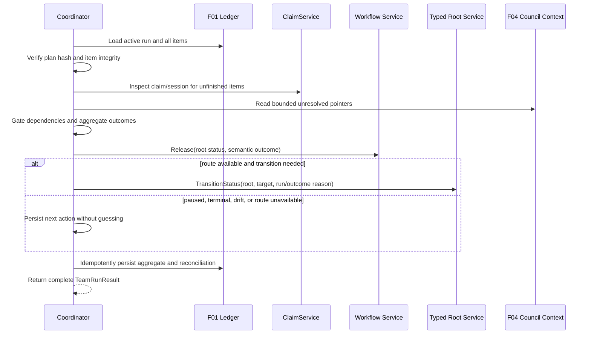

# Aggregate Routing and Resume

This specification is incremental over the E38 epic. See the epic PRD for
business context, goals, ownership boundaries, and success criteria: §2–§4.
See the parent architecture for system decisions, especially ADR-002,
ADR-005, ADR-006, §3.3, §4.2, §4.4, and §4.5. Feature research is in
[`research-report.md`](research-report.md).

## Requirements

### Functional requirements

| ID | Requirement | Traceability |
|---|---|---|
| REQ-F-001 | The aggregate coordinator shall load the complete persisted F01 run and item snapshot, including excluded and skipped items, and shall reject missing membership rows as a ledger-integrity error. It shall consume F02’s persisted item outcomes rather than infer completion from current entity statuses or child counts. | Epic PRD §3; parent architecture §3.3, §4.4; I-01, I-02 |
| REQ-F-002 | The coordinator shall aggregate every planned item into one semantic result. It shall preserve distinct `completed`, `failed`, `blocked`, `paused`, `cancelled`, `partial`, `provider_unavailable`, `refresh_required`, and `routing_unavailable` states, plus configured workflow extensions, without collapsing partial or provider failure into success. | Epic PRD §2 failure containment and diagnosability; parent architecture §4.4; I-03 |
| REQ-F-003 | The coordinator shall apply deterministic precedence: plan or configuration drift and missing ledger integrity stop with `refresh_required`; an unresolved council or human/quality boundary yields `paused`; required failed or provider-unavailable work yields `failed`; required blocked or unsatisfied dependencies yield `blocked`; cancellation without a complete successful set yields `cancelled`; excluded/skipped work allowed by the plan may complete, otherwise the result is `partial`; only all required eligible items with configured success outcomes may produce `completed`. | Parent architecture ADR-006; I-02 |
| REQ-F-004 | For a non-terminal root step, the coordinator shall resolve the aggregate semantic result through `workflow.Service.Release(fromStatus, outcome)` and shall invoke exactly one injected typed root transition adapter with the resolved target and a bounded reason containing the run ID and aggregate outcome. It shall never select a transition positionally, hard-code a target such as `completed`, or update entity tables directly. | Epic PRD §3 workflow boundary; parent architecture ADR-006; X-02 |
| REQ-F-005 | If the root step is terminal, parking, missing, or lacks the selected outcome route, the coordinator shall persist the aggregate and return `routing_unavailable` or the configured paused boundary with an exact next action. It shall not guess a target or force a transition. | Parent architecture §4.4; X-02 |
| REQ-F-006 | Resume shall identify one active run for the requested root. It shall reject ambiguous active runs, preserve the selected run ID, and return a complete result when no item is dispatchable. | Epic PRD §3 resume boundary; I-01 |
| REQ-F-007 | Before dispatch selection, resume shall recompute the canonical plan fingerprint without mutation. A mismatch in children, dependencies, workflow metadata, execution mode, or concurrency shall return `refresh_required` and shall not merge the changed snapshot into the existing run. | Parent architecture §3.3; ADR-002; I-01 |
| REQ-F-008 | Resume shall treat a terminal ledger item as complete for that run and shall never redispatch it implicitly. It shall preserve attempt, evidence, outcome, and session history; a retry requires an explicit new attempt and cannot overwrite another attempt’s terminal result. | Epic PRD §2 resume safety; parent architecture §3.3 |
| REQ-F-009 | Resume shall reconcile claimed or running items by comparing the ledger claim/session ID with the current claim. An expired or missing lease becomes a visible unfinished/stale-attempt diagnostic; a different live session becomes `claim_conflict`. Normal resume shall never force-steal a live claim or release a claim without its session ID. | Epic PRD §4 ownership; parent architecture ADR-005; `internal/services/claim_service.go` |
| REQ-F-010 | Resume shall select only unfinished items whose dependencies satisfy the same configured-success semantics used by F02. Dependents of failed, blocked, paused, cancelled, or unsatisfied prerequisites shall receive a durable blocked/skipped reason and shall not dispatch. | Epic PRD §2 dependency safety; I-02 |
| REQ-F-011 | The coordinator shall consume bounded F04 council decisions, handoffs, unresolved escalations, and inbox pointers. An unresolved escalation or required review shall pause routing and expose the artifact path and next action without copying prompts, credentials, or unrestricted worker output. | Epic PRD §2 council contract; parent architecture §4.5; I-04 |
| REQ-F-012 | The returned `TeamRunResult` shall include root identity, run status, execution mode, limit, aggregate outcome, configured target or paused boundary, root transition result, every item result, counts, claim and worker sessions, evidence references, and one actionable next action. F05 owns presentation and JSON/CLI formatting. | Parent architecture §4.2, §4.4, §4.6; I-03 |
| REQ-F-013 | Aggregate finalization shall be idempotent. Replaying the same run result shall not create a second root transition, duplicate history entry, duplicate council pointer, or change a terminal run to a different outcome. | Epic PRD §2 resume safety; parent architecture ADR-006 |

### Non-functional requirements

| ID | Requirement | Verification |
|---|---|---|
| REQ-NFR-001 | Aggregation and resume decisions shall be deterministic for the same ledger, claim snapshot, workflow configuration, and council metadata. Item diagnostics shall use stable ordering by wave, execution order, priority, and canonical child key. | `internal/team/aggregate_test.go`; `internal/team/resume_test.go` |
| REQ-NFR-002 | New coordinator dependencies shall be context-aware, constructor-injected interfaces. Team policy remains in `internal/team`; SQL remains in `internal/repository/teamrun`; typed root services remain behind an adapter. | `CLAUDE.md`; `.claude/rules/architecture.md`; `.claude/rules/services/service-design.md` |
| REQ-NFR-003 | Ledger reconciliation and finalization shall use short, idempotent repository transactions and existing SQLite/Turso busy-retry conventions. No transaction may remain open while reading workflow or council files or while dispatching a worker. | `internal/repository/teamrun/repository_test.go`; `.claude/rules/testing/architecture.md` |
| REQ-NFR-004 | Persisted evidence, reasons, telemetry fields, and resume pointers shall be bounded and secret-safe. They shall exclude rendered prompts, credentials, tokens, unrestricted stdout/stderr, and transcripts. | `internal/team/aggregate_test.go`; `tests/contracts/e38_interactions_test.go#TC-003` |
| REQ-NFR-005 | Root transitions shall retain existing workflow validation, status normalization, history recording, and idempotency through the typed service adapter. F03 shall not add a second workflow engine or claim store. | `internal/services/entity_service.go`; `internal/services/claim_service.go`; X-02 |
| REQ-NFR-006 | Resume reads shall be bounded by the persisted run’s item count and shall not rescan or replan unrelated roots. | `internal/team/resume_test.go` |

### Acceptance criteria

| ID | Given / when | Then | Test pointer |
|---|---|---|---|
| AC-F03-001 | A run contains all-success eligible items and allowed exclusions. | The result is `completed`, resolves the configured `pass` route, transitions the root once, and reports every item. | `internal/team/aggregate_test.go#TestAggregate_AllRequiredItemsPass` |
| AC-F03-002 | A run contains mixed success and partial, failed, blocked, cancelled, skipped, or provider outcomes. | The deterministic precedence returns the specified non-success result, preserves each item diagnostic, and never reports success from counts alone. | `internal/team/aggregate_test.go#TestAggregate_MixedOutcomes` |
| AC-F03-003 | The root route defines a custom outcome or a pause/quality boundary. | The coordinator resolves the configured semantic route or returns the exact paused boundary; it does not choose a positional or hard-coded status. | `internal/team/aggregate_test.go#TestAggregate_UsesConfiguredOutcomeRoute` |
| AC-F03-004 | The selected aggregate outcome is absent from the current root step, or the step is terminal/parking. | The run is durable, no root transition occurs, and the result contains `routing_unavailable` plus a next action naming the missing route or review boundary. | `internal/team/aggregate_test.go#TestAggregate_StopsWhenRouteUnavailable` |
| AC-F03-005 | A root has two active runs, or its ledger has a missing planned item. | Resume returns a typed ambiguity/integrity error and performs no claim, dispatch, transition, or mutation. | `internal/team/resume_test.go#TestResume_RejectsAmbiguousOrIncompleteRun` |
| AC-F03-006 | A child, dependency edge, workflow role, execution mode, or limit changes after the run is persisted. | Resume returns `refresh_required`, preserves the old snapshot, and does not dispatch or merge changed membership. | `internal/team/resume_test.go#TestResume_RejectsPlanDrift` |
| AC-F03-007 | A run has completed items plus expired, missing, live, and reissued claims. | Completed items are not redispatched; expired/missing claims become stale-attempt diagnostics; a different live session becomes a non-destructive claim conflict; no live claim is force-stolen. | `internal/team/resume_test.go#TestResume_ReconcilesClaimSessions` |
| AC-F03-008 | A dependent item has a failed, blocked, paused, cancelled, or unsatisfied prerequisite. | Resume records the exact dependency reason, leaves the dependent undispatched, and still returns unrelated ready items and the aggregate result. | `internal/team/resume_test.go#TestResume_GatesDependencies` |
| AC-F03-009 | F04 provides an unresolved escalation or required review pointer. | The coordinator preserves the bounded pointer, returns `paused`, and identifies council/review action without selecting a human destination. | `internal/team/aggregate_test.go#TestAggregate_PausesForCouncilEscalation` |
| AC-F03-010 | Finalization is retried after a successful root transition or after interruption. | The retry returns the same terminal result and creates no duplicate transition, history, item result, or council pointer. | `internal/team/aggregate_test.go#TestAggregate_FinalizationIsIdempotent` |
| AC-F03-011 | A result contains prompt text, a credential pattern, or oversized unrestricted output. | Validation rejects or reduces the value to a bounded safe summary; the result and ledger contain no sensitive content. | `internal/team/aggregate_test.go#TestAggregate_RejectsSensitiveEvidence` |
| AC-F03-012 | No team run exists for an ordinary root execution. | F03 performs no team-only reconciliation or transition and existing `shark next`/`shark run` behavior remains unchanged. | `internal/team/compatibility_test.go#TestTeamCoordinator_DoesNotAlterOrdinaryRun` |

### Out of scope for this feature

- Planning, child discovery, dependency normalization, plan persistence, and
  ledger schema ownership from F01.
- Child scheduling, worker dispatch, claim acquisition, heartbeat, release,
  and process-result mapping from F02, except the resume-facing reconciliation
  seam consumed here.
- The `shark-attack` skill, roster validation, council file protocol, and
  escalation artifact writing from F04; F03 consumes bounded pointers only.
- CLI formatting, dashboards, HTTP endpoints, new providers, model selection,
  automatic retries, decomposition, merging, conflict resolution, or a second
  workflow/claim engine.
- Worker-owned root leases, root transitions, root status changes, or forced
  claim stealing.

## Architecture

### Component changes

| Path | Change | Responsibility |
|---|---|---|
| `internal/team/aggregate.go` | Create | Aggregate persisted item outcomes, apply the precedence table, resolve the configured root semantic route, and finalize the root transition idempotently. |
| `internal/team/resume.go` | Create | Load one active run, verify plan hash, reconcile claims/sessions, gate unfinished items by the persisted dependency-success policy, and return a complete `TeamRunResult`. |
| `internal/team/interfaces.go` | Modify | Add consumer-side interfaces for ledger snapshot/reconciliation, claim inspection, workflow outcome resolution, typed root transition, bounded council context, clock, and ID generation. Reuse F01/F02 interfaces where their contracts already match. |
| `internal/team/models.go` | Modify only if required | Add aggregate, routing, reconciliation, and next-action fields only when they cannot be represented by the F01/F02 `TeamRunResult`, `TeamRunItem`, `outcome`, `skip_reason`, evidence, and session fields. Keep validation and bounds centralized. |
| `internal/team/aggregate_test.go` | Create | Mock-only tests for outcome vocabulary, precedence, custom routes, pause/quality boundaries, council pointers, sensitive evidence, and idempotent finalization. |
| `internal/team/resume_test.go` | Create | Mock-only tests for active-run selection, hash drift, terminal-item idempotency, claim/session reconciliation, dependency gating, and no-dispatch outcomes. |
| `internal/team/compatibility_test.go` | Create | Regression tests proving ordinary single-entity execution has no team-run side effects. |
| `internal/team/ledger_service.go` | Modify | Add narrow reconciliation/finalization operations or CAS wrappers only where F01’s existing `GetRun`, `ListItems`, `UpdateRun`, and item-result methods cannot enforce session, attempt, and terminal idempotency. |
| `internal/repository/teamrun/repository.go` | Modify only if required | Add pure SQL active-run lookup, reconciliation CAS, or aggregate-finalization methods only after existing F01 queries are shown insufficient. Preserve short transactions and constraints. |
| `internal/services/claim_service.go` | Reuse unchanged unless diagnostics require a narrow additive seam | Use `Get`, `IsClaimable`, and session-scoped semantics; never add F03 force-steal behavior or a second TTL. |
| `internal/services/entity_service.go` | Reuse unchanged | Existing typed services and `TransitionStatus` remain the validation/history boundary. |
| `internal/workflow/service.go` | Reuse unchanged | Use `GetOutcomes`, `GetValidOutcomes`, and `Release`; do not add positional routing. |
| `internal/services/resume_service.go` | Reuse as an optional context source | Preserve entity-specific resume DTOs. Do not add team-run state to `TaskResumeContext`, `FeatureResumeContext`, or `EpicResumeContext`. |
| `tests/contracts/e38_interactions_test.go` | Modify | Add the shared I-03 aggregate contract assertions and extend shared I-01/I-02 fixtures only when required; consumers reference the same test pointers. |
| `tests/contracts/e38_f04_interactions_test.go#TC-001` | Reuse | Consume the existing I-04 shared message/artifact contract pointer; TC-002 is supplementary lifecycle coverage; do not create a twin contract test. |

No new database table or migration is owned by F03. F03 uses F01’s
`team_runs` and `team_run_items`; any missing reconciliation field requires an
explicit F01 contract update before implementation rather than an F03 side
table.

### Data model changes

F03 adds no independent schema. The coordinator reads and updates these F01
fields:

- `team_runs`: `id`, `root_key`, `root_type`, `status`, `plan_hash`,
  `aggregate_outcome`, `next_action`, `root_session_id`, and lifecycle times.
- `team_run_items`: child identity/type, wave and dependency snapshot, item
  status, claim/worker session IDs, outcome, skip reason, bounded evidence,
  attempt, and lifecycle times.

The aggregate result adds a typed in-memory routing result containing the
semantic outcome, configured target (when present), paused boundary (when
present), transition result, reconciliation diagnostics, counts, and next
action. Persist only bounded fields supported by the F01 schema. Treat the
ledger as authoritative for run membership and terminal item completion;
claims and work sessions remain lease/telemetry sources, not completion
sources.

### API and interface contracts

F03 adds no public HTTP API. Its service-level contract is context-first and
entry-point agnostic:

- `Aggregate(ctx context.Context, runID int64) (*TeamRunResult, error)` loads
  the complete run and performs deterministic aggregate routing.
- `Resume(ctx context.Context, rootKey string) (*TeamRunResult, error)` finds
  one resumable active run, reconciles it, and returns the exact next action.
- `Finalize(ctx context.Context, runID int64, result AggregateResult) (*TeamRunResult, error)` persists the result and invokes at most one typed root transition.
- `RootTransitioner` follows the existing consumer-side seam:
  `TransitionStatus(ctx context.Context, key, target string, opts services.TransitionOptions) (*services.TransitionResult, error)`.
- `OutcomeRouter` follows `workflow.Service.Release(fromStatus, outcome)`,
  with `GetOutcomes`/`GetValidOutcomes` used for diagnostics.
- `ClaimInspector` exposes claim lookup and claimability using the existing
  `ClaimService.Get` and `IsClaimable` semantics. Release remains session
  scoped and is not a resume operation.
- `CouncilContextReader` returns bounded F04 artifact paths and statuses for
  the root/run scope. It does not write artifacts or return prompt content.

The stable returned shape is the parent architecture §4.4 aggregate outcome
contract: aggregate outcome, configured target or paused boundary, root
transition result, complete per-item diagnostics, and next action. F05 owns
human output and CLI/API serialization.

### Aggregate and resume flow

### Key technical decisions

| Decision | Rationale |
|---|---|
| Put aggregation and resume in `internal/team`, beside F01/F02 orchestration. | The parent architecture ADR-001 establishes this boundary; `runner.RunController` is a single-entity state machine and `ResumeService` is entity-context aggregation, so extending either would mix ownership. |
| Use the F01 ledger as the source of run membership and terminal completion. | ADR-002 and F01’s unique `(team_run_id, child_key)` contract make interruption and exactly-once resume inspectable; claims and work sessions are not durable plan state. |
| Route by semantic outcome through `workflow.Service.Release`. | ADR-006 and `internal/workflow/service.go` already resolve case-insensitive configured outcomes and provide actionable invalid-route errors. This preserves E16/E35 custom workflow language. |
| Keep root transition behind the existing typed service adapter. | `internal/services/entity_service.go` centralizes normalization, validation, history, and idempotency. Direct repository writes would violate the service-layer architecture. |
| Reconcile claims by session identity and never force-steal on resume. | `ClaimService` and `internal/repository/claim/claim_repository.go` provide lease-safe, session-scoped operations; a live conflict must remain visible rather than becoming false progress. |
| Use an explicit precedence table and preserve non-success states. | Mixed child outcomes cannot be safely inferred from counts. A named table is deterministic, testable, and prevents partial execution from appearing successful. |
| Compose F04 context as bounded read-only pointers. | F04 owns file artifacts and privacy rules. F03 needs escalation state to pause routing but must not create a second council store or persist unrestricted worker output. |

### Integration with existing code

- F01 supplies `TeamRun`, `TeamRunItem`, `TeamRunResult`, plan hash, wave,
  dependency, attempt, evidence, claim/session, and ledger CAS contracts from
  `internal/team/models.go`, `internal/team/ledger_service.go`, and
  `internal/repository/teamrun/repository.go` as specified in F01.
- F02 supplies durable per-child semantic/process outcomes, dependency state,
  evidence, skip reasons, timestamps, and session links. F03 must not parse
  dispatcher stdout or reconstruct worker results.
- Root routing uses `internal/workflow/service.go` methods
  `GetOutcomes`, `GetValidOutcomes`, and `Release`, backed by
  `internal/config/workflow/steps.go`’s `ResolveOutcome`.
- Root transitions use the per-type adapters consumed by
  `internal/cli/commands/run.go`, which delegate to
  `internal/services/epic_service.go`, `feature_service.go`, or
  `task_service.go` and ultimately `EntityService.TransitionStatus`.
- Claim reconciliation uses `internal/services/claim_service.go` methods
  `Get`, `IsClaimable`, and `Heartbeat` semantics plus
  `internal/repository/claim/claim_repository.go` session identity. F03 does
  not call `Release` unless it owns the exact session being released.
- Entity context may be composed from `internal/services/resume_service.go`,
  but team-run fields stay in F03’s result and do not alter entity resume DTOs.
- The shared output returned to F05 follows architecture §4.4 and the stable
  I-03 contract. F05 formats it for `shark attack resume` and summary surfaces.

## Cross-feature interactions

### Consumes

- **I-01 — Team-run domain contract**; producer: E38-F01 Team Plan and Durable
  Ledger. Shape source: **E38 architecture §4.2 Team-run domain contract**.
  F03 consumes the immutable plan/item snapshot, plan hash, waves, item state,
  claim/session links, attempts, and ledger update primitives. Contract test:
  `tests/contracts/e38_interactions_test.go#TC-001`.
- **I-02 — Aggregate outcome contract**; producer: E38-F02 Scheduler and
  Claims. Shape source: **E38 architecture §4.4 Aggregate outcome contract**.
  F03 consumes each persisted child semantic/process outcome, evidence, skip
  reason, dependency state, timestamp, and session link. Contract test:
  `tests/contracts/e38_interactions_test.go#TC-002`.
- **I-04 — Council communication contract**; producer: E38-F04 Shark Attack
  Skill and Role Protocol. Shape source: **E38 architecture §4.5 Council
  communication contract**. F03 consumes bounded escalation, handoff,
  decision, resolution, and inbox pointers to determine whether routing must
  pause. Contract test:
  `tests/contracts/e38_f04_interactions_test.go#TC-001`; TC-002 is supplementary
  durable artifact lifecycle coverage for the same shared contract.

### Produces

- **I-03 — Aggregate outcome contract**; consumer: E38-F05 Reporting and
  Operator Surface. Shape source: **E38 architecture §4.4 Aggregate outcome
  contract**. F03 produces aggregate semantic outcome, configured target or
  paused boundary, root transition result, complete item diagnostics, counts,
  and next action. Contract test:
  `tests/contracts/e38_interactions_test.go#TC-003`.

The I-## identifiers and shape-source wording mirror
`docs/plan/E38-shark-attack-team-orchestration/E38-interaction-map.md`.

## Cross-epic integrations

### Consumes

- **X-02 — Configured workflow roles, boundaries, semantic outcomes, and root
  routing**; producer epic: E16/E35 Multi-Level and Route-Based Workflow;
  consumer epic: E38. Contract / shape source: **E38 architecture §4.1 and
  §4.4; docs/guides/route-based-workflow.md**, exactly as recorded in both
  E38 cross-epic maps. UX/CX handoff: approval and quality gates remain visible
  decisions; aggregate routing preserves configured project language instead
  of inventing statuses. Test coverage: `docs/plan/E38-shark-attack-team-
  orchestration/uat-plan.md` UAT-04, UAT-05, and UAT-10, plus the aggregate
  route tests listed above.

The X-02 ownership and wording mirror
`E38-cross-epic-map.md` and
`docs/product/cross-epic-integration-map.md`; no new X-## row is introduced.

## Exit-gate checklist

- [x] Every requirement is testable and traces to the epic or parent contract.
- [x] Aggregate precedence, route failure, plan drift, and claim reconciliation
      have explicit behavior with no critical TBD.
- [x] Every planned source and test path is listed.
- [x] No F03-owned database migration or duplicate claim/workflow engine is
      introduced.
- [x] I-01, I-02, I-03, and I-04 mirror the parent interaction map and use
      shared contract-test pointers.
- [x] X-02 mirrors both cross-epic maps with its shape source, UX/CX handoff,
      and UAT coverage.
