# E38 Architecture: Shark Attack Team Orchestration

**Epic:** E38 — Shark Attack Team Orchestration  
**Date:** 2026-07-13  
**Status:** Proposed for decomposition

This document designs a Shark-owned coordination layer for an existing epic or
feature root. It consumes the entity, workflow, dependency, claim, prompt, and
provider contracts described in [`research.md`](./research.md); it does not
replace them or create backlog work.

## 1. Architecture overview

E38 adds a team planner, durable team-run ledger, dependency-aware scheduler,
aggregate outcome router, and thin operator surface. The planner snapshots
eligible children before execution. The coordinator then launches children in
bounded dependency waves, using the ordinary Shark-rendered prompt and the
existing external dispatcher for every worker.

The root coordinator owns the root lease and all root transitions. A child
worker owns craft only: it receives one scoped prompt, produces evidence and a
semantic outcome, and does not claim, heartbeat, release, or transition its
dispatched entity. Shark remains the source of truth for workflow state,
leases, dependencies, prompt assembly, and history.

### 1.1 System boundary

In scope are opt-in team preview, start, resume, and summary operations for an
epic or feature root; role-aware child planning; bounded parallel or sequential
execution; durable item outcomes; pause/failure/cancellation handling; and the
`shark-attack` skill, roster, communication, and council-memory procedure.

Out of scope are backlog creation or decomposition, a new provider runtime,
cross-database execution, automatic merges, approval bypasses, a web dashboard,
or changing ordinary `shark next` and `shark run` behavior.

### 1.2 Target component flow

```mermaid
flowchart TD
    OP[Operator or shark-attack skill]
    CLI[Thin attack CLI commands]
    TEAM[internal/team service]
    PLAN[Read-only planner]
    LEDGER[Team-run ledger repository]
    CHILD[Child discovery and dependency adapters]
    NEXT[Shared dispatch-step builder from shark next]
    CLAIM[ClaimService and leases]
    SCHED[Bounded dependency scheduler]
    RUN[runner.AgentDispatcher]
    WORKER[External worker process]
    ROUTE[Configured aggregate outcome router]
    ROOT[Root EntityService transition]
    DB[(SQLite or Turso)]
    COUNCIL[docs/council memory and inbox]
    OBS[Existing slog / OpenTelemetry]

    OP --> CLI --> TEAM
    TEAM --> PLAN
    PLAN --> CHILD
    PLAN --> NEXT
    PLAN --> LEDGER
    LEDGER --> DB
    TEAM --> SCHED
    SCHED --> CLAIM
    SCHED --> RUN --> WORKER
    SCHED --> LEDGER
    SCHED --> ROUTE --> ROOT
    ROOT --> DB
    TEAM --> COUNCIL
    TEAM --> OBS
```

### 1.3 What changes and what stays

| Area | Disposition | Design responsibility |
|---|---|---|
| `internal/team/` | New | Planner, coordinator, aggregate result, interfaces, and ledger-facing domain types |
| Team-run repository and SQLite migration | New | Persist plan membership, item state, outcomes, resume cursor, and diagnostics |
| `internal/cli/commands/attack.go` | New thin adapter | Preview, start, resume, and summary commands; JSON/table formatting only |
| `internal/runner/` | Extend by adapter | Expose the existing dispatch interface and capability checks to team scheduling |
| `next` prompt assembly | Reuse/extract seam | Produce exactly the same fully assembled child prompt as ordinary dispatch |
| `ClaimService` | Reuse/extend diagnostics | Atomic child claim, TTL renewal, session-scoped release, and conflict details |
| Workflow and entity services | Reuse/extend interfaces | Resolve child routing and root aggregate outcomes through configured transitions |
| `shark-data/skills/shark-attack/` | New distributable content | Team setup, roles, communication, memory, escalation, and CLI mechanics reference |
| Existing `shark next` / `shark run` | Compatibility baseline | No team-only side effects when invoked normally |

## 2. Key technical decisions

### ADR-001: Put team orchestration in `internal/team`

**Context:** Team coordination is a domain workflow spanning repositories,
claims, runner dispatch, dependencies, and root transitions. It is more than a
CLI concern and is not a one-entity `RunController` loop.

**Decision:** Create `internal/team` with constructor-injected interfaces for
child discovery, dispatch-step resolution, claims, ledger persistence,
dispatching, capability checks, and entity transitions. Keep CLI commands thin.

**Rationale:** This follows the service-layer rule of fat services and thin
controllers, while keeping the existing `internal/runner` single-entity
controller intact. It also makes scheduler and failure tests deterministic with
mocks.

**Alternatives rejected:** Extending `RunController` would overload a
single-entity state model; implementing the loop in Cobra would violate the
CLI boundary; a new host-native agent runtime would duplicate provider logic.

**Consequences:** A new domain package and interfaces are required, but normal
and team execution can share tested seams without behavioral drift.

### ADR-002: Persist a normalized team-run ledger

**Context:** Claims and work sessions describe current leases and telemetry but
cannot prove plan membership, exactly-once completion, skipped reasons, or
resume state after process loss.

**Decision:** Add `team_runs` and `team_run_items` through an additive database
migration. A preview remains read-only; start persists a plan snapshot before
any child claim; resume reuses the active run and its completed item records.

**Rationale:** SQLite/Turso is already Shark’s durable source of truth and the
existing repository/migration pattern is proven. Normalized rows support
diagnostic queries and idempotent updates without overloading `work_sessions`.

**Alternatives rejected:** An in-memory scheduler loses interruption state; a
filesystem JSON file is not authoritative and can diverge from claims; adding
team columns to entity tables couples execution history to domain entities.

**Consequences:** One additive migration and a repository are needed. Ledger
writes must be short and serialized/retried on transient SQLite busy errors.

### ADR-003: Reuse the canonical child dispatch contract

**Context:** `shark next` already resolves workflow action, placeholders, agent
persona, provider, model, effort, and a self-contained prompt. Rebuilding any
part in team code would create a second contract.

**Decision:** Extract or expose a service-level dispatch-step builder used by
both `next` and `internal/team`. The team planner calls it once per child and
stores the resulting metadata and plan hash; the worker receives its rendered
prompt at dispatch time.

**Rationale:** This preserves E22/E32 prompt ownership and keeps route-based
workflow configuration authoritative. Re-rendering at dispatch time allows
fresh claims and status while the plan snapshot detects material drift.

**Alternatives rejected:** Calling the CLI recursively is difficult to test
and mixes presentation with domain logic; copying prompt assembly into the
team package guarantees drift.

**Consequences:** `next` needs a narrow internal seam, and a changed child
workflow after planning must cause a plan refresh or an explicit drift result.

### ADR-004: Schedule by dependency waves and conservative resource policy

**Context:** Children may be independent, dependent, claimed elsewhere, or
unsafe to edit concurrently. Existing dependency reads are task-oriented and
do not provide a complete team plan.

**Decision:** Build a generic directed graph from the root’s current children,
validate missing edges and cycles, assign topological waves, and bound active
workers by the requested limit. Unknown or overlapping file ownership is
serialized or excluded with a visible reason. If safe team capability is
unavailable, use explicit sequential fallback.

**Rationale:** Topological scheduling is deterministic and makes dependency
safety inspectable before mutation. Conservative serialization protects shared
files while still allowing independent work to run concurrently.

**Alternatives rejected:** Flat fan-out risks false completion and file races;
optimistic overlap detection hides unsafe work; a hard parallel requirement
would make the feature unusable on hosts without team capability.

**Consequences:** Plan preview must identify dependency and resource reasons;
parallel efficiency depends on usable worktree/path metadata.

### ADR-005: Keep worker ownership separate from root ownership

**Context:** The E38 PRD requires zero worker-owned status transitions and
preservation of the parent loop’s root lease contract.

**Decision:** The coordinator claims and heartbeats the root, claims each child
immediately before dispatch, releases each child by its session ID, records the
worker outcome, and alone routes the root aggregate outcome. Worker prompts
retain the existing ownership preamble.

**Rationale:** The separation is enforceable at the coordinator boundary and
matches the current claim/lease and transition services. It prevents a worker
from racing the scheduler or advancing a root it does not own.

**Alternatives rejected:** Giving workers status permissions makes aggregate
results non-deterministic; force-stealing claims would violate safe concurrent
work and existing lease semantics.

**Consequences:** A parent run must remain alive and heartbeat the root. Claim
conflicts are first-class item outcomes, not hidden retries.

### ADR-006: Route aggregates through configured semantic outcomes

**Context:** Route-based workflows define `pass`, `fail`, `blocked`, pause, and
custom outcomes; no hardcoded status such as `completed` is valid for every
project.

**Decision:** The aggregate router derives a semantic team result from every
planned item and asks the root workflow for the configured target outcome. A
success route requires all eligible work and required gates to satisfy their
configured success outcome. Failure, blocked, pause, cancellation, and partial
states remain distinguishable in the team result and next-action output.

**Rationale:** This preserves E16/E35 workflow portability and prevents a
partially successful team from being presented as a successful root.

**Alternatives rejected:** Deriving status from child counts or hardcoding
terminal names would contradict configured workflow semantics.

**Consequences:** Workflow fixtures must cover aggregate outcome mappings, and
the root transition history must include the aggregate outcome as its reason.

### ADR-007: Make `shark-attack` a recipe, not a second engine

**Context:** The team needs roles, council communication, memory, escalation,
and setup guidance, while Shark already owns CLI mechanics and prompt routing.

**Decision:** Ship `shark-attack` as a portable skill under the Shark-data
bundle/override mechanism. A project roster YAML describes responsibilities and
model preferences; workflow YAML remains the authority for assignment and
state transitions. Council memory lives under `docs/council/` with decisions,
handoffs, escalations, and acknowledged inboxes.

**Rationale:** This follows E32’s embedded artifact and override model and
avoids a second source of truth for workflow state or provider credentials.

**Consequences:** Setup must explain missing product context and capability
fallbacks. Private council files may be gitignored, but durable decisions must
remain available to refreshed workers.

## 3. Data model and persistence

### 3.1 `team_runs`

One row represents a persisted plan and its execution lifecycle for one root.

| Field | Type | Required / constraint | Purpose |
|---|---|---|---|
| `id` | integer | primary key | Stable run identifier |
| `root_key` | text | required | Epic or feature key being coordinated |
| `root_type` | text | required, allow-listed | Entity type used for typed service routing |
| `status` | text | required, allow-listed | `planned`, `running`, `paused`, `failed`, `completed`, `cancelled` |
| `execution_mode` | text | required | `parallel` or `sequential` actually selected |
| `concurrency_limit` | integer | required, positive | Maximum active child workers |
| `plan_hash` | text | required | Detects child/dependency/workflow drift before resume |
| `aggregate_outcome` | text | nullable | Semantic result returned by the coordinator |
| `next_action` | text | nullable | Operator-readable resume, review, or retry guidance |
| `root_session_id` | text | nullable | Root lease/session owner; never a worker identity |
| `started_at` / `completed_at` | timestamp | nullable | Lifecycle timing |
| `created_at` / `updated_at` | timestamp | required | Audit and ordering |

### 3.2 `team_run_items`

One row represents one planned child. The unique pair `(team_run_id,
child_key)` enforces exactly-once plan membership.

| Field | Type | Required / constraint | Purpose |
|---|---|---|---|
| `id` | integer | primary key | Stable item identifier |
| `team_run_id` | integer | required foreign key | Parent team run |
| `child_key` / `child_type` | text | required | Child identity and typed routing |
| `wave` / `execution_order` | integer | required, non-negative | Dependency wave and deterministic tie-break |
| `dependency_keys` | text JSON | required | Snapshot of prerequisite keys |
| `planned_role` / `planned_provider` / `planned_model` | text | nullable | Workflow-resolved plan metadata |
| `item_status` | text | required, allow-listed | `planned`, `claimed`, `running`, `completed`, `failed`, `blocked`, `paused`, `skipped`, `cancelled` |
| `claim_session_id` / `worker_session_id` | text | nullable | Session links for safe release and telemetry |
| `outcome` | text | nullable | Worker semantic outcome |
| `skip_reason` | text | nullable | Claim, dependency, gate, capability, or resource reason |
| `evidence` | text | nullable | Bounded summary and artifact references; no credentials |
| `attempt` | integer | required, non-negative | Resume/retry accounting without duplicate completion |
| `started_at` / `completed_at` | timestamp | nullable | Per-child timing |
| `created_at` / `updated_at` | timestamp | required | Audit and reconciliation |

Indexes support active-root lookup, run-item listing by wave/status, child
lookup, and claim/session reconciliation. The ledger is not a replacement for
`entity_claims` or `work_sessions`; it links to those records by session ID.

### 3.3 State and idempotency rules

1. Preview creates no ledger row and performs no claim, transition, note, or
   file mutation.
2. Start persists the complete plan before the first child claim.
3. A completed item is terminal for that run unless an explicit operator retry
   creates a new attempt; resume never dispatches it implicitly.
4. A claimed/running item with an expired lease is reconciled before dispatch;
   its prior attempt remains recorded and the next attempt is explicit.
5. A plan hash mismatch causes a refresh-required result unless the operator
   explicitly starts a new plan. The coordinator never guesses at changed
   dependencies.

## 4. Integration contracts

### 4.1 Planner contract — `TeamPlan`

The planner accepts a root key, requested concurrency, and host capability
facts. It returns the root snapshot, one child record per eligible or excluded
child, dependency waves, resource-conflict reasons, resolved worker metadata,
selected execution mode, and a stable plan hash. It is read-only and returns a
validation error for cycles, missing dependencies, ambiguous children, or
unresolvable workflow steps.

### 4.2 Team-run domain contract

The service accepts a plan confirmation or an existing run ID and returns a
`TeamRunResult` containing root identity, run status, execution mode, limit,
aggregate outcome, next action, and complete item results. Item results include
child key/type, wave, planned and actual worker metadata, claim/session IDs,
outcome, skip reason, evidence links, timestamps, and attempt.

This section is the shared shape source for I-01 and for the ledger/reporting
features in the interaction map.

### 4.3 Scheduler contract — child lifecycle

For each eligible item the scheduler: verifies predecessor success; persists a
claiming state; atomically claims the child; renders the canonical child
dispatch step; dispatches through `runner.AgentDispatcher`; records the
structured process result and semantic outcome; releases the child session;
and unlocks only the next eligible wave. A claim conflict records `skipped`
with diagnostics and does not block unrelated work.

### 4.4 Aggregate outcome contract

The aggregate router consumes all item states and configured root workflow
metadata. It returns one semantic result from `pass`, `fail`, `blocked`,
`paused`, `cancelled`, or `partial` (plus configured extensions), then invokes
the typed root transition adapter. It must report the exact configured target
or a pause/error when routing is unavailable. This is the shared shape source
for I-02 and I-03.

### 4.5 Council communication contract

Every durable message identifies sender role, recipient role, root/child key,
subject, requested action or question, urgency, evidence links, and created
time. Inbox entries are acknowledged/removed after action; decisions,
handoffs, unresolved questions, and escalation resolutions are copied to their
durable directories. The roster never grants Shark mutation authority.

### 4.6 Operator contract

The CLI provides read-only `shark attack plan <root>`, execution
`shark attack start <root>`, re-entry `shark attack resume <root>`, and
`shark attack summary <root-or-run-id>`. All commands support JSON output using
the `TeamPlan` or `TeamRunResult` shapes. Human output is concise but includes
root, counts, mode, per-child outcome/skipped reason, and next action.

An HTTP adapter, if exposed by the existing server, calls the same service and
does not create a second scheduler. Authentication and authorization remain
the server’s existing boundary; local CLI access follows current project
permissions.

## 5. Migration and rollout strategy

### Phase 1 — Contracts and read-only planning

Expose the shared dispatch-step builder, define team domain types and ledger
repository interfaces, add planner validation, and ship plan preview. No
existing command behavior changes and no ledger mutation occurs during preview.

### Phase 2 — Durable start and sequential execution

Add the additive migration, persist plans, implement root/child lease handling,
sequential execution, result summaries, and aggregate routing. This is the
safe fallback and the first end-to-end release slice.

### Phase 3 — Dependency waves and bounded parallelism

Add topological scheduling, shared-resource detection, worktree capability
checks, bounded concurrency, cancellation, and parallel timing fixtures. Keep
sequential mode available and explicit.

### Phase 4 — Resume, skill, and council memory

Add interruption reconciliation, resume/summary commands, the embedded
`shark-attack` skill, roster validation, council-memory layout, escalation
procedure, and setup guidance. Keep private council content replaceable via
project overrides.

### Backward compatibility and rollback

Existing entity tables, claims, work sessions, workflow files, `shark next`,
and `shark run` remain compatible. If team execution is disabled or the
migration is not present, ordinary single-worker execution remains available.
Rollback removes the team command registration and ignores the additive team
tables; it does not rewrite entity status or delete the database. Incomplete
team runs remain inspectable and can be resumed after the implementation is
restored.

## 6. Cross-cutting quality requirements

| Concern | Requirement |
|---|---|
| Reliability | Persist before dispatch; session-scoped release; bounded retries for SQLite busy; cancellation leaves explicit item state |
| Performance | Plan reads are bounded by root child count; parallel mode is limited; the success target is at least 25% lower median wall time for three independent children |
| Security | Never log prompts, credentials, or unrestricted worker output; validate root/child keys and roster YAML; do not allow roster roles to mutate Shark state |
| Worktree safety | Require isolated worktrees or proven non-overlap; unknown overlap is serialized or excluded |
| Observability | Use existing structured logs/traces with run ID, root key, child key, wave, item state, provider, duration, and outcome; keep prompt content out of telemetry |
| Operations | Every paused, failed, cancelled, and completed run reports item counts, per-item reason/outcome, and next action |
| Testing | Mock services for planner/scheduler/CLI; real SQLite only for ledger repository tests; integration fixtures cover concurrency, claims, dependencies, failure, pause, resume, fallback, and ordinary-run compatibility |

## 7. Required implementation handoff

Decomposition should create feature boundaries matching the interaction map:

* Team plan/ledger
* Scheduler/claims
* Aggregate routing/reporting
* The `shark-attack` skill/council protocol

Feature specifications must reference
the I-## IDs and the exact architecture sections above. Any change to the
workflow outcome shape, ledger fields, or council message contract must update
the maps before implementation gates pass.

The interaction map is a data-contract map, not an automatic execution-order
map. Before decomposition exits, derive a separate feature dependency graph
from each feature’s explicit `Dependencies:` declaration and run a complete
topological sort. Reject the decomposition if any cycle exists, including a
cycle introduced by a producer/consumer wire. A producer may be a prerequisite
for a consumer, but a consumer must not be made a prerequisite of its producer
merely because the producer later observes the consumer’s result. This guard
prevents communication contracts such as I-04 from creating circular feature
execution plans.

### Architect and CX review record

The architect dependency review identified the E22 dispatcher/prompt seams,
E16/E35 workflow outcomes, E19 role-aware sprint pull, E23 telemetry, and E32
bundle/override distribution as required integration boundaries. The CX review
confirmed that preview is the first operator decision, pause/approval gates
must preserve completed work and show the exact next decision, resume must
avoid duplicate work, and refreshed workers need durable handoffs and decisions
without relying on prior conversation context.

All technical decisions are resolved for decomposition. No open design question
blocks the next workflow step; implementation may refine method names while
preserving the contracts and ownership rules above.
