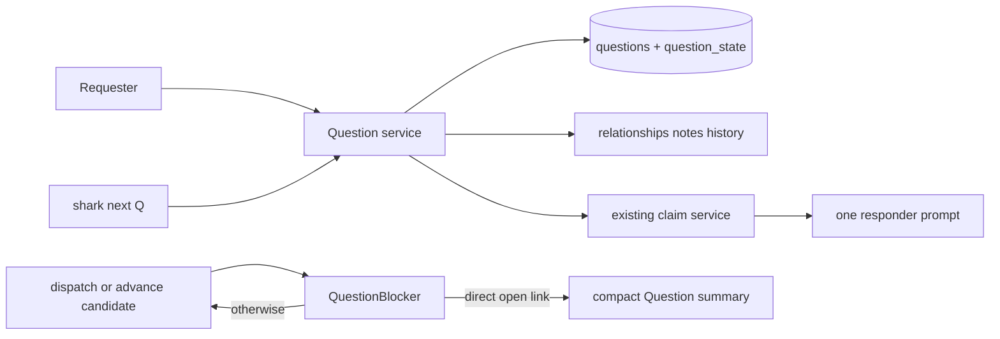

# E39 Architecture: Question and Decision Workflow Management

## Scope and component design

E39 adds a top-level `question` entity for a bounded serial answer-and-resolution workflow. It reuses SQLite/Turso persistence, route-based workflows, generic registry, claims, typed notes/history, relationships, keyed `shark next <key> --json`, search, and viewer projections. It adds neither a council runtime, parallel responders, transcript store, nor linked-work authority.

The proposed monotonic key is `Q###` such as `Q001`, distinct from `E`, `F`, `T`, `B`, `CC`, `S`, and `I`. Add `question` to every existing closed type switch: model allowlists, key parsing, registry/adapters, generic commands/services, claims, notes, history, context, relationships, search, viewer, API, workflow, and prompts. Command handlers remain thin; `QuestionService` owns validation/transactions and repositories own data access.

| Component | Change | Contract |
|---|---|---|
| Model/repository | New | Question identity, summary, status, blocking, requester, resolution metadata, context |
| Registry/key routing | Extend | Registered `question` and `Q###` resolve through generic surfaces |
| Workflow/claims | Extend | First pending responder only; existing claim is the sole lease |
| Scoped gate | New service seam | Only direct open, explicitly blocking Question stops a candidate |
| Query/viewer/API | Extend | Safe normal reads plus open-by-responder and blocking-for views |

## Domain and persistence contract

Create an additive `questions` table with standard entity fields plus one-line `summary`, `blocking`, `requester`, `resolution_kind`, and `resolution_pointer`; store validated `question_state` in `context_data`. Index unique key and only query-plan-backed open/blocking/status/owner lookups. Do not backfill unstructured `open_questions`.

| `question_state` field | Constraint |
|---|---|
| `resolution_owner` | Required non-empty actor/role before closure |
| `responders` | Ordered 1–10 distinct identities, each `pending` or `completed` |
| `responses` | One per responder; summary <= 1,000 UTF-8 bytes; evidence pointer <= 2,048 bytes |
| `current_responder` | Derived/validated first pending responder, never independently trusted |
| `blocking` | Must match Question record |

Service/domain validation rejects credentials, rendered prompts, transcript-shaped material, and over-limit values. Long evidence belongs in a typed note or authoritative record pointer; generic metadata and `open_questions` are not substitutes.

Add Question-only directed `question_blocks` from `Question -> affected entity`. Informational links remain `references`/`linked_to`; generic `blocks` behavior does not change. Only `question_blocks` plus `blocking=true` qualifies for the gate.

| Resolution kind | Required evidence before closure |
|---|---|
| `local_clarification` | Concise linked-entity note |
| `feature_change` | Authoritative feature-spec pointer |
| `product_decision` | `docs/product/progress.md` decision-log pointer |
| `architecture_decision` | ADR plus affected architecture/spec pointers |
| `follow_up_work` | Linked Shark work-item key |
| `no_lasting_consequence` | Bounded answer plus Question history |

Create, response, resolution, withdrawal, and supersession record Question history and durable note evidence when needed. Question operations never claim, advance, or resolve linked work.

## Workflow and direct gate

The new route-based Question workflow uses semantic boundaries `open`, `answering`, `ready_for_resolution`, `resolved`, `withdrawn`, and `superseded`. `shark next Q### --json` validates state and returns normal `NextResponse` data for exactly the first pending responder. Existing `ClaimService` remains sole lease authority. A successful response validates session and bounded payload, records history, and completes that responder; next responder eligibility begins only after release. Failure, expiry, and release without success leave the responder pending. Parent loop ownership remains unchanged.

Before keyed dispatch and supported transition commit, `QuestionBlocker` queries only incoming `question_blocks` from open blocking Questions. A match returns `Q###`, summary, resolution owner, and current responder without a claim or mutation. No match retains current behavior. The gate does not block Question transitions, traverse relationship graphs, or reinterpret legacy `blocks`.

## Interfaces, migration, security, and ADRs

Question surfaces mirror standalone patterns: create, get, list/search, link/unlink, response, resolve, withdraw/supersede, `open-by-responder`, and `blocking-for`. Authorization is a configurable policy seam: requester creation, current-responder response, and resolution-owner closure use the same service check. Blocked-work callers see compact copy only; full response is for assigned responder or resolution owner. Handoff copy links the Question rather than copying mutable state into chat or `docs/council/`.

Migration is additive/idempotent with fresh-install and upgrade coverage; deployed rollback is forward corrective migration, not table deletion. Parameterized repositories and service validation run before history/link mutation. Response material is excluded from search, viewer, claims, and telemetry.

- **ADR-001:** Add `question`/`Q###` across the closed entity contract. Notes/context cannot provide accountable lifecycle or queries; exhaustive switch regression tests are required.
- **ADR-002:** Reuse claims for serial response. It preserves the existing lease/phase boundary; parallel collection and a new queue are rejected.
- **ADR-003:** Use `question_blocks`, not global/generic `blocks`. This protects existing semantics; tests prove link direction and unrelated-work continuity.
- **ADR-004:** Require resolution kind and authoritative pointer for consequential closure. A response alone is insufficient; closure/history validation is transactional.

## Delivery boundaries and traceability

| Intended feature | Real trigger / production path | Complete UAT result | Prerequisite and output |
|---|---|---|---|
| F01 Entity/platform registration | Requester creates `Q###` via CLI/API | UAT-01 retrieve/link/list/search/history | DB/registry; adapter/model |
| F02 Serial workflow/provenance | `shark next Q###` routes Question | UAT-02 serial response; UAT-04 provenance | F01; validated dispatch/state |
| F03 Scoped gate | Linked owner dispatches/advances work | UAT-03 direct-only stop | F01/F02 predicate; compact result |
| F04 Focused safe reads | Responder/owner queries Question | UAT-01/UAT-05 safe views | F01–F03 projections |

Risks: missed type switches, alternate gate bypass, claim/status races, legacy-block drift, and disclosure. Mitigate with exhaustive registry/key/command tests, dispatch-plus-transition gate tests, session transaction tests, isolated relationship tests, and bounds/redaction tests. REQ-F-001–004 map F01/F02; F-005–006 F03/F04; F-007–009 F02/F03; NF-001–004 span all four.
