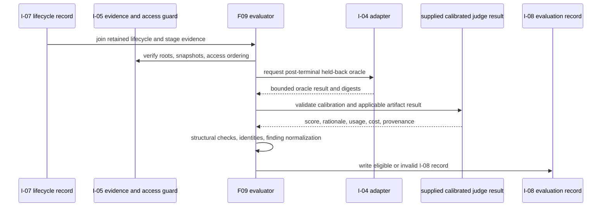

# E40-F09 Calibrated evaluation and comparison identity

This specification is incremental over the E40 epic. See [the epic PRD](../epic.md)
for business context, goals G6 and G13-G19, and the high-level acceptance
criteria. The system-level decisions and shared lifecycle contracts are in
[the epic architecture](../architecture.md), especially the lifecycle run,
lifecycle evaluation, and workflow value-attribution sections.

The validated research report for this feature is
[research-report.md](research-report.md). Its Capability map is authoritative
for reuse: F09 reuses I-05 evidence/isolation, I-04 scenario/oracle identity as
carried by upstream records, the I-07 lifecycle record, the existing artifact
aggregation discipline, structured `review-finding` notes, and the repository
deep-review bundle. F09 adds the I-08 evaluator, finding adjudication,
calibration, and exact comparison identity; it does not reimplement those
upstream capabilities.

## Requirements

### Functional requirements

| ID | Requirement | Traceability |
|---|---|---|
| REQ-F-001 | F09 MUST accept one complete I-05 evidence set and one I-07 lifecycle record, join them by the recorded run/scenario/dispatch references, and emit exactly one versioned I-08 evaluation record. A missing, duplicated, or contradictory join MUST be retained as a named invalidity reason and MUST make the record ineligible for aggregation. | Epic G9, G13; I-05, I-07 |
| REQ-F-002 | I-08 MUST keep three independent truth blocks: `structural`, `judge`, and `execution_oracle`. Structural checks MUST cover required artifacts, ownership, links, dependencies, status transitions, traceability, and executable-task eligibility. The judge MUST cover only applicable planning/decomposition artifacts. The execution oracle MUST be the held-back implementation predicate. A terminal Shark status, process exit code, or worker self-report MUST never populate any missing truth block. | Epic G13; architecture lifecycle evaluation record |
| REQ-F-003 | The structural evaluator MUST return a deterministic result for each check in a closed, schema-owned vocabulary. Each check MUST include its check ID, applicable stage/entity, observed result (`pass`, `fail`, or `not_applicable`), evidence references, and a bounded reason when it is not a pass. | Epic G13, G18; `bench/evidence/i05-schema.yaml` precedent |
| REQ-F-004 | F09 MUST run the held-back oracle only after the I-07 scenario reaches terminal status and the I-05 evaluator-access boundary authorizes access. It MUST use the admitted I-04 adapter and final predicate, record the oracle test/reference digests and result, and leave no evaluator-only file in an agent-visible root after evaluation. A pre-terminal or failed-isolation request MUST stop with a named invalidity reason and zero oracle execution. | Epic G9, G13; I-04, I-05 |
| REQ-F-005 | F09 MUST validate a calibrated judge input containing rubric digest, judge prompt digest, model/configuration identity, calibration-set digest, human-scored calibration examples, reference digest, rationale, score, usage, cost, and applicability. Calibration examples MUST be disjoint from the held-out evaluation set. Missing calibration or judge identity MUST make the I-08 record ineligible; it MUST not be replaced by a default score. | Epic G13, G14; architecture ADR-008 |
| REQ-F-006 | I-08 MUST carry a complete evaluation identity consisting of scenario/version, fixture and adapter identity, toolchain identity, Shark binary digest, installed Shark-data content digest, every rendered prompt digest, provider/model/effort identity for applicable stages, judge identity, evaluator-reference digests, and resource-policy digest. Any missing or unequal required field MUST produce a machine-readable divergence reason. | Epic G14; X-12 |
| REQ-F-007 | For every code-producing or review candidate, F09 MUST compare the complete candidate snapshot: base commit, tree digest, binary-diff digest, changed-path digest, ordered dirty/untracked manifest, test-suite digest, and derived candidate identity digest. A branch name, `HEAD`, or base commit alone MUST never qualify two candidates as identical. | Epic G19; architecture ADR-009 |
| REQ-F-008 | F09 MUST derive workflow-policy identity from enabled gates, gate order, reviewer provider/model/effort, rendered review prompt digest, the single deep-review bundle digest, and the fixes-allowed-between-gates policy. The deep-review digest MUST cover `SKILL.md`, all six angle prompts, the consolidator prompt, and `scripts/get_diff.sh`. Any policy difference MUST reject the comparison. | Epic G17, G19; repository deep-review bundle |
| REQ-F-009 | F09 MUST retain every raw review finding from I-07 and add an independent normalized finding containing F09 identity, confirmation source, first-seen gate, duplicate/recurrence link, resolution candidate, and final disposition. Reviewer-supplied fingerprint, severity, and disposition MUST remain raw evidence and MUST not be treated as adjudicated truth. | Epic G17; `internal/models/validation.go` |
| REQ-F-010 | F09 MUST support two comparison modes. `independent_frozen_candidate` compares QA and finish-feature deep review against the same candidate and test-suite snapshot with no intervening fix. `sequential_delivery` preserves each intervening candidate and attributes only newly confirmed findings to the later gate. Stage order alone MUST not be reported as causal evidence. | Epic G17, G19; workflow value-attribution contract |
| REQ-F-011 | F09 MUST calculate review evidence as separate measures: emitted, normalized unique, duplicate, recurrent, confirmed, unconfirmed, downstream-escape, elapsed-time, provider-cost, rework, and artifact-use values, grouped by gate, severity, and defect class. Precision and recall MUST be emitted only when a retained seeded truth set exists; otherwise the record MUST report truth-set-unavailable and the non-truth-set measures. | Epic G17, G18 |
| REQ-F-012 | F09 MUST preserve separate quality, time, and cost dimensions and MUST NOT emit a composite efficiency score. An evaluation record MUST retain artifact-use and replay-lineage references from I-05/I-07 so downstream reporting can identify consumed and orphaned artifacts without rerunning the scenario. | Epic G16, G18; I-05, I-07 |
| REQ-F-013 | F09 MUST set `aggregate_eligible: false` for any incomplete, mixed, failed-oracle, failed-calibration, isolation-violating, candidate-mismatched, or policy-mismatched record. It MUST retain all invalid records and every reason under the declared output root; aggregation MUST never silently drop or average them. | Epic G6, G14, G19; existing `bench/scripts/aggregate-runs.sh` invalid-input discipline |

### Non-functional requirements

| ID | Requirement | Traceability |
|---|---|---|
| REQ-NF-001 | I-08 MUST be a file-backed artifact under `bench/evaluations/`; it MUST add no Shark database table, migration, workflow engine, claim store, Question store, or product service. | Epic constraints; architecture ADR-002 |
| REQ-NF-002 | Schema validation, structural evaluation, normalization, identity comparison, and replay of retained evaluation artifacts MUST run offline with zero provider calls and zero writes to the live Shark database, `.sharkconfig.json`, or live working tree. Canonical JSON uses sorted keys, compact UTF-8 encoding, and lowercase SHA-256 digests. | Epic G7, G15; F05/F06 offline precedents |
| REQ-NF-003 | Evaluator-only paths, reference content, credentials, rendered prompts, and unbounded transcripts MUST not be copied into I-08. I-08 may retain bounded paths, sizes, digests, access-event metadata, rationale, and bounded result evidence. | Epic G9; architecture ADR-007 |
| REQ-NF-004 | The verifier MUST stream retained JSONL or stage records and avoid loading transcripts or evaluator payloads into memory. On the committed 100 MB synthetic evidence fixture, contract verification MUST complete within 30 seconds on the repository CI runner. | Epic G7, G15; existing offline validator pattern |
| REQ-NF-005 | Generic evaluation code MUST remain fixture-language-neutral. Language-specific test, lint, build, oracle, and test-identity behavior MUST be reached through the I-04 adapter; F09 MUST not add Python- or Go-specific branches. | Epic G8, G13; F05 adapter boundary |

### Acceptance criteria

| ID | Verification | Expected result |
|---|---|---|
| AC-001 | `tests/contracts/e40_i08_lifecycle_evaluation_contract_test.go#TC-067` validates `bench/evaluation/i08-schema.yaml` and valid/invalid I-08 fixtures. | Required fields, types, vocabularies, digest rules, and rejected-field reasons are schema-owned; malformed records name the failing path. |
| AC-002 | `tc067_lifecycle_evaluation_truth_test.sh` runs the evaluator against structural-pass, judge-pass, oracle-fail, and terminal-status-only fixtures. | The three truth blocks remain distinct; terminal status or worker exit cannot substitute for oracle or judge evidence. |
| AC-003 | `tc068_heldback_oracle_isolation_test.sh` exercises pre-terminal, post-terminal, evaluator-access, hidden-test injection, and cleanup branches through the existing I-05 guard and I-04 adapter. | Pre-terminal access makes zero adapter/provider calls; authorized post-terminal evaluation records one access event, produces the oracle result, and leaves no hidden file in agent-visible roots. |
| AC-004 | `tc069_calibration_boundary_test.sh` supplies disjoint calibration/evaluation sets, missing calibration, changed rubric, changed judge model, and malformed judge usage. | Only the calibrated case is eligible; all other cases retain named invalidity reasons and no fabricated score. |
| AC-005 | `tc070_comparison_identity_test.sh` changes one at a time: scenario, fixture, adapter, Shark binary, content digest, rendered prompt, provider/model/effort, judge, reference, resource policy, candidate tree/diff/paths/dirty-untracked manifest/test suite, enabled gates, order, reviewer fields, review bundle, and fix policy. | Each changed field rejects the pair with the exact divergence; an exact match accepts it. Branch/`HEAD`-only matches are rejected. |
| AC-006 | `tc071_review_finding_normalization_test.sh` feeds findings, zero findings, duplicate fingerprints, recurrences after a candidate change, confirmed seeded defects, clean controls, and unconfirmed findings. | Raw fields are preserved; normalized identity and confirmation fields are independently populated; precision/recall appear only with a truth set. |
| AC-007 | `tc072_review_comparison_modes_test.sh` evaluates QA and deep review in both declared modes. | Independent mode has one frozen candidate and no fix edge; sequential mode retains all candidate identities and counts only later newly confirmed findings. |
| AC-008 | `tc073_evaluation_replay_determinism_test.sh` evaluates the same retained I-05/I-07 inputs twice with provider calls denied. | The I-08 verdict and invalidity inventory are byte-identical, and evaluation does not rerun the scenario. |
| AC-009 | `tc074_invalid-retention-and-aggregation_test.sh` supplies incomplete, mixed, failed-oracle, failed-calibration, and mismatched records to the evaluator and existing aggregate path. | Every invalid record remains in the invalid inventory; no invalid record contributes to an aggregate or disappears silently. |
| AC-010 | `tc075_content-identity_x12_test.sh` computes identity from the installed canonical Shark-data bundle and changes one workflow, prompt, skill, and agent file at a time. | The content digest changes for each mutation and a paired comparison is rejected with the differing digest; the test uses the X-12 source contract. |
| AC-011 | Static and runtime review of all F09 scripts plus the 100 MB fixture. | No product/database files change, no generic script branches on fixture language, no evaluator-only bytes appear in I-08, and verification meets REQ-NF-004. |
| AC-012 | `make fmt && make lint && make test` and `bench/scripts/tests/run-all.sh` with TC-067 through TC-075 registered. | Repository quality gates and the complete F09 contract suite pass; no existing F01-F08 test is removed or weakened. |

### Out of scope for this feature

- Operator spend acknowledgement, pilot selection, provider-backed batch execution, report formatting, publication, and noise-band presentation; these belong to E40-F10.
- A new provider runtime, judge provider integration, prompt assembler, Shark workflow engine, claim/Question store, or usage decoder.
- Retrofitting Phase 1 `bench/scripts/aggregate-runs.sh` records into lifecycle I-08; F09 reuses its invalid-retention discipline and leaves its v1 contract intact.
- Training or tuning the judge rubric against the held-out evaluation set, statistical significance beyond the published noise band, and claims of causal value from observational gate order.
- Epics, sprint stages, D06-D14 product design, CI/merge/cleanup, hosted dashboards, scheduled runs, and cross-harness comparison.

## Architecture

### Component changes

| Path | Change |
|---|---|
| `bench/evaluation/i08-schema.yaml` | New machine-readable owner for I-08 schema version, field inventory, digest rules, truth/check vocabularies, comparison modes, finding dispositions, and invalidity reasons. |
| `bench/scripts/evaluate-lifecycle.sh` | New offline F09 entrypoint. Joins I-05/I-07, invokes existing structural/isolation checks, runs the authorized held-back oracle after terminal status, validates supplied calibrated judge evidence, normalizes findings, computes identities, and writes one I-08 record. It never calls a provider. |
| `bench/scripts/run-heldback-oracle.sh` | New narrow oracle adapter. Enforces terminal/evaluator-access ordering through `verify-stage-evidence.sh`, calls the I-04 adapter capabilities, captures only bounded result metadata, and cleans the checkout before returning. |
| `bench/scripts/normalize-review-findings.sh` | New deterministic normalizer. Reads the raw I-07 `review_gates` findings, preserves them byte-for-byte by reference, and emits F09 normalized identity, confirmation, duplicate/recurrence, resolution-candidate, and disposition fields. |
| `bench/scripts/compare-lifecycle-evaluations.sh` | New pair comparator. Validates evaluation identity, candidate identity, workflow-policy identity, and the independent/sequential mode rules; it emits an accepted pair or retained divergence reasons. |
| `bench/scripts/verify-lifecycle-evaluation.sh` | New fail-closed I-08 validator used by the evaluator and F10. It reads the schema rather than embedding vocabularies and rejects incomplete or contradictory records without producing an aggregate. |
| `bench/scripts/tests/tc067_lifecycle_evaluation_truth_test.sh` through `bench/scripts/tests/tc075_content-identity_x12_test.sh` | New offline shell contract fixtures for the acceptance criteria above. They use stubs at the declared adapter/guard seams and deny provider/network access. |
| `tests/contracts/e40_i08_lifecycle_evaluation_contract_test.go` | New test-only Go contract validator, `package contracts`, `TC-067`; reads the I-08 schema and committed valid/invalid fixtures only. |
| `tests/contracts/testdata/e40_i08/{valid,invalid}/` | New static I-08 fixtures covering truth separation, calibration, identity, finding normalization, comparison modes, invalid retention, and digest changes. |
| `bench/scripts/tests/run-all.sh` | Modified only to register TC-067 through TC-075 in deterministic order. |
| `bench/README.md` | Modified with the I-08 artifact layout, evaluator/oracle ordering, identity rules, finding semantics, offline commands, and F09 test-tier instructions. |

No file under `internal/` or `cmd/` is modified. The following are read-only
integration inputs: `bench/evidence/i05-schema.yaml`,
`bench/runs/i07-schema.yaml`, `bench/scripts/verify-stage-evidence.sh`,
`bench/scripts/verify-evidence-roots.sh`, `bench/scripts/review-capture.sh`,
the I-04 adapter, and the repository-owned deep-review bundle.

### Data model changes

There is no Shark schema or migration. F09 writes
`bench/evaluations/<evaluation_id>/evaluation.jsonl`; it contains one JSON
object and references, rather than copies, I-05/I-07 source artifacts.

| Block | Required contents |
|---|---|
| `identity` | I-08 schema version, evaluation/run/scenario identity, fixture/adapter/toolchain identity, Shark binary and X-12 content digests, rendered prompt digests, provider/model/effort identity, judge/calibration/reference/resource-policy identity, and source artifact digests. |
| `structural` | Ordered check results, applicability, evidence pointers, and bounded failure reasons for artifacts, ownership, links, dependencies, transitions, traceability, and executable tasks. |
| `judge` | Applicability, rubric/prompt/model/configuration/calibration/reference digests, calibration set and held-out separation evidence, bounded rationale/score, usage, cost, and invalidity reasons. |
| `execution_oracle` | Final-predicate kind, evaluator access event, oracle test/reference digests, adapter/test identity, observed result, and bounded output summary. |
| `candidate_snapshots` | Candidate ID and all six I-05 identity fields plus `candidate_identity_digest`, ordered by stage/gate. |
| `workflow_policy` | Enabled gates, gate order, reviewer provider/model/effort, rendered review prompt digest, deep-review bundle digest, fixes-allowed policy, and `workflow_policy_identity_digest`. |
| `review_findings` | Raw finding references, normalized finding records, truth-set availability, confirmation source, first-seen gate, duplicate/recurrence links, resolution candidate, disposition, and derived counts. |
| `comparison` | Mode, left/right evaluation IDs, matched identity digest, candidate/policy references, intervening-candidate lineage, and accepted/rejected decision. |
| `eligibility` | Structural/judge/oracle validity, `aggregate_eligible`, `publication_eligible`, and ordered machine-readable invalidity reasons. |
| `metrics` | Separate quality, elapsed-time, provider-cost, rework, and artifact-use values; no composite score. |

Canonical identity digests are SHA-256 over compact sorted-key UTF-8 JSON. The
ordered dirty/untracked manifest and ordered prompt/stage lists are not sorted
as part of their field semantics. A changed order is a changed identity.

### API / interface contracts

F09 exposes file-backed shell interfaces rather than a Go API:

- `evaluate-lifecycle.sh --i05 <bundle> --i07 <lifecycle.jsonl> --scenario <package.yaml> --output <evaluation.jsonl> [--judge-result <json>]` reads the declared artifacts, produces I-08, and exits non-zero for an authoring/usage error. A valid but ineligible evaluation still writes its record and returns the record's eligibility verdict.
- `run-heldback-oracle.sh --scenario <package.yaml> --i07 <lifecycle.jsonl> --stage-bundle <bundle> --checkout <dir> --output <oracle.json>` accepts only a terminal I-07 record, obtains evaluator access through the existing I-05 broker, invokes the registered I-04 adapter, and returns bounded oracle metadata.
- `normalize-review-findings.sh --i07 <lifecycle.jsonl> --output <findings.json>` preserves raw source references and emits deterministic normalized findings; it never edits Shark notes or the I-07 record.
- `compare-lifecycle-evaluations.sh --left <evaluation.jsonl> --right <evaluation.jsonl> --mode <independent_frozen_candidate|sequential_delivery> --output <comparison.json>` accepts only identity-compatible pairs and retains every rejection reason.
- `verify-lifecycle-evaluation.sh <evaluation.jsonl> --schema <i08-schema.yaml>` performs offline schema, digest, truth-separation, eligibility, and comparison-shape validation.

The main evaluation flow is:

### Key technical decisions

**ADR-F09-01 — File-backed post-run evaluator, not Shark persistence.**
F09 follows architecture ADR-002 and the existing `aggregate-runs.sh` pattern:
retained JSON artifacts are the source of truth, making offline replay and
invalid-record retention possible without a new database schema. A service or
table would couple benchmark evidence to product lifecycle state.

**ADR-F09-02 — Three truth blocks remain separate.** This follows the parent
lifecycle evaluation contract and F06/F08 boundaries. Structural validity,
calibrated judgment, and executable correctness answer different questions;
keeping separate results prevents a judge or terminal status from masking a
failed held-back oracle.

**ADR-F09-03 — The oracle uses the existing evaluator-access broker.** F06's
`verify-stage-evidence.sh` already owns terminal ordering and evaluator-access
events, while the I-04 adapter owns language-specific test behavior. F09 adds
orchestration and result validation only; it does not copy hidden files or add a
second isolation policy.

**ADR-F09-04 — Judge execution is injected as a bounded result.** F10 owns
provider spend and operator workflow. F09 owns the judge contract, calibration
separation, provenance validation, and eligibility; accepting a captured result
keeps the evaluator offline and avoids a second provider runtime. Missing or
malformed evidence fails closed.

**ADR-F09-05 — Candidate and policy identity are composite digests.** This
implements parent ADR-009 and the I-05 candidate fields. Git branch labels and
`HEAD` are insufficient because dirty files, untracked files, tests, gate order,
review configuration, and fix policy can change the result.

**ADR-F09-06 — Raw findings and normalized findings coexist.** This extends the
structured note shape in `internal/models/validation.go` without changing note
storage. Raw reviewer claims remain auditable evidence; F09's independent
normalization and confirmation prevent reviewer fingerprints or severity from
becoming truth by assertion.

**ADR-F09-07 — Independent and sequential comparisons are different modes.**
This follows the parent workflow value-attribution contract. One frozen
candidate measures overlap/complementarity; sequential candidates measure
incremental confirmed yield and rework. A single ambiguous mode would conflate
those interpretations.

**ADR-F09-08 — Fail closed but retain invalidity.** This follows architecture
ADR-008 and `aggregate-runs.sh`: incomplete or mixed records remain diagnosable
and never contribute to a headline aggregate. Silent exclusion would make a
biased sample look clean.

### Integration with existing code

- `bench/runs/i07-schema.yaml` is the source for I-07 required fields,
  terminal outcomes, workflow policy, raw review findings, candidate fields,
  and digest rules. `verify-lifecycle-run.sh` is invoked before evaluation;
  F09 does not duplicate its lifecycle validation.
- `bench/evidence/i05-schema.yaml` and
  `bench/scripts/verify-stage-evidence.sh` supply the I-05 vocabularies,
  candidate snapshot, artifact-consumer evidence, time/usage records, and
  terminal evaluator-access boundary. F09 consumes their output and does not
  change their schema or gate behavior.
- `bench/scripts/verify-evidence-roots.sh` remains the pre-dispatch disclosure
  guard. `run-heldback-oracle.sh` invokes the post-terminal grant path of
  `verify-stage-evidence.sh` and then the registered I-04 adapter's
  `inject-tests` and `test` capabilities.
- `bench/scripts/review-capture.sh --input <review.json> --output <capture.json>`
  remains the raw review capture seam. F09 reads the `review_gates` shape and
  normalizes it without calling `shark note` or mutating the source record.
- `internal/models/validation.go:228-262` remains the canonical
  `review-finding` note allowlist (`ValidNoteTypes` and `ValidateNoteType`).
  F09 preserves the metadata fields emitted by the feature QA, code-review,
  and approval prompts; any upstream note-shape change is a contract drift,
  not an F09-local reinterpretation.
- `skills/shark-rider/skills/deep-review/SKILL.md`, its six angle references,
  `references/consolidator.md`, and `scripts/get_diff.sh` are read as one
  bundle and hashed together. F09 does not fork or edit the review workflow.
- `internal/sharkdata/default_data/` is hashed through the X-12 canonical
  Shark-data content contract. The digest covers installed workflows, prompts,
  skills, and agents; F09 does not invent a second content identity.
- `bench/scripts/aggregate-runs.sh` remains the Phase 1 aggregator. F09 copies
  its strict invalid-input/retention posture for I-08 but does not alter the
  v1 schema or relabel v1 output as lifecycle evaluation.

## Cross-feature interactions

### Consumes

- **I-05 — Stage evidence and evaluator isolation**; producer E40-F06; F09 reads immutable stage snapshots, evaluator-access lineage, provider usage, artifact producer/consumer records, exact candidate fields, and stage eligibility. **Shape source:** `../architecture.md#stage-evidence-and-isolation-contract`. **Contract test pointer:** `tests/contracts/e40_i05_stage_evidence_contract_test.go#TC-042`. The map-assigned gate mode is `contract-only` until E40-F09 proves live production-path use; activation owner and closure key are E40-F09 at its own UAT; counterpart status is read live at review/UAT time; review basis is F06's completed `spec.md` and the map row; disposition remains `pending-integration` until activation.
- **I-07 — Lifecycle run record**; producer E40-F08; F09 reads the entity graph, dispatch lineage, workflow policy, candidate references, raw review-gate states/findings, Questions, resource limits, stop outcome, and aggregate-eligibility evidence. **Shape source:** `../architecture.md#lifecycle-run-record-contract`. **Contract test pointer:** `tests/contracts/e40_i07_lifecycle_run_contract_test.go#TC-061`. The map-assigned gate mode is `contract-only` until E40-F09 proves live production-path use; activation owner and closure key are E40-F09 at its own UAT; counterpart status is read live; review basis is F08's completed `spec.md` and the map row; disposition is `pending-integration` until activation.

### Produces

- **I-08 — Lifecycle evaluation record**; consumer E40-F10. **Shape source:** `../architecture.md#lifecycle-evaluation-record-contract`. **Contract test pointer:** `tests/contracts/e40_i08_lifecycle_evaluation_contract_test.go#TC-067` (the single shared contract proof; F10 must reuse this pointer, not create a twin). The map-assigned gate mode is `contract-only` until E40-F10 proves live production-path use; activation owner is E40-F10; closure key is E40-F10 at its own UAT; counterpart status is read live at review/UAT time; review basis is this completed `spec.md` and the map row; disposition is `pending-integration` until F10 closes the handoff.

F09 does not declare I-04 or I-06 as direct interactions: their identity and
oracle references arrive through the I-05/I-07 producer contracts named above.
F09 does not invent or alter any I-## ID, shape source, gate mode, closure key,
or counterpart status.

## Cross-epic integrations

### Consumes and validates

- **X-12 — Installed canonical Shark-data content identity**; producer E32,
  E32-F04; purpose: derive one digest over the installed workflows, prompts,
  skills, and agents so evaluations cannot compare mixed content bundles.
  **Contract / shape source:** `E32-F04 Shark-data canonical-content contract;
  E40 architecture "Lifecycle evaluation record contract"`. **UX / CX handoff:**
  internal operator evidence; a content mismatch is shown as a rejected
  comparison with both digests, never as a quality delta. **Test coverage:**
  `tc075_content-identity_x12_test.sh`, `tests/contracts/e40_i08_lifecycle_evaluation_contract_test.go#TC-067`,
  and E40 UAT-14.

F09 neither produces nor consumes any other X-## row. X-09's audited provider
usage mapping is consumed by F06/I-05 and arrives at F09 through that contract;
F09 does not redefine the X-09 boundary. X-10, X-11, and X-13 belong to F07 or
F08 and are not direct F09 integrations.

## Durable unresolved decisions

No material unresolved decision remains for this specification. The evaluator
boundary, file-backed store, three-truth model, fail-closed identity policy,
review comparison modes, I-05/I-07 handoffs, and X-12 content identity are
settled by the parent architecture, maps, and validated F09 research report.
The ordinary implementation details are constrained by the schema and
acceptance criteria above; no Q### record is required.

## Verification traceability

| Requirement group | Proof |
|---|---|
| REQ-F-001–003 | AC-001/002; I-05/I-07 validators; UAT-13 |
| REQ-F-004–005 | AC-003/004; F06 access contract; UAT-13 |
| REQ-F-006–008 | AC-005/010; X-12; UAT-14 and UAT-19 |
| REQ-F-009–011 | AC-006/007; UAT-17 |
| REQ-F-012–013 | AC-008/009; UAT-14, UAT-17, and UAT-18 |
| REQ-NF-001–005 | AC-011/012; epic constraints and offline validator precedents |

RECOMMENDED OUTCOME: pass
