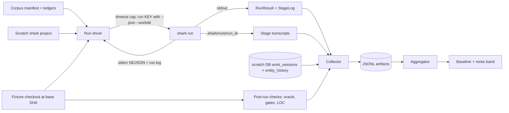

# E40 Architecture: Shark Bench

## Scope and component design

E40 adds a benchmark harness *around* `shark run`. Phase 1 changes no Go code except E40-F04. `shark run` remains the sole execution engine: it already cascades every entity type with per-child claim and `work_session`, dispatches agents headlessly, emits a `--json` `RunResult` carrying `StageLog[]`, persists per-stage transcripts under `.shark/runs/<run_id>/`, and blocks workers from self-advancing status through `DefaultDisallowedTools` — measurement integrity without harness effort. A config variant needs no schema work either: `OrchestratorAction` already carries `provider`, `model`, `effort`, `skills`, and the prompt template, so a variant is only an alternate workflow YAML tree selected by `workflow_config`.

Nothing in E40 adds a shark database table, a migration, or a service. JSONL artifacts are the store; reports are derived. `internal/reporting` is a fixed docs/plan scan schema and is deliberately not reused.

| Component | Change | Contract |
|---|---|---|
| Corpus and oracles (F01) | New, outside shark | Fixture repo at a pinned base SHA, machine-readable manifest, held-back F2P tests, P2P set, reference patch, base-SHA test and lint ledgers |
| Run driver (F02) | New harness scripts | Provision, seed, invoke, collect, emit one JSONL record per run |
| Aggregator and report (F03) | New harness scripts | Read artifacts only; publish baseline and per-metric noise band; replay a stored manifest and verify reproducibility within the band (G7/UAT-07) |
| `shark run` liveness (F04) | Extend `internal/cli/commands/run.go` | stderr progress in `--json` mode, stage-scoped heartbeat, correct child labeling, unconditional per-run log |

## Run lifecycle and isolation contract

One run is one (corpus item x variant x rep). The harness provisions a scratch shark project through `scripts/shark-scratch-env.sh`, repoints `workflow_config` at the variant bundle (scratch `admin init` defaults to the embedded bundle and will not do this on its own), and enables `CaptureAgentTranscripts`. It seeds the corpus entities through the shark CLI and captures the assigned keys from the create responses; it never specifies keys. It then invokes `shark run <key> --json` under an external `timeout` cap, records its own monotonic start and end, and treats a killed process as `outcome=timeout`.

Isolation is **harness-owned**, not `--worktree`-owned (ADR-001). The harness creates the fixture-repo checkout at the corpus base SHA, passes it as `--workdir`, and keeps it alive after the run so post-run checks can execute against the code the agent actually produced. Because a fresh checkout is created per run regardless — the pinned base SHA requires it — isolation is unchanged by this choice.

A consequence worth naming, because it is easy to get wrong: **one run spans two roots.** `--workdir` sets only the agent process's working directory, so the fixture checkout holds the code, the tests, and everything the post-run oracle, lint, and LOC checks read. Shark's own project root stays the scratch project, and transcripts, `run.log`, and the whole `.shark/runs/<run_id>/` tree are written there — `writeTranscript` joins the run's project root, not the agent's cwd. A collector that looks for transcripts under the fixture checkout finds nothing. The split is what makes harness-owned isolation work: the scratch project owns shark state, the checkout owns code, and neither is disturbed when the other is recreated.

Two `shark run` behaviors are pinned assumptions rather than settled contracts, because E22 is still active: the `RunResult` and `StageLog` field set the collector parses, and the documented transcript byte format (`COMMAND:` / `EXIT:` / `DURATION:<ms>ms` / `---STDOUT---` / `---STDERR---`). F02 carries a canary check that asserts both against a real invocation, so an upstream E22 change fails loud instead of silently corrupting collected metrics.

## Corpus and oracle contract

The corpus is the shape F01 produces and F02 consumes. Per item: an issue-style prompt, an entity seed spec (type, title, description; bugs add severity and an author-written repro test as their F2P oracle), held-back F2P test files, a P2P set identifier, and a reference patch. Held-back tests live only in the corpus directory and are injected into the checkout after the run reaches terminal status, never into the repo the agent sees.

Admission is execution-based and reproducible: at the base commit F2P must be red and P2P green; with the reference patch applied both must be green. An item failing either check is rejected with the failing check named and never benched. Alongside the manifest, F01 commits base-SHA ledgers — the full test result set and the golangci-lint issue set at the base commit — so post-run checks can count *regressions* and *new* lint issues rather than absolute counts.

The fixture repo's location (separate repo versus vendored directory) stays an F01 implementation choice; it is non-material to this architecture because every consumer reaches it through the manifest's pinned SHA.

## Metric collection and artifact schema

Collection has four sources, each answering what the others cannot.

| Source | Yields |
|---|---|
| `RunResult` stdout | Per-stage `duration_ns`, action, agent type, provider, exit code; final status and outcome; rejection inference from status re-entry after a gate stage |
| Stage transcripts | The agent JSON envelope per stage: token usage, cost, exact model IDs, API duration |
| Scratch DB | `work_sessions` per-child time windows and outcomes; `entity_history` backward transitions as the rejection cross-check. Both tables are already `entity_type`/`entity_key` generic — no migration |
| Post-run checks in the `--workdir` checkout | Oracle result from injected F2P tests; `p2p_regressions` against the base test ledger; `fmt`/`vet`/`test` gates; `lint_new_issues` against the base lint ledger; `git diff --numstat <base_sha>` for LOC with a prod/test split |

One JSONL record per run carries a manifest block (corpus item, variant, rep, fixture and bundle SHAs, exact model IDs, timeout cap), per-stage records, post-run check results, and a rollup. This record is the stable shape F03 reads; F03 reads nothing else. A run that times out still emits a record — its stage attribution comes from the liveness stream, not from stdout.

The envelope field names the parser depends on are **not yet verified** against a live envelope (Q003). The design doc names `usage.*`, `total_cost_usd`, `duration_api_ms`, `num_turns`, and `modelUsage`; the only parsing code in the repo decodes a narrower set for its own purposes and corroborates none of the last three. F02 confirms the real names against one captured transcript before writing the parser. Exact model IDs are required manifest data, so if `modelUsage` is absent a fallback source must be named rather than the field dropped.

## Run liveness contract

`shark run --json` is silent until completion today: `internal/cli/commands/run.go` gates both the 10-second ticker and the `opts.Progress` callback behind `if !cli.GlobalConfig.JSON`, and both print sites use the closure's top-level `normalizedKey` instead of `update.EntityKey`, so cascade children are labelled as their parent. F04 fixes both halves together — fixing only the stderr half would still mislabel children.

F04 emits progress as NDJSON on **stderr** (one object per line: timestamp, run id, entity key, stage status, action, agent and provider, event, stage elapsed, total elapsed) while stdout stays exactly one `RunResult` document, so existing `--json` consumers are unbroken. It also writes `.shark/runs/<run_id>/run.log` unconditionally — not gated on observability config, which is a deliberate departure from the E23 slog path rather than a use of it — and prints that path once at run start.

This is a contract F02 consumes in code, not only an operator convenience. When a run is killed by the timeout cap, stdout never delivers a `RunResult`, so F02 must recover the stalled stage from elsewhere. F04's stream is the primary source and the richest one — it carries stage elapsed, agent, and provider, and needs no database access.

A fallback does exist, so this is a strong preference rather than a hard block. The controller advances status and writes the stage transcript only *after* the dispatch returns, so a run killed mid-agent leaves the entity in the scratch DB still at the executing stage's status, and the highest-numbered transcript bounds the last *completed* stage. F02 can therefore satisfy UAT-5 without F04, less richly. This recommendation is applied: live `execution_order` sequences F04 at 2, ahead of F02 at 3, so F02 builds against F04's liveness record as its primary source instead of the fallback path first.

## ADRs

- **ADR-001 — Harness-owned `--workdir`, not `shark run --worktree`.** `--worktree` defers `git worktree remove --force` on every return path, so the tree is destroyed before the harness regains control, uncommitted agent work is force-deleted, and the timestamped path is never exposed on `RunResult`. Post-run checks need a live tree, so `--worktree` is insufficient rather than merely inconvenient. Committed work would survive on the `shark-run-<key>-<ts>` branch, but oracle and lint checks need files. This deviates from PRD section 3 and design section 1 step 4; recorded as Q001. Rejected alternative: a Go change to preserve or emit the worktree path — it would spend the epic's single Phase 1 Go change on isolation instead of liveness.
- **ADR-002 — JSONL artifacts are the only store.** No shark table, migration, or reuse of `internal/reporting`. Reports are derived and reproducible from the artifact directory alone, which is what makes G7 checkable.
- **ADR-003 — A config variant is a workflow YAML bundle.** `OrchestratorAction` already carries every knob, so variants need no schema change and Phase 2 inherits the mechanism unchanged.
- **ADR-004 — Pin the parsed `shark run` surface with a canary.** E22 is active, not frozen. Asserting the `RunResult`, `StageLog`, and transcript byte format against a real invocation converts a silent metric corruption into a loud failure.
- **ADR-005 — Phase 1 benches tasks and bugs only, so cascade attribution is deferred.** Cascade children's stages flatten into the parent with no entity key, and sibling children inherit the parent run id while restarting their own stage counter, so their transcripts collide on filename and the later write truncates the earlier. This answers the design doc's open "verify before P2 rollups" item and is a `shark run` correctness issue in its own right, worth filing separately from E40. It constrains Phase 2 feature benching, not Phase 1; recorded as Q004.

## Delivery boundaries and traceability

| Feature | Real trigger / production path | Observable result | Prerequisite and output |
|---|---|---|---|
| F01 Corpus and oracles | Curator runs the admission gate on a candidate item | UAT-2 rejection with the failing check named; gate reproduces on a clean checkout | Fixture repo; manifest + held-back tests + base-SHA ledgers (I-01) |
| F02 Run driver | Operator runs one (item, variant, rep) unattended | UAT-5 bounded timeout with the stalled stage recorded; complete metric families per run | F01 manifest, F04 liveness; JSONL record (I-02) |
| F03 Baseline and noise band | Operator starts the 10 x 3 batch and walks away; or replays a stored manifest | UAT-1 batch completes and the report states per-metric spread; UAT-7 replay reproduces the manifest's metrics within the published band | F02 artifacts; published noise band; replay verification result (G7) |
| F04 `shark run` liveness | Any `shark run` invocation, bench or human | UAT-6 in-flight observability; stdout still one document | None; stderr NDJSON + `run.log` (I-03) |

Phase 1 exit owns G1–G5 and G7. G7/UAT-7 (stored-manifest replay) is owned by F03, which re-invokes F02's single-run command against the manifest's pinned inputs and verifies the result against the published band — no new I-## is needed since replay reuses the I-01/I-02 shapes already produced by F01 and F02. **G6, UAT-3, and UAT-4 are Phase 2 criteria**, not Phase 1: they require variant bundles and the paired comparison report, which PRD section 3 defers and F03 explicitly excludes. No Phase 1 feature owns them, so leaving them stated as Phase 1 exit criteria would leave the epic with an orphaned requirement. This restatement is recorded as Q002 and reflected in [uat-plan.md](uat-plan.md).

Q001 (isolation mechanism) and Q002 (G6 phase placement) are **resolved**: both proposed answers are applied throughout this document, epic.md, E40-F02's feature.md, and E40-F03's feature.md, and `shark question resolve` records `architecture_decision` against those files. Open decisions remaining: Q003 (envelope field names — F02 must confirm before writing the parser) and Q004 (Phase 2 cascade attribution — constrains Phase 2 feature benching only, not Phase 1). Risks and their mitigations — variance swamping config effects, weak oracles, repetition cost, scaffold-compliance confound, model-version drift — are stated in [shark-bench-design.md](shark-bench-design.md) section 7 and are not restated here.
