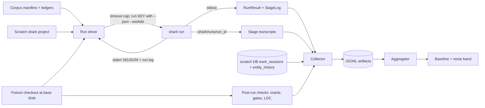

# E40 Architecture: Shark Bench

## Scope and component design

E40 is a benchmark harness around Shark. Phase 1 uses `shark run` as its sole
execution engine and changes no Go code except E40-F04. Lifecycle v2 adds a
host-side benchmark controller because it must record each keyed dispatch,
inject versioned stakeholder and research responses, schedule every eligible
descendant, and freeze evidence after each applicable stage. The controller
uses Shark's public keyed dispatch, claim, heartbeat, outcome-transition,
release, and Question contracts. It never reconstructs workflow routing or the
rendered prompt.

The completed Phase 1 path remains valid: `shark run` cascades entities with
per-child claims and work sessions, dispatches agents headlessly, emits a JSON
`RunResult` with `StageLog[]`, persists transcripts, and blocks workers from
self-advancing status. A config variant still needs no schema work because
`OrchestratorAction` already carries `provider`, `model`, `effort`, `skills`,
and the prompt template.

E40 adds no Shark database table or second workflow engine. Benchmark artifacts
remain file-backed and reports remain derived. Any generic Shark or Rider change
discovered during implementation is separate work under its owning epic.
`internal/reporting` remains a fixed docs/plan scan schema and is not reused.

| Component | Change | Contract |
|---|---|---|
| Corpus and oracles (F01) | New, outside shark | Fixture repo at a pinned base SHA, machine-readable manifest, held-back F2P tests, P2P set, reference patch, base-SHA test and lint ledgers |
| Run driver (F02) | New harness scripts | Provision, seed, invoke, collect, emit one JSONL record per run |
| Aggregator and report (F03) | New harness scripts | Read artifacts only; publish baseline and per-metric noise band; replay a stored manifest and verify reproducibility within the band (G7/UAT-07) |
| `shark run` liveness (F04) | Extend `internal/cli/commands/run.go` | stderr progress in `--json` mode, stage-scoped heartbeat, correct child labeling, unconditional per-run log |
| Lifecycle scenarios and adapters (F05) | Extend the bench corpus | Versioned four-family scenario package, controlled Python fixture, language-neutral adapter boundary (I-04) |
| Stage evidence and isolation (F06) | New bench contract and guards | Three-root access policy plus immutable per-stage snapshot (I-05) |
| Product-design replay (F07) | New host-side adapter around the existing Rider action | Versioned stakeholder/research replay and D01-D05 lineage (I-06) |
| Keyed lifecycle controller (F08) | New host-side benchmark controller | Canonical dispatch/lease/outcome loop over public Shark APIs; complete lifecycle run record (I-07) |
| Evaluation and identity (F09) | New post-stage/post-run evaluator | Structural results, calibrated judge evidence, execution oracle, comparison identity and eligibility verdict (I-08) |
| Operator lifecycle baseline (F10) | Extend bench commands and reports | No-spend preview, explicit spend gates, retained pilots, lifecycle and diagnostic reports, publication gate |

## Lifecycle v2 controller boundary

Lifecycle v2 has two host-side layers:

1. E40-F07 runs the existing Shark Rider product-design action for feature
   scenarios and supplies only responses authorized by the scenario replay
   bundle.
2. E40-F08 starts from the created Shark entity, requests each keyed dispatch
   from Shark, and owns the mechanical lease and transition loop around the
   returned concrete entity.

For every dispatch, E40-F08 preserves the response, resolves a hierarchy fork
through a recorded policy, claims the concrete entity, passes the rendered
prompt unchanged, heartbeats the lease, records the worker's semantic outcome,
applies the configured transition, and releases the claim on every exit path.
Shark remains authoritative for routing, prompt assembly, workflow state,
claims, and Questions. The benchmark controller is authoritative only for
scenario scheduling, replay input, evidence capture, and resource ceilings.

This boundary differs deliberately from Phase 1. A single `shark run` call is
ideal for low-cost task and bug baselines, but it does not expose the
stage-by-stage host control needed to replay D01-D05 interactions, freeze each
artifact boundary, or execute and explain every generated descendant.

## Run lifecycle and isolation contract

One run is one (corpus item x variant x rep). The harness provisions a scratch shark project through `scripts/shark-scratch-env.sh`, repoints `workflow_config` at the variant bundle (scratch `admin init` defaults to the embedded bundle and will not do this on its own), and enables `CaptureAgentTranscripts`. It seeds the corpus entities through the shark CLI and captures the assigned keys from the create responses; it never specifies keys. It then invokes `shark run <key> --json` under an external `timeout` cap, records its own monotonic start and end, and treats a killed process as `outcome=timeout`.

Isolation is **harness-owned**, not `--worktree`-owned (ADR-001). The harness creates the fixture-repo checkout at the corpus base SHA, passes it as `--workdir`, and keeps it alive after the run so post-run checks can execute against the code the agent actually produced. Because a fresh checkout is created per run regardless — the pinned base SHA requires it — isolation is unchanged by this choice.

A consequence worth naming, because it is easy to get wrong: **one run spans two roots.** `--workdir` sets only the agent process's working directory, so the fixture checkout holds the code, the tests, and everything the post-run oracle, lint, and LOC checks read. Shark's own project root stays the scratch project, and transcripts, `run.log`, and the whole `.shark/runs/<run_id>/` tree are written there — `writeTranscript` joins the run's project root, not the agent's cwd. A collector that looks for transcripts under the fixture checkout finds nothing. The split is what makes harness-owned isolation work: the scratch project owns shark state, the checkout owns code, and neither is disturbed when the other is recreated.

Two `shark run` behaviors are pinned assumptions rather than settled contracts, because E22 is still active: the `RunResult` and `StageLog` field set the collector parses, and the documented transcript byte format (`COMMAND:` / `EXIT:` / `DURATION:<ms>ms` / `---STDOUT---` / `---STDERR---`). F02 carries a canary check that asserts both against a real invocation, so an upstream E22 change fails loud instead of silently corrupting collected metrics.

## Corpus and oracle contract

The corpus is the shape F01 produces and F02 consumes. Per item: an issue-style prompt, an entity seed spec (type, title, description; bugs add severity and an author-written repro test as their F2P oracle), held-back F2P test files, a P2P set identifier, and a reference patch. Held-back tests live only in the corpus directory and are injected into the checkout after the run reaches terminal status, never into the repo the agent sees.

Admission is execution-based and reproducible: at the base commit F2P must be red and P2P green; with the reference patch applied both must be green. An item failing either check is rejected with the failing check named and never benched. Alongside the manifest, F01 commits base-SHA ledgers — the full test result set and the golangci-lint issue set at the base commit — so post-run checks can count *regressions* and *new* lint issues rather than absolute counts.

The fixture repo's location (separate repo versus vendored directory) stays an F01 implementation choice; it is non-material to this architecture because every consumer reaches it through the manifest's pinned SHA.

## Lifecycle scenario package contract

I-04 extends the Phase 1 corpus principles without making the Go manifest the
global benchmark shape. Each package contains:

- scenario ID and version, entity family, and stage-applicability matrix;
- fixture SHA, execution-adapter name and version, and toolchain identity;
- agent-visible initial input and references to replay inputs;
- evaluator-only reference-artifact and execution-oracle references;
- resource policy and the machine-checkable final predicate; and
- admission status with reproducible base and reference outcomes.

E40-F05 writes I-04. E40-F06, E40-F07, and E40-F08 treat it as read-only. The
adapter owns language-specific commands; no generic workflow or evaluator may
branch on Python, Go, or a package manager.

## Stage evidence and isolation contract

I-05 defines three roots:

| Root | Contents | Worker access |
|---|---|---|
| Agent-visible fixture checkout | Source, visible tests, and the planning context required by the current prompt | Read/write during its dispatch |
| Scratch Shark project | Shark database, generated planning documents, run logs, transcripts, claims, and history | Only through authorized Shark and harness surfaces |
| Evaluator-only root | Approved artifacts, judge answer keys, reference patches, and hidden execution tests | Never during worker dispatch; evaluator access only after the applicable stage or run |

Each applicable stage snapshot records scenario, entity, stage, prompt digest,
input and replay lineage, output paths and digests, tokens, cost, elapsed time,
errors, rework, and access events. Admission and every dispatch boundary prove
that evaluator-only files are absent from both agent-visible roots. A named stop
outcome still writes partial evidence but marks it ineligible for publication.

## Product-design replay contract

I-06 is a versioned sequence of authorized stakeholder answers, interview or
proxy-research evidence, and frozen research-tool responses plus the D01-D05
artifact lineage created from them. The replay adapter supplies a response only
when the current action and request match an unused authorized entry. It records
the entry digest and consuming stage. Missing input yields `unresolved_gate`;
scored runs never fall back to live research or interactive input.

E40-F07 wraps the existing E36-F02 product-design route through X-10. It does
not copy the methodology or make D01-D05 a Shark workflow status. Bug,
change-card, and tech-debt scenarios bypass this prelude and record those stages
as non-applicable.

## Lifecycle run record contract

I-07 contains the scenario identity and entity graph; every preserved keyed
dispatch response; fork decision; claim, heartbeat, and release; prompt and
worker-result reference; semantic outcome and resulting status; Question and
replay decision; stage-evidence reference; usage, cost, and elapsed time; and
resource ceilings plus observed consumption. It ends with one named scenario
outcome and an aggregate-eligibility flag.

E40-F08 writes a reason for every skipped or ineligible generated task. It runs
all other eligible tasks. `resource_limit`, lease loss, missing outcome,
`unresolved_gate`, pause, archive, error, cancellation, and worker failure stop
the scenario, retain partial evidence, and prevent baseline publication.

## Lifecycle evaluation record contract

I-08 keeps three truths separate:

1. deterministic structural checks over artifacts, ownership, links,
   dependencies, transitions, traceability, and executable-task eligibility;
2. a versioned LLM-judge result for applicable planning and decomposition
   artifacts, calibrated against human-scored examples; and
3. the held-back execution-oracle result for implementation correctness.

The record also pins scenario and replay identity, fixture and adapter, Shark
binary, installed Shark-data content, every rendered prompt, stage provider,
model and effort, judge configuration, rubric, references, and resource policy.
Missing or disagreeing identity makes the run ineligible for aggregation and
records every divergence reason. Workflow completion and worker self-report are
never substitutes for these results.

## Metric collection and artifact schema

Collection has four sources, each answering what the others cannot.

| Source | Yields |
|---|---|
| `RunResult` stdout | Per-stage `duration_ns`, action, agent type, provider, exit code; final status and outcome; rejection inference from status re-entry after a gate stage |
| Stage transcripts | The agent JSON envelope per stage: token usage, cost, exact model IDs, API duration |
| Scratch DB | `work_sessions` per-child time windows and outcomes; `entity_history` backward transitions as the rejection cross-check. Both tables are already `entity_type`/`entity_key` generic — no migration |
| Post-run checks in the `--workdir` checkout | Oracle result from injected F2P tests; `p2p_regressions` against the base test ledger; `fmt`/`vet`/`test` gates; `lint_new_issues` against the base lint ledger; `git diff --numstat <base_sha>` for LOC with a prod/test split |

One JSONL record per run carries a manifest block (corpus item, variant, rep, fixture and bundle SHAs, exact model IDs, timeout cap), per-stage records, post-run check results, and a rollup. This record is the stable shape F03 reads; F03 reads nothing else. A run that times out still emits a record — its stage attribution comes from the liveness stream, not from stdout.

Phase 1 historically parsed the retained provider envelope. Lifecycle v2 must
not copy that parser by assumption: E40-F06 verifies the current E27-F15 field
mapping through X-09, E40-F08 writes the observed runtime values into I-05 and
I-07, and E40-F09 rejects a record whose required usage or model identity is
absent. A named, tested fallback source is acceptable; silently dropping the
field is not.

## Run liveness contract

`shark run --json` is silent until completion today: `internal/cli/commands/run.go` gates both the 10-second ticker and the `opts.Progress` callback behind `if !cli.GlobalConfig.JSON`, and both print sites use the closure's top-level `normalizedKey` instead of `update.EntityKey`, so cascade children are labelled as their parent. F04 fixes both halves together — fixing only the stderr half would still mislabel children.

F04 emits progress as NDJSON on **stderr** (one object per line: timestamp, run id, entity key, stage status, action, agent and provider, event, stage elapsed, total elapsed) while stdout stays exactly one `RunResult` document, so existing `--json` consumers are unbroken. It also writes `.shark/runs/<run_id>/run.log` unconditionally — not gated on observability config, which is a deliberate departure from the E23 slog path rather than a use of it — and prints that path once at run start.

This is a contract F02 consumes in code, not only an operator convenience. When a run is killed by the timeout cap, stdout never delivers a `RunResult`, so F02 must recover the stalled stage from elsewhere. F04's stream is the primary source and the richest one — it carries stage elapsed, agent, and provider, and needs no database access.

A fallback does exist, so this is a strong preference rather than a hard block. The controller advances status and writes the stage transcript only *after* the dispatch returns, so a run killed mid-agent leaves the entity in the scratch DB still at the executing stage's status, and the highest-numbered transcript bounds the last *completed* stage. F02 can therefore satisfy UAT-5 without F04, less richly. This recommendation is applied: live `execution_order` sequences F04 at 2, ahead of F02 at 3, so F02 builds against F04's liveness record as its primary source instead of the fallback path first.

## ADRs

- **ADR-001 — Harness-owned `--workdir`, not `shark run --worktree`.** `--worktree` defers `git worktree remove --force` on every return path, so the tree is destroyed before the harness regains control, uncommitted agent work is force-deleted, and the timestamped path is never exposed on `RunResult`. Post-run checks need a live tree, so `--worktree` is insufficient rather than merely inconvenient. Committed work would survive on the `shark-run-<key>-<ts>` branch, but oracle and lint checks need files. This deviates from PRD section 3 and design section 1 step 4; recorded as Q001. Rejected alternative: a Go change to preserve or emit the worktree path — it would spend the epic's single Phase 1 Go change on isolation instead of liveness.
- **ADR-002 — JSONL artifacts are the only store.** No shark table, migration, or reuse of `internal/reporting`. Reports are derived and reproducible from the artifact directory alone, which is what makes G7 checkable.
- **ADR-003 — A config variant is a workflow YAML bundle.** `OrchestratorAction` already carries every knob, so variants need no schema change and lifecycle v2 inherits the mechanism unchanged.
- **ADR-004 — Pin the parsed `shark run` surface with a canary.** E22 is active, not frozen. Asserting the `RunResult`, `StageLog`, and transcript byte format against a real invocation converts a silent metric corruption into a loud failure.
- **ADR-005 — Phase 1 benches tasks and bugs only, so its cascade attribution is deferred.** Cascade children's stages flatten into the parent with no entity key, and sibling children inherit the parent run id while restarting their own stage counter, so their transcripts collide on filename and the later write truncates the earlier. This answered the former "verify before P2 rollups" item and remains a `shark run` correctness issue in its own right. Lifecycle v2 avoids treating that flattened record as truth by writing per-dispatch I-05/I-07 evidence through E40-F08; recorded as Q004.
- **ADR-006 — Keep both execution paths and name their phases.** Phase 1 keeps
  `shark run` for its completed low-cost baseline. Lifecycle v2 uses a
  Rider-equivalent host loop over public Shark APIs because replay and
  per-dispatch evidence require host control. The loop may schedule and record;
  it may not reimplement routing, prompts, workflow state, claims, or Questions.
- **ADR-007 — Isolate evaluator truth in a third root.** The Phase 1 split
  between scratch Shark state and fixture code remains. Lifecycle v2 adds an
  evaluator-only root that is unavailable to workers and admitted at every
  dispatch boundary. Post-stage and post-run evaluators receive narrow,
  recorded access only when authorized.
- **ADR-008 — Fail closed on evidence and comparison identity.** Missing stage
  evidence, oracle results, judge calibration, or any required identity field
  invalidates publication. The system retains partial and invalid records for
  diagnosis instead of discarding or silently averaging them.

## Delivery boundaries and traceability

| Feature | Real trigger / production path | Observable result | Prerequisite and output |
|---|---|---|---|
| F01 Corpus and oracles | Curator runs the admission gate on a candidate item | UAT-2 rejection with the failing check named; gate reproduces on a clean checkout | Fixture repo; manifest + held-back tests + base-SHA ledgers (I-01) |
| F02 Run driver | Operator runs one (item, variant, rep) unattended | UAT-5 bounded timeout with the stalled stage recorded; complete metric families per run | F01 manifest, F04 liveness; JSONL record (I-02) |
| F03 Baseline and noise band | Operator starts the 10 x 3 batch and walks away; or replays a stored manifest | UAT-1 batch completes and the report states per-metric spread; UAT-7 replay reproduces the manifest's metrics within the published band | F02 artifacts; published noise band; replay verification result (G7) |
| F04 `shark run` liveness | Any `shark run` invocation, bench or human | UAT-6 in-flight observability; stdout still one document | None; stderr NDJSON + `run.log` (I-03) |
| F05 Lifecycle scenarios | Curator admits a versioned scenario package | UAT-08 loads all four families and rejects malformed or non-runnable cases | Phase 1 corpus principles (I-01); lifecycle scenario package (I-04) |
| F06 Stage evidence and isolation | Harness admits and dispatches an applicable stage | UAT-09 proves hidden truth absent at dispatch and replays the captured stage later | I-04 and X-09; stage evidence bundle (I-05) |
| F07 Product-design replay | Operator starts an admitted feature scenario | UAT-10 completes D01-D05 from frozen responses or stops at `unresolved_gate` | I-04 and X-10; product-design replay result (I-06) |
| F08 Keyed lifecycle runner | Product-design prelude completes or a non-feature root is admitted | UAT-11 and UAT-12 cover every lease/transition path, Question, descendant, and safety stop | I-04, I-05, I-06, X-11, X-13; lifecycle run record (I-07) |
| F09 Evaluation and identity | A stage snapshot or scenario run becomes evaluable | UAT-13 and UAT-14 separate structural, judge, and oracle truth and reject incompatible aggregates | I-05, I-07, X-12; lifecycle evaluation record (I-08) |
| F10 Operator baseline | Operator previews, pilots, runs, or reports a lifecycle batch | UAT-15 prevents accidental spend and gates publication on inspected pilots and complete evidence | I-07 and I-08; retained baseline and diagnostic reports |

Phase 1 exit owns G1-G5 and G7. G7/UAT-7 remains owned by F03 and reuses
I-01/I-02. Lifecycle v2 owns G8-G15 and UAT-08 through UAT-15 through
E40-F05-E40-F10. G6 and UAT-03/UAT-04 now have a durable home in E40-F09 and
E40-F10, but their detailed configuration-matrix design remains subject to
those feature workflows rather than being retrofitted into completed F03.

Q001 and Q002 remain resolved for Phase 1. Q003 becomes an E40-F06/X-09
research obligation: reuse the audited provider-usage mapping when available
and fail closed on missing identity. Q004's Phase 1 `shark run` attribution
constraint is superseded for lifecycle v2 by E40-F08's per-dispatch I-07
record, but the underlying `shark run` defect remains relevant to its own
surface and must not be marked fixed by this architecture. Risks and
mitigations remain in [shark-bench-design.md](shark-bench-design.md).
