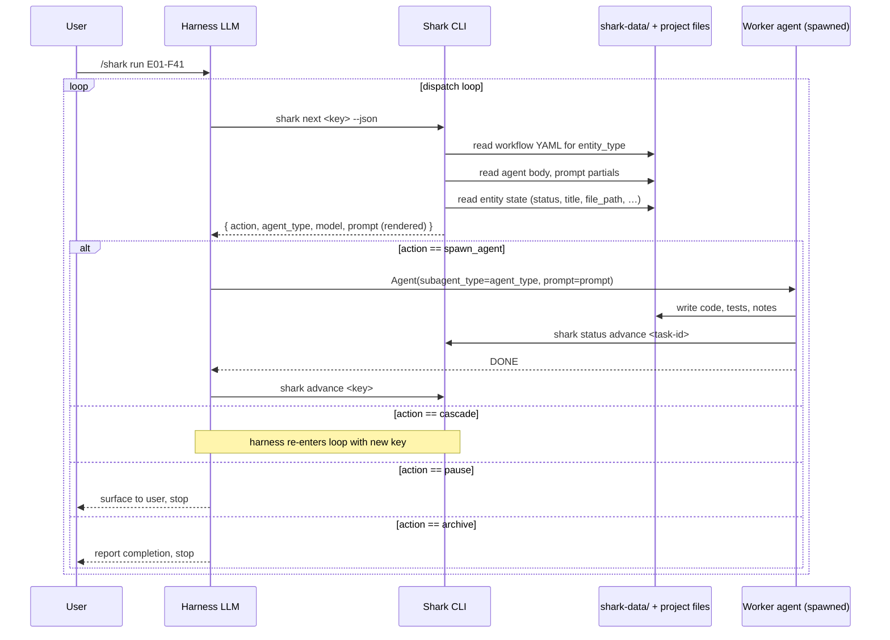
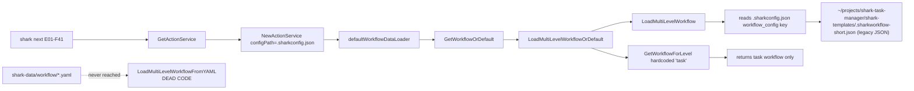
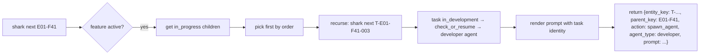
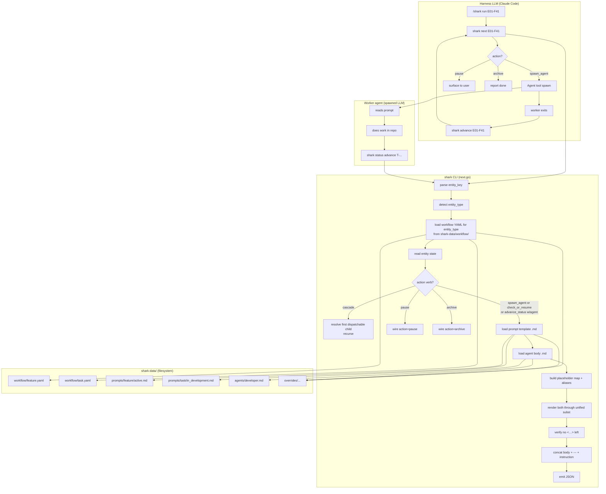

# Shark 2.0 — Dispatch path needs a rethink

## TL;DR

The Shark 2.0 trial in wormwoodGM (2026-05-11) failed at the dispatch step.
The three failure modes (B1 cascade lookup, B2 unsubstituted prompt
placeholders, B3 inert workflow YAML) all share one root cause:

**The Shark 2.0 data layout (`shark-data/`) was built as files, but the
runtime is still wired to the Shark 1.x JSON-config + task-only action
service.** The new YAML loader, the per-entity workflows, the angle-bracket
placeholders in agent files, and the `.md` prompt files all exist on disk
but no path in the engine actually consumes them as a coherent whole.

This document is a requirements/architecture rethink. It does not propose a
specific implementation — it describes the intended flow end-to-end so we
can compare it to what's actually wired today and decide the right shape
for the fix.

---

## 1. The end-to-end picture (from a requirements POV)

The system has three actors:

| Actor | What it is |
|---|---|
| **Harness LLM** (`Claude Code` etc.) | The conversational loop the user is talking to. Spawns sub-agents via the `Agent` tool. |
| **Shark CLI** (`shark next`, `shark advance`, …) | Stateless query layer. Reads project state, returns a single dispatch step as JSON. Knows nothing about LLMs. |
| **Spawned worker agent** | A new LLM invocation spawned by the harness with a fully-rendered, self-contained prompt. Does the actual work (writes code, runs tests, mutates shark state). |

The intended interaction is a *pull loop driven by the harness*:



**What the harness needs from the CLI (the contract):**

1. `shark next <key>` returns a *single, fully self-contained dispatch
   step*. Never a half-rendered template. Never with `<task-id>`-style
   placeholders left in the prompt.
2. The `action` field is what the harness branches on. Values must be
   ones the harness knows how to act on — `spawn_agent`, `cascade`,
   `pause`, `archive`. Today there's a fifth (`check_or_resume`) leaking
   out of the action service that the harness doesn't know about.
3. The `prompt` is everything the worker needs to do its job alone. The
   worker has no other context — it doesn't see this conversation, can't
   ask the harness questions, doesn't know which task it is unless the
   prompt says so explicitly.
4. The worker can mutate shark state via the same CLI. The harness should
   not need to manage worker state — when the worker exits, the harness
   re-queries `shark next` to learn what's next.

---

## 2. What's actually wired today (gap analysis)

### Gap 1 — Workflow config doesn't load the YAML



**Implications:**
- Per-entity YAML files in `shark-data/workflow/` are inert. Edits there
  have zero runtime effect.
- The action service only knows task statuses. `shark next` on a feature
  cannot succeed, regardless of how clean the cascade definition is.
- `shark init` lays down `shark-data/` but never updates
  `.sharkconfig.json` to point at it — projects end up in a permanently
  half-migrated state.

### Gap 2 — Prompt rendering has no variable-substitution pass

```mermaid
flowchart LR
    A[runNext] --> B[GetStatusActionPopulated\nstatus + vars]
    B --> C[PopulateTemplate]
    C -->|.tmpl ref| D[OrchestratorRenderer.Render\nuses Go template {{.Field}}]
    C -->|other| E[strings.NewReplacer {key} value]
    A --> F[LoadAgentBodyForInline]
    F --> G[IncludeResolver.Resolve\nonly expands {{include:}}]
    F --> H[NO VARIABLE SUBSTITUTION]
    A --> I[concat: body + ---\\n + instruction]

    subgraph "agent body (developer.md)"
      X[uses &lt;task-id&gt; &lt;epic&gt; &lt;feature&gt;]
    end

    subgraph "supported syntaxes"
      Y[OrchestratorRenderer: {{.Field}}]
      Z[PopulateTemplate inline: {key}]
    end

    X -.->|no engine matches| H
```

**Three sub-problems on this gap:**

1. **No substitution layer for agent bodies.** Agent files use
   angle-bracket placeholders (`<task-id>`, `<epic>`, `<feature>`,
   `<task>`). No engine in the stack supports that syntax. The 19
   placeholders observed in the trial pass through verbatim.
2. **Placeholder names don't align.** `TaskPlaceholders` emits
   `task_id`, `task_key`, `epic_id`, `feature_id`. Even if a `<…>` pass
   existed, the keys wouldn't match — `<task-id>` ≠ `task_id`.
3. **Instruction template references stale `.tmpl` paths.** YAMLs say
   `instruction_template: task_short/in_development.tmpl`. The `.md`
   prompt exists at `shark-data/prompts/task_short/in_development.md`
   but `PopulateTemplate` only routes `.tmpl` through the renderer; `.md`
   gets treated as inline literal text, so the lookup misses and the
   instruction silently renders to `""`. Worker gets only the agent body.

### Gap 3 — `shark next` doesn't speak the harness's vocabulary

The action service emits whatever verb the YAML says (`cascade`,
`check_or_resume`, `archive`, `advance_status`, …). `next.go:178` passes
that through. But the harness loop in
`~/.claude/skills/shark/workflows/run.md` only knows three verbs:
`spawn_agent`, `pause`, `archive`.

So even after Gap 1+2 are fixed, `shark next E01-F41` would return
`action: "cascade"` and the harness would have no idea what to do.

### Gap 4 — Two parallel naming schemes (`.short.yaml` vs `.yaml`)

The default_data ships both `feature.yaml` (long-form) and
`feature.short.yaml` (canonical short). The user uses only the short
form. The long form is dead weight that confuses authoring and adds
ambiguity to the YAML loader (which currently maps `feature.yaml`, not
`feature.short.yaml`).

Same problem in prompts: `shark-data/prompts/task_short/` and
`shark-data/prompts/feature_short/` carry the `_short` suffix even
though the long-form `task/` is also present and unused.

---

## 3. What "right" looks like (proposed requirements)

### R1. Single source of truth for workflow config

The workflow definition lives in `shark-data/workflow/*.yaml`, one file
per entity type. There is no `.sharkworkflow.json`, no `workflow_config`
key in `.sharkconfig.json`, no `shark-templates/` fallback. The engine
reads `shark-data/` and that's it.

`shark init` lays the directory down. `shark upgrade` refreshes it
preserving `overrides/`. `.sharkconfig.json` is no longer involved in
workflow loading at all.

### R2. Per-entity action lookup

`GetStatusActionPopulated(ctx, entityType, status, vars)` — entity_type
is a required argument. The service holds a map
`{entityType → {status → action}}`. A feature in `active` is looked up
against the feature workflow, not the task workflow. Cross-entity status
name collisions (e.g. `completed` exists for every entity) are not a
problem because keyspaces are isolated.

### R3. The CLI emits *exactly* what the harness can act on

`shark next` returns one of four action verbs. Anything internal
(`cascade`, `check_or_resume`, `advance_status`) is resolved inside the
engine before the response leaves the CLI.

| Wire action | When | What harness does |
|---|---|---|
| `spawn_agent` | YAML action ∈ {`check_or_resume`, `advance_status`}, or any verb that names an `agent_type` | Spawn the agent, then `shark advance <original-key>` |
| `cascade` | YAML action = `cascade` AND a child entity is dispatchable | Loop back with the child's key (or the engine has already followed the cascade and returned the child's dispatch — see R4) |
| `pause` | YAML action = `pause`, or no action defined | Surface to user, stop |
| `archive` | YAML action = `archive`, or status is terminal | Report and stop |

### R4. Cascade is engine-internal

When the user calls `shark next E01-F41`, the engine sees the feature is
in `active` (action=cascade), looks at the feature's in-progress
children, picks the first one, and recursively resolves that task's
dispatch. The wire response carries `entity_key: T-E01-F41-003` (the
task), `parent_key: E01-F41` (the feature, optional for audit), and
`action: spawn_agent`. The harness never sees `cascade` on the wire.



When the worker calls `shark advance T-E01-F41-003`, the task moves
forward. The feature's `active` status doesn't change — it stays
`active` until all children are complete (or a parent-level rule
promotes it). The harness's next `shark next E01-F41` call re-cascades
to whatever is now next.

### R5. Prompt rendering has one substitution layer that the agent body and the instruction both go through

```mermaid
flowchart LR
    A[runNext] --> B[load entity state]
    B --> C[build placeholder map\nwith aliases]
    C --> D[load instruction template .md\nfrom shark-data/prompts/]
    C --> E[load agent body .md\nfrom shark-data/agents/]
    D --> F[render: substitute {{.task_id}}, {{.title}}, ...]
    E --> G[render: substitute &lt;task-id&gt;, &lt;epic&gt;, &lt;feature&gt;]
    F --> H[concatenate: agent_body + ---\\n + instruction]
    G --> H
    H --> I[return as resp.prompt]
```

Concretely:

- One placeholder map is built per dispatch step. Keys cover what the
  worker actually needs: `task_id`, `task_key` (alias), `task-id`
  (alias), `title`, `task` (alias for title), `epic_id`, `epic` (alias),
  `feature_id`, `feature` (alias), `status`, `file_path`, `branch`,
  `agent_type`, `model`. New aliases are cheap; one source of truth.
- Agent bodies use one syntax (`<key>`); instruction templates use
  another (`{{.Key}}` Go template). The renderer knows both. Pick one
  per file type and document it.
- The agent body MUST contain the task identity (`<task-id>`,
  `<file_path>`) after rendering. A post-render check rejects any
  surviving angle-bracket placeholder and fails loudly — silent
  pass-through is the failure mode we hit in the trial.

### R6. Templates resolve to `.md` only

`shark-data/prompts/<entity>/<status>.md` is the canonical location.
The `.tmpl` extension is dropped from YAML references, from the
renderer's preload list (or kept only as silent fallback for one
release), and from authoring guidance. The `_short` suffix is dropped
from directory names: `prompts/task/`, `prompts/feature/`, etc.

### R7. `shark init` is the bootstrap, end of story

After `shark init`, the project has everything it needs:
`shark-data/workflow/`, `shark-data/prompts/`, `shark-data/agents/`,
`shark-data/skills/`, `shark-data/overrides/`. No `.sharkconfig.json`
edits required. No `.sharkworkflow.json` anywhere. No `shark-templates/`.

`shark validate` confirms the directory is structurally sound. It
already exists and works (the trial showed 1 informational warning,
which is fine).

---

## 4. Putting it together: target architecture diagram



---

## 5. Concrete gaps vs. the proposal (what's missing)

| # | Required behavior | Status |
|---|---|---|
| R1 | Workflow loads from `shark-data/workflow/*.yaml` | **Not wired.** `LoadMultiLevelWorkflowFromYAML` has zero production callers. Engine still reads JSON via `LoadMultiLevelWorkflow`. |
| R2 | Action service is per-entity | **Not wired.** `defaultWorkflowDataLoader` hardcodes `GetWorkflowForLevel("task")`. |
| R3 | CLI emits {spawn_agent, cascade, pause, archive} only | **Partial.** `next.go` passes through any verb the YAML says (`check_or_resume`, `cascade`, …). |
| R4 | Cascade resolves engine-internally | **Not implemented.** `ActionCascade` is a defined constant with no runtime handler. |
| R5 | Unified placeholder substitution covering `<…>` and `{{.…}}` | **Not implemented.** Agent body inline-load (commit `c057a68`) skipped the substitution pass. Angle brackets pass through. |
| R6 | `.md` prompts only, drop `.tmpl`, drop `_short` suffix | **In-flight.** `.md` files exist; YAMLs still reference `.tmpl`; `_short` directories still present. |
| R7 | `shark init` is the only bootstrap step | **Half done.** `shark init` lays down `shark-data/` but doesn't disconnect the project from legacy JSON config. |

---

## 6. Suggested ordering once we agree on the shape

1. **Convergence on this doc** (1–2 hours, async). Confirm the wire
   contract in §3.R3 and the cascade-internal model in §3.R4.
2. **Drop dead code first** (small, no behavior change):
   - delete `shark-data/default_data/workflow/*.yaml` (long form),
     rename `*.short.yaml` → `*.yaml`
   - rename `prompts/task_short/` → `prompts/task/`,
     `prompts/feature_short/` → `prompts/feature/`,
     update YAML references in one pass
   - update YAML `instruction_template` from `.tmpl` to `.md`
3. **Wire the YAML loader as the runtime loader.** New
   `GetWorkflowForEntity(entityType)` API. Deprecate
   `GetWorkflowOrDefault`.
4. **Per-entity action service.** Add `entityType` parameter to
   `GetStatusAction*`. Update `next.go` + `run.go` + `controller.go`
   call sites.
5. **Unified placeholder substitution.** One renderer pass after
   `LoadAgentBodyForInline` and before concatenation. Aliases live in
   the placeholder builder. Post-render check fails loudly on surviving
   `<…>` tokens.
6. **Cascade resolution in `next.go`.** When action=cascade, recurse on
   first dispatchable child. Wire response carries child's key.
7. **Drop `.sharkconfig.json` workflow_config** code paths. (F6 in E02.)
8. **Re-trial in wormwoodGM.** Same harness, same project, expect
   `shark next E01-F41` to return a fully-rendered developer prompt
   for T-E01-F41-003 with `T-E01-F41-003` and
   `LexiconObservationRecorder` both appearing in the prompt body.

Each step is reviewable in isolation. Steps 2 and 3–4 are independent
and can be done in parallel.

---

## 7. Open questions for jwwel

1. **Is the harness allowed to know `cascade`?** If yes (R4 alternative),
   the engine is simpler — it just returns `cascade` + a target key,
   and the harness loops. If no (R4 as written), the engine recurses
   internally and the wire is cleaner.
2. **Should the worker's CLI calls go through the same workflow YAML?**
   Today the worker runs `shark status advance <task-id>` which
   triggers transitions defined in the workflow. If we centralize on
   per-entity YAML, that path must still work for the worker. Probably
   already does — but worth confirming.
3. **Override semantics for workflow YAMLs.** Today
   `LoadMultiLevelWorkflowFromYAML` checks `overrides/workflow/<file>`
   before the default. Confirm this is the desired UX (full replacement,
   not merge). If users want to tweak a single status's agent_type,
   full replacement is heavy.
4. **`.sharkconfig.json` removal blast radius.** What else lives in
   `.sharkconfig.json` (cloud_db settings, viewer prefs, …)? Disconnect
   it from workflow loading only, leave the file for other concerns?
