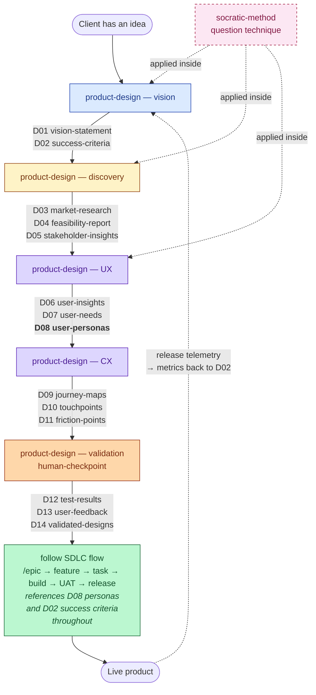

# PDLC Pipeline — Skills, Agents, and Artifacts

This document describes the **Product Definition Lifecycle (PDLC)** — the skills and artifacts that take an idea from "client has a hunch" to "validated concept, ready to build." Implementation, QA, UAT, and release are deliberately treated as a single downstream **SDLC** concern from this diagram's perspective.

The PDLC produces D-numbered artifacts D01–D14. The SDLC consumes them and produces its own outputs (code, tests, QA reports, UAT logs, release notes) in their normal repo locations — none of those are D-numbered.

## Exit Points

The pipeline is drawn at full fidelity. Most projects exit earlier than D14 — pick the latest gate that earns its keep for your context:

| Exit | When to use it | Hand off to |
|---|---|---|
| **After D11** (friction-points) | Internal team, iterative delivery, validation handled per-feature via `/uat` | `/epic` with D08+D09+D11 as inputs |
| **After D14** (validated-designs) | Want concept-level validation against a mockup before committing to build | `/epic` with D14 as the "go-build" signal |

D15 (approved-designs) and D16 (dev-go-ahead) — formal client scope-lock and authorization ceremonies — have been removed from the pipeline. The shark epic-approval lifecycle handles the same job for internal work; consulting engagements that need a paper-trail handoff should produce those documents outside this pipeline.

## Conventions

- **D-numbers are a global PDLC sequence**, not per-skill. Each artifact has a unique `D##-name.md` and the numbers reflect the order they are produced in.
- **All D-numbered artifacts live in `docs/product/`** (flat folder; ~15–19 files for a complete run).
- **F-numbered artifacts** are scoped per feature and live in `docs/plan/<epic>/<feature>/`. F-numbers split between two skills:
  - `specification-writing` produces F01 (feature PRD) and F02 (user stories).
  - `feature-design` produces F07 (wireframes), F08 (prototype), and F09 (feature journey map).
- **E-numbered** (epics) and **T-numbered** (tasks) follow the same per-feature convention.
- Code, tests, QA reports, and UAT decision logs are not D-numbered — they live in their normal repo locations.
- `socratic-method` and `brainstorming` are **technique helpers, not flow nodes**. Socratic-method is the underlying question technique; brainstorming is a 5-phase idea-refinement shape that uses socratic-method internally and hands off to an artifact-producing skill (`product-design`, `feature-design`, `epic`, `prd`, `task`, `triage`).

## Pipeline Flow



**Solid arrows** = main PDLC flow. **Dashed arrows** = helper invocation and feedback loop. The PDLC ends at D14; everything after it is the SDLC's responsibility.

## What "Follow SDLC Flow" Covers

The single SDLC box in the diagram unpacks (in order) into the following skills, listed here so you can find them — but they are **not** part of the PDLC sequence and don't deserve their own diagram nodes:

| Sub-phase | Skill | Output |
|---|---|---|
| Epic creation & approval | `specification-writing` (`epic`) + shark | `E##-epic.md`, epic approved in shark |
| Feature PRD | `specification-writing` (`prd`) | `feature.md` (filename from shark; per feature) |
| Feature design | `feature-design` (`wireframes`, `prototype`) | `wireframes.md`, `prototype.md` (per feature) |
| Tasks | `specification-writing` (`task`) | `tasks/T-E##-F##-###.md` (per feature). User stories live inside `feature.md`, not as a separate file. |
| Build | `implementation` (TDD), `quality` (`review-code`, `qa-testing`) | code, unit tests, code review reports, QA reports |
| Acceptance | `uat` | UAT decision log |
| Release | `devops` | release notes, deployment runbook, monitoring/alerting setup (in their normal repo locations — not D-numbered) |
| Sprint orchestration | `sprint-planning`, `sprint-execution`, `sprint-analytics` (`/plan-sprint`, `/run-sprint`, `/run-sprint-team`, `/retro-sprint`) | Sprint state in shark; `docs/sprints/{S###}-retro.md` |

**Epic-level scope-lock and authorization happen in shark**, not in a D-numbered document. When the epic transitions to its approved state, that's the signal the SDLC has been authorized.

**Release telemetry feeds back to D02** via metrics dashboards and post-launch reviews — the closure of the loop is operational, not document-based.

**Feature-level sequence inside the SDLC:** `feature PRD → wireframes → optional prototype and feature-journey → tasks → build`. The `feature-design` skill is invoked after the feature PRD is approved and before tasks are written, so wireframes and journey maps shape story and task boundaries. User stories are a section inside the feature PRD, not a separate file.

## User Personas — How They Flow Through

Personas (D08) are the most cross-cutting artifact in the lineup, so a quick callout:

- **Inputs** (what feeds them): D05 stakeholder-insights, D06 user-insights, D07 user-needs.
- **Producer**: ux-designer agent during the UX design phase.
- **PDLC consumers**: D09 journey-maps (personas are the actors); D12–D14 validation (sessions and verdicts reference personas for whose feedback to weight).
- **SDLC consumers** (where the persona reference crosses the boundary): epic and feature PRDs cite personas in user stories ("As [persona] I want…"); tasks cite them in acceptance criteria; UAT scripts test against persona behaviors.

If you find yourself writing a PRD without referencing a persona, that's a smell — either D08 is missing/stale or the user story needs sharpening.

## PDLC Artifact Table

All PDLC artifacts (D01–D14) are produced by the single `product-design` skill, which has one workflow per D-artifact. The "Workflow" column below names the file inside `product-design/workflows/`.

| Phase | Skill | Workflow | Producer (agent) | D-# | Artifact | Primary consumers |
|---|---|---|---|---|---|---|
| **Vision** | `product-design` | `d01-vision.md` | client | D01 | `D01-vision-statement.md` | discovery, UX/CX design, SDLC spec, all downstream |
| Vision | `product-design` | `d02-success-criteria.md` | client | D02 | `D02-success-criteria.md` | UAT, release telemetry, all downstream evaluation |
| **Discovery** | `product-design` | `d03-market-research.md` | researcher | D03 | `D03-market-research.md` | UX/CX design, PRD, positioning |
| Discovery | `product-design` | `d04-feasibility.md` | architect | D04 | `D04-feasibility-report.md` | architecture, PRD, scoping |
| Discovery | `product-design` | `d05-stakeholder-insights.md` | business-analyst | D05 | `D05-stakeholder-insights.md` | UX research synthesis, PRD |
| **UX Design** | `product-design` | `d06-user-insights.md` | ux-designer | D06 | `D06-user-insights.md` | needs, personas |
| UX Design | `product-design` | `d07-user-needs.md` | ux-designer | D07 | `D07-user-needs.md` | personas, journey-maps |
| UX Design | `product-design` | `d08-user-personas.md` | ux-designer | D08 | `D08-user-personas.md` | journey-maps, F07–F09, **referenced throughout SDLC** |
| **CX Design** | `product-design` | `d09-journey-maps.md` | cx-designer | D09 | `D09-journey-maps.md` | touchpoints, feature scoping, F09 |
| CX Design | `product-design` | `d10-touchpoints.md` | cx-designer | D10 | `D10-touchpoints.md` | F07 wireframes, F08 prototype |
| CX Design | `product-design` | `d11-friction-points.md` | cx-designer | D11 | `D11-friction-points.md` | F07 wireframes, F09 journey maps, prioritization |
| **Validation** | `product-design` | `d12-test-results.md` | human (real user) | D12 | `D12-test-results.md` | feedback synthesis |
| Validation | `product-design` | `d13-user-feedback.md` | synthesizer | D13 | `D13-user-feedback.md` | validated designs |
| Validation | `product-design` | `d14-validated-designs.md` | synthesizer | D14 | `D14-validated-designs.md` | **handoff to SDLC** (`/epic`) |

Below the line is SDLC territory (included for completeness; not on the PDLC diagram). SDLC artifact filenames follow the existing repo convention (see `specification-writing/context/naming-conventions.md`) — bare descriptive names or numeric-prefixed (`02-…`, `03-…`), never `F##-`-prefixed.

| Phase | Skill | Artifact |
|---|---|---|
| Feature PRD (SDLC) | `specification-writing` | `feature.md` (filename from shark; verify via `shark get <feature-key> --json`). User stories are a section inside this file, not a separate file. |
| Feature design (SDLC) | `feature-design` (`wireframes.md`) | `wireframes.md` (per feature) |
| Feature design (SDLC) | `feature-design` (`prototype.md`) | `prototype.md` (per feature, optional) |
| Architecture (SDLC) | `architecture` | `02-architecture.md` through `07-implementation-phases.md` (numeric-prefixed) |
| Tasks (SDLC) | `specification-writing` (`write-task.md`) | `tasks/T-E##-F##-###.md` |

## Side-Helper: Socratic Method

`socratic-method` is the underlying questioning technique used at every elicitation point in the PDLC. It is invoked transitively from `product-design` (vision elicitation in D01–D02, interviews in D03/D05, persona refinement in D06–D08, and validation conversations in D12–D14). It produces no artifacts of its own; its value is the discipline of the questions asked inside other skills.

`brainstorming` is a related but distinct skill — a 5-phase shape (Anchor → Understand → Explore Alternatives → Sharpen → Hand Off) that uses socratic-method internally. Use brainstorming when the user has a fuzzy idea and you don't yet know which artifact-producing skill it should feed; brainstorming sharpens the idea and offers the handoff (most commonly to `product-design` or `epic`). It's not on the diagram because it's not a phase — it's an entry-ramp helper.

## Skill-to-Skill Handoff Rules

- **`product-design` (D01–D02) → everything.** D01/D02 are the foundation. If they're missing or stale, downstream workflows should propose running them first rather than inventing constraints.
- **`product-design` discovery (D03–D05) is bounded by D01.** Market-research (D03) uses the target user from D01 §2 to scope competitors. Feasibility-analysis (D04) uses D01 §6 (Constraints) as hard limits. Stakeholder-research (D05) interviews against D01's named segment.
- **`product-design` UX/CX (D06–D11) consumes D03–D05** plus D01 for scope. UX (ux-designer) produces D06–D08; CX (cx-designer) produces D09–D11.
- **Validation gates (D12–D14) are *human* steps.** The `product-design` validation workflows prepare artifacts but the user is the actual decision-maker.
- **D14 is the PDLC→SDLC boundary.** Once D14 marks the concept as validated (or you exit earlier — see Exit Points), work hands off to `/epic` to create the epic in shark, then `specification-writing` for F01 PRD, then `feature-design` for F07–F09, then `specification-writing` for F02 stories and tasks, then `implementation` and `quality` for build, then `uat`, then `devops`. Epic-level scope-lock and authorization are tracked in shark, not in a D-numbered document.
- **`feature-design` consumes `product-design` outputs.** Wireframes/prototype/feature-journey all anchor to D08 personas and D09 journey stages — never invent personas at the feature level.
- **The loop closes operationally.** Release telemetry from `devops` feeds metrics back to D02 via dashboards and post-launch reviews, not via numbered documents.

## Where Artifacts Live

```
docs/
├── product/                          ← all D-numbered artifacts (flat)
│   ├── D01-vision-statement.md
│   ├── D02-success-criteria.md
│   ├── D03-market-research.md
│   ├── D04-feasibility-report.md
│   ├── D05-stakeholder-insights.md
│   ├── D06-user-insights.md
│   ├── D07-user-needs.md
│   ├── D08-user-personas.md           ← cross-cutting; referenced from SDLC
│   ├── D09-journey-maps.md
│   ├── D10-touchpoints.md
│   ├── D11-friction-points.md
│   ├── D12-test-results.md
│   ├── D13-user-feedback.md
│   └── D14-validated-designs.md       ← PDLC ends here
└── plan/                              ← epic/feature/task specs (per existing convention)
    └── <epic-id>/
        └── <feature-id>/
            ├── feature.md                   ← specification-writing (filename from shark; PRD)
            ├── wireframes.md                ← feature-design
            ├── prototype.md                 ← feature-design (optional)
            ├── 02-architecture.md           ← architecture
            ├── 03-database-design.md        ← architecture
            ├── 04-api-specification.md      ← architecture
            ├── 05-frontend-design.md        ← architecture
            ├── 06-security-performance.md   ← architecture
            ├── 07-implementation-phases.md  ← architecture
            ├── tasks/                       ← specification-writing (write-task)
            │   └── T-E##-F##-###.md
            └── reviews/                     ← cx-designer review reports
                ├── experience-validation.md
                ├── journey-coherence.md
                ├── experience-review.md
                └── accessibility-notes.md
```

## Caveats and Open Items

- **The validation phase (D12–D14) is owned by the `product-design` skill** via the workflows `d12-test-results.md`, `d13-user-feedback.md`, and `d14-validated-designs.md`. The `human-checkpoint` and `client` agents remain the actors; the skill orchestrates their elicitation and artifact production.
- **D15 (approved-designs) and D16 (dev-go-ahead) have been removed.** The shark epic-approval lifecycle handles scope-lock and dev authorization for internal work. Consulting engagements that need formal client paper-trail signoff should produce those documents outside this pipeline.
- **D17 (release-candidate), D18 (deployed-product), and D19 (feedback-channels) have been removed.** Release notes, deployment runbooks, and monitoring/alerting configuration live in their normal repo locations — `devops` produces them, but they are not D-numbered. Telemetry feedback to D02 is operational (dashboards, post-launch reviews), not document-based.
- **The pre-existing `vision` slash-command** (`/vision`) starts a PDLC workflow inside shark; it is *not* the same as the `product-design` skill, which produces D01/D02 documents through `d01-vision.md` and `d02-success-criteria.md`. The slash-command may invoke the skill internally; double-check before relying on either.
- **No F##-prefixed artifact filenames.** Earlier drafts of the pipeline used `F01-feature-prd.md`, `F07-wireframes.md`, etc. — those names were fabricated and do not match the actual repo convention. Real filenames: `feature.md` (PRD, from shark), `wireframes.md`, `prototype.md`, plus the architect's `02-` through `07-` numbered files. The `F##` token is reserved for **feature keys** (e.g., `E07-F08`), not artifact prefixes.
- **No feature-level journey artifact.** The epic-level `user-journeys.md` (and PDLC `D09-journey-maps.md`) are the journey sources of truth. Feature-level journey zooms were tried as an artifact but added more overhead than value — wireframes carry the feature-specific flow.
- **CX review artifacts live in `reviews/`.** `reviews/experience-validation.md`, `reviews/journey-coherence.md`, `reviews/experience-review.md`, `reviews/accessibility-notes.md` — alongside the feature directory.
- **D-numbering ends at D14.** D15–D19 have been retired (D15/D16 were ceremonial signoff documents; D17–D19 were release docs that duplicate operational telemetry). New D-documents append at D15+.

---

**Last updated:** 2026-04-27
