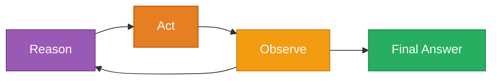
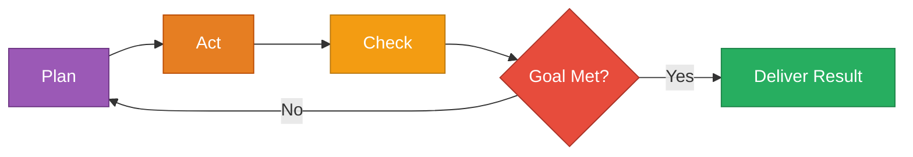
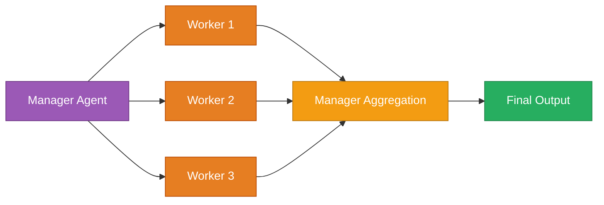
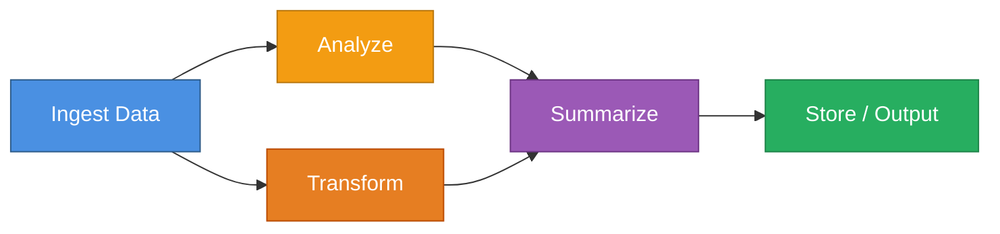
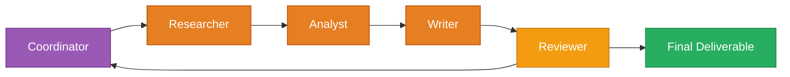
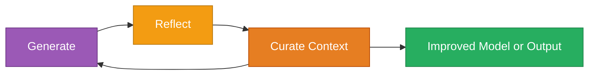

# Common Agentic Workflow Patterns

A visual and structural overview of key patterns in agentic system design.
Each section includes a summary, workflow diagram, and node-level responsibilities.

## Table of Contents

- [Quick Reference](#quick-reference)
- [Framework Suitability](#framework-suitability)
- [Core Patterns](#core-patterns)
  - [1. Direct Tool-Calling](#1-direct-tool-calling)
  - [2. ReAct (Reason + Act)](#2-react-reason--act)
  - [3. Plan → Act → Check (PAC)](#3-plan--act--check-pac)
  - [4. Hierarchical (Manager / Worker)](#4-hierarchical-manager--worker)
  - [5. Graph / DAG Workflow](#5-graph--dag-workflow)
  - [6. Multi-Agent Collaboration (Crew)](#6-multi-agent-collaboration-crew)
  - [7. Agentic RAG](#7-agentic-rag-retrieval-augmented-generation)
  - [8. Reflective / Self-Improving](#8-reflective--self-improving-ace-or-reflexion)
- [Pattern Composition](#pattern-composition)
- [Legend](#legend)
- [Related Resources](#related-resources)

---

## Quick Reference

| Pattern | Best For | Complexity | Key Benefit |
|---------|----------|------------|-------------|
| **Direct Tool-Calling** | Simple, single-task operations | Low | Fast, deterministic |
| **ReAct** | Exploratory tasks needing iteration | Medium | Adaptive reasoning |
| **Plan → Act → Check** | Quality-critical workflows | Medium | Built-in validation |
| **Hierarchical** | Parallelizable subtasks | Medium-High | Efficient delegation |
| **Graph/DAG** | Multi-step data pipelines | Medium-High | Clear dependencies |
| **Multi-Agent Crew** | Role-based collaboration | High | Specialized expertise |
| **Agentic RAG** | Knowledge-grounded answers | Medium-High | Source verification |
| **Reflective** | Long-running improvement | High | Self-optimization |

---

## Framework Suitability

**LangGraph** excels at:
- **Graph/DAG Workflow** - Native StateGraph support with explicit edge definitions
- **Plan → Act → Check** - Conditional edges enable validation loops
- **Agentic RAG** - Built-in memory and state management for retrieval pipelines

**CrewAI** excels at:
- **Multi-Agent Collaboration** - Core design around role-based agents
- **Hierarchical** - Manager/worker delegation is native pattern
- **ReAct** - Agent role definitions with tool access

**DSPy** excels at:
- **Direct Tool-Calling** - `dspy.Predict` with function signatures
- **ReAct** - `dspy.ReAct` module with optimization support
- **Reflective/Self-Improving** - Optimization-driven design philosophy

---

## Core Patterns

## 1. Direct Tool-Calling

*[legend](#legend)*

#### Summary
A single agent directly calls one or more tools to perform a defined task — the simplest and fastest agentic pattern.

#### Node Description

**Agent**

* Parses and interprets the user's request
* Chooses the correct tool or function to call
* Formats parameters and validates input

**Tool Call**

* Executes a deterministic operation (e.g., API, function, script)
* Returns structured output

**Result Returned**

* Agent packages and delivers the tool's output to the user or next system

#### Implementation Notes

- **Tool Selection**: Use function schemas with clear input/output contracts
- **Error Handling**: Implement try-catch around tool calls with graceful fallbacks
- **When to Use**: Deterministic tasks with known tools (API calls, calculations, data retrieval)
- **Avoid When**: Task requires exploration or multiple attempts to succeed

#### Use Cases

- **API Integration**: "Get current weather for New York" → calls weather API → returns formatted data
- **Data Lookup**: "Find user by email" → queries database → returns user record
- **Simple Calculations**: "Convert 100 USD to EUR" → calls currency API → returns conversion

---

## 2. ReAct (Reason + Act)

*[legend](#legend)*

#### Summary

An iterative loop where the agent reasons about the situation, performs an action, observes the result, and continues until done.

#### Node Description

**Reason**

* Interprets the problem and decides next step
* Plans which tool or action to take

**Act**

* Executes the chosen tool or step
* Collects the immediate outcome

**Observe**

* Reads and evaluates results
* Determines if the goal has been met

**Final Answer**

* Returns a synthesized result when the loop converges

#### Implementation Notes

- **Loop Control**: Set max iterations (5-10 typical) to prevent infinite loops
- **Observation Parsing**: Structure tool outputs for consistent parsing by the agent
- **Early Exit**: Define clear success criteria in Observe step
- **Cost Management**: Each iteration costs LLM tokens—monitor usage carefully
- **State Tracking**: Maintain conversation history across iterations

#### Use Cases

- **Research Tasks**: "What's the population of the capital of France?" → reason (need capital) → act (search "capital of France") → observe ("Paris") → reason (need population) → act (search "Paris population") → final answer
- **Debugging**: "Why is this API failing?" → reason (check logs) → act (fetch logs) → observe (error) → reason (check config) → act (read config) → final answer
- **Multi-Step Problem Solving**: Complex queries requiring iterative exploration

---

## 3. Plan → Act → Check (PAC)

*[legend](#legend)*

#### Summary

A structured cycle separating planning, execution, and evaluation phases for quality assurance and governance.

#### Node Description

**Plan**

* Defines the objective and execution steps
* Allocates tools, agents, and resources

**Act**

* Executes planned actions
* Records outputs and observations

**Check**

* Verifies quality, correctness, and completeness
* Produces feedback for re-planning if necessary

**Deliver Result**

* Outputs validated, reviewed outcome

#### Implementation Notes

- **Quality Metrics**: Define measurable success criteria in Check phase
- **Iteration Limits**: Set max re-plan attempts to avoid infinite refinement
- **Check Granularity**: Balance thoroughness vs execution speed
- **Feedback Loop**: Ensure Check provides actionable feedback to Plan
- **Governance**: Ideal for regulated environments requiring audit trails

#### Use Cases

- **Code Generation**: Plan (spec analysis) → Act (generate code) → Check (run tests) → iterate until tests pass
- **Content Creation**: Plan (outline) → Act (write draft) → Check (quality review) → iterate until approved
- **Data Processing**: Plan (define pipeline) → Act (process data) → Check (validate output) → iterate until clean

---

## 4. Hierarchical (Manager / Worker)

*[legend](#legend)*

#### Summary

A manager agent delegates tasks to specialized worker agents and aggregates their results.

#### Node Description

**Manager Agent**

* Breaks problem into sub-tasks
* Assigns tasks to domain-specific workers
* Aggregates and reconciles results

**Worker Agents**

* Execute assigned sub-tasks independently
* Return structured results or analyses

**Manager Aggregation**

* Combines results, resolves conflicts
* Produces a unified conclusion

#### Implementation Notes

- **Worker Specialization**: Design workers with clear, non-overlapping domains
- **Parallel Execution**: Run workers concurrently when tasks are independent
- **Aggregation Strategy**: Define how to resolve conflicts between worker outputs
- **Avoid Deep Hierarchies**: Keep to 2 levels max (manager → workers) to reduce coordination overhead
- **Load Balancing**: Distribute work evenly across workers

#### Use Cases

- **Document Analysis**: Manager assigns sections to workers → each analyzes their section → manager synthesizes findings
- **Multi-Modal Processing**: Manager delegates image analysis, text extraction, metadata extraction to specialized workers
- **Parallel Research**: Manager assigns research topics to workers → each gathers data → manager combines insights

---

## 5. Graph / DAG Workflow

*[legend](#legend)*

#### Summary

A directed acyclic graph defines a deterministic, stateful pipeline of agent or tool executions.

#### Node Description

**Ingest Data**

* Reads or loads input into the system
* Validates format and schema

**Analyze**

* Extracts features, metadata, or insights
* Performs preliminary reasoning

**Transform**

* Processes or converts data for next stage
* Normalizes or filters content

**Summarize**

* Combines analysis and transformation outputs
* Produces concise, meaningful representation

**Store / Output**

* Writes results to storage or next workflow step

#### Implementation Notes

- **Dependency Management**: Use topological sorting to determine execution order
- **State Persistence**: Store intermediate results for debugging and recovery
- **Error Propagation**: Design nodes to handle upstream failures gracefully
- **Parallelization**: Execute independent branches concurrently
- **Idempotency**: Make nodes rerunnable without side effects

#### Use Cases

- **ETL Pipelines**: Ingest → Clean → Transform → Enrich → Load → Validate
- **ML Pipelines**: Load data → Preprocess → Feature engineering → Train → Evaluate → Deploy
- **Content Publishing**: Draft → Review → Edit → Approve → Format → Publish

---

## 6. Multi-Agent Collaboration (Crew)

*[legend](#legend)*

#### Summary

Multiple agents with defined roles collaborate and exchange information to achieve a shared objective.

#### Node Description

**Coordinator**

* Initiates the workflow and assigns roles
* Manages sequence and information flow

**Researcher**

* Gathers facts, sources, and supporting evidence

**Analyst**

* Interprets findings, draws conclusions

**Writer**

* Synthesizes output into coherent format

**Reviewer**

* Checks for quality, bias, and consistency

**Final Deliverable**

* Approved, polished result ready for output

#### Implementation Notes

- **Role Definition**: Clearly specify each agent's expertise and responsibilities
- **Communication Protocol**: Define how agents pass information (direct, via coordinator)
- **Consensus Mechanism**: Establish how to resolve disagreements between agents
- **Sequential vs Parallel**: Determine which roles can work concurrently
- **Human-in-the-Loop**: Consider where human oversight is needed (Reviewer phase)

#### Use Cases

- **Report Generation**: Researcher gathers data → Analyst interprets → Writer drafts → Reviewer validates → final report
- **Product Development**: Ideator proposes → Engineer evaluates feasibility → Designer creates mockups → Reviewer approves
- **Investigation**: Collector gathers evidence → Analyzer finds patterns → Synthesizer creates narrative → Validator checks facts

---

## 7. Agentic RAG (Retrieval-Augmented Generation)

*[legend](#legend)*

#### Summary

Combines retrieval, reasoning, and verification steps to ensure answers are grounded in source data.

#### Node Description

**Retriever**

* Searches vector or knowledge databases
* Returns relevant documents or passages

**Reranker**

* Prioritizes best matches by semantic relevance

**Generator**

* Composes answer using retrieved context

**Verifier**

* Checks for hallucinations or unsupported claims

**Grounded Answer**

* Outputs validated, source-cited response

#### Implementation Notes

- **Retrieval Strategy**: Choose between dense (semantic) vs sparse (keyword) vs hybrid retrieval
- **Chunk Size**: Balance context completeness (larger) vs precision (smaller), typically 200-800 tokens
- **Reranking Models**: Use cross-encoders for higher accuracy, bi-encoders for speed
- **Citation Format**: Include source references in outputs for auditability
- **Hallucination Detection**: Implement verification step comparing generated answer to retrieved context
- **Fallback Handling**: Define behavior when no relevant documents found

#### Use Cases

- **Customer Support**: "What's our refund policy for damaged items?" → retrieve policy docs → generate answer → verify against source → cite policy section
- **Legal Research**: Query case law → retrieve relevant cases → rank by relevance → generate summary → cite specific statutes
- **Technical Documentation**: "How do I configure SSL?" → retrieve docs → generate step-by-step guide → verify accuracy → link to source pages

---

## 8. Reflective / Self-Improving (ACE or Reflexion)

*[legend](#legend)*

#### Summary

An autonomous loop where agents generate, reflect on, and curate their evolving context to improve over time.

#### Node Description

**Generate**

* Produces initial content, plan, or hypothesis

**Reflect**

* Evaluates prior output for errors or improvement
* Logs lessons learned

**Curate Context**

* Updates long-term memory or context database
* Refines what future iterations see

**Improved Model or Output**

* Represents cumulative, adaptive improvement

#### Implementation Notes

- **Memory Architecture**: Design clear separation between short-term (episode) and long-term (persistent) memory
- **Reflection Triggers**: Define when to reflect (every N iterations, on failure, periodically)
- **Curation Strategy**: Establish rules for what to keep, update, or discard from context
- **Success Metrics**: Track improvement over time with quantitative measures
- **Convergence Criteria**: Define when system is "good enough" to stop iterating
- **Storage**: Use vector databases for semantic memory, structured DBs for explicit rules

#### Use Cases

- **Agent Training**: Generate response → Reflect on quality → Curate successful patterns → improve future responses
- **Optimization Loop**: Run experiment → Reflect on results → Curate best practices → apply to next iteration
- **Knowledge Base Evolution**: Answer query → Reflect on accuracy → Curate which sources are most reliable → prioritize better sources

---

## Pattern Composition

Real-world systems often combine multiple patterns for enhanced capabilities:

### Research + Verification Agent
**Composition**: Multi-Agent Crew + Agentic RAG
- Researcher agents use RAG to gather facts from knowledge bases
- Analyst agents use ReAct to explore findings and generate insights
- Reviewer agent verifies claims against original sources
- Coordinator uses Hierarchical pattern to orchestrate the team

**Use Case**: Automated research reports with source verification

### Self-Improving RAG System
**Composition**: Agentic RAG + Reflective
- Standard RAG pipeline for query → retrieval → generation → verification
- Reflective layer tracks which documents/chunks produced best answers
- System curates knowledge of effective retrieval strategies
- Continuously improves retrieval quality over time

**Use Case**: Enterprise knowledge bases that get smarter with usage

### Validated Pipeline Orchestrator
**Composition**: Graph/DAG + Plan → Act → Check
- DAG defines overall workflow structure and dependencies
- Each node implements Plan → Act → Check internally
- Parallel execution where dependencies allow
- Quality gates at each stage prevent error propagation

**Use Case**: ML training pipelines with validation at each stage

### Adaptive Problem Solver
**Composition**: ReAct + Hierarchical
- Top-level ReAct loop for exploration and decision-making
- When subtasks identified, spawns specialized workers (Hierarchical)
- Workers execute tasks in parallel
- Results feed back into ReAct observation phase

**Use Case**: Complex troubleshooting scenarios requiring both exploration and parallel execution

---

## Legend

Node types are represented with different colors. Each color category serves a distinct functional role:

- 🔵 **Blue - Input/Entry Points** (user requests, queries, initial data)
  - *Where data enters the system*

- 🟣 **Purple - Agents/Reasoning Nodes** (cognitive processing, planning, coordination)
  - *Where decisions are made and strategies formed*

- 🟠 **Orange - Execution/Action Nodes** (performing work, transforming data)
  - *Where actual work happens and state changes*

- 🟡 **Yellow - Evaluation/Analysis Nodes** (checking, observing, analyzing, reviewing)
  - *Where quality is assessed and feedback generated*

- 🟢 **Green - Output/Results** (final answers, deliverables, completed work)
  - *Where value is delivered to users*

- ⚪ **Light Gray - Tools/Resources** (databases, APIs, external systems)
  - *Where external capabilities are accessed*

- 🔴 **Red - Decision Points** (conditional logic, branching)
  - *Where flow control happens based on conditions*

---

## Related Resources

**Framework Comparisons**:
- [LangGraph vs CrewAI vs OpenAI Swarm](agentic-ai-docs/langraph%20v%20crewai%20vs%20swarm.md) - Detailed framework comparison with scalability, collaboration, and deployment analysis

**Implementation Guidance**:
- [AI Agent Checklist](agentic-ai-docs/ai-agent-checklist.md) - Compressed checklist for agent development from planning to production
- [DSPy Documentation](agentic-ai-docs/dspy.md) - Programming LLMs with declarative modules and optimization

**Enterprise Considerations**:
- [RAG Enterprise](agentic-ai-docs/RAG%20Enterprise.md) - Real-world lessons on enterprise RAG implementation: document quality, metadata architecture, hybrid retrieval, and production infrastructure

