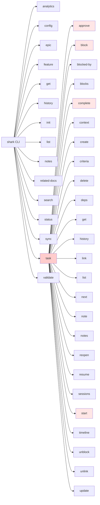
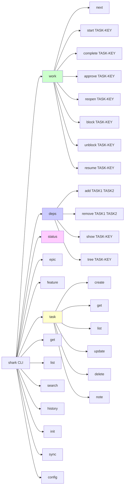
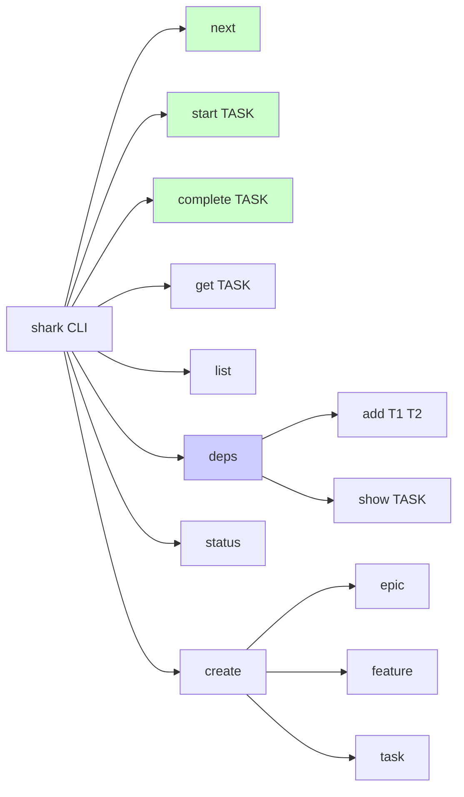

# Shark Command Hierarchy Analysis

## Current Structure (16 top-level commands)



**Problem:** `task` has **27 subcommands** - way too many!

---

## Proposed: AI-Agent-Focused Structure (13 top-level commands)

Optimized for spec-driven development workflows.



---

## Command Count Comparison

| Category | Current | Proposed | Change |
|----------|---------|----------|--------|
| **Top-level commands** | 16 | 13 | -3 |
| **Task subcommands** | 27 | 6 | -21 |
| **Work subcommands** | 0 | 8 | +8 |
| **Deps subcommands** | 0 | 4 | +4 |

---

## AI Agent Workflow Examples

### Current (verbose, nested)
```bash
# 1. Find work
shark task next --json

# 2. Start work
shark task start T-E10-F03-004 --json

# 3. Check what blocks me
shark task blocked-by T-E10-F03-004 --json

# 4. Complete work
shark task complete T-E10-F03-004 --json

# 5. Check project status
shark status --json
```

### Proposed (concise, discoverable)
```bash
# 1. Find work
shark work next --json

# 2. Start work
shark work start T-E10-F03-004 --json

# 3. Check what blocks me
shark deps show T-E10-F03-004 --json

# 4. Complete work
shark work complete T-E10-F03-004 --json

# 5. Check project status
shark status --json
```

---

## Core AI Agent Commands (The Essential 10)

For spec-driven development, AI agents primarily need:

| Command | Purpose | Frequency |
|---------|---------|-----------|
| `shark work next` | Find next task | Very High |
| `shark work start TASK` | Begin work | Very High |
| `shark work complete TASK` | Finish work | Very High |
| `shark work resume TASK` | Get context to resume | High |
| `shark deps show TASK` | Check dependencies | High |
| `shark deps add T1 T2` | Add dependency | Medium |
| `shark task get TASK` | Get task details | High |
| `shark status` | Project overview | Medium |
| `shark task create` | Create new task | Medium |
| `shark sync` | Sync filesystem | Low |

---

## Alternative: Ultra-Minimal Structure

If we want to go **even simpler** for AI agents:



This gives **8 top-level commands** for the most common AI operations.

---

## Recommendation

**For AI-agent spec-driven development:**

Go with the **"work" command group** approach (13 top-level):
- ✅ Keeps top-level manageable (13 vs 16)
- ✅ Groups lifecycle operations logically (`work`)
- ✅ Separates dependency management (`deps`)
- ✅ Reduces cognitive load (27 → 6 task subcommands)
- ✅ Makes AI agent code more readable
- ✅ Matches mental model: "I want to work on tasks" vs "I want to task... something"

### Migration Path

1. Keep old commands as **aliases** for 2-3 releases
2. Add deprecation warnings
3. Update AI agent prompts/documentation
4. Remove aliases in v2.0

Would you like me to implement this restructure?
