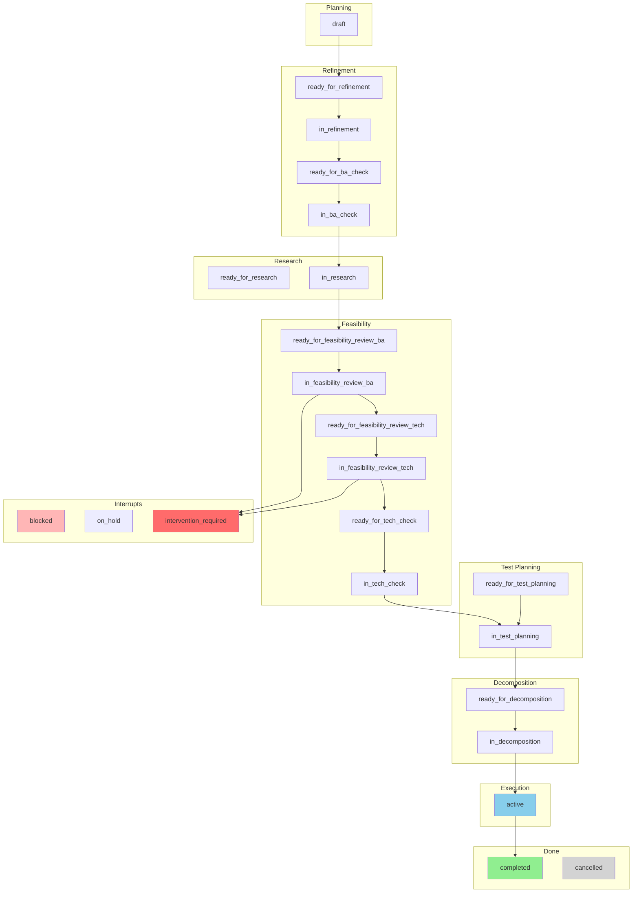

  ---             
  # Task Status Flow                                                                                                             

  ```mermaid 
  graph TD                                                                                                                     
      subgraph Planning
          draft[draft]                                                                                                         
          todo[todo]                                                                                                           
          rfba[ready_for_refinement_ba]                                                                                        
          irba[in_refinement_ba]                                                                                               
          rftech[ready_for_refinement_tech]                                                                                    
          irtech[in_refinement_tech]                                                                                           
      end                                                                                                                      
                                                                                                                               
      subgraph Development                                                                                                     
          rfdev[ready_for_development]                                                                                         
          idev[in_development]
      end

      subgraph Review                                                                                                          
          rfcr[ready_for_code_review]
          icr[in_code_review]                                                                                                  
      end         
                                                                                                                               
      subgraph QA 
          rfqa[ready_for_qa]
          iqa[in_qa]                                                                                                           
      end                                                                                                                      
                                                                                                                               
      subgraph Approval                                                                                                        
          rfapp[ready_for_approval]
          iapp[in_approval]                                                                                                    
      end
                                                                                                                               
      subgraph Terminal                                                                                                        
          completed[completed]
          cancelled[cancelled]                                                                                                 
      end         
                                                                                                                               
      subgraph Interrupts
          blocked[blocked]                                                                                                     
          on_hold[on_hold]
      end                                                                                                                      
   
      %% Happy path                                                                                                            
      draft --> rfba
      todo --> rfba                                                                                                            
      rfba --> irba
      irba --> rftech
      rftech --> irtech                                                                                                        
      irtech --> rfdev                                                                                                         
      rfdev --> idev                                                                                                           
      idev --> rfcr                                                                                                            
      rfcr --> icr                                                                                                             
      icr --> rfqa                                                                                                             
      rfqa --> iqa                                                                                                             
      iqa --> rfapp                                                                                                            
      rfapp --> iapp
      iapp --> completed                                                                                                       
                                                                                                                               
      %% Rejection loops                                                                                                       
      icr --> rfdev                                                                                                            
      iqa --> rfdev                                                                                                            
      iapp --> rfqa
                                                                                                                               
      %% Blocked/hold from active states                                                                                       
      idev --> blocked                                                                                                         
      iqa --> blocked                                                                                                          
      idev --> on_hold                                                                                                         
                                                                                                                               
      %% Cancellation                                                                                                          
      draft --> cancelled                                                                                                      
      rfdev --> cancelled                                                                                                      
                                                                                                                               
      style completed fill:#90EE90                                                                                             
      style cancelled fill:#D3D3D3                                                                                             
      style blocked fill:#FFB6B6                                                                                               
      style on_hold fill:#FFD580                                                                                               
```                                                                                                                               
  # Feature Status Flow (Happy Path)                                                                                             

```mermaid                  
  graph TD                                                                                                                     
      subgraph Validation
          draft[draft]                                                                                                         
          rfsv[ready_for_scope_validation]
          isv[in_scope_validation]                                                                                             
      end                                                                                                                      
                                                                                                                               
      subgraph Triage                                                                                                          
          rftriage[ready_for_triage]
          itriage[in_triage]
      end                                                                                                                      
   
      subgraph Research                                                                                                        
          rfresearch[ready_for_research]
          iresearch[in_research]                                                                                               
      end
                                                                                                                               
      subgraph Refinement
          rfrba[ready_for_refinement_ba]
          irba[in_refinement_ba]                                                                                               
          rfbac[ready_for_ba_check]                                                                                            
          ibac[in_ba_check]                                                                                                    
          rfrtech[ready_for_refinement_tech]                                                                                   
          irtech[in_refinement_tech]                                                                                           
          rftechc[ready_for_tech_check]                                                                                        
          itechc[in_tech_check]                                                                                                
      end                                                                                                                      
                                                                                                                               
      subgraph Test Planning                                                                                                   
          rftp[ready_for_test_planning]
          itp[in_test_planning]                                                                                                
      end         

      subgraph Decomposition
          rftg[ready_for_task_generation]
          itg[in_task_generation]                                                                                              
      end
                                                                                                                               
      subgraph Execution
          rtb[ready_to_build]
          active[active]                                                                                                       
      end                                                                                                                      
                                                                                                                               
      subgraph Done                                                                                                            
          completed[completed]
          cancelled[cancelled]
      end

      subgraph Interrupts
          blocked[blocked]
          on_hold[on_hold]                                                                                                     
      end                                                                                                                      
                                                                                                                               
      %% Happy path                                                                                                            
      draft --> rfsv
      rfsv --> isv                                                                                                             
      isv --> rftriage
      rftriage --> itriage                                                                                                     
      itriage --> rfresearch                                                                                                   
      rfresearch --> iresearch                                                                                                 
      iresearch --> rfrtech                                                                                                    
      rfrtech --> irtech                                                                                                       
      irtech --> rftechc                                                                                                       
      rftechc --> itechc                                                                                                       
                                                                                                                               
      %% BA refinement branch                                                                                                  
      itriage --> rfrba                                                                                                        
      rfrba --> irba                                                                                                           
      irba --> rfbac                                                                                                           
      rfbac --> ibac                                                                                                           
      ibac --> rfrtech                                                                                                         
                                                                                                                               
      %% After tech check
      itechc --> rftp                                                                                                          
      rftp --> itp                                                                                                             
      itp --> rftg
      rftg --> itg                                                                                                             
      itg --> rtb                                                                                                              
      rtb --> active                                                                                                           
      active --> completed                                                                                                     
                  
      style completed fill:#90EE90,color:#000
      style cancelled fill:#D3D3D3
      style blocked fill:#FFB6B6
      style rtb fill:#98FB98
      style active fill:#87CEEB                                                                                                
```


# Epic Status Flow                                       


  ---                                                                                                                          
