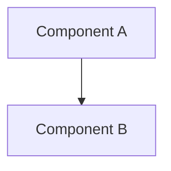

# Output Conventions

Every brownfield-analysis document follows these conventions so the body of work reads as one
coherent set.

## Document header

Begin each document with a title and a short provenance block:

```markdown
# [Document Title]

> Part of the [Project Name] Brownfield Analysis
> Generated: [ISO timestamp]
```

## Cross-references

Link to related documents using relative paths:

```markdown
See also: [Dependencies](../architecture/dependencies.md)
```

## Mermaid diagrams

Wrap every diagram in a fenced `mermaid` code block:

````markdown

````

## Evidence references

When referencing source code, name the exact path:

```markdown
- Uses the Factory pattern (`src/main/java/com/example/factory/UserFactory.java`)
```

When citing a dependency version, draw it from the actual build file:

```markdown
- `commons-collections:commons-collections:3.2.1` (`pom.xml`, line 42) — CVE-2015-6420
```

## Tables

Use Markdown tables for inventories and comparisons:

```markdown
| Component | Language | Files | Purpose        |
|-----------|----------|-------|----------------|
| core-api  | Java     | 142   | REST API layer |
```

## Severity ratings

When documenting technical debt or security issues, use a consistent four-level scale:

| Rating | Meaning |
|--------|---------|
| Critical | Actively exploitable or causing current failures |
| High | Significant risk; fix before next release |
| Medium | Should be fixed in the next quarter |
| Low | Minor concern; address when convenient |
