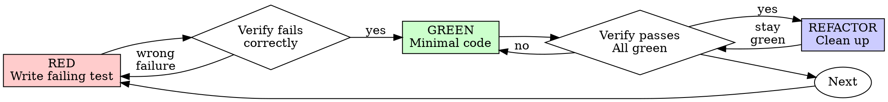

# Test-Driven Development (TDD)

## Overview

Write the test first. Watch it fail. Write minimal code to pass.

**Core principle:** If you didn't watch the test fail, you don't know if it tests the right thing.

**Test your logic, not the tools:** Databases, frameworks, and libraries are already tested. Once you've verified integration with a repository test, mock all database behavior. Test behavior and business logic, not data retrieval.

**Violating the letter of the rules is violating the spirit of the rules.**

## When to Use

**Always:**
- New features
- Bug fixes
- Refactoring
- Behavior changes

**Exceptions (ask your human partner):**
- Throwaway prototypes
- Generated code
- Configuration files

Thinking "skip TDD just this once"? Stop. That's rationalization.

## The Iron Law

```
NO PRODUCTION CODE WITHOUT A FAILING TEST FIRST
```

Write code before the test? Delete it. Start over.

**No exceptions:**
- Don't keep it as "reference"
- Don't "adapt" it while writing tests
- Don't look at it
- Delete means delete

Implement fresh from tests. Period.

## Test Plan-Driven TDD (Shift-Left Integration)

When a **QA-authored test plan** exists for your task (created during the `test_planning` phase), test scenarios come from the test plan and feature PRD — not from your own interpretation of the task spec.

**How to check:** Look for a test plan in `docs/plan/$EPIC_ID/$FEATURE_ID/test_plans/` matching your task ID. The implementation skill's process flow will direct you to read it.

**When a test plan exists:**

1. **Read the test plan first** — it defines the acceptance test cases with concrete inputs and expected outputs
2. **Read the parent feature PRD** — understand the feature-level intent behind the test cases
3. **Write tests that validate the test plan scenarios** — translate each TC-NNN test case into automated tests
4. **Follow Red-Green-Refactor** as normal — the cycle doesn't change, only the source of test scenarios does

**What changes:**
- Test scenarios come from the QA test plan, not your interpretation
- Edge cases and negative cases are already specified
- Expected outputs are concrete, not inferred
- Each test traces to a feature PRD requirement (documented in the test case)

**What stays the same:**
- The Iron Law still applies — no production code without a failing test
- Red-Green-Refactor cycle is unchanged
- Minimal code to pass each test
- Verify RED, then GREEN, then REFACTOR

**Why this matters:** Without this, you're self-grading — writing both the test scenarios and the code, validating your own interpretation of the spec. The QA test plan is an independent validation of what "correct" means, grounded in the feature PRD.

**No test plan exists?** Follow standard TDD. Write tests from the task spec and acceptance criteria as usual.

---

## Red-Green-Refactor



### RED - Write Failing Test

Write one minimal test showing what should happen.

<Good>
```typescript
test('retries failed operations 3 times', async () => {
  let attempts = 0;
  const operation = () => {
    attempts++;
    if (attempts < 3) throw new Error('fail');
    return 'success';
  };

  const result = await retryOperation(operation);

  expect(result).toBe('success');
  expect(attempts).toBe(3);
});
```
Clear name, tests real behavior, one thing
</Good>

<Bad>
```typescript
test('retry works', async () => {
  const mock = jest.fn()
    .mockRejectedValueOnce(new Error())
    .mockRejectedValueOnce(new Error())
    .mockResolvedValueOnce('success');
  await retryOperation(mock);
  expect(mock).toHaveBeenCalledTimes(3);
});
```
Vague name, tests mock not code
</Bad>

**Requirements:**
- One behavior
- Clear name
- Real code (no mocks unless unavoidable)

### Verify RED - Watch It Fail

**MANDATORY. Never skip.**

```bash
npm test path/to/test.test.ts
```

Confirm:
- Test fails (not errors)
- Failure message is expected
- Fails because feature missing (not typos)

**Test passes?** You're testing existing behavior. Fix test.

**Test errors?** Fix error, re-run until it fails correctly.

### GREEN - Minimal Code

Write simplest code to pass the test.

<Good>
```typescript
async function retryOperation<T>(fn: () => Promise<T>): Promise<T> {
  for (let i = 0; i < 3; i++) {
    try {
      return await fn();
    } catch (e) {
      if (i === 2) throw e;
    }
  }
  throw new Error('unreachable');
}
```
Just enough to pass
</Good>

<Bad>
```typescript
async function retryOperation<T>(
  fn: () => Promise<T>,
  options?: {
    maxRetries?: number;
    backoff?: 'linear' | 'exponential';
    onRetry?: (attempt: number) => void;
  }
): Promise<T> {
  // YAGNI
}
```
Over-engineered
</Bad>

Don't add features, refactor other code, or "improve" beyond the test.

### Verify GREEN - Watch It Pass

**MANDATORY.**

```bash
npm test path/to/test.test.ts
```

Confirm:
- Test passes
- Other tests still pass
- Output pristine (no errors, warnings)

**Test fails?** Fix code, not test.

**Other tests fail?** Fix now.

### REFACTOR - Clean Up

After green only:
- Remove duplication
- Improve names
- Extract helpers

Keep tests green. Don't add behavior.

### Repeat

Next failing test for next feature.

## Good Tests

| Quality | Good | Bad |
|---------|------|-----|
| **Minimal** | One thing. "and" in name? Split it. | `test('validates email and domain and whitespace')` |
| **Clear** | Name describes behavior | `test('test1')` |
| **Shows intent** | Demonstrates desired API | Obscures what code should do |
| **Tests logic** | Tests YOUR behavior and business logic | Tests database queries, framework features |
| **Fast** | Mocks repositories (except repo tests) | Connects to DB in every test |

## Database and Repository Testing

**THE GOLDEN RULE: Test your logic and behavior, not known working tools.**

Databases are already tested by their vendors. Once you write repository tests that establish the database integration works, you're done testing the database. Every other test should mock the repository.

**Critical distinction:**
- **Repository tests** (few) → Test actual DB to verify integration works
- **Service/business logic tests** (many) → Mock repositories, test YOUR logic

Don't waste time testing data retrieval repeatedly. You're not testing the database's ability to store and retrieve data—that's Oracle/Postgres/MySQL's job and they've already done it. You're testing that YOUR code does the right thing with that data.

<Good>
```typescript
// Service test - mock the repository
test('getUserTasks returns active tasks', async () => {
  const mockRepo = {
    findByUserId: jest.fn().mockResolvedValue([
      { id: 1, status: 'active' },
      { id: 2, status: 'active' }
    ])
  };

  const service = new TaskService(mockRepo);
  const tasks = await service.getUserTasks(123);

  expect(tasks).toHaveLength(2);
  expect(mockRepo.findByUserId).toHaveBeenCalledWith(123);
});
```
Service tests mock repository—no DB needed
</Good>

<Bad>
```typescript
// Service test - connects to real DB
test('getUserTasks returns active tasks', async () => {
  const db = await setupTestDatabase();
  await db.insert({ userId: 123, status: 'active' });

  const service = new TaskService(new TaskRepository(db));
  const tasks = await service.getUserTasks(123);

  expect(tasks).toHaveLength(1);
});
```
**WRONG:** Slow, brittle, tests database vendor's code not YOUR service logic.

**Why this is wrong:**
- Tests data retrieval (that's the DB's job, already tested by Oracle/Postgres/MySQL)
- Slow (DB setup/teardown for every test)
- Doesn't test YOUR business logic
- Wastes time testing known working tools
</Bad>

<Good>
```typescript
// Repository test - connects to real DB
test('TaskRepository.findByUserId queries correctly', async () => {
  const db = await setupTestDatabase();
  await db.insert({ userId: 123, status: 'active' });

  const repo = new TaskRepository(db);
  const tasks = await repo.findByUserId(123);

  expect(tasks).toHaveLength(1);
  expect(tasks[0].userId).toBe(123);
});
```
Repository test validates DB interaction
</Good>

**Key principle:** Test your logic, not the database. Once repository tests establish the DB works, mock repositories in all other tests. Don't test data retrieval—that's not your code, that's the database vendor's code. Test YOUR business logic and behavior.

## Why Order Matters

**"I'll write tests after to verify it works"**

Tests written after code pass immediately. Passing immediately proves nothing:
- Might test wrong thing
- Might test implementation, not behavior
- Might miss edge cases you forgot
- You never saw it catch the bug

Test-first forces you to see the test fail, proving it actually tests something.

**"I already manually tested all the edge cases"**

Manual testing is ad-hoc. You think you tested everything but:
- No record of what you tested
- Can't re-run when code changes
- Easy to forget cases under pressure
- "It worked when I tried it" ≠ comprehensive

Automated tests are systematic. They run the same way every time.

**"Deleting X hours of work is wasteful"**

Sunk cost fallacy. The time is already gone. Your choice now:
- Delete and rewrite with TDD (X more hours, high confidence)
- Keep it and add tests after (30 min, low confidence, likely bugs)

The "waste" is keeping code you can't trust. Working code without real tests is technical debt.

**"TDD is dogmatic, being pragmatic means adapting"**

TDD IS pragmatic:
- Finds bugs before commit (faster than debugging after)
- Prevents regressions (tests catch breaks immediately)
- Documents behavior (tests show how to use code)
- Enables refactoring (change freely, tests catch breaks)

"Pragmatic" shortcuts = debugging in production = slower.

**"Tests after achieve the same goals - it's spirit not ritual"**

No. Tests-after answer "What does this do?" Tests-first answer "What should this do?"

Tests-after are biased by your implementation. You test what you built, not what's required. You verify remembered edge cases, not discovered ones.

Tests-first force edge case discovery before implementing. Tests-after verify you remembered everything (you didn't).

30 minutes of tests after ≠ TDD. You get coverage, lose proof tests work.

## Common Rationalizations

| Excuse | Reality |
|--------|---------|
| "Too simple to test" | Simple code breaks. Test takes 30 seconds. |
| "I'll test after" | Tests passing immediately prove nothing. |
| "Tests after achieve same goals" | Tests-after = "what does this do?" Tests-first = "what should this do?" |
| "Already manually tested" | Ad-hoc ≠ systematic. No record, can't re-run. |
| "Deleting X hours is wasteful" | Sunk cost fallacy. Keeping unverified code is technical debt. |
| "Keep as reference, write tests first" | You'll adapt it. That's testing after. Delete means delete. |
| "Need to explore first" | Fine. Throw away exploration, start with TDD. |
| "Test hard = design unclear" | Listen to test. Hard to test = hard to use. |
| "TDD will slow me down" | TDD faster than debugging. Pragmatic = test-first. |
| "Manual test faster" | Manual doesn't prove edge cases. You'll re-test every change. |
| "Existing code has no tests" | You're improving it. Add tests for existing code. |
| "Need to test DB works" | Database vendor already tested it. Test YOUR logic, mock the repo. |
| "Should test actual data retrieval" | Repository test does that once. Don't repeat. Test behavior not tools. |

## Red Flags - STOP and Start Over

- Code before test
- Test after implementation
- Test passes immediately
- Can't explain why test failed
- Tests added "later"
- Rationalizing "just this once"
- "I already manually tested it"
- "Tests after achieve the same purpose"
- "It's about spirit not ritual"
- "Keep as reference" or "adapt existing code"
- "Already spent X hours, deleting is wasteful"
- "TDD is dogmatic, I'm being pragmatic"
- "This is different because..."
- **Testing database queries in service/business logic tests (mock the repo!)**
- **Connecting to real DB outside of repository tests**

**All of these mean: Delete code. Start over with TDD.**

## Verification Checklist

Before marking work complete:

- [ ] Every new function/method has a test
- [ ] Watched each test fail before implementing
- [ ] Each test failed for expected reason (feature missing, not typo)
- [ ] Wrote minimal code to pass each test
- [ ] All tests pass
- [ ] Output pristine (no errors, warnings)
- [ ] Tests use real code (mocks only if unavoidable)
- [ ] **Repository mocked in all service/business logic tests** (DB only in repo tests)
- [ ] Edge cases and errors covered

Can't check all boxes? You skipped TDD. Start over.

## When Stuck

| Problem | Solution |
|---------|----------|
| Don't know how to test | Write wished-for API. Write assertion first. Ask your human partner. |
| Test too complicated | Design too complicated. Simplify interface. |
| Must mock everything | Code too coupled. Use dependency injection. |
| Test setup huge | Extract helpers. Still complex? Simplify design. |
| Tests are slow | Connecting to DB in service tests? Mock the repository instead. |
| Need real DB for test | Is this a repository test? Use real DB. Service test? Mock repo. |

## Debugging Integration

Bug found? Never fix without a test. The test proves the fix and prevents regression.

**For detailed workflow, see:** [references/debugging-workflow.md](references/debugging-workflow.md)

### Quick Reference

```
1. CAPTURE: Document bug (what, steps, expected, actual)
2. TEST: Write failing test that reproduces bug
3. VERIFY RED: Run test, confirm correct failure
4. FIX: Minimal code to pass test
5. VERIFY GREEN: Run test, confirm pass + no regressions
6. EXPAND: Check edge cases, add more tests if needed
```

### Example: Bug Fix with TDD

**Bug:** Empty email accepted

**RED**
```typescript
test('rejects empty email', async () => {
  const result = await submitForm({ email: '' });
  expect(result.error).toBe('Email required');
});
```

**Verify RED**
```bash
$ npm test
FAIL: expected 'Email required', got undefined
```

**GREEN**
```typescript
function submitForm(data: FormData) {
  if (!data.email?.trim()) {
    return { error: 'Email required' };
  }
  // ...
}
```

**Verify GREEN**
```bash
$ npm test
PASS
```

### Referencing from Other Skills

Debugging skills can reference this workflow:

```markdown
When bug is identified, follow TDD debugging workflow:
See: test-driven-development/references/debugging-workflow.md
```

## Final Rule

```
Production code → test exists and failed first
Otherwise → not TDD
```

No exceptions without your human partner's permission.
